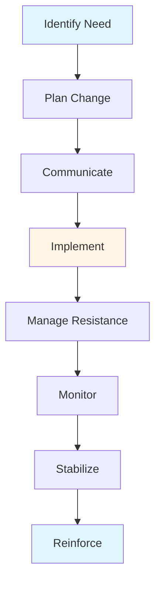

# Change Management Guide - Comprehensive

## Table of Contents
1. [Introduction](#introduction)
2. [Change Management Overview](#change-management-overview)
3. [Why Change is Necessary](#why-change-is-necessary)
4. [Change Management Models](#change-management-models)
5. [Change Planning](#change-planning)
6. [Leading Change](#leading-change)
7. [Managing Resistance](#managing-resistance)
8. [Communication in Change](#communication-in-change)
9. [Change Implementation](#change-implementation)
10. [Measuring Change Success](#measuring-change-success)
11. [Best Practices](#best-practices)
12. [Common Pitfalls](#common-pitfalls)
13. [Real-World Examples](#real-world-examples)
14. [Templates & Checklists](#templates--checklists)
15. [Tools & Software](#tools--software)
16. [Resources](#resources)
17. [Summary](#summary)

---

## Introduction

Change management is the process of helping individuals and organizations transition from current state to desired future state. This guide covers change management models, leading change, managing resistance, and organizational adaptation.

### Who This Guide Is For
- Managers leading change
- Change agents
- Business leaders
- Anyone involved in organizational change

### Key Learning Objectives
- Understand change management
- Learn change models (Kotter, ADKAR, Lewin)
- Plan and implement change
- Lead change effectively
- Manage resistance
- Measure change success

---

## Change Management Overview

### Definition

**Change Management** is a structured approach to transitioning individuals, teams, and organizations from current state to desired future state.

### Types of Change

#### 1. Incremental Change
- Small, continuous changes
- Gradual improvement
- Low risk
- Easier to implement

#### 2. Transformational Change
- Major, fundamental changes
- Significant impact
- Higher risk
- Requires strong leadership

#### 3. Developmental Change
- Improving existing
- Enhancing capabilities
- Growth-oriented

#### 4. Transitional Change
- Moving from one state to another
- Replacing old with new
- Managed transition

### Change Management Process

---

## Why Change is Necessary

### Drivers of Change

#### 1. External Drivers
- **Market Changes**: Competition, customer needs
- **Technology**: Digital transformation, innovation
- **Regulations**: New laws, compliance
- **Economic**: Economic conditions, globalization
- **Social**: Demographics, culture

#### 2. Internal Drivers
- **Strategy**: New strategy, goals
- **Performance**: Poor performance, improvement needed
- **Growth**: Expansion, scaling
- **Restructuring**: Reorganization, efficiency
- **Culture**: Culture change, values

### Benefits of Change

1. **Competitive Advantage**: Stay ahead
2. **Efficiency**: Improve operations
3. **Innovation**: New capabilities
4. **Growth**: Enable growth
5. **Survival**: Adapt or perish

---

## Change Management Models

### 1. Kotter's 8-Step Model

#### Step 1: Create Urgency
- Identify crisis or opportunity
- Communicate urgency
- Build coalition

#### Step 2: Form Coalition
- Assemble change team
- Get key people on board
- Build support

#### Step 3: Create Vision
- Develop clear vision
- Communicate vision
- Get buy-in

#### Step 4: Communicate Vision
- Communicate frequently
- Address concerns
- Model behavior

#### Step 5: Remove Obstacles
- Identify barriers
- Remove obstacles
- Empower action

#### Step 6: Create Short-term Wins
- Plan for quick wins
- Recognize achievements
- Build momentum

#### Step 7: Build on Change
- Don't declare victory too early
- Continue improvement
- Build on success

#### Step 8: Anchor Change
- Make change stick
- Embed in culture
- Reinforce

### 2. ADKAR Model

**ADKAR** = Awareness, Desire, Knowledge, Ability, Reinforcement

#### A - Awareness
- Understand need for change
- Why change is necessary
- Consequences of not changing

#### D - Desire
- Want to change
- Personal motivation
- Support change

#### K - Knowledge
- Know how to change
- Training
- Information

#### A - Ability
- Can implement change
- Skills
- Resources

#### R - Reinforcement
- Sustain change
- Reinforce behavior
- Prevent regression

### 3. Lewin's Change Model

#### Stage 1: Unfreeze
- Prepare for change
- Create motivation
- Reduce resistance

#### Stage 2: Change
- Implement change
- Transition
- Support

#### Stage 3: Refreeze
- Stabilize change
- Reinforce
- Make permanent

---

## Change Planning

### Overview

Change planning prepares for successful change implementation.

### Change Plan Components

#### 1. Change Vision
- Clear vision
- Benefits
- Future state

#### 2. Stakeholder Analysis
- Identify stakeholders
- Assess impact
- Engagement strategy

#### 3. Change Strategy
- Approach
- Phases
- Timeline

#### 4. Communication Plan
- Messages
- Channels
- Timing
- Audience

#### 5. Training Plan
- Training needs
- Programs
- Schedule
- Resources

#### 6. Risk Management
- Identify risks
- Mitigation strategies
- Contingency plans

#### 7. Success Metrics
- Define success
- Metrics
- Measurement
- Targets

---

## Leading Change

### Overview

Leading change requires strong leadership and change management skills.

### Leadership in Change

#### 1. Vision and Direction
- Clear vision
- Communicate direction
- Inspire

#### 2. Support and Resources
- Provide resources
- Remove barriers
- Support team

#### 3. Role Modeling
- Model desired behavior
- Walk the talk
- Demonstrate commitment

#### 4. Communication
- Frequent communication
- Transparent
- Two-way
- Address concerns

#### 5. Empowerment
- Empower team
- Delegate
- Trust
- Enable action

### Change Leadership Styles

#### 1. Directive
- Top-down
- Clear direction
- Fast decisions
- Use when: Crisis, urgent

#### 2. Participative
- Involve team
- Collaborative
- Buy-in
- Use when: Complex, need support

#### 3. Supportive
- Support team
- Coaching
- Development
- Use when: Learning needed

---

## Managing Resistance

### Overview

Resistance to change is natural. Effective management reduces resistance.

### Sources of Resistance

#### 1. Individual Resistance
- Fear of unknown
- Loss of status
- Job security
- Comfort zone
- Lack of trust

#### 2. Organizational Resistance
- Structure
- Culture
- Systems
- Politics
- Resources

### Resistance Management Strategies

#### 1. Communication
- Explain why
- Address concerns
- Provide information
- Transparent

#### 2. Participation
- Involve in planning
- Get input
- Ownership
- Buy-in

#### 3. Support
- Training
- Resources
- Coaching
- Emotional support

#### 4. Negotiation
- Address concerns
- Compromise
- Win-win
- Agreement

#### 5. Coercion
- Last resort
- Force compliance
- Use sparingly
- May create resentment

---

## Communication in Change

### Overview

Communication is critical for successful change.

### Change Communication Principles

#### 1. Early and Often
- Start early
- Communicate frequently
- Don't wait
- Keep updated

#### 2. Clear and Simple
- Clear messages
- Simple language
- Avoid jargon
- Easy to understand

#### 3. Honest and Transparent
- Be honest
- Transparent
- Address concerns
- Build trust

#### 4. Two-Way
- Listen
- Feedback
- Dialogue
- Address questions

#### 5. Consistent
- Consistent messages
- Aligned
- No contradictions
- Unified

### Communication Channels

- Face-to-face meetings
- Email
- Intranet
- Town halls
- Newsletters
- Videos
- Social media

---

## Change Implementation

### Overview

Change implementation executes the change plan.

### Implementation Steps

#### 1. Prepare
- Final preparations
- Resources ready
- Team ready
- Systems ready

#### 2. Launch
- Announce change
- Communicate
- Begin implementation
- Provide support

#### 3. Execute
- Implement changes
- Monitor progress
- Address issues
- Adjust as needed

#### 4. Support
- Provide support
- Training
- Resources
- Coaching

#### 5. Monitor
- Track progress
- Measure results
- Identify issues
- Take action

---

## Measuring Change Success

### Overview

Measuring change success ensures change achieves objectives.

### Success Metrics

#### 1. Adoption Metrics
- Adoption rate
- Usage
- Participation
- Engagement

#### 2. Performance Metrics
- Performance improvement
- Productivity
- Quality
- Efficiency

#### 3. Business Metrics
- Revenue
- Cost
- Customer satisfaction
- Market share

#### 4. People Metrics
- Employee satisfaction
- Engagement
- Retention
- Skills

### Measurement Process

1. Define metrics
2. Baseline measurement
3. Set targets
4. Monitor regularly
5. Analyze results
6. Take action

---

## Best Practices

### Change Management Best Practices

1. **Start with Why**
   - Clear rationale
   - Communicate need
   - Build urgency

2. **Strong Leadership**
   - Committed leaders
   - Visible support
   - Role modeling

3. **Communication**
   - Frequent, clear
   - Transparent
   - Two-way

4. **Involve People**
   - Participation
   - Input
   - Ownership

5. **Support**
   - Training
   - Resources
   - Coaching

6. **Manage Resistance**
   - Anticipate
   - Address
   - Overcome

7. **Celebrate Wins**
   - Recognize progress
   - Quick wins
   - Momentum

---

## Common Pitfalls

### Change Management Pitfalls

1. **No Clear Vision**
   - Unclear direction
   - Confusion
   - Resistance

2. **Poor Communication**
   - Insufficient communication
   - Unclear messages
   - Rumors

3. **Lack of Leadership**
   - Weak leadership
   - No support
   - Inconsistent

4. **Ignoring Resistance**
   - Not addressing
   - Resistance grows
   - Failure

5. **No Support**
   - Insufficient training
   - No resources
   - Poor support

6. **Rushing**
   - Too fast
   - No time to adapt
   - Failure

---

## Real-World Examples

### Example 1: Digital Transformation

**Company**: Traditional retailer
**Change**: Digital transformation
**Approach**: Kotter's model, strong leadership, communication
**Result**: Successful transformation, improved performance

### Example 2: Culture Change

**Company**: Tech company
**Change**: Culture transformation
**Approach**: ADKAR model, employee involvement
**Result**: Improved culture, higher engagement

### Example 3: Process Improvement

**Company**: Manufacturing
**Change**: Lean implementation
**Approach**: Lewin's model, training, support
**Result**: Improved efficiency, cost reduction

---

## Templates & Checklists

### Change Plan Template

**Change**: [Description]
**Vision**: [Vision statement]
**Objectives**: [Objectives]
**Stakeholders**: [List]
**Strategy**: [Approach]
**Timeline**: [Timeline]
**Risks**: [Risks and mitigation]
**Success Metrics**: [Metrics]

### Change Readiness Checklist

- [ ] Need for change identified
- [ ] Vision developed
- [ ] Stakeholders identified
- [ ] Change plan created
- [ ] Communication plan ready
- [ ] Training plan ready
- [ ] Resources allocated
- [ ] Risks identified
- [ ] Success metrics defined
- [ ] Leadership committed

---

## Tools & Software

### Change Management Tools

1. **Change Management Software**: Change tracking
2. **Communication Tools**: Slack, Teams
3. **Project Management**: Change projects
4. **Survey Tools**: Change readiness, feedback

---

## Resources

### Books

1. "Leading Change" - John Kotter
2. "Switch" - Chip Heath
3. "The Heart of Change" - John Kotter

### Online Resources

1. **Prosci**: Change management resources
2. **Change Management Institute**: Change resources

---

## Summary

### Key Takeaways

1. **Change Management**: Structured approach to change
2. **Change Models**: Kotter, ADKAR, Lewin
3. **Leadership**: Critical for success
4. **Communication**: Essential throughout
5. **Resistance**: Natural, must be managed
6. **Planning**: Prepare thoroughly
7. **Measurement**: Track success

### Final Recommendations

1. **Plan Thoroughly**: Comprehensive change plan
2. **Lead Strongly**: Committed leadership
3. **Communicate**: Frequently and clearly
4. **Involve People**: Participation and ownership
5. **Support**: Training and resources
6. **Manage Resistance**: Address proactively
7. **Measure**: Track and adjust

Remember: Change is constant. Effective change management enables organizations to adapt and thrive.

---

**Last Updated**: 2024

**Related Guides**:
- [Management Fundamentals Guide](./MANAGEMENT_FUNDAMENTALS_GUIDE.md)
- [Strategic Management Guide](./STRATEGIC_MANAGEMENT_GUIDE.md)
- [Operations & Project Management Guide](./OPERATIONS_PROJECT_MANAGEMENT_GUIDE.md)

