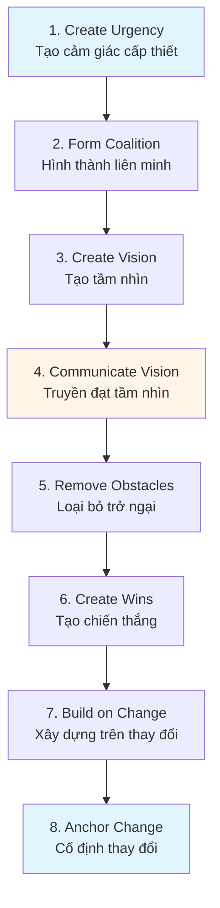
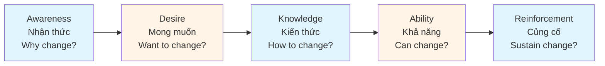
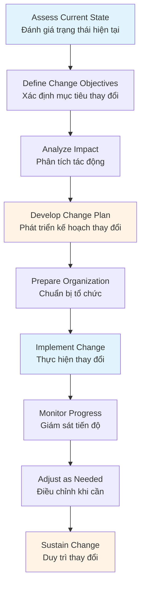
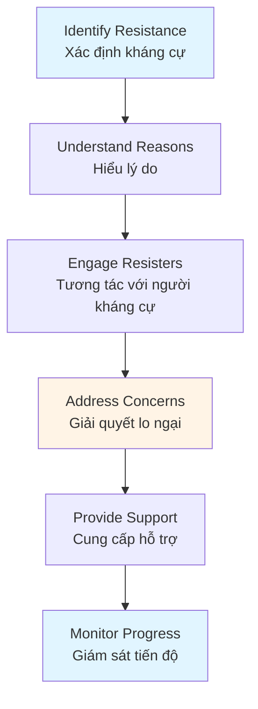
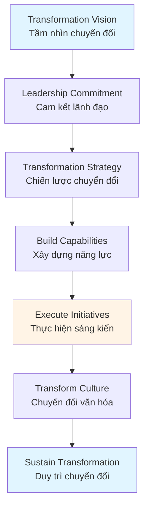
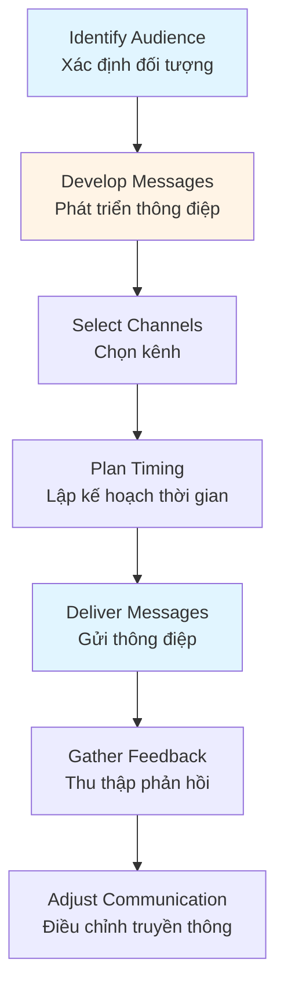

# Change Management Guide - Comprehensive

## Quản trị sự thay đổi và thích ứng / Change Management & Adaptation

## Table of Contents
1. [Introduction](#introduction)
2. [Change Management Models](#change-management-models)
3. [Change Planning and Implementation](#change-planning-and-implementation)
4. [Resistance Management](#resistance-management)
5. [Organizational Transformation](#organizational-transformation)
6. [Change Communication](#change-communication)
7. [Best Practices](#best-practices)
8. [Common Pitfalls](#common-pitfalls)
9. [Real-World Examples](#real-world-examples)
10. [Templates & Checklists](#templates--checklists)
11. [Tools & Software](#tools--software)
12. [Resources](#resources)
13. [Summary](#summary)

---

## Introduction

Change management is the process of planning, implementing, and managing organizational change. Effective change management helps organizations adapt to new circumstances, implement improvements, and achieve transformation goals.

Quản trị thay đổi là quá trình lập kế hoạch, thực hiện và quản lý thay đổi tổ chức. Quản trị thay đổi hiệu quả giúp tổ chức thích ứng với hoàn cảnh mới, thực hiện cải thiện và đạt được mục tiêu chuyển đổi.

### Who This Guide Is For
- Change managers and leaders
- Project managers implementing change
- Organizational development professionals
- Managers leading transformations
- Anyone responsible for organizational change

### Key Learning Objectives
- Understand change management models
- Learn change planning and implementation
- Master resistance management
- Lead organizational transformation
- Communicate change effectively

---

## Change Management Models

### Kotter's 8-Step Change Model / Mô hình thay đổi 8 bước của Kotter



**Steps**:
1. Create urgency - Build sense of need
2. Form coalition - Assemble change team
3. Create vision - Develop change vision
4. Communicate vision - Share widely
5. Remove obstacles - Address barriers
6. Create wins - Generate short-term wins
7. Build on change - Sustain momentum
8. Anchor change - Make change permanent

### ADKAR Model / Mô hình ADKAR

**ADKAR** - Awareness, Desire, Knowledge, Ability, Reinforcement



**Application**:
- Assess individual change readiness
- Identify gaps at each stage
- Develop targeted interventions
- Measure progress

### Lewin's Change Model / Mô hình thay đổi của Lewin

**Three Stages**:
1. **Unfreeze** - Prepare for change
2. **Change** - Implement change
3. **Refreeze** - Stabilize change

### Bridges' Transition Model / Mô hình chuyển đổi của Bridges

**Three Phases**:
1. **Ending** - Letting go of old ways
2. **Neutral Zone** - Transition period
3. **New Beginning** - Embracing new ways

---

## Change Planning and Implementation

### Change Planning Process / Quy trình lập kế hoạch thay đổi



### Change Planning Components / Thành phần lập kế hoạch thay đổi

#### 1. Change Scope / Phạm vi thay đổi
- What will change?
- What will not change?
- Boundaries and limits
- Affected areas

#### 2. Change Objectives / Mục tiêu thay đổi
- Specific goals
- Success criteria
- Measurable outcomes
- Timeline

#### 3. Stakeholder Analysis / Phân tích các bên liên quan
- Identify stakeholders
- Assess impact
- Determine support/resistance
- Develop engagement plan

#### 4. Resource Requirements / Yêu cầu nguồn lực
- Budget
- People
- Time
- Technology
- Training

#### 5. Risk Assessment / Đánh giá rủi ro
- Identify risks
- Assess probability and impact
- Develop mitigation strategies
- Plan contingencies

### Implementation Approach / Cách tiếp cận thực hiện

#### Phased Approach / Tiếp cận theo giai đoạn
- Implement in stages
- Test and learn
- Adjust between phases
- Lower risk

#### Big Bang Approach / Tiếp cận thay đổi lớn
- Implement all at once
- Faster completion
- Higher risk
- Requires strong preparation

---

## Resistance Management

### Understanding Resistance / Hiểu về kháng cự

**Why People Resist Change**:
- Fear of the unknown
- Loss of control
- Comfort with status quo
- Lack of trust
- Poor communication
- Past negative experiences

### Types of Resistance / Loại kháng cự

#### Active Resistance / Kháng cự chủ động
- Open opposition
- Sabotage
- Complaints
- Organized resistance

#### Passive Resistance / Kháng cự thụ động
- Silent non-compliance
- Procrastination
- Absenteeism
- Low engagement

### Resistance Management Strategies / Chiến lược quản lý kháng cự



### Strategies / Chiến lược

1. **Communication**
   - Explain why change is needed
   - Share benefits
   - Address concerns
   - Provide regular updates

2. **Involvement**
   - Include in planning
   - Seek input
   - Empower participation
   - Build ownership

3. **Support**
   - Provide training
   - Offer resources
   - Give time to adjust
   - Recognize efforts

4. **Negotiation**
   - Address specific concerns
   - Find compromises
   - Make adjustments
   - Win-win solutions

5. **Coercion** (Last resort)
   - Use authority
   - Apply pressure
   - Consequences for non-compliance

---

## Organizational Transformation

### Transformation Types / Loại chuyển đổi

#### 1. Strategic Transformation / Chuyển đổi chiến lược
- New business model
- Market repositioning
- Strategic pivot
- Major strategic change

#### 2. Cultural Transformation / Chuyển đổi văn hóa
- Organizational culture change
- Values and behaviors
- Mindset shift
- Cultural alignment

#### 3. Digital Transformation / Chuyển đổi số
- Technology adoption
- Digital processes
- Digital business model
- Digital capabilities

#### 4. Operational Transformation / Chuyển đổi vận hành
- Process redesign
- Efficiency improvements
- Quality enhancement
- Operational excellence

### Transformation Framework / Khung chuyển đổi



### Transformation Success Factors / Yếu tố thành công chuyển đổi

1. **Strong Leadership**
   - Visible commitment
   - Consistent messaging
   - Role modeling
   - Decision-making

2. **Clear Vision**
   - Compelling vision
   - Clear objectives
   - Shared understanding
   - Alignment

3. **Change Capability**
   - Change management skills
   - Project management
   - Communication skills
   - Training and development

4. **Employee Engagement**
   - Involve employees
   - Address concerns
   - Provide support
   - Recognize contributions

5. **Continuous Improvement**
   - Monitor progress
   - Adjust approach
   - Learn from experience
   - Build on successes

---

## Change Communication

### Communication Strategy / Chiến lược truyền thông



### Communication Principles / Nguyên tắc truyền thông

1. **Clear and Simple**
   - Use simple language
   - Avoid jargon
   - Be specific
   - Provide examples

2. **Consistent**
   - Consistent messages
   - Aligned communication
   - Coordinated approach
   - Single source of truth

3. **Frequent**
   - Regular updates
   - Ongoing communication
   - Multiple touchpoints
   - Reinforce messages

4. **Two-Way**
   - Listen to feedback
   - Encourage questions
   - Address concerns
   - Dialogue, not monologue

5. **Honest and Transparent**
   - Be truthful
   - Share challenges
   - Admit uncertainty
   - Build trust

### Communication Channels / Kênh truyền thông

- **Face-to-face** - Meetings, town halls
- **Email** - Updates, announcements
- **Intranet** - Information portal
- **Video** - Recorded messages, webinars
- **Social Media** - Internal platforms
- **Newsletters** - Regular updates

---

## Best Practices

### Change Management Best Practices / Thực hành quản lý thay đổi tốt

1. **Start with Why**
   - Explain purpose
   - Build urgency
   - Create compelling case
   - Connect to vision

2. **Engage Early**
   - Involve stakeholders
   - Seek input
   - Build coalition
   - Create ownership

3. **Communicate Constantly**
   - Regular updates
   - Multiple channels
   - Two-way communication
   - Address concerns

4. **Provide Support**
   - Training and development
   - Resources and tools
   - Time to adjust
   - Recognition

5. **Celebrate Wins**
   - Acknowledge progress
   - Recognize efforts
   - Share successes
   - Build momentum

6. **Monitor and Adjust**
   - Track progress
   - Measure success
   - Gather feedback
   - Adapt approach

---

## Common Pitfalls

### Change Management Mistakes / Các sai lầm quản lý thay đổi

1. **Lack of Leadership Support**
   - **Problem**: Leaders not committed
   - **Solution**: Secure leadership commitment first

2. **Poor Communication**
   - **Problem**: Insufficient or unclear communication
   - **Solution**: Develop comprehensive communication plan

3. **Ignoring Resistance**
   - **Problem**: Not addressing resistance
   - **Solution**: Proactively manage resistance

4. **Insufficient Planning**
   - **Problem**: Rushing into change
   - **Solution**: Invest time in planning

5. **Not Sustaining Change**
   - **Problem**: Change doesn't stick
   - **Solution**: Anchor change in systems and culture

---

## Real-World Examples

### Example 1: Technology Company Digital Transformation

**Situation**: Traditional company moving to digital-first model.

**Change Management Approach**:
- Created urgency with market analysis
- Formed transformation coalition
- Developed clear digital vision
- Communicated extensively
- Provided digital skills training
- Celebrated milestones

**Result**: Successful digital transformation, 40% efficiency improvement, increased employee engagement.

### Example 2: Manufacturing Company Culture Change

**Situation**: Company shifting from command-and-control to collaborative culture.

**Change Management Approach**:
- Leadership role modeling
- Employee involvement in design
- Training on new behaviors
- Recognition programs
- Process changes
- Regular feedback

**Result**: Improved employee satisfaction by 35%, reduced turnover by 25%, increased innovation.

---

## Templates & Checklists

### Change Management Plan Template

```
Change Initiative: [Name]
Change Manager: [Name]
Start Date: [Date]
End Date: [Date]

1. Change Overview
   - Change description
   - Business case
   - Objectives
   - Success criteria

2. Stakeholder Analysis
   - Key stakeholders
   - Impact assessment
   - Engagement plan

3. Change Strategy
   - Change approach
   - Phases and timeline
   - Key activities

4. Communication Plan
   - Key messages
   - Communication channels
   - Schedule
   - Responsibilities

5. Training Plan
   - Training needs
   - Training programs
   - Schedule
   - Resources

6. Risk Management
   - Risks and mitigation
   - Resistance management
   - Contingency plans

7. Success Metrics
   - KPIs
   - Measurement methods
   - Review schedule
```

### Change Readiness Checklist

- [ ] Change vision and objectives defined
- [ ] Leadership commitment secured
- [ ] Stakeholder analysis completed
- [ ] Communication plan developed
- [ ] Training plan created
- [ ] Resources allocated
- [ ] Risks identified and mitigated
- [ ] Resistance management plan ready
- [ ] Success metrics defined
- [ ] Change team assembled
- [ ] Timeline established
- [ ] Budget approved

---

## Tools & Software

### Change Management
- **Prosci** - Change management methodology and tools
- **Change Compass** - Change portfolio management
- **ChangeScout** - Change management platform

### Communication
- **Slack** - Team communication
- **Microsoft Teams** - Collaboration platform
- **Zoom** - Video conferencing

### Project Management
- **Asana** - Change initiative tracking
- **Monday.com** - Change project management
- **Jira** - Change management workflows

---

## Resources

### Books
- "Leading Change" by John Kotter
- "Switch: How to Change Things When Change Is Hard" by Chip Heath
- "The Heart of Change" by John Kotter
- "ADKAR: A Model for Change" by Jeffrey Hiatt

### Professional Organizations
- **Association of Change Management Professionals (ACMP)**
- **Prosci** - Change management research and training
- **Change Management Institute**

### Certifications
- **CCMP** - Certified Change Management Professional
- **Prosci Certification** - Change management methodology

---

## Summary

### Key Takeaways / Điểm chính

1. **Change management models** (Kotter, ADKAR, Lewin) provide structured approaches.

2. **Change planning** requires assessment, stakeholder analysis, and risk management.

3. **Resistance management** is critical - understand reasons and address proactively.

4. **Organizational transformation** requires strong leadership and employee engagement.

5. **Effective communication** is essential - clear, consistent, frequent, two-way.

6. **Sustaining change** requires anchoring in systems, processes, and culture.

### Next Steps / Bước tiếp theo

- Assess change readiness
- Develop change management plan
- Apply change management models
- Build change management capabilities
- Review Strategic Management Guide for change strategy alignment

---

**Remember**: Change is constant. Effective change management helps organizations adapt, improve, and thrive in changing environments.

**Nhớ rằng**: Thay đổi là không đổi. Quản lý thay đổi hiệu quả giúp tổ chức thích ứng, cải thiện và phát triển trong môi trường thay đổi.
