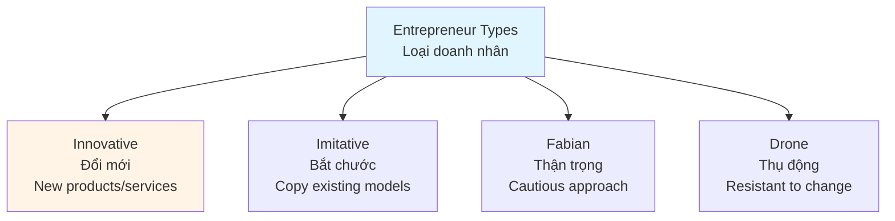
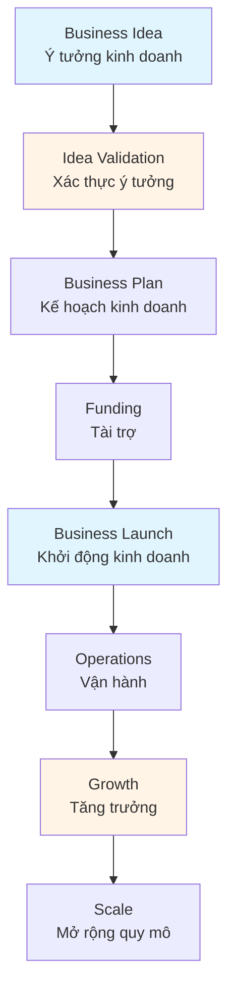
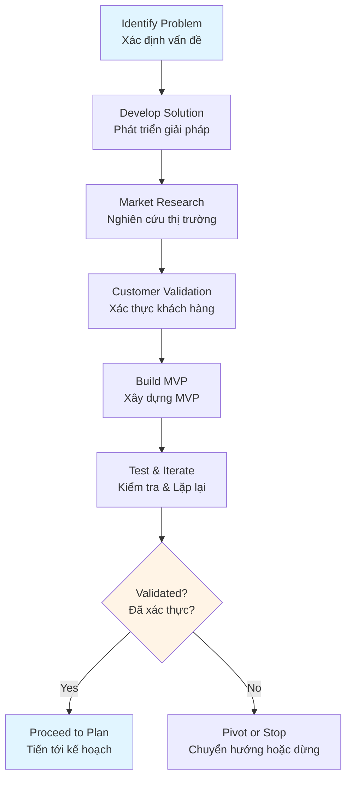
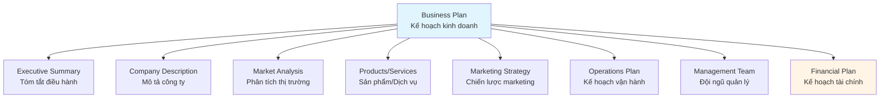
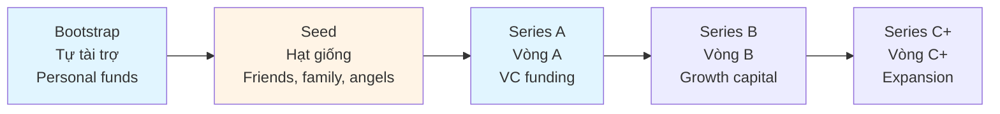
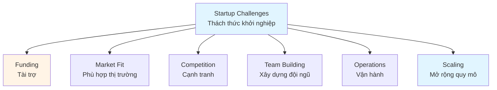
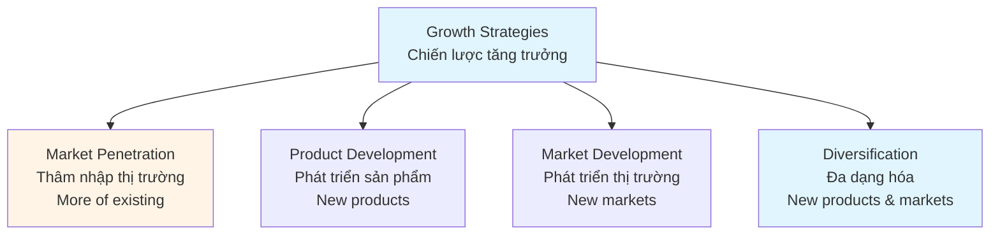

# Entrepreneurship Guide - Comprehensive

## Khởi nghiệp là gì? Các vấn đề cần chú ý / Entrepreneurship Fundamentals

## Table of Contents
1. [Introduction](#introduction)
2. [Entrepreneurship Concepts](#entrepreneurship-concepts)
3. [Business Idea Validation](#business-idea-validation)
4. [Business Plan Development](#business-plan-development)
5. [Funding and Investment](#funding-and-investment)
6. [Startup Challenges](#startup-challenges)
7. [Growth Strategies](#growth-strategies)
8. [Best Practices](#best-practices)
9. [Common Pitfalls](#common-pitfalls)
10. [Real-World Examples](#real-world-examples)
11. [Templates & Checklists](#templates--checklists)
12. [Tools & Software](#tools--software)
13. [Resources](#resources)
14. [Summary](#summary)

---

## Introduction

Entrepreneurship is the process of creating, developing, and managing a new business venture to generate profit. This guide covers entrepreneurship fundamentals, idea validation, business planning, funding, challenges, and growth strategies.

Khởi nghiệp là quá trình tạo, phát triển và quản lý một dự án kinh doanh mới để tạo ra lợi nhuận. Hướng dẫn này bao gồm các nguyên tắc cơ bản về khởi nghiệp, xác thực ý tưởng, lập kế hoạch kinh doanh, tài trợ, thách thức và chiến lược tăng trưởng.

### Who This Guide Is For
- Aspiring entrepreneurs
- Startup founders
- Business owners
- Anyone considering starting a business
- Students learning entrepreneurship

### Key Learning Objectives
- Understand entrepreneurship concepts
- Learn to validate business ideas
- Develop comprehensive business plans
- Understand funding options
- Navigate startup challenges
- Plan for growth

---

## Entrepreneurship Concepts

### What is Entrepreneurship? / Khởi nghiệp là gì?

**Entrepreneurship** is the process of identifying opportunities, taking risks, and creating value through innovation and business creation.

**Khởi nghiệp** là quá trình xác định cơ hội, chấp nhận rủi ro và tạo giá trị thông qua đổi mới và tạo doanh nghiệp.

### Types of Entrepreneurs / Loại doanh nhân



#### 1. Innovative Entrepreneur / Doanh nhân đổi mới
- Creates new products/services
- Introduces new methods
- Opens new markets
- High risk, high reward

#### 2. Imitative Entrepreneur / Doanh nhân bắt chước
- Copies successful models
- Adapts to local market
- Lower risk
- Proven concepts

#### 3. Fabian Entrepreneur / Doanh nhân thận trọng
- Cautious and skeptical
- Slow to adopt changes
- Risk-averse
- Follows others

#### 4. Drone Entrepreneur / Doanh nhân thụ động
- Resistant to change
- Traditional approach
- Low innovation
- May struggle to adapt

### Entrepreneurial Characteristics / Đặc điểm doanh nhân

- **Vision** - See opportunities
- **Risk-Taking** - Accept uncertainty
- **Innovation** - Create new solutions
- **Persistence** - Overcome obstacles
- **Leadership** - Inspire others
- **Adaptability** - Respond to changes
- **Passion** - Strong commitment

### Entrepreneurship Process / Quy trình khởi nghiệp



---

## Business Idea Validation

### Idea Validation Process / Quy trình xác thực ý tưởng



### Validation Methods / Phương pháp xác thực

#### 1. Problem-Solution Fit / Phù hợp vấn đề-giải pháp
- Is there a real problem?
- Is the problem significant?
- Will people pay for a solution?
- Does your solution address it?

#### 2. Market Validation / Xác thực thị trường
- Market size
- Market growth
- Competition analysis
- Market trends
- Barriers to entry

#### 3. Customer Validation / Xác thực khách hàng
- **Customer Interviews** - Talk to potential customers
- **Surveys** - Gather quantitative data
- **Landing Pages** - Test interest
- **Pre-orders** - Validate willingness to pay
- **Pilot Programs** - Test with real customers

#### 4. MVP (Minimum Viable Product) / Sản phẩm tối thiểu khả thi
- Build simplest version
- Test core assumptions
- Gather feedback
- Iterate quickly
- Minimize investment

### Validation Questions / Câu hỏi xác thực

- Is there a real customer need?
- Is the market large enough?
- Can you reach customers?
- Will customers pay?
- Can you deliver?
- Is it sustainable?
- Do you have competitive advantage?

---

## Business Plan Development

### Business Plan Components / Thành phần kế hoạch kinh doanh



### Business Plan Sections / Các phần kế hoạch kinh doanh

#### 1. Executive Summary / Tóm tắt điều hành
- Business concept
- Market opportunity
- Competitive advantage
- Financial highlights
- Funding requirements

#### 2. Company Description / Mô tả công ty
- Company overview
- Mission and vision
- Legal structure
- Location
- History (if applicable)

#### 3. Market Analysis / Phân tích thị trường
- Industry overview
- Target market
- Market size and trends
- Competition analysis
- Market positioning

#### 4. Products/Services / Sản phẩm/Dịch vụ
- Product description
- Features and benefits
- Competitive advantages
- Development stage
- Future products

#### 5. Marketing Strategy / Chiến lược marketing
- Marketing approach
- Pricing strategy
- Distribution channels
- Promotion strategy
- Sales strategy

#### 6. Operations Plan / Kế hoạch vận hành
- Production process
- Facilities and equipment
- Supply chain
- Quality control
- Technology

#### 7. Management Team / Đội ngũ quản lý
- Team members
- Roles and responsibilities
- Experience and skills
- Organizational structure
- Advisors

#### 8. Financial Plan / Kế hoạch tài chính
- Financial projections
- Startup costs
- Revenue projections
- Expense forecasts
- Cash flow projections
- Break-even analysis
- Funding requirements

---

## Funding and Investment

### Funding Stages / Giai đoạn tài trợ



### Funding Sources / Nguồn tài trợ

#### 1. Bootstrapping / Tự tài trợ
- Personal savings
- Credit cards
- Friends and family
- Revenue from business
- **Pros**: Full control, no dilution
- **Cons**: Limited resources, slow growth

#### 2. Angel Investors / Nhà đầu tư thiên thần
- High-net-worth individuals
- Early-stage investment
- Mentorship often included
- **Amount**: $25K - $500K
- **Equity**: 10-25%

#### 3. Venture Capital / Vốn mạo hiểm
- Professional investment firms
- Series A, B, C rounds
- Growth-focused
- **Amount**: $500K - $50M+
- **Equity**: 20-40%

#### 4. Bank Loans / Vay ngân hàng
- Traditional financing
- Requires collateral
- Interest payments
- **Pros**: No equity dilution
- **Cons**: Debt obligation, difficult to obtain

#### 5. Crowdfunding / Gây quỹ cộng đồng
- Online platforms (Kickstarter, Indiegogo)
- Many small investors
- Pre-sales model
- **Pros**: Market validation, marketing
- **Cons**: Platform fees, delivery obligations

#### 6. Government Grants / Trợ cấp chính phủ
- Non-dilutive funding
- Specific criteria
- Research and development
- **Pros**: No equity, no repayment
- **Cons**: Competitive, restrictions

### Pitching to Investors / Thuyết trình cho nhà đầu tư

#### Pitch Deck Structure / Cấu trúc pitch deck

1. **Problem** - What problem are you solving?
2. **Solution** - Your product/service
3. **Market** - Market size and opportunity
4. **Business Model** - How you make money
5. **Traction** - Progress and milestones
6. **Competition** - Competitive landscape
7. **Team** - Why your team can execute
8. **Financials** - Revenue projections
9. **Ask** - Funding amount and use

#### Pitching Best Practices / Thực hành thuyết trình tốt

- Tell a compelling story
- Show passion and commitment
- Demonstrate market understanding
- Highlight traction and progress
- Be clear about ask and use of funds
- Practice and refine
- Answer questions confidently

---

## Startup Challenges

### Common Startup Challenges / Thách thức khởi nghiệp phổ biến



#### 1. Funding Challenges / Thách thức tài trợ
- **Problem**: Insufficient capital
- **Solutions**: Bootstrap, multiple funding sources, revenue focus

#### 2. Finding Product-Market Fit / Tìm phù hợp sản phẩm-thị trường
- **Problem**: Product doesn't meet market needs
- **Solutions**: Customer validation, iteration, pivot if needed

#### 3. Competition / Cạnh tranh
- **Problem**: Established competitors
- **Solutions**: Differentiation, niche focus, innovation

#### 4. Team Building / Xây dựng đội ngũ
- **Problem**: Attracting talent with limited resources
- **Solutions**: Equity, culture, mission, growth opportunity

#### 5. Operations / Vận hành
- **Problem**: Managing growth and operations
- **Solutions**: Systems, processes, automation, delegation

#### 6. Scaling / Mở rộng quy mô
- **Problem**: Growing too fast or too slow
- **Solutions**: Strategic planning, controlled growth, resources

### Overcoming Challenges / Vượt qua thách thức

- **Resilience** - Persist through difficulties
- **Adaptability** - Pivot when needed
- **Learning** - Learn from failures
- **Networking** - Build support network
- **Mentorship** - Seek guidance
- **Focus** - Prioritize what matters

---

## Growth Strategies

### Growth Strategy Framework / Khung chiến lược tăng trưởng



### Growth Strategies / Chiến lược tăng trưởng

#### 1. Market Penetration / Thâm nhập thị trường
- Increase market share
- More customers in existing market
- Strategies: Pricing, promotion, distribution

#### 2. Product Development / Phát triển sản phẩm
- New products to existing market
- Product line extensions
- Innovation and R&D

#### 3. Market Development / Phát triển thị trường
- Existing products to new markets
- Geographic expansion
- New customer segments

#### 4. Diversification / Đa dạng hóa
- New products to new markets
- Related diversification
- Unrelated diversification

### Scaling Strategies / Chiến lược mở rộng quy mô

1. **Organic Growth** - Internal expansion
2. **Strategic Partnerships** - Collaborate for growth
3. **Acquisitions** - Buy other businesses
4. **Franchising** - License business model
5. **Licensing** - License technology/products

---

## Best Practices

### Entrepreneurship Best Practices / Thực hành khởi nghiệp tốt

1. **Validate Early**
   - Test assumptions quickly
   - Get customer feedback
   - Iterate based on learning
   - Fail fast, learn faster

2. **Focus on Customers**
   - Understand customer needs
   - Solve real problems
   - Deliver value
   - Build relationships

3. **Build Strong Team**
   - Hire for culture fit
   - Complementary skills
   - Shared vision
   - Empower team

4. **Manage Cash Flow**
   - Monitor cash closely
   - Control expenses
   - Accelerate revenue
   - Plan for contingencies

5. **Stay Agile**
   - Adapt to changes
   - Pivot when needed
   - Continuous learning
   - Quick decision-making

6. **Network Actively**
   - Build relationships
   - Seek mentors
   - Join communities
   - Share knowledge

---

## Common Pitfalls

### Entrepreneurship Mistakes / Các sai lầm khởi nghiệp

1. **No Market Validation**
   - **Problem**: Building without validating
   - **Solution**: Validate before building

2. **Poor Cash Management**
   - **Problem**: Running out of cash
   - **Solution**: Monitor cash flow closely

3. **Trying to Do Everything**
   - **Problem**: Lack of focus
   - **Solution**: Focus on core value

4. **Ignoring Competition**
   - **Problem**: Not understanding competition
   - **Solution**: Regular competitive analysis

5. **Hiring Too Fast**
   - **Problem**: Premature scaling
   - **Solution**: Hire when truly needed

6. **Not Adapting**
   - **Problem**: Sticking to failed approach
   - **Solution**: Pivot when needed

---

## Real-World Examples

### Example 1: Tech Startup Success

**Situation**: Software startup validating B2B SaaS product.

**Approach**:
- Conducted 50+ customer interviews
- Built MVP and tested with 10 beta customers
- Iterated based on feedback
- Secured seed funding from angel investors
- Focused on product-market fit before scaling

**Result**: Achieved product-market fit, $2M Series A funding, 500+ customers in 18 months.

### Example 2: E-commerce Startup

**Situation**: Online retailer starting with limited capital.

**Approach**:
- Bootstrapped with personal savings
- Started with niche product category
- Used dropshipping to minimize inventory
- Focused on digital marketing
- Reinvested profits for growth

**Result**: Profitable from month 6, expanded to 5 product categories, $1M revenue in year 2.

---

## Templates & Checklists

### Business Plan Template

```
Business Plan: [Company Name]
Date: [Date]

1. Executive Summary
   - Business concept
   - Market opportunity
   - Competitive advantage
   - Financial summary
   - Funding needs

2. Company Description
   - Mission and vision
   - Legal structure
   - Location
   - History

3. Market Analysis
   - Industry overview
   - Target market
   - Market size
   - Competition
   - Trends

4. Products/Services
   - Description
   - Features
   - Competitive advantages
   - Development stage

5. Marketing Strategy
   - Positioning
   - Pricing
   - Distribution
   - Promotion
   - Sales

6. Operations Plan
   - Processes
   - Facilities
   - Supply chain
   - Technology

7. Management Team
   - Team members
   - Experience
   - Structure
   - Advisors

8. Financial Plan
   - Startup costs
   - Revenue projections
   - Expense forecasts
   - Cash flow
   - Break-even
   - Funding needs
```

### Startup Launch Checklist

- [ ] Business idea validated
- [ ] Business plan completed
- [ ] Legal entity formed
- [ ] Business registered
- [ ] Licenses and permits obtained
- [ ] Funding secured
- [ ] Team assembled
- [ ] Product/service ready
- [ ] Website/online presence
- [ ] Marketing materials
- [ ] Operations systems
- [ ] Accounting setup
- [ ] Bank account opened
- [ ] Insurance obtained
- [ ] Launch plan ready

---

## Tools & Software

### Business Planning
- **LivePlan** - Business plan software
- **Bizplan** - Business planning platform
- **Enloop** - Business plan generator

### Validation
- **Typeform** - Customer surveys
- **Google Forms** - Simple surveys
- **Landing Page Builders** - Test interest

### Financial Management
- **QuickBooks** - Accounting software
- **Xero** - Cloud accounting
- **Wave** - Free accounting

### Project Management
- **Asana** - Task management
- **Trello** - Kanban boards
- **Monday.com** - Work management

### Marketing
- **Mailchimp** - Email marketing
- **Hootsuite** - Social media
- **Google Analytics** - Web analytics

---

## Resources

### Books
- "The Lean Startup" by Eric Ries
- "Zero to One" by Peter Thiel
- "The $100 Startup" by Chris Guillebeau
- "Start with Why" by Simon Sinek

### Online Resources
- **Y Combinator Startup School** - Free startup course
- **Coursera Entrepreneurship** - Online courses
- **Startup Nation** - Entrepreneurship resources

### Communities
- **Founders Network** - Founder community
- **Startup Grind** - Global startup community
- **Entrepreneurs' Organization** - EO network

---

## Summary

### Key Takeaways / Điểm chính

1. **Entrepreneurship** involves identifying opportunities, taking risks, and creating value.

2. **Idea validation** is critical - validate before investing heavily.

3. **Business plan** provides roadmap and helps secure funding.

4. **Funding** options vary - choose based on stage and needs.

5. **Startup challenges** are common - resilience and adaptability are key.

6. **Growth strategies** help scale business systematically.

### Next Steps / Bước tiếp theo

- Validate your business idea
- Develop comprehensive business plan
- Secure funding
- Build strong team
- Launch and iterate
- Plan for growth
- Review other management guides for operational excellence

---

**Remember**: Entrepreneurship is a journey of learning, adapting, and persisting. Focus on solving real problems, building strong relationships, and creating value.

**Nhớ rằng**: Khởi nghiệp là hành trình học hỏi, thích ứng và kiên trì. Tập trung vào giải quyết vấn đề thực tế, xây dựng mối quan hệ mạnh mẽ và tạo giá trị.
