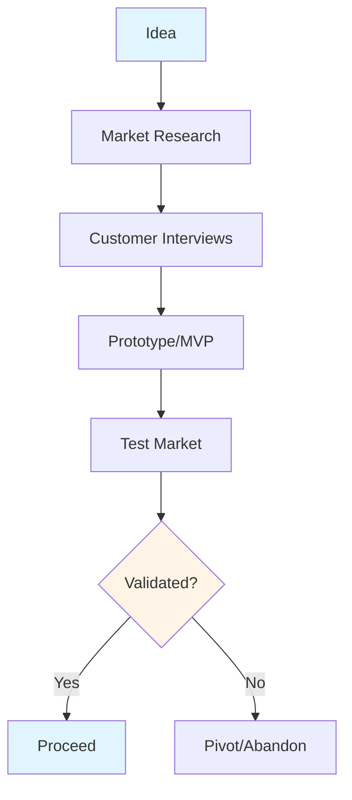

# Entrepreneurship Guide - Comprehensive

## Table of Contents
1. [Introduction](#introduction)
2. [What is Entrepreneurship?](#what-is-entrepreneurship)
3. [Entrepreneurial Mindset](#entrepreneurial-mindset)
4. [Business Idea Generation and Validation](#business-idea-generation-and-validation)
5. [Business Model Development](#business-model-development)
6. [Business Plan](#business-plan)
7. [Funding Options](#funding-options)
8. [Startup Legal Structure](#startup-legal-structure)
9. [Marketing for Startups](#marketing-for-startups)
10. [Financial Management for Startups](#financial-management-for-startups)
11. [Common Startup Challenges](#common-startup-challenges)
12. [Success Factors](#success-factors)
13. [Best Practices](#best-practices)
14. [Common Pitfalls](#common-pitfalls)
15. [Real-World Examples](#real-world-examples)
16. [Templates & Checklists](#templates--checklists)
17. [Tools & Software](#tools--software)
18. [Resources](#resources)
19. [Summary](#summary)

---

## Introduction

Entrepreneurship is the process of creating, developing, and managing a new business venture. This guide covers what entrepreneurship is, the startup process, key considerations, and how to build a successful startup.

### Who This Guide Is For
- Aspiring entrepreneurs
- Startup founders
- Business owners
- Anyone interested in entrepreneurship

### Key Learning Objectives
- Understand entrepreneurship
- Develop entrepreneurial mindset
- Generate and validate business ideas
- Create business model and plan
- Secure funding
- Navigate startup challenges
- Build successful startup

---

## What is Entrepreneurship?

### Definition

**Entrepreneurship** is the process of designing, launching, and running a new business, typically a startup offering a product, process, or service.

### Key Characteristics

#### 1. Innovation
- New products/services
- New processes
- New business models
- Creative solutions

#### 2. Risk-Taking
- Financial risk
- Career risk
- Uncertainty
- Calculated risks

#### 3. Opportunity Recognition
- Identify opportunities
- Market gaps
- Unmet needs
- Trends

#### 4. Value Creation
- Create value for customers
- Solve problems
- Meet needs
- Generate revenue

### Types of Entrepreneurship

#### 1. Small Business Entrepreneurship
- Local businesses
- Traditional businesses
- Lifestyle businesses
- Examples: Restaurant, retail store

#### 2. Scalable Startup Entrepreneurship
- High growth potential
- Venture capital
- Technology focus
- Examples: Tech startups

#### 3. Large Company Entrepreneurship
- Innovation in large companies
- Intrapreneurship
- New ventures
- Examples: Corporate innovation

#### 4. Social Entrepreneurship
- Social mission
- Social impact
- Sustainability
- Examples: Non-profits, social enterprises

---

## Entrepreneurial Mindset

### Overview

Entrepreneurial mindset is the way entrepreneurs think and approach challenges.

### Key Traits

#### 1. Vision
- Clear vision
- Future-oriented
- Big picture thinking
- Long-term perspective

#### 2. Resilience
- Persistence
- Bounce back from failure
- Overcome obstacles
- Never give up

#### 3. Risk Tolerance
- Comfortable with uncertainty
- Calculated risks
- Risk management
- Not risk-averse

#### 4. Adaptability
- Flexible
- Quick to adapt
- Pivot when needed
- Learn and adjust

#### 5. Passion
- Passionate about idea
- Motivated
- Committed
- Enthusiasm

#### 6. Self-Confidence
- Believe in self
- Confidence in idea
- Take action
- Leadership

### Developing Entrepreneurial Mindset

**Activities**:
- Learn from failures
- Take calculated risks
- Network
- Continuous learning
- Practice problem-solving
- Build resilience

---

## Business Idea Generation and Validation

### Overview

Business idea generation creates ideas. Validation tests if ideas are viable.

### Idea Generation Methods

#### 1. Problem-Solution Fit
- Identify problems
- Find solutions
- Validate need
- Test solution

#### 2. Market Gaps
- Identify gaps
- Unmet needs
- Opportunities
- Market research

#### 3. Trends
- Industry trends
- Technology trends
- Social trends
- Economic trends

#### 4. Personal Experience
- Own problems
- Work experience
- Hobbies
- Skills

#### 5. Innovation
- New technology
- New application
- Improvement
- Disruption

### Idea Validation

**Validation Process**:

**Validation Methods**:
- Market research
- Customer interviews
- Surveys
- Prototype testing
- MVP (Minimum Viable Product)
- Pilot programs

**Key Questions**:
- Is there a real problem?
- Do people want solution?
- Will they pay?
- Can we deliver?
- Is it scalable?

---

## Business Model Development

### Overview

Business model describes how business creates, delivers, and captures value.

### Business Model Canvas

**Nine Building Blocks**:

#### 1. Value Propositions
- What value do we deliver?
- What problems do we solve?
- What needs do we meet?
- Why choose us?

#### 2. Customer Segments
- Who are our customers?
- Market segments
- Target customers
- Customer personas

#### 3. Channels
- How do we reach customers?
- Distribution channels
- Communication channels
- Sales channels

#### 4. Customer Relationships
- What relationships do we establish?
- Customer acquisition
- Customer retention
- Customer growth

#### 5. Revenue Streams
- How do we make money?
- Revenue sources
- Pricing models
- Payment methods

#### 6. Key Resources
- What resources are needed?
- Physical resources
- Intellectual resources
- Human resources
- Financial resources

#### 7. Key Activities
- What activities are critical?
- Production
- Problem solving
- Platform/network

#### 8. Key Partnerships
- Who are our partners?
- Suppliers
- Strategic partners
- Joint ventures
- Alliances

#### 9. Cost Structure
- What are our costs?
- Fixed costs
- Variable costs
- Economies of scale
- Cost drivers

### Business Model Types

#### 1. Product Model
- Sell products
- One-time purchase
- Examples: Retail, manufacturing

#### 2. Service Model
- Provide services
- Recurring revenue
- Examples: Consulting, services

#### 3. Subscription Model
- Recurring subscription
- Predictable revenue
- Examples: SaaS, streaming

#### 4. Marketplace Model
- Connect buyers and sellers
- Commission-based
- Examples: E-commerce platforms

#### 5. Freemium Model
- Free basic, paid premium
- User acquisition
- Examples: Software, apps

#### 6. Platform Model
- Platform ecosystem
- Network effects
- Examples: Social media, marketplaces

---

## Business Plan

### Overview

Business plan documents business strategy, operations, and financial projections.

### Business Plan Structure

#### 1. Executive Summary
- Business overview
- Key highlights
- Investment ask
- 1-2 pages

#### 2. Company Description
- Company overview
- Mission and vision
- Legal structure
- History

#### 3. Market Analysis
- Industry analysis
- Target market
- Competition
- Market size

#### 4. Organization and Management
- Organizational structure
- Management team
- Key personnel
- Advisors

#### 5. Products/Services
- Product description
- Features and benefits
- Competitive advantage
- Development stage

#### 6. Marketing and Sales
- Marketing strategy
- Sales strategy
- Pricing
- Distribution

#### 7. Financial Projections
- Revenue projections
- Expense projections
- Cash flow
- Break-even analysis
- Funding needs

#### 8. Funding Request
- Amount needed
- Use of funds
- Funding terms
- Exit strategy

#### 9. Appendix
- Supporting documents
- Market research
- Financial details
- Team resumes

---

## Funding Options

### Overview

Startups need funding to launch and grow.

### Funding Stages

#### 1. Pre-Seed
- Idea stage
- Personal savings
- Friends and family
- Small amounts

#### 2. Seed
- Early stage
- Product development
- Market validation
- Angel investors
- Seed funds

#### 3. Series A
- Growth stage
- Market expansion
- Team building
- Venture capital

#### 4. Series B, C, D...
- Scaling
- Market leadership
- Expansion
- Later-stage VC

### Funding Sources

#### 1. Bootstrapping
- Self-funding
- Personal savings
- Revenue
- No external funding

**Pros**: Full control, no dilution
**Cons**: Limited resources, slower growth

#### 2. Friends and Family
- Personal network
- Early support
- Flexible terms

**Pros**: Easy access, flexible
**Cons**: Relationship risk, limited amount

#### 3. Angel Investors
- Individual investors
- Early stage
- Mentorship
- Network

**Pros**: Mentorship, network, flexible
**Cons**: Dilution, limited amount

#### 4. Venture Capital
- Professional investors
- Larger amounts
- Growth focus
- Exit expectations

**Pros**: Large amounts, expertise, network
**Cons**: Dilution, loss of control, pressure

#### 5. Crowdfunding
- Many small investors
- Online platforms
- Rewards or equity

**Pros**: Market validation, marketing
**Cons**: Public disclosure, platform fees

#### 6. Bank Loans
- Traditional financing
- Debt financing
- Collateral required

**Pros**: No dilution, control
**Cons**: Repayment, interest, collateral

#### 7. Grants
- Government grants
- Foundation grants
- No repayment

**Pros**: No dilution, no repayment
**Cons**: Competitive, restrictions

### Funding Strategy

**Considerations**:
- Amount needed
- Stage of business
- Growth plans
- Control preferences
- Risk tolerance
- Network

---

## Startup Legal Structure

### Overview

Legal structure affects liability, taxes, and operations.

### Legal Structure Types

#### 1. Sole Proprietorship
- Single owner
- Simple
- Full liability
- Pass-through taxation

**Best For**: Small, low-risk businesses

#### 2. Partnership
- Two or more owners
- Shared ownership
- Shared liability
- Pass-through taxation

**Best For**: Small businesses with partners

#### 3. Corporation (C-Corp)
- Separate legal entity
- Limited liability
- Corporate taxation
- Can issue stock

**Best For**: High-growth, VC-funded startups

#### 4. S-Corporation
- Corporation with pass-through
- Limited liability
- Pass-through taxation
- Restrictions

**Best For**: Small to medium businesses

#### 5. Limited Liability Company (LLC)
- Limited liability
- Pass-through taxation
- Flexible
- No stock

**Best For**: Many startups, flexible structure

### Legal Considerations

- Liability protection
- Tax implications
- Ownership structure
- Fundraising ability
- Compliance requirements
- Exit strategy

---

## Marketing for Startups

### Overview

Startup marketing requires creativity and resourcefulness.

### Startup Marketing Strategies

#### 1. Content Marketing
- Blog posts
- Videos
- Social media
- SEO
- Low cost, high value

#### 2. Social Media Marketing
- Free platforms
- Community building
- Engagement
- Brand awareness

#### 3. Influencer Marketing
- Partner with influencers
- Reach target audience
- Authentic promotion
- Cost-effective

#### 4. Email Marketing
- Direct communication
- Low cost
- Personalization
- Automation

#### 5. Partnerships
- Strategic partnerships
- Co-marketing
- Referrals
- Mutual benefit

#### 6. PR and Media
- Press releases
- Media coverage
- Public relations
- Brand awareness

### Startup Marketing Best Practices

1. **Focus on Value**: Provide value
2. **Know Your Customer**: Understand target
3. **Be Authentic**: Genuine brand
4. **Leverage Free**: Free channels
5. **Measure**: Track results
6. **Iterate**: Test and improve

---

## Financial Management for Startups

### Overview

Financial management is critical for startup survival and growth.

### Key Financial Areas

#### 1. Cash Flow Management
- Monitor cash flow
- Forecast cash
- Manage burn rate
- Maintain runway

**Burn Rate**: Monthly cash consumption
**Runway**: Time until cash runs out

#### 2. Budgeting
- Create budget
- Track expenses
- Control costs
- Plan spending

#### 3. Financial Records
- Keep records
- Accounting
- Tax compliance
- Financial statements

#### 4. Fundraising
- Prepare for fundraising
- Financial projections
- Pitch deck
- Investor relations

### Financial Metrics

- Monthly Recurring Revenue (MRR)
- Customer Acquisition Cost (CAC)
- Lifetime Value (LTV)
- Burn Rate
- Runway
- Gross Margin
- Net Margin

---

## Common Startup Challenges

### Overview

Startups face many challenges. Understanding and preparing helps.

### Key Challenges

#### 1. Funding
- Raising capital
- Cash flow
- Financial management
- Investor relations

#### 2. Market Validation
- Proving demand
- Customer acquisition
- Product-market fit
- Competition

#### 3. Team Building
- Finding talent
- Limited resources
- Building culture
- Retention

#### 4. Competition
- Established competitors
- Market saturation
- Differentiation
- Competitive advantage

#### 5. Scaling
- Growth challenges
- Operations scaling
- Team scaling
- System scaling

#### 6. Time Management
- Wearing many hats
- Priorities
- Work-life balance
- Efficiency

### Overcoming Challenges

- Plan ahead
- Build network
- Seek advice
- Learn continuously
- Stay resilient
- Adapt quickly

---

## Success Factors

### Overview

Understanding success factors helps build successful startups.

### Key Success Factors

#### 1. Strong Team
- Right people
- Complementary skills
- Commitment
- Culture

#### 2. Market Opportunity
- Large market
- Growing market
- Real need
- Willing to pay

#### 3. Product-Market Fit
- Product meets need
- Customer satisfaction
- Demand
- Scalability

#### 4. Execution
- Strong execution
- Speed
- Quality
- Results

#### 5. Funding
- Adequate funding
- Right investors
- Financial management
- Runway

#### 6. Adaptability
- Pivot when needed
- Learn and adjust
- Market changes
- Customer feedback

---

## Best Practices

### Entrepreneurship Best Practices

1. **Validate Early**: Test ideas early
2. **Focus on Customer**: Customer-first
3. **Build MVP**: Minimum viable product
4. **Iterate Quickly**: Test and improve
5. **Manage Cash**: Cash is king
6. **Build Network**: Relationships matter
7. **Learn Continuously**: Always learning

---

## Common Pitfalls

### Entrepreneurship Pitfalls

1. **No Market Validation**: Assumptions only
2. **Poor Planning**: No business plan
3. **Cash Flow Problems**: Poor financial management
4. **Wrong Team**: Team issues
5. **No Focus**: Too many things
6. **Ignoring Competition**: Not aware
7. **Giving Up Too Early**: Not persistent

---

## Real-World Examples

### Example 1: Successful Startup

**Startup**: Tech SaaS company
**Idea**: Validated through customer interviews
**Funding**: Bootstrapped then VC
**Result**: Successful exit, profitable

### Example 2: Pivot Success

**Startup**: E-commerce startup
**Challenge**: Initial idea not working
**Solution**: Pivoted to B2B model
**Result**: Successful pivot, growth

### Example 3: Bootstrapped Success

**Startup**: Service business
**Approach**: Bootstrapped, revenue-focused
**Result**: Profitable, sustainable growth

---

## Templates & Checklists

### Business Plan Checklist

- [ ] Executive summary written
- [ ] Market analysis completed
- [ ] Business model defined
- [ ] Financial projections created
- [ ] Team described
- [ ] Marketing plan developed
- [ ] Funding needs calculated
- [ ] Plan reviewed
- [ ] Plan finalized

### Startup Launch Checklist

- [ ] Business idea validated
- [ ] Business model developed
- [ ] Business plan created
- [ ] Legal structure chosen
- [ ] Funding secured
- [ ] Team assembled
- [ ] Product/service ready
- [ ] Marketing plan ready
- [ ] Operations ready
- [ ] Launch planned

---

## Tools & Software

### Startup Tools

1. **Business Model Canvas**: Online tools
2. **Financial Modeling**: Excel, templates
3. **Project Management**: Asana, Trello
4. **Accounting**: QuickBooks, Xero
5. **Marketing**: HubSpot, Mailchimp

---

## Resources

### Books

1. "The Lean Startup" - Eric Ries
2. "Zero to One" - Peter Thiel
3. "The Startup Owner's Manual" - Steve Blank

### Online Resources

1. **Y Combinator**: Startup resources
2. **Startup School**: Free courses
3. **Crunchbase**: Startup data

---

## Summary

### Key Takeaways

1. **Entrepreneurship**: Creating and running new business
2. **Mindset**: Vision, resilience, risk tolerance
3. **Idea Validation**: Test before building
4. **Business Model**: How to create and capture value
5. **Business Plan**: Document strategy and plan
6. **Funding**: Multiple options available
7. **Challenges**: Many, but manageable

### Final Recommendations

1. **Validate Ideas**: Test early and often
2. **Focus on Customer**: Customer-first approach
3. **Manage Cash**: Cash flow critical
4. **Build Team**: Right people essential
5. **Learn Continuously**: Always improving
6. **Stay Resilient**: Persistence pays
7. **Network**: Relationships matter

Remember: Entrepreneurship is a journey. Start with validation, build iteratively, focus on customers, and stay resilient.

---

**Last Updated**: 2024

**Related Guides**:
- [Management Fundamentals Guide](./MANAGEMENT_FUNDAMENTALS_GUIDE.md)
- [Financial & Accounting Guide](./FINANCIAL_ACCOUNTING_GUIDE.md)
- [Marketing Management Guide](./MARKETING_MANAGEMENT_GUIDE.md)

