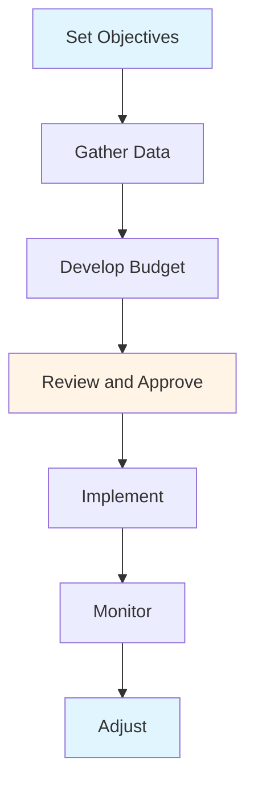

# Financial & Accounting Guide - Comprehensive

## Table of Contents
1. [Introduction](#introduction)
2. [Financial Management Overview](#financial-management-overview)
3. [Accounting Fundamentals](#accounting-fundamentals)
4. [Financial Statements](#financial-statements)
5. [Financial Analysis](#financial-analysis)
6. [Budgeting and Forecasting](#budgeting-and-forecasting)
7. [Cost Management](#cost-management)
8. [Capital Budgeting](#capital-budgeting)
9. [Working Capital Management](#working-capital-management)
10. [Financial Planning](#financial-planning)
11. [Best Practices](#best-practices)
12. [Common Pitfalls](#common-pitfalls)
13. [Real-World Examples](#real-world-examples)
14. [Templates & Checklists](#templates--checklists)
15. [Tools & Software](#tools--software)
16. [Resources](#resources)
17. [Summary](#summary)

---

## Introduction

Financial management and accounting are essential for business success. This guide covers financial management principles, accounting fundamentals, financial statements, analysis, budgeting, and financial decision-making.

### Who This Guide Is For
- Managers making financial decisions
- Entrepreneurs managing business finances
- Business students learning finance
- Anyone involved in financial management

### Key Learning Objectives
- Understand financial management principles
- Learn accounting fundamentals
- Read and analyze financial statements
- Create budgets and forecasts
- Make financial decisions
- Manage costs and working capital

---

## Financial Management Overview

### Definition

**Financial Management** is the planning, organizing, directing, and controlling of financial activities such as procurement and utilization of funds.

### Key Objectives

1. **Profit Maximization**: Maximize profits (short-term focus)
2. **Wealth Maximization**: Maximize shareholder value (long-term focus)
3. **Liquidity Management**: Maintain adequate cash flow
4. **Risk Management**: Manage financial risks
5. **Growth**: Support business growth

### Financial Management Functions

#### 1. Financial Planning
- Estimate financial requirements
- Plan capital structure
- Plan fund allocation

#### 2. Financial Control
- Monitor financial performance
- Compare actual vs planned
- Take corrective action

#### 3. Financial Decision-Making
- Investment decisions
- Financing decisions
- Dividend decisions

---

## Accounting Fundamentals

### Overview

Accounting is the process of recording, classifying, summarizing, and interpreting financial transactions.

### Accounting Principles

#### 1. Accrual Basis
- Record transactions when they occur
- Not when cash is received/paid
- Matches revenues and expenses

#### 2. Going Concern
- Assume business will continue
- Not liquidating
- Basis for valuation

#### 3. Consistency
- Use same methods over time
- Enables comparison
- Change only if justified

#### 4. Conservatism
- Record losses when probable
- Record gains when realized
- Don't overstate assets/income

### Accounting Equation

```
Assets = Liabilities + Equity
```

**Assets**: What company owns
**Liabilities**: What company owes
**Equity**: Owner's stake

### Double-Entry Bookkeeping

**Principle**: Every transaction affects at least two accounts

**Example**: Purchase equipment for $10,000 cash
- Debit: Equipment $10,000 (Asset increases)
- Credit: Cash $10,000 (Asset decreases)

---

## Financial Statements

### Overview

Financial statements provide information about financial position and performance.

### 1. Balance Sheet

**Purpose**: Shows financial position at a point in time

**Structure**:
```
Assets = Liabilities + Equity
```

**Assets**:
- **Current Assets**: Cash, accounts receivable, inventory
- **Fixed Assets**: Property, plant, equipment
- **Intangible Assets**: Goodwill, patents, trademarks

**Liabilities**:
- **Current Liabilities**: Accounts payable, short-term debt
- **Long-term Liabilities**: Long-term debt, bonds

**Equity**:
- **Share Capital**: Owner's investment
- **Retained Earnings**: Accumulated profits

### 2. Income Statement

**Purpose**: Shows financial performance over a period

**Structure**:
```
Revenue
- Cost of Goods Sold
= Gross Profit
- Operating Expenses
= Operating Income
- Interest, Taxes
= Net Income
```

**Key Components**:
- **Revenue**: Sales, service income
- **Cost of Goods Sold**: Direct costs
- **Operating Expenses**: Overhead, salaries, marketing
- **Net Income**: Profit after all expenses

### 3. Cash Flow Statement

**Purpose**: Shows cash inflows and outflows

**Structure**:
```
Cash from Operating Activities
+ Cash from Investing Activities
+ Cash from Financing Activities
= Net Change in Cash
+ Beginning Cash
= Ending Cash
```

**Operating Activities**: Day-to-day business
**Investing Activities**: Buying/selling assets
**Financing Activities**: Borrowing, equity

---

## Financial Analysis

### Overview

Financial analysis evaluates financial performance and position.

### Financial Ratios

#### 1. Liquidity Ratios

**Current Ratio**:
```
Current Ratio = Current Assets / Current Liabilities
```
- Measures short-term liquidity
- Target: > 1.0 (varies by industry)

**Quick Ratio**:
```
Quick Ratio = (Current Assets - Inventory) / Current Liabilities
```
- More conservative liquidity measure
- Excludes inventory

#### 2. Profitability Ratios

**Gross Profit Margin**:
```
Gross Margin = (Revenue - COGS) / Revenue × 100
```
- Measures production efficiency

**Net Profit Margin**:
```
Net Margin = Net Income / Revenue × 100
```
- Measures overall profitability

**Return on Assets (ROA)**:
```
ROA = Net Income / Total Assets × 100
```
- Measures asset efficiency

**Return on Equity (ROE)**:
```
ROE = Net Income / Equity × 100
```
- Measures return to owners

#### 3. Efficiency Ratios

**Asset Turnover**:
```
Asset Turnover = Revenue / Total Assets
```
- Measures asset utilization

**Inventory Turnover**:
```
Inventory Turnover = COGS / Average Inventory
```
- Measures inventory efficiency

#### 4. Leverage Ratios

**Debt-to-Equity**:
```
Debt-to-Equity = Total Debt / Equity
```
- Measures financial leverage

**Debt Ratio**:
```
Debt Ratio = Total Debt / Total Assets × 100
```
- Measures debt level

### Ratio Analysis Best Practices

1. **Compare**: Industry, competitors, historical
2. **Understand Context**: Industry-specific
3. **Use Multiple Ratios**: Don't rely on one
4. **Trend Analysis**: Look at trends over time
5. **Qualitative Factors**: Consider non-financial factors

---

## Budgeting and Forecasting

### Overview

Budgeting is planning future financial activities. Forecasting predicts future financial performance.

### Budgeting Process



### Types of Budgets

#### 1. Operating Budget
- Revenue budget
- Expense budget
- Operating income

#### 2. Capital Budget
- Long-term investments
- Equipment purchases
- Major projects

#### 3. Cash Budget
- Cash inflows
- Cash outflows
- Cash balance

### Budgeting Methods

#### Incremental Budgeting
- Base on previous period
- Adjust for changes
- Simple but may perpetuate inefficiencies

#### Zero-Based Budgeting
- Start from zero
- Justify all expenses
- More thorough but time-consuming

#### Activity-Based Budgeting
- Based on activities
- Cost drivers
- More accurate

### Forecasting Methods

#### 1. Historical Trend
- Extend past trends
- Simple
- Assumes continuity

#### 2. Regression Analysis
- Statistical relationship
- More sophisticated
- Requires data

#### 3. Scenario Planning
- Multiple scenarios
- Best, base, worst case
- Considers uncertainty

---

## Cost Management

### Overview

Cost management controls and reduces costs while maintaining quality.

### Cost Types

#### 1. Fixed Costs
- Don't vary with production
- Examples: Rent, salaries, insurance
- Per unit decreases with volume

#### 2. Variable Costs
- Vary with production
- Examples: Materials, direct labor
- Per unit constant

#### 3. Mixed Costs
- Part fixed, part variable
- Examples: Utilities, maintenance

### Cost Management Strategies

#### 1. Cost Reduction
- Reduce costs
- Maintain quality
- Improve efficiency

#### 2. Cost Control
- Monitor costs
- Compare with budget
- Take corrective action

#### 3. Value Analysis
- Analyze value vs cost
- Eliminate non-value activities
- Optimize value

### Break-Even Analysis

**Break-Even Point**: Where revenue equals costs

```
Break-Even Units = Fixed Costs / (Price - Variable Cost per Unit)
```

**Use**: Pricing decisions, cost analysis

---

## Capital Budgeting

### Overview

Capital budgeting evaluates long-term investment decisions.

### Capital Budgeting Methods

#### 1. Payback Period
- Time to recover investment
- Simple
- Ignores time value of money

#### 2. Net Present Value (NPV)
- Present value of cash flows minus investment
- Considers time value of money
- Accept if NPV > 0

#### 3. Internal Rate of Return (IRR)
- Discount rate where NPV = 0
- Compare with cost of capital
- Accept if IRR > cost of capital

#### 4. Profitability Index
- NPV / Initial Investment
- Measures return per dollar invested
- Higher is better

### Capital Budgeting Process

1. Identify opportunities
2. Estimate cash flows
3. Evaluate using methods
4. Select best projects
5. Implement
6. Monitor

---

## Working Capital Management

### Overview

Working capital management manages short-term assets and liabilities.

### Working Capital

```
Working Capital = Current Assets - Current Liabilities
```

### Components

#### 1. Cash Management
- Maintain adequate cash
- Optimize cash balance
- Invest excess cash

#### 2. Accounts Receivable
- Credit policy
- Collection management
- Bad debt management

#### 3. Inventory Management
- Optimal inventory level
- Reduce holding costs
- Avoid stockouts

#### 4. Accounts Payable
- Payment terms
- Cash discount decisions
- Supplier relationships

### Working Capital Strategies

#### Conservative
- High working capital
- Low risk
- Lower returns

#### Aggressive
- Low working capital
- Higher risk
- Higher returns

#### Moderate
- Balanced approach
- Moderate risk/return

---

## Financial Planning

### Overview

Financial planning sets financial goals and plans to achieve them.

### Financial Planning Process

1. **Assess Current Situation**
   - Current financial position
   - Financial statements
   - Cash flow

2. **Set Financial Goals**
   - Short-term goals
   - Long-term goals
   - SMART goals

3. **Develop Plan**
   - Revenue projections
   - Expense planning
   - Investment planning
   - Financing plan

4. **Implement**
   - Execute plan
   - Monitor progress
   - Adjust as needed

5. **Review and Update**
   - Regular reviews
   - Update plan
   - Adjust goals

---

## Best Practices

### Financial Management Best Practices

1. **Maintain Accurate Records**
   - Timely recording
   - Accurate data
   - Regular reconciliation

2. **Monitor Regularly**
   - Daily cash flow
   - Weekly reports
   - Monthly financials

3. **Plan Ahead**
   - Budgets
   - Forecasts
   - Scenarios

4. **Control Costs**
   - Monitor expenses
   - Identify savings
   - Optimize spending

5. **Manage Cash Flow**
   - Forecast cash flow
   - Maintain reserves
   - Optimize timing

6. **Analyze Performance**
   - Financial ratios
   - Trends
   - Benchmarking

7. **Make Informed Decisions**
   - Use financial data
   - Consider all factors
   - Evaluate alternatives

---

## Common Pitfalls

### Financial Management Pitfalls

1. **Poor Record Keeping**
   - Inaccurate records
   - Late entries
   - Missing transactions

2. **No Budgeting**
   - No financial plan
   - Reactive management
   - Cash flow problems

3. **Ignoring Cash Flow**
   - Focus only on profit
   - Cash flow problems
   - Liquidity issues

4. **No Analysis**
   - Don't analyze performance
   - Miss trends
   - Poor decisions

5. **Over-Leverage**
   - Too much debt
   - High risk
   - Financial distress

6. **No Planning**
   - No financial planning
   - Unprepared for changes
   - Missed opportunities

---

## Real-World Examples

### Example 1: Cash Flow Management

**Situation**: Growing business with cash flow issues
**Solution**: Improved receivables collection, better payment terms
**Result**: Improved cash flow, business stability

### Example 2: Cost Reduction

**Situation**: High operating costs
**Solution**: Process improvement, supplier negotiation
**Result**: 15% cost reduction, improved profitability

### Example 3: Financial Planning

**Situation**: Startup needing funding
**Solution**: Financial plan, projections, investor presentation
**Result**: Successfully raised capital

---

## Templates & Checklists

### Financial Statement Checklist

- [ ] Balance sheet prepared
- [ ] Income statement prepared
- [ ] Cash flow statement prepared
- [ ] All accounts reconciled
- [ ] Financial statements reviewed
- [ ] Ratios calculated
- [ ] Analysis completed

### Budget Checklist

- [ ] Objectives set
- [ ] Historical data gathered
- [ ] Revenue budget created
- [ ] Expense budget created
- [ ] Capital budget created
- [ ] Cash budget created
- [ ] Budget reviewed
- [ ] Budget approved
- [ ] Monitoring system in place

---

## Tools & Software

### Accounting Software

1. **QuickBooks**: Small business accounting
2. **Xero**: Cloud accounting
3. **SAP**: Enterprise accounting
4. **Oracle Financials**: Enterprise financials

### Financial Analysis Tools

1. **Excel**: Financial modeling
2. **Power BI**: Financial dashboards
3. **Tableau**: Financial visualization

### Budgeting Tools

1. **Adaptive Insights**: Budgeting and planning
2. **Anaplan**: Connected planning
3. **Excel**: Budget templates

---

## Resources

### Books

1. "Financial Management" - Brigham & Houston
2. "Accounting Principles" - Weygandt, Kimmel, Kieso
3. "Financial Intelligence" - Karen Berman

### Online Resources

1. **Investopedia**: Financial education
2. **CFA Institute**: Financial analysis
3. **AccountingTools**: Accounting resources

---

## Summary

### Key Takeaways

1. **Financial Management**: Planning, controlling, decision-making
2. **Accounting**: Recording, classifying, summarizing transactions
3. **Financial Statements**: Balance sheet, income statement, cash flow
4. **Financial Analysis**: Ratios, trends, benchmarking
5. **Budgeting**: Planning future finances
6. **Cost Management**: Control and reduce costs
7. **Working Capital**: Manage short-term assets/liabilities

### Final Recommendations

1. **Maintain Records**: Accurate, timely accounting
2. **Monitor Regularly**: Track financial performance
3. **Plan Ahead**: Budgets and forecasts
4. **Analyze**: Use ratios and trends
5. **Manage Cash**: Cash flow is critical
6. **Control Costs**: Optimize spending
7. **Make Decisions**: Use financial data

Remember: Financial management is about making informed decisions to achieve business goals. Understand the numbers, plan ahead, and monitor continuously.

---

**Last Updated**: 2024

**Related Guides**:
- [Strategic Management Guide](./STRATEGIC_MANAGEMENT_GUIDE.md)
- [Operations & Project Management Guide](./OPERATIONS_PROJECT_MANAGEMENT_GUIDE.md)
- [Entrepreneurship Guide](./ENTREPRENEURSHIP_GUIDE.md)

