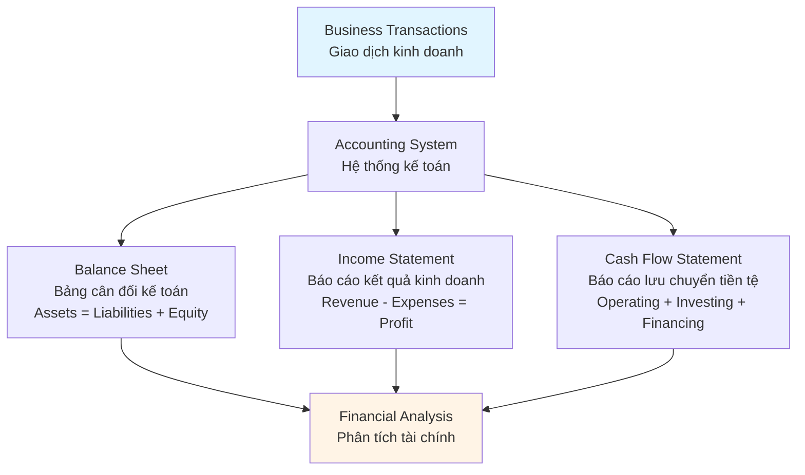
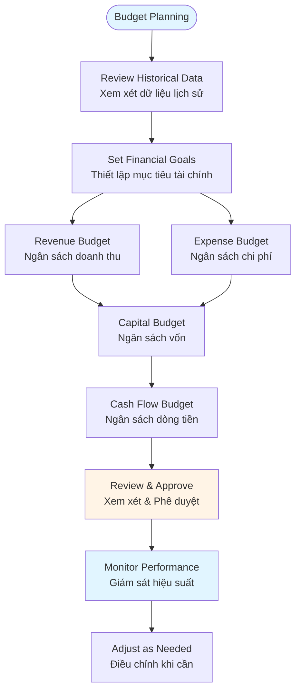
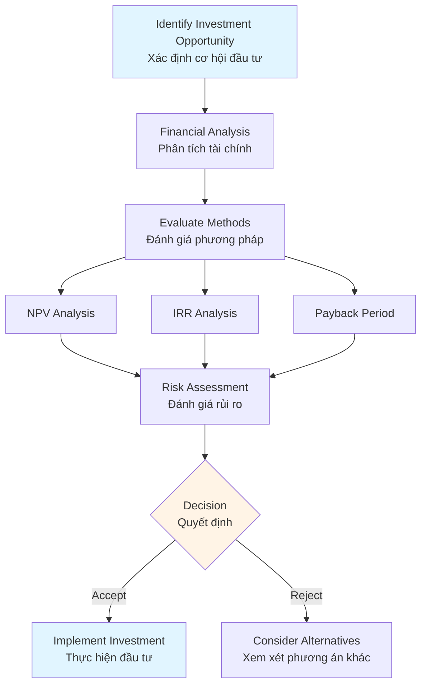

# Financial & Accounting Guide - Comprehensive

## Quản trị Tài chính & Kế toán doanh nghiệp / Financial & Accounting Management

## Table of Contents
1. [Introduction](#introduction)
2. [Financial Statements](#financial-statements)
3. [Financial Analysis and Ratios](#financial-analysis-and-ratios)
4. [Budgeting and Forecasting](#budgeting-and-forecasting)
5. [Cost Management](#cost-management)
6. [Investment Decisions](#investment-decisions)
7. [Best Practices](#best-practices)
8. [Common Pitfalls](#common-pitfalls)
9. [Real-World Examples](#real-world-examples)
10. [Templates & Checklists](#templates--checklists)
11. [Tools & Software](#tools--software)
12. [Resources](#resources)
13. [Summary](#summary)

---

## Introduction

Financial and accounting management is essential for business success. This guide covers financial statements, analysis, budgeting, cost management, and investment decision-making for effective financial management.

Quản trị tài chính và kế toán là điều cần thiết cho thành công kinh doanh. Hướng dẫn này bao gồm báo cáo tài chính, phân tích, ngân sách, quản lý chi phí và ra quyết định đầu tư để quản lý tài chính hiệu quả.

### Who This Guide Is For
- Business managers and executives
- Entrepreneurs and startup founders
- Financial analysts and accountants
- Anyone making financial decisions

### Key Learning Objectives
- Understand financial statements
- Learn financial analysis and ratios
- Master budgeting and forecasting
- Apply cost management techniques
- Make informed investment decisions

---

## Financial Statements

### Three Core Financial Statements / Ba báo cáo tài chính cốt lõi



### 1. Balance Sheet / Bảng cân đối kế toán

**Purpose**: Shows financial position at a point in time

**Key Components**:
- **Assets** (Tài sản): What the company owns
  - Current assets (cash, accounts receivable, inventory)
  - Fixed assets (property, equipment)
- **Liabilities** (Nợ phải trả): What the company owes
  - Current liabilities (accounts payable, short-term debt)
  - Long-term liabilities (long-term debt)
- **Equity** (Vốn chủ sở hữu): Owner's stake
  - Common stock, retained earnings

**Fundamental Equation**: Assets = Liabilities + Equity

### 2. Income Statement / Báo cáo kết quả kinh doanh

**Purpose**: Shows profitability over a period

**Key Components**:
- **Revenue** (Doanh thu): Income from operations
- **Cost of Goods Sold (COGS)** (Giá vốn hàng bán): Direct costs
- **Gross Profit** (Lợi nhuận gộp): Revenue - COGS
- **Operating Expenses** (Chi phí hoạt động): Overhead costs
- **Operating Income** (Lợi nhuận hoạt động): Gross Profit - Operating Expenses
- **Net Income** (Lợi nhuận ròng): Final profit after all expenses

### 3. Cash Flow Statement / Báo cáo lưu chuyển tiền tệ

**Purpose**: Shows cash inflows and outflows

**Key Components**:
- **Operating Activities** (Hoạt động kinh doanh): Cash from operations
- **Investing Activities** (Hoạt động đầu tư): Cash from investments
- **Financing Activities** (Hoạt động tài chính): Cash from financing

**Key Insight**: Profit ≠ Cash flow (timing differences)

---

## Financial Analysis and Ratios

### Financial Ratio Categories / Phân loại tỷ số tài chính

#### 1. Liquidity Ratios / Tỷ số thanh khoản
Measure ability to meet short-term obligations

- **Current Ratio** = Current Assets / Current Liabilities
  - Ideal: 1.5 - 3.0
- **Quick Ratio** = (Current Assets - Inventory) / Current Liabilities
  - Ideal: 1.0 - 2.0

#### 2. Profitability Ratios / Tỷ số lợi nhuận
Measure ability to generate profits

- **Gross Profit Margin** = (Revenue - COGS) / Revenue × 100
- **Operating Profit Margin** = Operating Income / Revenue × 100
- **Net Profit Margin** = Net Income / Revenue × 100
- **Return on Assets (ROA)** = Net Income / Total Assets × 100
- **Return on Equity (ROE)** = Net Income / Shareholders' Equity × 100

#### 3. Efficiency Ratios / Tỷ số hiệu quả
Measure asset utilization

- **Asset Turnover** = Revenue / Total Assets
- **Inventory Turnover** = COGS / Average Inventory
- **Accounts Receivable Turnover** = Revenue / Average Accounts Receivable
- **Days Sales Outstanding (DSO)** = 365 / Accounts Receivable Turnover

#### 4. Leverage Ratios / Tỷ số đòn bẩy
Measure debt levels

- **Debt-to-Equity Ratio** = Total Debt / Total Equity
- **Debt Ratio** = Total Debt / Total Assets
- **Interest Coverage Ratio** = Operating Income / Interest Expense

### Ratio Analysis Framework / Khung phân tích tỷ số

1. **Calculate Ratios** - Compute all relevant ratios
2. **Compare to Benchmarks** - Industry averages, competitors
3. **Trend Analysis** - Compare over time periods
4. **Identify Issues** - Areas of concern
5. **Develop Action Plan** - Address problems

---

## Budgeting and Forecasting

### Budgeting Process / Quy trình lập ngân sách



### Budget Types / Loại ngân sách

1. **Operating Budget** - Day-to-day operations
   - Revenue budget
   - Expense budget
   - Production budget

2. **Capital Budget** - Long-term investments
   - Equipment purchases
   - Facility expansion
   - Technology investments

3. **Cash Flow Budget** - Cash management
   - Cash inflows
   - Cash outflows
   - Cash position

### Forecasting Methods / Phương pháp dự báo

1. **Historical Trend Analysis** - Extrapolate past trends
2. **Market Research** - Industry and market data
3. **Expert Judgment** - Management estimates
4. **Statistical Models** - Regression, time series
5. **Scenario Planning** - Best case, worst case, most likely

### Budget Best Practices / Thực hành ngân sách tốt

- Involve all departments
- Base on realistic assumptions
- Review and update regularly
- Monitor variances
- Take corrective action promptly

---

## Cost Management

### Cost Categories / Phân loại chi phí

#### 1. Fixed Costs / Chi phí cố định
Costs that don't vary with production volume
- Rent, salaries, insurance
- Remain constant regardless of output

#### 2. Variable Costs / Chi phí biến đổi
Costs that vary with production volume
- Raw materials, direct labor
- Increase with production

#### 3. Mixed Costs / Chi phí hỗn hợp
Combination of fixed and variable
- Utilities, maintenance
- Have both fixed and variable components

### Cost Management Techniques / Kỹ thuật quản lý chi phí

#### 1. Cost-Volume-Profit (CVP) Analysis
- Break-even analysis
- Contribution margin
- Target profit analysis

**Break-even Point** = Fixed Costs / (Price - Variable Cost per Unit)

#### 2. Activity-Based Costing (ABC)
- Allocate costs based on activities
- More accurate cost assignment
- Better decision-making

#### 3. Cost Reduction Strategies
- Process improvement
- Supplier negotiation
- Technology automation
- Waste elimination

### Cost Control / Kiểm soát chi phí

1. **Establish Standards** - Set cost targets
2. **Measure Actual Costs** - Track spending
3. **Compare to Standards** - Identify variances
4. **Investigate Variances** - Understand causes
5. **Take Corrective Action** - Address issues

---

## Investment Decisions

### Capital Budgeting / Lập ngân sách vốn

Process of evaluating and selecting long-term investments

### Investment Evaluation Methods / Phương pháp đánh giá đầu tư

#### 1. Payback Period / Thời gian hoàn vốn
Time to recover initial investment
- **Simple**: Doesn't consider time value of money
- **Discounted**: Accounts for time value

#### 2. Net Present Value (NPV) / Giá trị hiện tại ròng
Present value of cash flows minus initial investment
- **NPV > 0**: Accept project
- **NPV < 0**: Reject project
- **NPV = 0**: Indifferent

#### 3. Internal Rate of Return (IRR) / Tỷ suất sinh lời nội bộ
Discount rate where NPV = 0
- **IRR > Required Rate**: Accept project
- **IRR < Required Rate**: Reject project

#### 4. Profitability Index (PI) / Chỉ số lợi nhuận
Present value of future cash flows / Initial investment
- **PI > 1**: Accept project
- **PI < 1**: Reject project

### Investment Decision Framework / Khung ra quyết định đầu tư



---

## Best Practices

### Financial Management Best Practices / Thực hành quản lý tài chính tốt

1. **Regular Financial Review**
   - Monthly financial statements
   - Quarterly comprehensive analysis
   - Annual strategic review

2. **Cash Flow Management**
   - Monitor cash flow daily
   - Forecast cash needs
   - Maintain cash reserves
   - Optimize payment terms

3. **Budget Discipline**
   - Stick to approved budgets
   - Require approval for variances
   - Regular budget reviews
   - Adjust when necessary

4. **Cost Control**
   - Regular cost analysis
   - Identify cost drivers
   - Eliminate waste
   - Negotiate better terms

5. **Financial Planning**
   - Long-term financial strategy
   - Scenario planning
   - Risk management
   - Capital structure optimization

---

## Common Pitfalls

### Financial Management Mistakes / Các sai lầm quản lý tài chính

1. **Ignoring Cash Flow**
   - **Problem**: Focusing only on profit
   - **Impact**: Cash shortages, inability to pay bills
   - **Solution**: Monitor cash flow regularly

2. **Poor Budgeting**
   - **Problem**: Unrealistic budgets
   - **Impact**: Budget variances, poor planning
   - **Solution**: Base budgets on data and realistic assumptions

3. **Inadequate Financial Records**
   - **Problem**: Poor bookkeeping
   - **Impact**: Inaccurate financial statements, compliance issues
   - **Solution**: Maintain accurate, timely records

4. **Not Understanding Financial Statements**
   - **Problem**: Making decisions without understanding numbers
   - **Impact**: Poor financial decisions
   - **Solution**: Learn to read and interpret financial statements

5. **Over-Leveraging**
   - **Problem**: Too much debt
   - **Impact**: High interest costs, financial risk
   - **Solution**: Maintain appropriate debt levels

---

## Real-World Examples

### Example 1: Startup Cash Flow Management

**Situation**: Tech startup with strong revenue growth but cash flow issues.

**Financial Management Approach**:
- Implemented weekly cash flow forecasting
- Negotiated extended payment terms with suppliers
- Accelerated customer collections
- Secured line of credit for working capital
- Reduced non-essential expenses

**Result**: Improved cash position by 40% in 3 months, avoided cash crisis.

### Example 2: Manufacturing Cost Reduction

**Situation**: Manufacturing company facing margin pressure.

**Cost Management Approach**:
- Conducted activity-based costing analysis
- Identified high-cost activities
- Implemented lean manufacturing
- Negotiated better supplier terms
- Automated manual processes

**Result**: Reduced costs by 15%, improved gross margin by 3 percentage points.

---

## Templates & Checklists

### Financial Statement Review Checklist

- [ ] Review balance sheet for unusual items
- [ ] Analyze income statement trends
- [ ] Check cash flow statement
- [ ] Calculate key financial ratios
- [ ] Compare to industry benchmarks
- [ ] Review budget variances
- [ ] Identify areas of concern
- [ ] Develop action plan
- [ ] Document findings

### Budget Template

```
Budget Period: [Month/Quarter/Year]
Department: [Department Name]

Revenue:
- Product A: $[Amount]
- Product B: $[Amount]
- Services: $[Amount]
Total Revenue: $[Amount]

Expenses:
- Salaries: $[Amount]
- Rent: $[Amount]
- Marketing: $[Amount]
- Operations: $[Amount]
- Other: $[Amount]
Total Expenses: $[Amount]

Net Income: $[Amount]

Assumptions:
- [Key assumption 1]
- [Key assumption 2]
- [Key assumption 3]
```

---

## Tools & Software

### Accounting Software
- **QuickBooks** - Small business accounting
- **Xero** - Cloud-based accounting
- **Sage** - Business accounting solutions
- **FreshBooks** - Invoicing and accounting

### Financial Analysis
- **Excel** - Financial modeling and analysis
- **Tableau** - Financial data visualization
- **Power BI** - Business intelligence
- **Bloomberg Terminal** - Financial data and analytics

### Budgeting and Planning
- **Adaptive Insights** - Financial planning and analysis
- **Anaplan** - Business planning platform
- **Prophix** - Corporate performance management

### Expense Management
- **Expensify** - Expense reporting
- **Concur** - Travel and expense management
- **Receipt Bank** - Receipt management

---

## Resources

### Books
- "Financial Intelligence" by Karen Berman and Joe Knight
- "The Intelligent Investor" by Benjamin Graham
- "Financial Accounting" by Walter T. Harrison
- "Managerial Accounting" by Ray Garrison

### Professional Organizations
- **Financial Accounting Standards Board (FASB)**
- **American Institute of CPAs (AICPA)**
- **Institute of Management Accountants (IMA)**

### Certifications
- **CPA** - Certified Public Accountant
- **CMA** - Certified Management Accountant
- **CFA** - Chartered Financial Analyst

---

## Summary

### Key Takeaways / Điểm chính

1. **Financial statements** (Balance Sheet, Income Statement, Cash Flow) provide essential business information.

2. **Financial ratios** help assess liquidity, profitability, efficiency, and leverage.

3. **Budgeting and forecasting** are critical for planning and control.

4. **Cost management** requires understanding fixed, variable, and mixed costs.

5. **Investment decisions** should use NPV, IRR, and other evaluation methods.

6. **Cash flow management** is as important as profitability.

### Next Steps / Bước tiếp theo

- Review your financial statements regularly
- Calculate and monitor key financial ratios
- Develop comprehensive budgets
- Implement cost management practices
- Use financial analysis for decision-making
- Review Strategic Management Guide for financial strategy alignment

---

**Remember**: Financial management is about making informed decisions based on accurate financial information. Regular monitoring and analysis are essential for business success.

**Nhớ rằng**: Quản lý tài chính là đưa ra quyết định sáng suốt dựa trên thông tin tài chính chính xác. Giám sát và phân tích thường xuyên là điều cần thiết cho thành công kinh doanh.
