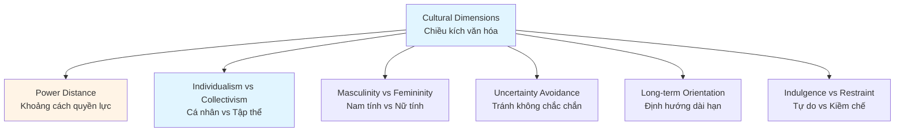
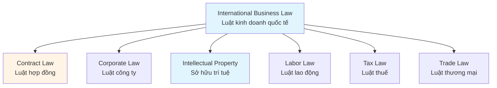
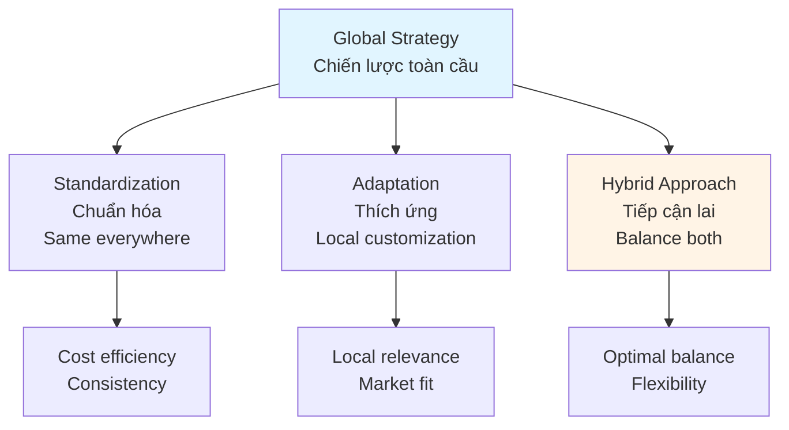
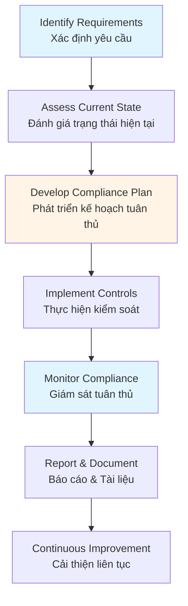
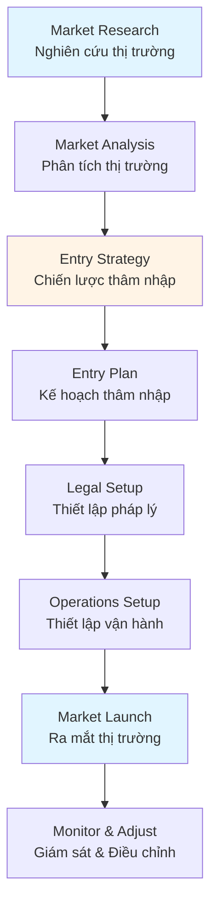

# Global Business & Legal Guide - Comprehensive

## Các vấn đề về văn hóa, pháp luật và toàn cầu hóa / Culture, Legal & Globalization

## Table of Contents
1. [Introduction](#introduction)
2. [Cross-Cultural Management](#cross-cultural-management)
3. [International Business Law Basics](#international-business-law-basics)
4. [Global Business Strategies](#global-business-strategies)
5. [Cultural Considerations](#cultural-considerations)
6. [Legal Compliance](#legal-compliance)
7. [Global Market Entry](#global-market-entry)
8. [Best Practices](#best-practices)
9. [Common Pitfalls](#common-pitfalls)
10. [Real-World Examples](#real-world-examples)
11. [Templates & Checklists](#templates--checklists)
12. [Tools & Software](#tools--software)
13. [Resources](#resources)
14. [Summary](#summary)

---

## Introduction

Global business requires understanding cultural differences, international legal frameworks, and global market dynamics. This guide covers cross-cultural management, international business law, global strategies, and cultural considerations for Western, Japanese, and Vietnamese business contexts.

Kinh doanh toàn cầu đòi hỏi hiểu biết về sự khác biệt văn hóa, khung pháp lý quốc tế và động lực thị trường toàn cầu. Hướng dẫn này bao gồm quản lý đa văn hóa, luật kinh doanh quốc tế, chiến lược toàn cầu và các cân nhắc văn hóa cho bối cảnh kinh doanh phương Tây, Nhật Bản và Việt Nam.

### Who This Guide Is For
- International business managers
- Global expansion leaders
- Cross-cultural team managers
- Entrepreneurs entering global markets
- Anyone working in international business

### Key Learning Objectives
- Understand cross-cultural management
- Learn international business law basics
- Develop global business strategies
- Navigate cultural differences
- Ensure legal compliance
- Plan global market entry

---

## Cross-Cultural Management

### Cultural Dimensions Framework / Khung chiều kích văn hóa

**Hofstede's Cultural Dimensions**:



#### 1. Power Distance / Khoảng cách quyền lực
- High: Accept hierarchical order
- Low: Expect equality

#### 2. Individualism vs. Collectivism / Cá nhân vs. Tập thể
- Individualistic: Focus on individual
- Collectivistic: Focus on group

#### 3. Masculinity vs. Femininity / Nam tính vs. Nữ tính
- Masculine: Competitive, achievement-oriented
- Feminine: Cooperative, quality of life

#### 4. Uncertainty Avoidance / Tránh không chắc chắn
- High: Prefer structure and rules
- Low: Comfortable with ambiguity

#### 5. Long-term Orientation / Định hướng dài hạn
- Long-term: Future-oriented, persistence
- Short-term: Present and past-oriented

### Cross-Cultural Communication / Giao tiếp đa văn hóa

#### Communication Styles / Phong cách giao tiếp

**Direct vs. Indirect**:
- **Direct** (Western): Explicit, straightforward
- **Indirect** (Asian): Implicit, context-dependent

**High-Context vs. Low-Context**:
- **High-Context**: Meaning in context, relationships
- **Low-Context**: Meaning in words, explicit

#### Communication Best Practices / Thực hành giao tiếp tốt

- Learn cultural norms
- Adapt communication style
- Be patient and respectful
- Ask for clarification
- Avoid assumptions
- Build relationships

### Managing Cross-Cultural Teams / Quản lý đội đa văn hóa

#### Challenges / Thách thức
- Language barriers
- Different work styles
- Communication differences
- Time zone differences
- Cultural misunderstandings

#### Strategies / Chiến lược
- Cultural awareness training
- Clear communication protocols
- Inclusive team culture
- Regular team building
- Cultural mediators
- Flexible work arrangements

---

## International Business Law Basics

### Legal Systems / Hệ thống pháp luật

#### Common Law / Luật thông lệ
- Precedent-based
- Case law
- Examples: US, UK, Australia

#### Civil Law / Luật dân sự
- Code-based
- Written statutes
- Examples: France, Germany, Vietnam

#### Religious Law / Luật tôn giáo
- Based on religious texts
- Examples: Islamic law

### Key Legal Areas / Lĩnh vực pháp luật chính



#### 1. Contract Law / Luật hợp đồng
- Contract formation
- Terms and conditions
- Breach of contract
- Dispute resolution
- Governing law

#### 2. Corporate Law / Luật công ty
- Business entity types
- Incorporation requirements
- Corporate governance
- Shareholder rights
- Regulatory compliance

#### 3. Intellectual Property / Sở hữu trí tuệ
- Patents
- Trademarks
- Copyrights
- Trade secrets
- IP protection strategies

#### 4. Labor Law / Luật lao động
- Employment contracts
- Labor regulations
- Worker rights
- Termination procedures
- Dispute resolution

#### 5. Tax Law / Luật thuế
- Corporate taxation
- Transfer pricing
- Tax treaties
- Tax compliance
- Tax planning

#### 6. Trade Law / Luật thương mại
- Import/export regulations
- Tariffs and duties
- Trade agreements
- Customs procedures
- Trade restrictions

### Dispute Resolution / Giải quyết tranh chấp

#### Methods / Phương pháp
- **Negotiation** - Direct discussion
- **Mediation** - Third-party facilitator
- **Arbitration** - Binding decision by arbitrator
- **Litigation** - Court proceedings

---

## Global Business Strategies

### Global Strategy Framework / Khung chiến lược toàn cầu



### Global Strategy Types / Loại chiến lược toàn cầu

#### 1. Global Strategy / Chiến lược toàn cầu
- Standardized products/services
- Centralized operations
- Economies of scale
- Global brand

#### 2. Multi-Domestic Strategy / Chiến lược đa quốc gia
- Localized products/services
- Decentralized operations
- Local responsiveness
- Local brands

#### 3. Transnational Strategy / Chiến lược xuyên quốc gia
- Balance standardization and localization
- Global learning
- Flexible operations
- Integrated network

### Market Entry Strategies / Chiến lược thâm nhập thị trường

1. **Exporting** - Sell products abroad
2. **Licensing** - License technology/brand
3. **Franchising** - Franchise business model
4. **Joint Venture** - Partner with local company
5. **Strategic Alliance** - Collaborate with partners
6. **Wholly Owned Subsidiary** - Full ownership

---

## Cultural Considerations

### Western Business Culture / Văn hóa kinh doanh phương Tây

#### Characteristics / Đặc điểm
- **Direct Communication** - Straightforward, explicit
- **Individualism** - Personal achievement
- **Low Power Distance** - Egalitarian
- **Time Orientation** - Monochronic, punctual
- **Decision Making** - Fast, data-driven
- **Relationship** - Business first, then personal

#### Business Practices / Thực hành kinh doanh
- Clear contracts
- Direct negotiations
- Efficient meetings
- Results-oriented
- Innovation-focused

### Japanese Business Culture / Văn hóa kinh doanh Nhật Bản

#### Characteristics / Đặc điểm
- **Indirect Communication** - Implicit, context-based
- **Collectivism** - Group harmony
- **High Power Distance** - Hierarchical
- **Long-term Orientation** - Future-focused
- **Consensus Decision Making** - Group agreement
- **Relationship** - Personal relationship important

#### Business Practices / Thực hành kinh doanh
- Relationship building (nemawashi)
- Group consensus
- Respect for hierarchy
- Quality focus
- Lifetime employment concept
- Gift-giving (omiyage)

### Vietnamese Business Culture / Văn hóa kinh doanh Việt Nam

#### Characteristics / Đặc điểm
- **Relationship-Oriented** - Personal connections (quan hệ)
- **Hierarchical** - Respect for authority
- **Collectivistic** - Family and group focus
- **Indirect Communication** - Face-saving important
- **Flexible Time** - Polychronic orientation
- **Relationship** - Personal relationships crucial

#### Business Practices / Thực hành kinh doanh
- Relationship building essential
- Family business common
- Face-to-face meetings preferred
- Gift-giving appreciated
- Negotiation process important
- Respect for elders and authority

### Cultural Adaptation Strategies / Chiến lược thích ứng văn hóa

1. **Research** - Learn about target culture
2. **Training** - Cultural awareness training
3. **Local Partners** - Work with local experts
4. **Adaptation** - Adjust business practices
5. **Respect** - Show cultural respect
6. **Patience** - Allow time for relationship building

---

## Legal Compliance

### Compliance Framework / Khung tuân thủ



### Key Compliance Areas / Lĩnh vực tuân thủ chính

#### 1. Regulatory Compliance / Tuân thủ quy định
- Industry regulations
- Government requirements
- Licensing and permits
- Reporting obligations

#### 2. Data Protection / Bảo vệ dữ liệu
- GDPR (Europe)
- Data privacy laws
- Data security
- Consent management

#### 3. Anti-Corruption / Chống tham nhũng
- FCPA (US)
- UK Bribery Act
- Anti-corruption policies
- Due diligence

#### 4. Labor Compliance / Tuân thủ lao động
- Employment laws
- Worker safety
- Wage and hour laws
- Discrimination laws

#### 5. Environmental Compliance / Tuân thủ môi trường
- Environmental regulations
- Sustainability requirements
- Waste management
- Carbon emissions

### Compliance Best Practices / Thực hành tuân thủ tốt

- Regular compliance audits
- Compliance training
- Documented policies
- Monitoring systems
- Legal counsel
- Risk assessment

---

## Global Market Entry

### Market Entry Process / Quy trình thâm nhập thị trường



### Market Entry Checklist / Danh sách kiểm tra thâm nhập thị trường

#### Market Research / Nghiên cứu thị trường
- [ ] Market size and growth
- [ ] Competitive landscape
- [ ] Customer needs
- [ ] Cultural factors
- [ ] Regulatory environment

#### Legal Setup / Thiết lập pháp lý
- [ ] Business entity registration
- [ ] Licenses and permits
- [ ] Tax registration
- [ ] Employment law compliance
- [ ] IP protection

#### Operations Setup / Thiết lập vận hành
- [ ] Local office/facility
- [ ] Supply chain setup
- [ ] Local partnerships
- [ ] Technology infrastructure
- [ ] Staff hiring

#### Market Launch / Ra mắt thị trường
- [ ] Marketing strategy
- [ ] Sales channels
- [ ] Customer service
- [ ] Brand positioning
- [ ] Launch activities

---

## Best Practices

### Global Business Best Practices / Thực hành kinh doanh toàn cầu tốt

1. **Cultural Intelligence**
   - Develop cultural awareness
   - Learn local customs
   - Adapt communication style
   - Build relationships

2. **Legal Due Diligence**
   - Understand local laws
   - Consult legal experts
   - Ensure compliance
   - Protect IP

3. **Local Partnerships**
   - Find reliable partners
   - Build trust
   - Leverage local knowledge
   - Share risks

4. **Flexible Strategy**
   - Balance global and local
   - Adapt to market needs
   - Learn and adjust
   - Stay agile

5. **Risk Management**
   - Identify risks
   - Assess impact
   - Develop mitigation
   - Monitor continuously

---

## Common Pitfalls

### Global Business Mistakes / Các sai lầm kinh doanh toàn cầu

1. **Cultural Insensitivity**
   - **Problem**: Ignoring cultural differences
   - **Solution**: Invest in cultural training

2. **Legal Non-Compliance**
   - **Problem**: Not understanding local laws
   - **Solution**: Consult legal experts

3. **Poor Market Research**
   - **Problem**: Insufficient market understanding
   - **Solution**: Conduct thorough research

4. **Inadequate Localization**
   - **Problem**: One-size-fits-all approach
   - **Solution**: Adapt to local needs

5. **Weak Partnerships**
   - **Problem**: Poor partner selection
   - **Solution**: Due diligence on partners

---

## Real-World Examples

### Example 1: Western Company Entering Vietnam

**Situation**: US tech company expanding to Vietnam.

**Approach**:
- Conducted cultural training
- Built relationships with local partners
- Adapted products for local market
- Hired local team
- Understood Vietnamese business customs
- Ensured legal compliance

**Result**: Successful market entry, strong local presence, 300% growth in 2 years.

### Example 2: Japanese-Vietnamese Joint Venture

**Situation**: Japanese manufacturer partnering with Vietnamese company.

**Approach**:
- Understood Japanese business culture (consensus, hierarchy)
- Respected Vietnamese relationship-building
- Bridged communication styles
- Combined quality focus with relationship approach
- Managed cultural differences proactively

**Result**: Successful partnership, quality products, strong relationships.

---

## Templates & Checklists

### Global Market Entry Plan Template

```
Market: [Country/Region]
Entry Date: [Date]

1. Market Analysis
   - Market size: [Size]
   - Growth rate: [Rate]
   - Competition: [Analysis]
   - Opportunities: [List]
   - Threats: [List]

2. Entry Strategy
   - Entry mode: [Export/JV/Subsidiary]
   - Rationale: [Reason]
   - Timeline: [Schedule]

3. Legal Requirements
   - Business registration: [Status]
   - Licenses needed: [List]
   - Tax obligations: [Details]
   - Compliance requirements: [List]

4. Cultural Considerations
   - Key cultural factors: [List]
   - Adaptation needed: [List]
   - Local partners: [Names]

5. Operations Plan
   - Location: [Address]
   - Staff: [Number]
   - Supply chain: [Details]
   - Technology: [Requirements]

6. Marketing Strategy
   - Positioning: [Strategy]
   - Channels: [List]
   - Budget: [Amount]

7. Risk Management
   - Key risks: [List]
   - Mitigation: [Strategies]
```

---

## Tools & Software

### Global Business
- **Global Trade Management** - Trade compliance software
- **SAP Global Trade Services** - International trade management
- **Thomson Reuters** - Global business intelligence

### Communication
- **Zoom** - Video conferencing across time zones
- **Slack** - Global team communication
- **Microsoft Teams** - International collaboration

### Legal Research
- **LexisNexis** - Legal research platform
- **Westlaw** - Legal information
- **Bloomberg Law** - Legal research and analytics

---

## Resources

### Books
- "The Culture Map" by Erin Meyer
- "International Business" by John Daniels
- "Cross-Cultural Management" by Marie-Joëlle Browaeys
- "Global Business" by Mike Peng

### Professional Organizations
- **International Business Association**
- **Society for Intercultural Education, Training and Research (SIETAR)**
- **International Trade Administration**

---

## Summary

### Key Takeaways / Điểm chính

1. **Cross-cultural management** requires understanding cultural dimensions and adapting communication.

2. **International business law** varies by legal system - understand local requirements.

3. **Global strategies** balance standardization and localization.

4. **Cultural considerations** differ significantly (Western, Japanese, Vietnamese).

5. **Legal compliance** is critical - consult experts and ensure adherence.

6. **Market entry** requires thorough research, legal setup, and cultural adaptation.

### Next Steps / Bước tiếp theo

- Develop cultural intelligence
- Research target markets
- Consult legal experts
- Build local partnerships
- Adapt business practices
- Review Strategic Management Guide for global strategy alignment

---

**Remember**: Success in global business requires cultural sensitivity, legal compliance, and strategic adaptation. Invest in understanding local cultures and regulations.

**Nhớ rằng**: Thành công trong kinh doanh toàn cầu đòi hỏi nhạy cảm văn hóa, tuân thủ pháp luật và thích ứng chiến lược. Đầu tư vào hiểu biết văn hóa và quy định địa phương.
