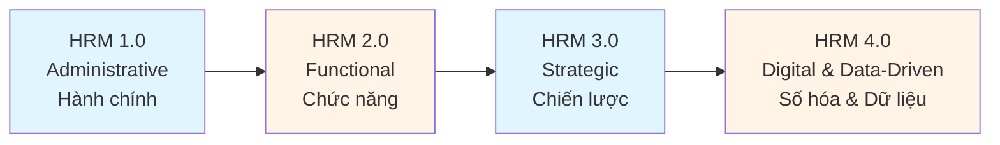
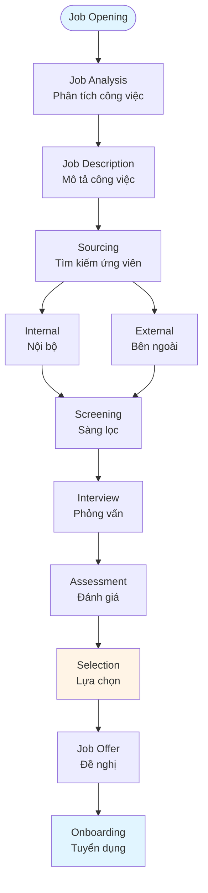
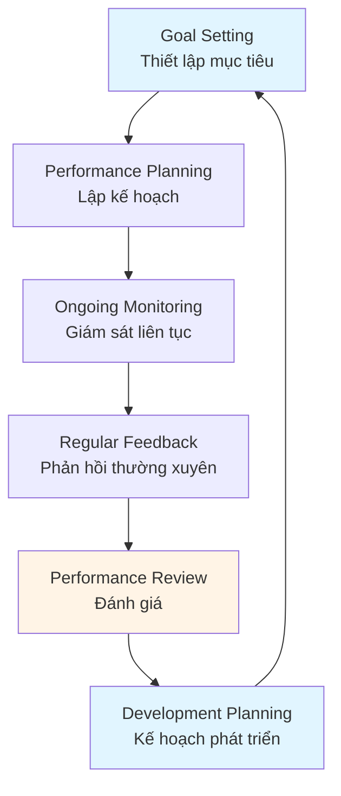

# Human Resource Management Guide - Comprehensive

## HRM 4.0 / Quản trị nguồn nhân lực

## Table of Contents
1. [Introduction](#introduction)
2. [Modern HR Practices (HRM 4.0)](#modern-hr-practices-hrm-40)
3. [Recruitment and Selection](#recruitment-and-selection)
4. [Performance Management](#performance-management)
5. [Employee Development](#employee-development)
6. [Compensation and Benefits](#compensation-and-benefits)
7. [Best Practices](#best-practices)
8. [Common Pitfalls](#common-pitfalls)
9. [Real-World Examples](#real-world-examples)
10. [Templates & Checklists](#templates--checklists)
11. [Tools & Software](#tools--software)
12. [Resources](#resources)
13. [Summary](#summary)

---

## Introduction

Human Resource Management (HRM) is the strategic approach to managing people in organizations. HRM 4.0 represents the evolution to data-driven, technology-enabled, and employee-centric HR practices.

Quản trị nguồn nhân lực (HRM) là cách tiếp cận chiến lược để quản lý con người trong tổ chức. HRM 4.0 đại diện cho sự tiến hóa sang các thực hành HR được hỗ trợ bởi dữ liệu, công nghệ và lấy nhân viên làm trung tâm.

### Who This Guide Is For
- HR professionals and managers
- Business leaders managing teams
- Entrepreneurs building organizations
- Anyone responsible for people management

### Key Learning Objectives
- Understand HRM 4.0 and modern HR practices
- Master recruitment and selection processes
- Learn effective performance management
- Develop employee development strategies
- Design compensation and benefits programs

---

## Modern HR Practices (HRM 4.0)

### Evolution of HRM / Sự tiến hóa của HRM



### HRM 4.0 Characteristics / Đặc điểm HRM 4.0

1. **Data-Driven Decision Making**
   - Analytics and metrics
   - Predictive HR analytics
   - Evidence-based practices

2. **Technology Integration**
   - AI and automation
   - Cloud-based HR systems
   - Mobile HR applications

3. **Employee Experience Focus**
   - Employee-centric design
   - Personalization
   - Continuous feedback

4. **Agile HR Practices**
   - Flexible policies
   - Rapid adaptation
   - Continuous improvement

### Key HR Functions / Các chức năng HR chính

- **Talent Acquisition** - Attracting and hiring talent
- **Performance Management** - Managing employee performance
- **Learning & Development** - Developing employee skills
- **Compensation & Benefits** - Rewarding employees
- **Employee Relations** - Managing workplace relationships
- **HR Analytics** - Data-driven HR insights

---

## Recruitment and Selection

### Recruitment Process / Quy trình tuyển dụng



### Sourcing Strategies / Chiến lược tìm kiếm

#### Internal Sourcing / Tuyển dụng nội bộ
- Job postings
- Internal referrals
- Promotions and transfers
- Succession planning

#### External Sourcing / Tuyển dụng bên ngoài
- Job boards (LinkedIn, Indeed)
- Social media recruiting
- Recruitment agencies
- University partnerships
- Employee referrals

### Selection Methods / Phương pháp lựa chọn

1. **Resume Screening** - Review qualifications
2. **Phone Screening** - Initial assessment
3. **Interviews** - Structured, behavioral, technical
4. **Assessment Tests** - Skills, personality, cognitive
5. **Reference Checks** - Verify background
6. **Background Checks** - Criminal, credit, education

### Interview Best Practices / Thực hành phỏng vấn tốt

- Use structured interview questions
- Ask behavioral questions (STAR method)
- Include multiple interviewers
- Take detailed notes
- Provide candidate feedback
- Make timely decisions

---

## Performance Management

### Performance Management Cycle / Chu kỳ quản lý hiệu suất



### Goal Setting / Thiết lập mục tiêu

**SMART Goals Framework**:
- **S**pecific - Clear and specific
- **M**easurable - Quantifiable metrics
- **A**chievable - Realistic and attainable
- **R**elevant - Aligned with objectives
- **T**ime-bound - Defined timeline

### Performance Review Methods / Phương pháp đánh giá

1. **360-Degree Feedback** - Feedback from multiple sources
2. **Management by Objectives (MBO)** - Goal-based evaluation
3. **Behavioral Rating Scales** - Rate specific behaviors
4. **Critical Incident Method** - Document key events
5. **Self-Assessment** - Employee self-evaluation

### Continuous Feedback / Phản hồi liên tục

- Regular one-on-one meetings
- Real-time feedback
- Peer feedback
- Project-based reviews
- Recognition and appreciation

---

## Employee Development

### Development Approaches / Cách tiếp cận phát triển

#### 1. Training Programs / Chương trình đào tạo
- Onboarding training
- Technical skills training
- Soft skills development
- Leadership development
- Compliance training

#### 2. Mentoring and Coaching / Cố vấn và huấn luyện
- Pair experienced with junior employees
- Provide guidance and support
- Career development discussions
- Skill transfer

#### 3. Job Rotation / Luân chuyển công việc
- Cross-functional experience
- Broaden skills
- Identify interests
- Prepare for advancement

#### 4. Educational Support / Hỗ trợ giáo dục
- Tuition reimbursement
- Certification programs
- Conference attendance
- Online learning platforms

### Career Development Planning / Lập kế hoạch phát triển nghề nghiệp

1. **Assess Current State** - Skills, interests, values
2. **Identify Career Goals** - Short-term and long-term
3. **Develop Action Plan** - Steps to achieve goals
4. **Provide Support** - Resources and opportunities
5. **Monitor Progress** - Regular check-ins

---

## Compensation and Benefits

### Compensation Structure / Cấu trúc lương thưởng

#### Base Salary / Lương cơ bản
- Fixed compensation
- Based on role and experience
- Market-competitive rates

#### Variable Pay / Lương biến đổi
- Performance bonuses
- Profit sharing
- Commission
- Stock options

### Benefits Package / Gói phúc lợi

#### Required Benefits / Phúc lợi bắt buộc
- Social security
- Health insurance
- Workers' compensation
- Unemployment insurance

#### Optional Benefits / Phúc lợi tùy chọn
- Retirement plans (401k, pension)
- Health and wellness programs
- Paid time off (vacation, sick leave)
- Flexible work arrangements
- Professional development
- Employee assistance programs

### Compensation Strategy / Chiến lược lương thưởng

- **Market Positioning** - Above, at, or below market
- **Internal Equity** - Fair pay across organization
- **Performance-Based** - Link pay to performance
- **Total Rewards** - Consider all compensation elements

---

## Best Practices

### HRM Best Practices / Thực hành HRM tốt

1. **Strategic Alignment**
   - Align HR with business strategy
   - Link HR metrics to business outcomes
   - Support organizational goals

2. **Employee Engagement**
   - Regular communication
   - Recognition programs
   - Work-life balance
   - Career development opportunities

3. **Data-Driven Decisions**
   - Use HR analytics
   - Measure HR effectiveness
   - Predict turnover and performance
   - Optimize HR processes

4. **Technology Integration**
   - Automate administrative tasks
   - Use HRIS effectively
   - Leverage AI for recruitment
   - Mobile HR access

5. **Compliance and Ethics**
   - Stay current with labor laws
   - Ensure fair practices
   - Maintain confidentiality
   - Ethical decision-making

---

## Common Pitfalls

### HRM Mistakes to Avoid / Các sai lầm HRM cần tránh

1. **Reactive Instead of Proactive**
   - **Problem**: Responding to issues after they occur
   - **Solution**: Anticipate needs, plan ahead

2. **One-Size-Fits-All Approach**
   - **Problem**: Same policies for all employees
   - **Solution**: Personalize where possible

3. **Poor Onboarding**
   - **Problem**: Inadequate new employee orientation
   - **Solution**: Comprehensive onboarding program

4. **Ignoring Employee Feedback**
   - **Problem**: Not listening to employee concerns
   - **Solution**: Regular surveys, open communication

5. **Inadequate Documentation**
   - **Problem**: Poor record-keeping
   - **Solution**: Maintain accurate HR records

---

## Real-World Examples

### Example 1: Tech Company Talent Acquisition

**Situation**: A tech company needs to hire 50 software engineers in 6 months.

**HRM Approach**:
- Built employer brand through social media
- Created employee referral program
- Partnered with universities
- Used AI for resume screening
- Streamlined interview process

**Result**: Hired 52 engineers in 5 months with 85% retention rate after 1 year.

### Example 2: Performance Management Transformation

**Situation**: Company moving from annual reviews to continuous feedback.

**HRM Approach**:
- Implemented quarterly check-ins
- Trained managers on feedback skills
- Introduced 360-degree feedback
- Created development plans
- Linked performance to development

**Result**: Increased employee satisfaction by 30%, improved performance ratings.

---

## Templates & Checklists

### Job Description Template

```
Position Title: [Title]
Department: [Department]
Reports To: [Manager Title]

Job Summary:
[Brief description of role]

Key Responsibilities:
1. [Responsibility 1]
2. [Responsibility 2]
3. [Responsibility 3]

Required Qualifications:
- Education: [Degree/level]
- Experience: [Years/type]
- Skills: [Specific skills]
- Certifications: [If applicable]

Preferred Qualifications:
- [Additional qualifications]

Compensation:
- Salary Range: [Range]
- Benefits: [List key benefits]
```

### Performance Review Checklist

- [ ] Review employee's goals and objectives
- [ ] Gather performance data and metrics
- [ ] Collect feedback from colleagues
- [ ] Prepare specific examples
- [ ] Schedule review meeting
- [ ] Discuss strengths and achievements
- [ ] Address areas for improvement
- [ ] Set new goals and objectives
- [ ] Create development plan
- [ ] Document review in HR system
- [ ] Follow up on action items

---

## Tools & Software

### HR Information Systems (HRIS)
- **BambooHR** - Comprehensive HR platform
- **Workday** - Enterprise HR and finance
- **ADP** - Payroll and HR solutions
- **Zenefits** - All-in-one HR platform

### Recruitment
- **LinkedIn Recruiter** - Professional networking
- **Greenhouse** - Applicant tracking system
- **Lever** - Modern recruiting software
- **Indeed** - Job board and ATS

### Performance Management
- **15Five** - Performance reviews and feedback
- **Lattice** - Performance management platform
- **Culture Amp** - Employee feedback and analytics

### Learning & Development
- **Coursera for Business** - Online learning
- **Udemy Business** - Skills training
- **Degreed** - Learning experience platform

---

## Resources

### Books
- "The Talent Code" by Daniel Coyle
- "First, Break All the Rules" by Marcus Buckingham
- "Work Rules!" by Laszlo Bock
- "HR Analytics Handbook" by Tracey Smith

### Professional Organizations
- **Society for Human Resource Management (SHRM)**
- **HR Certification Institute (HRCI)**
- **WorldatWork** - Total rewards association

### Certifications
- **SHRM-CP/SHRM-SCP** - SHRM certifications
- **PHR/SPHR** - HRCI certifications
- **GPHR** - Global HR certification

---

## Summary

### Key Takeaways / Điểm chính

1. **HRM 4.0** represents data-driven, technology-enabled, employee-centric HR practices.

2. **Effective recruitment** requires strategic sourcing, structured selection, and strong employer brand.

3. **Performance management** should be continuous, with regular feedback and development focus.

4. **Employee development** is essential for retention and organizational success.

5. **Compensation and benefits** must be competitive, fair, and aligned with performance.

6. **Best practices** include strategic alignment, employee engagement, and data-driven decisions.

### Next Steps / Bước tiếp theo

- Assess your current HR practices
- Identify areas for improvement
- Implement HRM 4.0 technologies
- Develop employee engagement strategies
- Review Strategic Management Guide for HR strategy alignment

---

**Remember**: People are the most valuable asset. Effective HRM creates engaged, productive employees who drive organizational success.

**Nhớ rằng**: Con người là tài sản quý giá nhất. HRM hiệu quả tạo ra những nhân viên gắn kết, năng suất cao, thúc đẩy thành công tổ chức.
