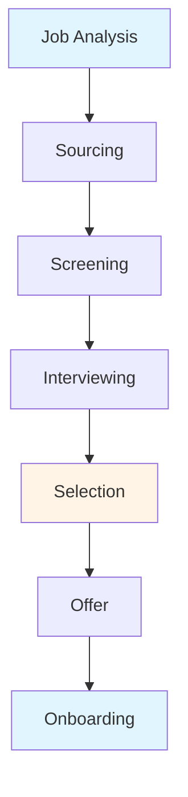
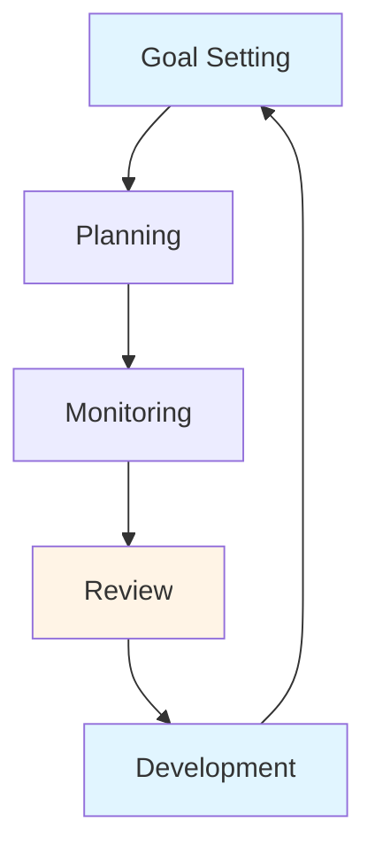

# Human Resource Management Guide - Comprehensive

## Table of Contents
1. [Introduction](#introduction)
2. [HRM Overview](#hrm-overview)
3. [HRM 4.0](#hrm-40)
4. [HR Functions](#hr-functions)
5. [Talent Acquisition](#talent-acquisition)
6. [Employee Development](#employee-development)
7. [Performance Management](#performance-management)
8. [Compensation and Benefits](#compensation-and-benefits)
9. [Employee Relations](#employee-relations)
10. [HR Analytics](#hr-analytics)
11. [HR Technology](#hr-technology)
12. [Best Practices](#best-practices)
13. [Common Pitfalls](#common-pitfalls)
14. [Real-World Examples](#real-world-examples)
15. [Templates & Checklists](#templates--checklists)
16. [Tools & Software](#tools--software)
17. [Resources](#resources)
18. [Summary](#summary)

---

## Introduction

Human Resource Management (HRM) is the strategic approach to managing people in organizations. This guide covers HRM 4.0 (digital transformation), traditional HRM functions, talent management, performance management, and modern HR practices.

### Who This Guide Is For
- HR managers and professionals
- Managers managing people
- Business owners building teams
- Anyone involved in people management

### Key Learning Objectives
- Understand HRM and its evolution
- Learn HRM 4.0 concepts
- Master HR functions
- Develop talent acquisition strategies
- Implement performance management
- Use HR analytics and technology

---

## HRM Overview

### Definition

**Human Resource Management (HRM)** is the strategic approach to managing people to achieve organizational goals.

### HRM Evolution

#### HRM 1.0: Personnel Management
- Administrative focus
- Record keeping
- Compliance
- Reactive

#### HRM 2.0: Human Resources
- Functional focus
- HR departments
- Policies and procedures
- Service-oriented

#### HRM 3.0: Strategic HRM
- Strategic partner
- Business alignment
- Value creation
- Proactive

#### HRM 4.0: Digital HRM
- Digital transformation
- Data-driven
- Employee experience
- Technology-enabled

### HRM Objectives

1. **Attract Talent**: Recruit best people
2. **Develop Talent**: Train and develop
3. **Retain Talent**: Keep good employees
4. **Motivate**: Engage and motivate
5. **Comply**: Legal compliance
6. **Support Strategy**: Align with business

---

## HRM 4.0

### Overview

HRM 4.0 represents the digital transformation of HR, leveraging technology and data.

### Key Characteristics

#### 1. Digitalization
- Digital processes
- Automation
- Self-service
- Mobile access

#### 2. Data-Driven
- HR analytics
- Predictive analytics
- Data-based decisions
- Metrics and KPIs

#### 3. Employee Experience
- Employee-centric
- User-friendly
- Personalized
- Seamless experience

#### 4. Technology Integration
- HRIS systems
- AI and machine learning
- Cloud-based
- Integration

### HRM 4.0 Technologies

#### 1. HR Information Systems (HRIS)
- Centralized data
- Process automation
- Self-service portals
- Analytics

#### 2. AI and Machine Learning
- Resume screening
- Predictive analytics
- Chatbots
- Personalized recommendations

#### 3. Cloud HR
- Cloud-based systems
- Accessibility
- Scalability
- Cost-effective

#### 4. Mobile HR
- Mobile apps
- Anytime access
- Employee self-service
- Manager tools

---

## HR Functions

### Core HR Functions

#### 1. Recruitment and Selection
- Job analysis
- Sourcing candidates
- Screening and selection
- Onboarding

#### 2. Training and Development
- Training needs analysis
- Training programs
- Development plans
- Career development

#### 3. Performance Management
- Goal setting
- Performance reviews
- Feedback
- Development planning

#### 4. Compensation and Benefits
- Salary structure
- Benefits design
- Payroll
- Total rewards

#### 5. Employee Relations
- Employee engagement
- Conflict resolution
- Labor relations
- Communication

#### 6. HR Administration
- Records management
- Policy development
- Compliance
- HR operations

---

## Talent Acquisition

### Overview

Talent acquisition is the process of finding and hiring the right people.

### Recruitment Process

### Sourcing Channels

#### 1. Internal
- Internal job postings
- Employee referrals
- Promotions
- Transfers

#### 2. External
- Job boards
- Social media
- Recruitment agencies
- Campus recruitment
- Networking

### Selection Methods

#### 1. Application Screening
- Resume review
- Application forms
- Initial screening

#### 2. Interviews
- Phone screening
- Video interviews
- Face-to-face interviews
- Panel interviews

#### 3. Assessments
- Skills tests
- Personality tests
- Cognitive tests
- Work samples

#### 4. Reference Checks
- Previous employers
- Character references
- Background checks

### Onboarding

**Process**:
- Welcome and orientation
- Paperwork and compliance
- Training
- Integration
- Support

**Best Practices**:
- Start before day one
- Clear program
- Buddy system
- Regular check-ins
- Feedback

---

## Employee Development

### Overview

Employee development builds capabilities and prepares for future roles.

### Development Methods

#### 1. Training
- On-the-job training
- Classroom training
- Online training
- Workshops
- Conferences

#### 2. Coaching
- One-on-one coaching
- Manager coaching
- External coaches
- Peer coaching

#### 3. Mentoring
- Formal mentoring
- Informal mentoring
- Reverse mentoring
- Group mentoring

#### 4. Job Rotation
- Different roles
- Cross-functional experience
- Skill development
- Career exploration

#### 5. Stretch Assignments
- Challenging projects
- New responsibilities
- Leadership opportunities
- Skill building

### Development Planning

**Process**:
1. Assess current skills
2. Identify development needs
3. Set development goals
4. Create development plan
5. Implement plan
6. Monitor progress
7. Evaluate results

---

## Performance Management

### Overview

Performance management improves employee performance and achieves goals.

### Performance Management Cycle

### Performance Management Process

#### 1. Goal Setting
- SMART goals
- Aligned with business
- Clear expectations
- Employee input

#### 2. Performance Planning
- Development plans
- Resources needed
- Support required
- Timeline

#### 3. Ongoing Monitoring
- Regular check-ins
- Feedback
- Support
- Adjustments

#### 4. Performance Review
- Formal review
- Assess performance
- Discuss achievements
- Identify improvements

#### 5. Development Planning
- Development needs
- Development plan
- Training
- Career planning

### Performance Appraisal Methods

#### 1. 360-Degree Feedback
- Multiple raters
- Comprehensive view
- Development focus

#### 2. Management by Objectives (MBO)
- Goal-based
- Measurable objectives
- Results-oriented

#### 3. Behaviorally Anchored Rating Scales (BARS)
- Behavior-based
- Specific examples
- Objective ratings

---

## Compensation and Benefits

### Overview

Compensation and benefits attract, motivate, and retain employees.

### Compensation Components

#### 1. Base Salary
- Fixed pay
- Market-based
- Job-based
- Experience-based

#### 2. Variable Pay
- Bonuses
- Commissions
- Profit sharing
- Performance pay

#### 3. Benefits
- Health insurance
- Retirement plans
- Paid time off
- Other benefits

### Compensation Strategy

**Factors**:
- Market rates
- Job value
- Performance
- Budget
- Competitiveness

**Approaches**:
- Market leader: Above market
- Market match: At market
- Market lagger: Below market

### Total Rewards

**Components**:
- Compensation
- Benefits
- Work-life balance
- Development
- Recognition
- Culture

---

## Employee Relations

### Overview

Employee relations manages relationships between employees and organization.

### Employee Relations Activities

#### 1. Employee Engagement
- Engagement surveys
- Action planning
- Communication
- Recognition

#### 2. Conflict Resolution
- Mediation
- Grievance handling
- Dispute resolution
- Fair process

#### 3. Communication
- Regular communication
- Transparency
- Feedback channels
- Two-way communication

#### 4. Labor Relations
- Union relations
- Collective bargaining
- Labor law compliance
- Employee representation

### Employee Engagement

**Drivers**:
- Meaningful work
- Growth opportunities
- Recognition
- Work-life balance
- Leadership
- Culture

**Measurement**:
- Engagement surveys
- Pulse surveys
- Exit interviews
- Stay interviews

---

## HR Analytics

### Overview

HR analytics uses data to make HR decisions.

### HR Metrics

#### 1. Recruitment Metrics
- Time to fill
- Cost per hire
- Quality of hire
- Source effectiveness

#### 2. Retention Metrics
- Turnover rate
- Retention rate
- Tenure
- Exit reasons

#### 3. Performance Metrics
- Performance ratings
- Goal achievement
- Development progress
- Promotion rate

#### 4. Engagement Metrics
- Engagement score
- Satisfaction scores
- Participation rates
- Net promoter score

### Predictive Analytics

**Applications**:
- Turnover prediction
- Performance prediction
- Success prediction
- Risk identification

---

## HR Technology

### Overview

HR technology automates and improves HR processes.

### HR Technology Categories

#### 1. HRIS (Human Resource Information System)
- Core HR data
- Employee records
- Payroll integration
- Reporting

#### 2. ATS (Applicant Tracking System)
- Recruitment management
- Candidate tracking
- Interview scheduling
- Onboarding

#### 3. LMS (Learning Management System)
- Training delivery
- Course management
- Progress tracking
- Certification

#### 4. Performance Management Systems
- Goal setting
- Performance reviews
- Feedback
- Development planning

#### 5. HR Analytics Tools
- Data analysis
- Reporting
- Dashboards
- Predictive analytics

---

## Best Practices

### HRM Best Practices

1. **Strategic Alignment**
   - Align HR with business
   - Support strategy
   - Create value

2. **Employee-Centric**
   - Focus on employees
   - Great experience
   - Employee voice

3. **Data-Driven**
   - Use data
   - Analytics
   - Evidence-based decisions

4. **Continuous Improvement**
   - Regular review
   - Innovation
   - Best practices

5. **Technology-Enabled**
   - Leverage technology
   - Automation
   - Efficiency

6. **Compliance**
   - Legal compliance
   - Ethical practices
   - Risk management

---

## Common Pitfalls

### HRM Pitfalls

1. **Administrative Focus Only**
   - Not strategic
   - Reactive
   - Low value

2. **Poor Technology**
   - Outdated systems
   - Poor integration
   - User-unfriendly

3. **No Analytics**
   - No data
   - Intuition only
   - Poor decisions

4. **Poor Employee Experience**
   - Complex processes
   - Poor service
   - Low satisfaction

5. **No Development**
   - No training
   - No development
   - Stagnation

---

## Real-World Examples

### Example 1: HRM 4.0 Transformation

**Company**: Tech company
**Approach**: Digital HR, self-service, analytics
**Result**: Improved efficiency, better experience, data-driven decisions

### Example 2: Talent Acquisition Success

**Company**: Growing startup
**Approach**: Employer branding, employee referrals, great candidate experience
**Result**: Attracted top talent, reduced time to fill

### Example 3: Performance Management

**Company**: Large organization
**Approach**: Continuous feedback, development focus, technology
**Result**: Improved performance, higher engagement

---

## Templates & Checklists

### Recruitment Checklist

- [ ] Job analysis completed
- [ ] Job description written
- [ ] Sourcing strategy defined
- [ ] Job posted
- [ ] Candidates sourced
- [ ] Applications screened
- [ ] Interviews conducted
- [ ] Assessments completed
- [ ] References checked
- [ ] Offer made
- [ ] Onboarding planned

### Performance Review Template

**Employee**: [Name]
**Period**: [Date Range]
**Reviewer**: [Name]

**Goals Achieved**:
- [Goal 1]
- [Goal 2]

**Strengths**:
- [Strength 1]
- [Strength 2]

**Areas for Improvement**:
- [Area 1]
- [Area 2]

**Development Plan**:
- [Development action 1]
- [Development action 2]

---

## Tools & Software

### HRIS Systems

1. **Workday**: Enterprise HRIS
2. **BambooHR**: Small/medium business
3. **ADP**: Payroll and HR
4. **SAP SuccessFactors**: Enterprise HR

### Recruitment Tools

1. **LinkedIn Recruiter**: Sourcing
2. **Greenhouse**: ATS
3. **Lever**: ATS

### Performance Management

1. **15Five**: Performance reviews
2. **Lattice**: Performance management
3. **Culture Amp**: Employee feedback

---

## Resources

### Books

1. "Human Resource Management" - Gary Dessler
2. "The HR Scorecard" - Brian Becker
3. "HR from the Outside In" - Dave Ulrich

### Online Resources

1. **SHRM**: Society for Human Resource Management
2. **HR.com**: HR resources
3. **LinkedIn Learning**: HR courses

---

## Summary

### Key Takeaways

1. **HRM Evolution**: From administrative to strategic to digital
2. **HRM 4.0**: Digital transformation, data-driven, employee experience
3. **HR Functions**: Recruitment, development, performance, compensation
4. **Talent Management**: Attract, develop, retain
5. **Performance Management**: Continuous process
6. **HR Analytics**: Data-driven decisions
7. **HR Technology**: Automation and efficiency

### Final Recommendations

1. **Be Strategic**: Align HR with business
2. **Embrace Technology**: Leverage HR technology
3. **Use Data**: HR analytics
4. **Focus on Experience**: Great employee experience
5. **Develop People**: Invest in development
6. **Measure**: Track HR metrics
7. **Improve Continuously**: Innovation and best practices

Remember: People are the most important asset. Effective HRM attracts, develops, and retains talent to achieve organizational success.

---

**Last Updated**: 2024

**Related Guides**:
- [Management Fundamentals Guide](./MANAGEMENT_FUNDAMENTALS_GUIDE.md)
- [Operations & Project Management Guide](./OPERATIONS_PROJECT_MANAGEMENT_GUIDE.md)
- [Change Management Guide](./CHANGE_MANAGEMENT_GUIDE.md)

