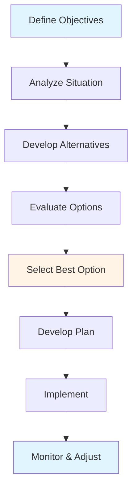
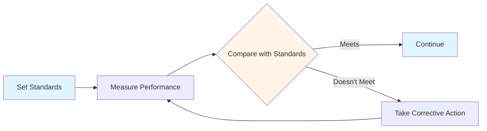
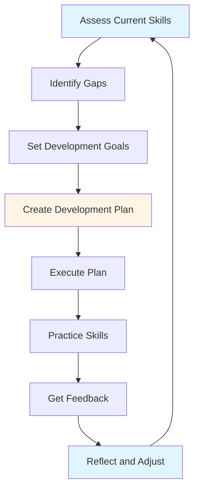
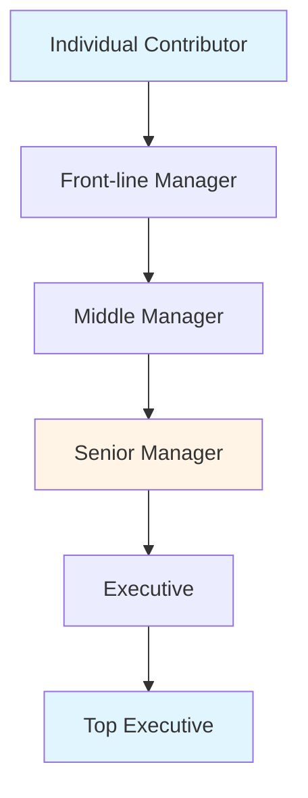

# Management Fundamentals Guide - Comprehensive

## Table of Contents
1. [Introduction](#introduction)
2. [What is Management?](#what-is-management)
3. [Management Functions](#management-functions)
4. [Management Levels](#management-levels)
5. [Management Skills](#management-skills)
6. [Management Theories](#management-theories)
7. [Management Roles](#management-roles)
8. [Career in Management](#career-in-management)
9. [Best Practices](#best-practices)
10. [Common Pitfalls](#common-pitfalls)
11. [Real-World Examples](#real-world-examples)
12. [Templates & Checklists](#templates--checklists)
13. [Tools & Software](#tools--software)
14. [Resources](#resources)
15. [Summary](#summary)

---

## Introduction

Management is the art and science of coordinating resources to achieve organizational goals. This guide provides a comprehensive overview of the management profession, covering fundamental principles, theories, skills, and practices essential for effective management.

### Who This Guide Is For
- New managers learning management fundamentals
- Aspiring managers preparing for leadership roles
- Business students studying management
- Anyone interested in understanding management

### Key Learning Objectives
- Understand what management is and why it matters
- Learn the core management functions
- Understand different management levels and roles
- Develop essential management skills
- Explore management theories and evolution
- Plan a career in management

---

## What is Management?

### Definition

**Management** is the process of planning, organizing, leading, and controlling resources (human, financial, physical, informational) to achieve organizational goals efficiently and effectively.

### Key Concepts

#### Efficiency vs Effectiveness

**Efficiency**: Doing things right
- Minimizing waste
- Optimizing resource use
- Reducing costs
- Time management

**Effectiveness**: Doing the right things
- Achieving goals
- Meeting objectives
- Creating value
- Strategic alignment

**Best Practice**: Balance both - be efficient in doing the right things

#### Management vs Leadership

**Management**:
- Focus: Processes, systems, structure
- Role: Planning, organizing, controlling
- Approach: Systematic, structured
- Goal: Stability and efficiency

**Leadership**:
- Focus: People, vision, change
- Role: Inspiring, motivating, influencing
- Approach: Visionary, adaptive
- Goal: Change and innovation

**Reality**: Effective managers need both management and leadership skills

### Why Management Matters

1. **Goal Achievement**: Ensures organizational objectives are met
2. **Resource Optimization**: Maximizes use of limited resources
3. **Coordination**: Aligns individual efforts toward common goals
4. **Efficiency**: Reduces waste and improves productivity
5. **Innovation**: Facilitates change and improvement
6. **Stakeholder Value**: Creates value for all stakeholders

---

## Management Functions

### Overview

Henri Fayol identified four core management functions, which remain fundamental today:

1. **Planning**
2. **Organizing**
3. **Leading**
4. **Controlling**

### 1. Planning

**Definition**: Setting goals and determining how to achieve them

**Process**:

**Types of Planning**:
- **Strategic Planning**: Long-term (3-5 years), organization-wide
- **Tactical Planning**: Medium-term (1-2 years), departmental
- **Operational Planning**: Short-term (daily, weekly, monthly), specific tasks

**Planning Steps**:
1. Define objectives
2. Analyze current situation
3. Identify alternatives
4. Evaluate alternatives
5. Select best option
6. Develop detailed plan
7. Implement plan
8. Monitor and adjust

**Best Practices**:
- Involve stakeholders
- Be realistic
- Set SMART goals
- Plan for contingencies
- Review and update regularly

### 2. Organizing

**Definition**: Arranging resources and activities to accomplish goals

**Key Activities**:
- Design organizational structure
- Define roles and responsibilities
- Allocate resources
- Establish reporting relationships
- Create coordination mechanisms

**Organizational Structure Types**:

**Functional Structure**:
- Organized by function (Marketing, Finance, HR)
- Advantages: Specialization, efficiency
- Disadvantages: Silos, coordination challenges

**Divisional Structure**:
- Organized by product, geography, or customer
- Advantages: Focus, accountability
- Disadvantages: Duplication, resource competition

**Matrix Structure**:
- Combines functional and divisional
- Advantages: Flexibility, resource efficiency
- Disadvantages: Complexity, dual reporting

**Organizing Best Practices**:
- Clear roles and responsibilities
- Appropriate span of control
- Effective communication channels
- Balance centralization and decentralization
- Regular structure review

### 3. Leading

**Definition**: Influencing and motivating people to achieve goals

**Key Activities**:
- Motivating employees
- Communicating vision
- Building teams
- Resolving conflicts
- Making decisions
- Providing direction

**Leadership Styles**:

**Autocratic**:
- Manager makes decisions alone
- Use when: Quick decisions needed, crisis situations
- Risk: Low employee engagement

**Democratic**:
- Manager involves team in decisions
- Use when: Team expertise needed, buy-in important
- Risk: Slower decisions

**Laissez-Faire**:
- Manager provides minimal direction
- Use when: Highly skilled, self-motivated team
- Risk: Lack of direction

**Best Practice**: Adapt style to situation and people

**Leading Best Practices**:
- Communicate clearly
- Build relationships
- Empower employees
- Recognize achievements
- Provide feedback
- Lead by example

### 4. Controlling

**Definition**: Monitoring performance and taking corrective action

**Control Process**:

**Types of Control**:

**Feedforward Control** (Preventive):
- Before problems occur
- Examples: Hiring process, quality standards
- Focus: Prevention

**Concurrent Control** (Real-time):
- During activities
- Examples: Real-time monitoring, daily standups
- Focus: Immediate correction

**Feedback Control** (After the fact):
- After completion
- Examples: Performance reviews, financial reports
- Focus: Learning and improvement

**Controlling Best Practices**:
- Set clear, measurable standards
- Monitor regularly
- Provide timely feedback
- Focus on important metrics
- Balance control with autonomy
- Use control for improvement, not punishment

---

## Management Levels

### Overview

Organizations typically have three management levels, each with different responsibilities and focus areas.

### 1. Top Management

**Roles**: CEO, President, Vice Presidents, Board of Directors

**Responsibilities**:
- Set organizational vision and strategy
- Make major decisions
- Allocate resources
- Represent organization externally
- Ensure long-term success

**Focus**:
- Strategic planning
- External environment
- Long-term (3-5+ years)
- Organization-wide

**Skills Needed**:
- Strategic thinking
- Vision
- Decision-making
- Communication
- Relationship building

### 2. Middle Management

**Roles**: Department heads, Division managers, Regional managers

**Responsibilities**:
- Implement top management strategies
- Coordinate activities
- Manage teams
- Report to top management
- Translate strategy to tactics

**Focus**:
- Tactical planning
- Department/division
- Medium-term (1-2 years)
- Coordination

**Skills Needed**:
- Planning and organizing
- Team management
- Communication
- Problem-solving
- Coordination

### 3. Front-line Management

**Roles**: Supervisors, Team leaders, Foremen

**Responsibilities**:
- Direct daily operations
- Supervise employees
- Ensure quality
- Handle day-to-day issues
- Report to middle management

**Focus**:
- Operational planning
- Daily operations
- Short-term (daily, weekly)
- Task execution

**Skills Needed**:
- Technical skills
- Communication
- Problem-solving
- Time management
- Employee relations

### Management Level Comparison

| Aspect | Top | Middle | Front-line |
|--------|-----|--------|------------|
| **Time Horizon** | Long-term | Medium-term | Short-term |
| **Scope** | Organization-wide | Department | Team/Tasks |
| **Focus** | Strategy | Tactics | Operations |
| **Decisions** | Strategic | Tactical | Operational |
| **Skills** | Conceptual | Human + Technical | Technical + Human |

---

## Management Skills

### Overview

Robert Katz identified three essential management skills. The relative importance varies by management level.

### 1. Technical Skills

**Definition**: Knowledge and proficiency in specific field or activity

**Examples**:
- Software development (for IT manager)
- Financial analysis (for Finance manager)
- Marketing techniques (for Marketing manager)
- Manufacturing processes (for Operations manager)

**Importance by Level**:
- **Top Management**: Low (delegate to experts)
- **Middle Management**: Medium (understand, don't need to do)
- **Front-line Management**: High (often hands-on)

**Development**:
- Education and training
- On-the-job experience
- Certifications
- Continuous learning

### 2. Human Skills (Interpersonal)

**Definition**: Ability to work with, understand, and motivate people

**Examples**:
- Communication
- Leadership
- Teamwork
- Conflict resolution
- Empathy
- Motivation

**Importance by Level**:
- **All Levels**: High (essential at all levels)

**Development**:
- Practice
- Feedback
- Training
- Self-awareness
- Experience

### 3. Conceptual Skills

**Definition**: Ability to think abstractly, see the big picture, understand relationships

**Examples**:
- Strategic thinking
- Systems thinking
- Problem-solving
- Decision-making
- Vision
- Innovation

**Importance by Level**:
- **Top Management**: High (critical)
- **Middle Management**: Medium (important)
- **Front-line Management**: Low (helpful)

**Development**:
- Education
- Reading
- Mentoring
- Experience
- Reflection

### Skill Development Framework

---

## Management Theories

### Overview

Management theory has evolved over time. Understanding these theories helps managers learn from history and apply appropriate approaches.

### 1. Classical Management Theory (Early 1900s)

#### Scientific Management (Frederick Taylor)
**Key Principles**:
- Scientific study of work
- Standardization
- Time and motion studies
- Piece-rate pay
- Separation of planning and doing

**Contributions**:
- Efficiency focus
- Systematic approach
- Measurement

**Limitations**:
- Dehumanizing
- Ignores individual differences
- Limited to routine work

#### Administrative Management (Henri Fayol)
**Key Principles**:
- Division of work
- Authority and responsibility
- Discipline
- Unity of command
- Unity of direction
- Subordination of individual interest
- Remuneration
- Centralization
- Scalar chain
- Order
- Equity
- Stability of tenure
- Initiative
- Esprit de corps

**Contributions**:
- Management functions
- Principles still relevant
- Systematic approach

**Limitations**:
- Rigid
- May not fit all situations

### 2. Behavioral Management Theory (1930s-1950s)

#### Hawthorne Studies
**Key Findings**:
- Social factors affect productivity
- Attention improves performance
- Group dynamics matter
- Informal organization exists

**Contributions**:
- Human element in management
- Social relationships matter
- Employee satisfaction important

#### Human Relations Movement
**Key Principles**:
- People are important
- Social needs matter
- Communication is critical
- Participation improves outcomes

**Contributions**:
- Focus on people
- Employee involvement
- Better understanding of motivation

### 3. Modern Management Theory (1950s-Present)

#### Systems Theory
**Key Concepts**:
- Organizations are systems
- Interconnected parts
- Input-process-output
- Feedback loops
- Environment matters

**Contributions**:
- Holistic view
- Understanding interconnections
- Systems thinking

#### Contingency Theory
**Key Concepts**:
- No one best way
- Depends on situation
- Context matters
- Adapt approach

**Contributions**:
- Flexibility
- Situational awareness
- Practical application

#### Quality Management
**Key Concepts**:
- Continuous improvement
- Customer focus
- Employee involvement
- Process orientation
- Data-driven decisions

**Contributions**:
- Quality focus
- Continuous improvement
- Customer satisfaction

---

## Management Roles

### Overview

Henry Mintzberg identified 10 management roles organized into three categories.

### Interpersonal Roles

#### 1. Figurehead
- Symbolic head
- Perform ceremonial duties
- Represent organization

**Examples**: Attending events, signing documents, welcoming visitors

#### 2. Leader
- Motivate and direct employees
- Hire and train
- Build relationships

**Examples**: Team meetings, performance reviews, coaching

#### 3. Liaison
- Maintain external contacts
- Build networks
- Exchange information

**Examples**: Industry events, client meetings, partnerships

### Informational Roles

#### 4. Monitor
- Seek and receive information
- Monitor environment
- Stay informed

**Examples**: Reading reports, attending meetings, market research

#### 5. Disseminator
- Share information with organization
- Communicate decisions
- Keep team informed

**Examples**: Team meetings, emails, announcements

#### 6. Spokesperson
- Represent organization externally
- Communicate to stakeholders
- Public relations

**Examples**: Press conferences, investor meetings, public speaking

### Decisional Roles

#### 7. Entrepreneur
- Initiate change
- Identify opportunities
- Implement improvements

**Examples**: New projects, process improvements, innovation

#### 8. Disturbance Handler
- Handle conflicts
- Resolve crises
- Solve problems

**Examples**: Conflict resolution, crisis management, problem-solving

#### 9. Resource Allocator
- Allocate resources
- Make budget decisions
- Prioritize activities

**Examples**: Budget approval, resource assignment, priority setting

#### 10. Negotiator
- Negotiate with stakeholders
- Represent in negotiations
- Reach agreements

**Examples**: Contract negotiations, salary discussions, vendor agreements

---

## Career in Management

### Management Career Path

### Career Stages

#### Stage 1: Individual Contributor
**Focus**: Technical excellence
**Skills**: Technical skills
**Goal**: Become expert in field

#### Stage 2: Front-line Manager
**Focus**: Managing small team
**Skills**: Technical + Human skills
**Goal**: Effective team management

#### Stage 3: Middle Manager
**Focus**: Managing department/division
**Skills**: Human + Conceptual skills
**Goal**: Department success

#### Stage 4: Senior Manager
**Focus**: Multiple departments/strategic
**Skills**: Strong conceptual + human skills
**Goal**: Organizational success

#### Stage 5: Executive
**Focus**: Organization-wide strategy
**Skills**: Strategic thinking, vision
**Goal**: Long-term organizational success

### Career Development

**1. Self-Assessment**
- Identify strengths and weaknesses
- Understand interests and values
- Assess skills and competencies
- Determine career goals

**2. Skill Development**
- Identify skill gaps
- Create development plan
- Seek training and education
- Gain experience
- Find mentor

**3. Networking**
- Build professional network
- Attend industry events
- Join professional associations
- Maintain relationships
- Seek opportunities

**4. Performance**
- Excel in current role
- Take on challenges
- Show leadership potential
- Deliver results
- Build reputation

**5. Career Planning**
- Set career goals
- Identify career path
- Plan development activities
- Seek feedback
- Adjust as needed

---

## Best Practices

### Management Best Practices

1. **Know Your People**
   - Understand individual strengths
   - Know what motivates them
   - Build relationships
   - Show genuine care

2. **Communicate Effectively**
   - Clear and frequent communication
   - Listen actively
   - Provide feedback
   - Be transparent

3. **Set Clear Expectations**
   - Define goals clearly
   - Set performance standards
   - Provide direction
   - Align with organization

4. **Empower Your Team**
   - Delegate appropriately
   - Provide resources
   - Trust your team
   - Support decisions

5. **Lead by Example**
   - Model desired behavior
   - Demonstrate values
   - Show commitment
   - Be accountable

6. **Focus on Results**
   - Set clear objectives
   - Measure performance
   - Hold accountable
   - Recognize achievements

7. **Continuous Learning**
   - Stay current
   - Learn from experience
   - Seek feedback
   - Adapt and improve

---

## Common Pitfalls

### Management Pitfalls

1. **Micromanagement**
   - Too much control
   - Not trusting team
   - Demotivating
   - Inefficient

2. **Poor Communication**
   - Unclear messages
   - Not listening
   - Inadequate information
   - Misunderstandings

3. **No Clear Direction**
   - Unclear goals
   - Vague expectations
   - Team confusion
   - Poor performance

4. **Ignoring People**
   - Focus only on tasks
   - Not recognizing contributions
   - Poor relationships
   - Low morale

5. **Resistance to Change**
   - Stuck in old ways
   - Not adapting
   - Missing opportunities
   - Falling behind

6. **Poor Decision-Making**
   - Hasty decisions
   - Not considering alternatives
   - No analysis
   - Bad outcomes

7. **No Development**
   - Not developing team
   - Not developing self
   - Stagnation
   - Limited growth

---

## Real-World Examples

### Example 1: Effective Planning

**Situation**: Tech startup planning product launch
**Approach**: Comprehensive planning with stakeholder involvement
**Result**: Successful launch, on-time, on-budget

### Example 2: Strong Leadership

**Situation**: Company facing crisis
**Approach**: Transparent communication, clear direction, team empowerment
**Result**: Team rallied, crisis resolved, stronger organization

### Example 3: Skill Development

**Situation**: New manager promoted from individual contributor
**Approach**: Structured development plan, mentoring, training
**Result**: Successful transition, effective manager

---

## Templates & Checklists

### Management Skills Assessment

**Technical Skills**:
- [ ] Current level: [Rate 1-5]
- [ ] Target level: [Rate 1-5]
- [ ] Development plan: [Plan]

**Human Skills**:
- [ ] Communication: [Rate 1-5]
- [ ] Leadership: [Rate 1-5]
- [ ] Teamwork: [Rate 1-5]
- [ ] Conflict resolution: [Rate 1-5]
- [ ] Development plan: [Plan]

**Conceptual Skills**:
- [ ] Strategic thinking: [Rate 1-5]
- [ ] Problem-solving: [Rate 1-5]
- [ ] Decision-making: [Rate 1-5]
- [ ] Systems thinking: [Rate 1-5]
- [ ] Development plan: [Plan]

### Management Functions Checklist

**Planning**:
- [ ] Objectives defined
- [ ] Situation analyzed
- [ ] Alternatives considered
- [ ] Plan developed
- [ ] Plan communicated
- [ ] Plan implemented
- [ ] Progress monitored

**Organizing**:
- [ ] Structure designed
- [ ] Roles defined
- [ ] Resources allocated
- [ ] Relationships established
- [ ] Coordination mechanisms in place

**Leading**:
- [ ] Vision communicated
- [ ] Team motivated
- [ ] Direction provided
- [ ] Conflicts resolved
- [ ] Decisions made
- [ ] Feedback provided

**Controlling**:
- [ ] Standards set
- [ ] Performance measured
- [ ] Compared with standards
- [ ] Corrective action taken
- [ ] Results communicated

---

## Tools & Software

### Management Tools

1. **Project Management**: Microsoft Project, Asana, Trello
2. **Communication**: Slack, Microsoft Teams, Zoom
3. **Analytics**: Excel, Power BI, Tableau
4. **Documentation**: Confluence, Google Docs, Notion
5. **Time Management**: Calendar apps, task managers

### Development Tools

1. **Learning Platforms**: Coursera, LinkedIn Learning, Udemy
2. **Books**: Management books, case studies
3. **Networking**: LinkedIn, professional associations
4. **Mentoring**: Mentorship programs, coaching

---

## Resources

### Books

1. "The Practice of Management" - Peter Drucker
2. "Good to Great" - Jim Collins
3. "The 7 Habits of Highly Effective People" - Stephen Covey
4. "First, Break All the Rules" - Marcus Buckingham
5. "The One Minute Manager" - Ken Blanchard

### Online Resources

1. **Harvard Business Review**: Management articles
2. **MIT Sloan Management Review**: Management research
3. **PMI**: Project management resources
4. **Coursera**: Management courses

### Certifications

1. **MBA**: Master of Business Administration
2. **PMP**: Project Management Professional
3. **CMI**: Chartered Management Institute
4. **SHRM**: Society for Human Resource Management

---

## Summary

### Key Takeaways

1. **Management** is coordinating resources to achieve goals efficiently and effectively
2. **Four Functions**: Planning, Organizing, Leading, Controlling
3. **Three Levels**: Top, Middle, Front-line (different focus and skills)
4. **Three Skills**: Technical, Human, Conceptual (importance varies by level)
5. **Management Theories**: Evolved from classical to modern, learn from all
6. **Management Roles**: 10 roles in three categories (Interpersonal, Informational, Decisional)
7. **Career Development**: Continuous learning and skill development

### Final Recommendations

1. **Understand Fundamentals**: Master core management functions
2. **Develop Skills**: Focus on all three skill types
3. **Learn from Theories**: Apply appropriate approaches
4. **Practice Roles**: Fulfill all management roles
5. **Plan Career**: Set goals and develop accordingly
6. **Learn Continuously**: Stay current and improve
7. **Lead by Example**: Model desired behavior

Remember: Effective management combines art (leadership, relationships) and science (planning, analysis). Develop both aspects for success.

---

**Last Updated**: 2024

**Related Guides**:
- [Strategic Management Guide](./STRATEGIC_MANAGEMENT_GUIDE.md)
- [Human Resource Management Guide](./HUMAN_RESOURCE_MANAGEMENT_GUIDE.md)
- [Operations & Project Management Guide](./OPERATIONS_PROJECT_MANAGEMENT_GUIDE.md)

