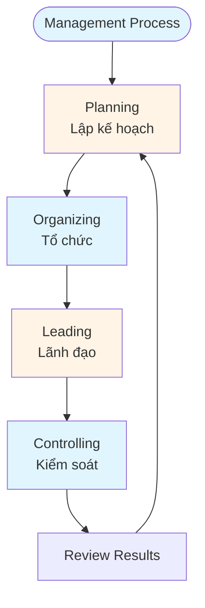
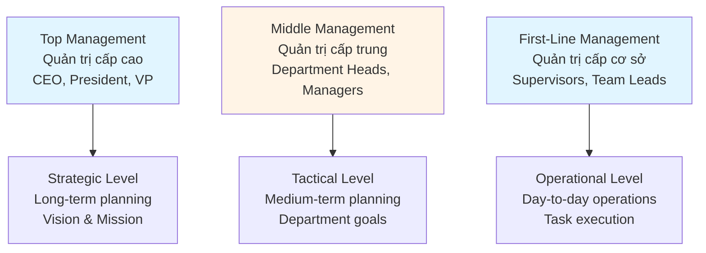

# Management Fundamentals Guide - Comprehensive

## Tổng quan về Nghề quản trị / Management Profession Overview

## Table of Contents
1. [Introduction](#introduction)
2. [Core Management Concepts](#core-management-concepts)
3. [Management Roles and Responsibilities](#management-roles-and-responsibilities)
4. [Management Levels](#management-levels)
5. [Management Skills Framework](#management-skills-framework)
6. [Best Practices](#best-practices)
7. [Common Pitfalls](#common-pitfalls)
8. [Real-World Examples](#real-world-examples)
9. [Templates & Checklists](#templates--checklists)
10. [Tools & Software](#tools--software)
11. [Resources](#resources)
12. [Summary](#summary)

---

## Introduction

Management is the art and science of coordinating resources to achieve organizational goals. This guide covers fundamental management concepts, roles, responsibilities, and skills essential for effective management.

Quản trị là nghệ thuật và khoa học phối hợp các nguồn lực để đạt được mục tiêu tổ chức. Hướng dẫn này bao gồm các khái niệm quản trị cơ bản, vai trò, trách nhiệm và kỹ năng cần thiết cho quản lý hiệu quả.

### Who This Guide Is For
- New managers starting their management journey
- Team leads transitioning to management roles
- Anyone aspiring to become a manager
- Business students learning management fundamentals

### Key Learning Objectives
- Understand core management concepts
- Learn management roles and responsibilities
- Identify different management levels
- Develop essential management skills
- Apply management best practices

---

## Core Management Concepts

### What is Management? / Quản trị là gì?

**Management** is the process of planning, organizing, leading, and controlling resources to achieve organizational objectives efficiently and effectively.

**Quản trị** là quá trình lập kế hoạch, tổ chức, lãnh đạo và kiểm soát các nguồn lực để đạt được mục tiêu tổ chức một cách hiệu quả.

### Four Functions of Management / Bốn chức năng quản trị



#### 1. Planning / Lập kế hoạch
- Setting objectives and goals
- Developing strategies and plans
- Allocating resources
- Establishing timelines

#### 2. Organizing / Tổ chức
- Structuring work and teams
- Assigning responsibilities
- Establishing reporting relationships
- Creating organizational structure

#### 3. Leading / Lãnh đạo
- Motivating employees
- Communicating vision
- Influencing behavior
- Building teams

#### 4. Controlling / Kiểm soát
- Monitoring performance
- Comparing results to plans
- Taking corrective action
- Ensuring quality

### Management vs. Leadership / Quản trị vs. Lãnh đạo

**Management** focuses on:
- Maintaining stability
- Following processes
- Managing resources
- Ensuring efficiency

**Leadership** focuses on:
- Creating change
- Inspiring vision
- Influencing people
- Driving innovation

Effective managers combine both management and leadership skills.

---

## Management Roles and Responsibilities

### Managerial Roles (Mintzberg's Model) / Vai trò quản lý

#### Interpersonal Roles / Vai trò liên nhân cách
1. **Figurehead** - Symbolic head, performs ceremonial duties
2. **Leader** - Motivates and directs subordinates
3. **Liaison** - Maintains network of contacts

#### Informational Roles / Vai trò thông tin
1. **Monitor** - Receives and collects information
2. **Disseminator** - Transmits information to organization
3. **Spokesperson** - Transmits information to outsiders

#### Decisional Roles / Vai trò quyết định
1. **Entrepreneur** - Initiates change and innovation
2. **Disturbance Handler** - Handles unexpected problems
3. **Resource Allocator** - Allocates organizational resources
4. **Negotiator** - Represents organization in negotiations

### Key Responsibilities / Trách nhiệm chính

- **Goal Achievement** - Ensure team meets objectives
- **Resource Management** - Optimize use of people, time, budget
- **Team Development** - Develop and grow team members
- **Problem Solving** - Address issues and challenges
- **Communication** - Facilitate information flow
- **Decision Making** - Make timely, informed decisions
- **Performance Management** - Monitor and improve performance

---

## Management Levels

### Three Levels of Management / Ba cấp quản trị



#### Top Management / Quản trị cấp cao
- **Focus**: Strategic planning, long-term goals
- **Time Horizon**: 3-5 years
- **Responsibilities**: Vision, mission, major decisions
- **Skills**: Strategic thinking, vision, leadership

#### Middle Management / Quản trị cấp trung
- **Focus**: Tactical planning, department goals
- **Time Horizon**: 1-2 years
- **Responsibilities**: Department coordination, resource allocation
- **Skills**: Planning, organizing, communication

#### First-Line Management / Quản trị cấp cơ sở
- **Focus**: Operational execution, daily tasks
- **Time Horizon**: Daily to weekly
- **Responsibilities**: Task assignment, quality control
- **Skills**: Technical skills, problem-solving, communication

---

## Management Skills Framework

### Three Types of Management Skills / Ba loại kỹ năng quản trị

#### 1. Technical Skills / Kỹ năng kỹ thuật
- Job-specific knowledge and expertise
- Most important for first-line managers
- Examples: Software development, accounting, marketing

#### 2. Human Skills / Kỹ năng con người
- Ability to work with and through people
- Important at all management levels
- Examples: Communication, motivation, conflict resolution

#### 3. Conceptual Skills / Kỹ năng tư duy
- Ability to think abstractly and see the big picture
- Most important for top management
- Examples: Strategic thinking, systems thinking, vision

### Skill Importance by Level / Tầm quan trọng kỹ năng theo cấp độ

| Management Level | Technical | Human | Conceptual |
|-----------------|-----------|-------|------------|
| Top Management | Low | High | Very High |
| Middle Management | Medium | High | High |
| First-Line Management | High | High | Medium |

---

## Best Practices

### Effective Management Practices / Thực hành quản lý hiệu quả

1. **Clear Communication**
   - Set clear expectations
   - Provide regular feedback
   - Listen actively
   - Use multiple communication channels

2. **Delegation**
   - Delegate appropriate tasks
   - Provide necessary authority
   - Maintain accountability
   - Support and guide

3. **Goal Setting**
   - Set SMART goals (Specific, Measurable, Achievable, Relevant, Time-bound)
   - Align goals with organizational objectives
   - Review and adjust regularly

4. **Team Development**
   - Identify development needs
   - Provide training opportunities
   - Offer mentoring and coaching
   - Recognize and reward achievements

5. **Decision Making**
   - Gather relevant information
   - Consider multiple alternatives
   - Involve stakeholders when appropriate
   - Make timely decisions

6. **Performance Management**
   - Set clear performance standards
   - Monitor progress regularly
   - Provide constructive feedback
   - Address performance issues promptly

---

## Common Pitfalls

### Mistakes to Avoid / Các sai lầm cần tránh

1. **Micromanagement**
   - **Problem**: Excessive control and involvement in details
   - **Impact**: Demotivates team, reduces efficiency
   - **Solution**: Delegate appropriately, trust team members

2. **Poor Communication**
   - **Problem**: Unclear instructions, lack of feedback
   - **Impact**: Confusion, mistakes, low morale
   - **Solution**: Establish clear communication channels, provide regular updates

3. **Ignoring Team Development**
   - **Problem**: Not investing in team growth
   - **Impact**: Stagnant skills, high turnover
   - **Solution**: Create development plans, provide learning opportunities

4. **Avoiding Difficult Decisions**
   - **Problem**: Procrastinating on tough choices
   - **Impact**: Problems escalate, opportunities lost
   - **Solution**: Gather information, consult stakeholders, decide promptly

5. **Not Recognizing Achievements**
   - **Problem**: Failing to acknowledge good work
   - **Impact**: Low motivation, decreased engagement
   - **Solution**: Recognize and reward contributions regularly

---

## Real-World Examples

### Example 1: Tech Startup Manager

**Situation**: A startup manager needs to scale a team from 5 to 20 people.

**Management Approach**:
- **Planning**: Created hiring plan with role definitions
- **Organizing**: Established team structure and reporting lines
- **Leading**: Communicated vision and motivated team
- **Controlling**: Set KPIs and monitored progress weekly

**Result**: Successfully scaled team while maintaining productivity and culture.

### Example 2: Manufacturing Supervisor

**Situation**: Production quality issues affecting customer satisfaction.

**Management Approach**:
- **Planning**: Developed quality improvement plan
- **Organizing**: Reorganized quality control processes
- **Leading**: Trained team on new procedures
- **Controlling**: Implemented daily quality checks

**Result**: Reduced defects by 40% within 3 months.

---

## Templates & Checklists

### Management Planning Template

```
Goal: [Specific objective]
Timeline: [Start date] to [End date]
Resources Needed:
- People: [Team members/roles]
- Budget: [Amount]
- Tools: [Equipment/software]

Action Steps:
1. [Task 1] - Owner: [Name] - Due: [Date]
2. [Task 2] - Owner: [Name] - Due: [Date]
3. [Task 3] - Owner: [Name] - Due: [Date]

Success Criteria:
- [Measurable outcome 1]
- [Measurable outcome 2]
- [Measurable outcome 3]

Risks & Mitigation:
- [Risk 1]: [Mitigation strategy]
- [Risk 2]: [Mitigation strategy]
```

### Daily Management Checklist

- [ ] Review team priorities and goals
- [ ] Check on progress of key projects
- [ ] Address any urgent issues
- [ ] Provide feedback to team members
- [ ] Update stakeholders on status
- [ ] Plan for next day/week
- [ ] Recognize team achievements

---

## Tools & Software

### Project Management
- **Asana** - Task and project management
- **Trello** - Kanban board management
- **Monday.com** - Work management platform
- **Jira** - Agile project management

### Communication
- **Slack** - Team communication
- **Microsoft Teams** - Collaboration platform
- **Zoom** - Video conferencing

### Performance Management
- **15Five** - Performance reviews and feedback
- **Lattice** - Performance management platform
- **BambooHR** - HR management system

### Analytics & Reporting
- **Google Analytics** - Business analytics
- **Tableau** - Data visualization
- **Power BI** - Business intelligence

---

## Resources

### Books
- "The Effective Executive" by Peter Drucker
- "First, Break All the Rules" by Marcus Buckingham
- "The One Minute Manager" by Kenneth Blanchard
- "Good to Great" by Jim Collins

### Online Courses
- Coursera: Management Fundamentals
- edX: Business Management Courses
- LinkedIn Learning: Management Skills

### Professional Organizations
- **American Management Association (AMA)**
- **Project Management Institute (PMI)**
- **Society for Human Resource Management (SHRM)**

---

## Summary

### Key Takeaways / Điểm chính

1. **Management is a process** involving planning, organizing, leading, and controlling.

2. **Managers play multiple roles** - interpersonal, informational, and decisional.

3. **Management occurs at three levels** - top (strategic), middle (tactical), and first-line (operational).

4. **Effective managers need** technical, human, and conceptual skills in varying proportions.

5. **Best practices include** clear communication, effective delegation, goal setting, and team development.

6. **Common pitfalls** include micromanagement, poor communication, and avoiding difficult decisions.

### Next Steps / Bước tiếp theo

- Review your current management practices
- Identify areas for skill development
- Apply management frameworks to your work
- Study Strategic Management Guide for advanced concepts

---

**Remember**: Effective management is about achieving results through people. Focus on developing your team, communicating clearly, and making informed decisions.

**Nhớ rằng**: Quản lý hiệu quả là đạt được kết quả thông qua con người. Tập trung vào phát triển đội ngũ, giao tiếp rõ ràng và đưa ra quyết định sáng suốt.
