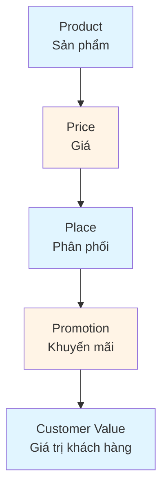
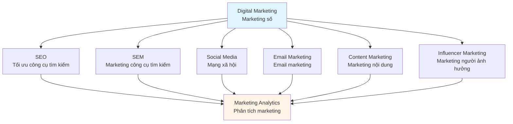
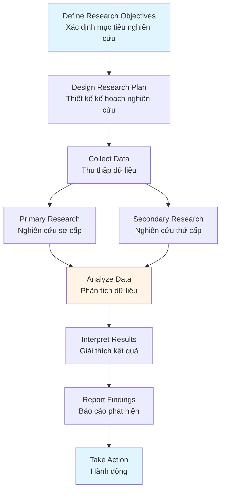
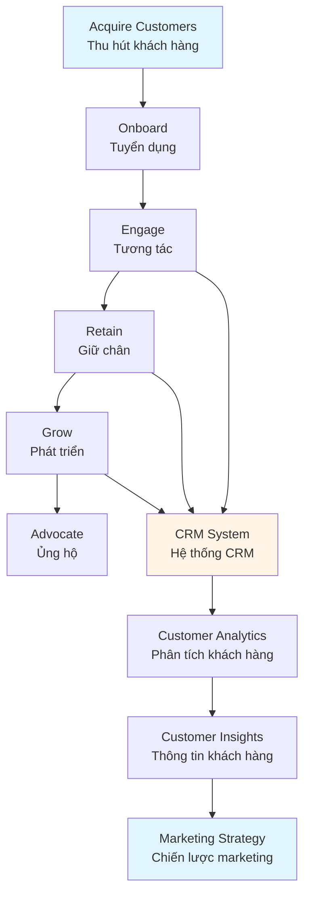

# Marketing Management Guide - Comprehensive

## Quản trị Marketing hiện đại / Modern Marketing Management

## Table of Contents
1. [Introduction](#introduction)
2. [Marketing Mix (4Ps/7Ps)](#marketing-mix-4ps7ps)
3. [Digital Marketing Strategies](#digital-marketing-strategies)
4. [Market Research and Segmentation](#market-research-and-segmentation)
5. [Brand Management](#brand-management)
6. [Customer Relationship Management (CRM)](#customer-relationship-management-crm)
7. [Marketing Analytics](#marketing-analytics)
8. [Best Practices](#best-practices)
9. [Common Pitfalls](#common-pitfalls)
10. [Real-World Examples](#real-world-examples)
11. [Templates & Checklists](#templates--checklists)
12. [Tools & Software](#tools--software)
13. [Resources](#resources)
14. [Summary](#summary)

---

## Introduction

Marketing management is the process of planning, executing, and controlling marketing activities to create, communicate, and deliver value to customers. Modern marketing combines traditional strategies with digital technologies and data-driven approaches.

Quản trị marketing là quá trình lập kế hoạch, thực hiện và kiểm soát các hoạt động marketing để tạo, truyền đạt và cung cấp giá trị cho khách hàng. Marketing hiện đại kết hợp chiến lược truyền thống với công nghệ số và cách tiếp cận dựa trên dữ liệu.

### Who This Guide Is For
- Marketing managers and professionals
- Business owners and entrepreneurs
- Product managers
- Anyone responsible for marketing activities

### Key Learning Objectives
- Understand marketing mix (4Ps/7Ps)
- Learn digital marketing strategies
- Master market research and segmentation
- Develop brand management skills
- Implement CRM systems
- Use marketing analytics effectively

---

## Marketing Mix (4Ps/7Ps)

### Traditional 4Ps / 4P truyền thống



#### 1. Product / Sản phẩm
- Product features and benefits
- Product design and quality
- Product line and portfolio
- Branding and packaging
- Product lifecycle management

#### 2. Price / Giá
- Pricing strategies
- Price positioning
- Discounts and promotions
- Payment terms
- Value-based pricing

#### 3. Place / Phân phối
- Distribution channels
- Channel selection
- Retail vs. online
- Supply chain management
- Channel partnerships

#### 4. Promotion / Khuyến mãi
- Advertising
- Sales promotion
- Public relations
- Personal selling
- Digital marketing

### Extended 7Ps (Services) / 7P mở rộng (Dịch vụ)

#### 5. People / Con người
- Service personnel
- Customer service
- Training and development
- Employee engagement

#### 6. Process / Quy trình
- Service delivery process
- Customer journey
- Process efficiency
- Quality standards

#### 7. Physical Evidence / Bằng chứng vật chất
- Service environment
- Tangible elements
- Brand presentation
- Customer touchpoints

---

## Digital Marketing Strategies

### Digital Marketing Channels / Kênh marketing số



### Key Digital Strategies / Chiến lược số chính

#### 1. Search Engine Optimization (SEO)
- Keyword research and optimization
- On-page and off-page SEO
- Technical SEO
- Local SEO
- Content optimization

#### 2. Search Engine Marketing (SEM)
- Pay-per-click (PPC) advertising
- Google Ads campaigns
- Keyword bidding strategies
- Ad copy optimization
- Landing page optimization

#### 3. Social Media Marketing
- Platform selection (Facebook, Instagram, LinkedIn, Twitter)
- Content strategy
- Community management
- Social advertising
- Influencer partnerships

#### 4. Email Marketing
- Email list building
- Segmentation and personalization
- Email automation
- A/B testing
- Performance tracking

#### 5. Content Marketing
- Content strategy
- Blog and article writing
- Video marketing
- Infographics and visual content
- Content distribution

### Digital Marketing Funnel / Phễu marketing số

1. **Awareness** - Attract potential customers
2. **Interest** - Engage and educate
3. **Consideration** - Build trust and credibility
4. **Purchase** - Convert to customers
5. **Retention** - Maintain relationships
6. **Advocacy** - Turn customers into advocates

---

## Market Research and Segmentation

### Market Research Process / Quy trình nghiên cứu thị trường



### Research Methods / Phương pháp nghiên cứu

#### Primary Research / Nghiên cứu sơ cấp
- Surveys and questionnaires
- Interviews (individual and focus groups)
- Observations
- Experiments
- Online research

#### Secondary Research / Nghiên cứu thứ cấp
- Industry reports
- Government data
- Competitor analysis
- Published studies
- Internal data

### Market Segmentation / Phân khúc thị trường

#### Segmentation Bases / Cơ sở phân khúc

1. **Demographic** - Age, gender, income, education
2. **Geographic** - Location, region, climate
3. **Psychographic** - Lifestyle, values, personality
4. **Behavioral** - Usage, loyalty, benefits sought

#### Targeting Strategies / Chiến lược nhắm mục tiêu

- **Undifferentiated** - One marketing mix for all
- **Differentiated** - Different mix for each segment
- **Concentrated** - Focus on one segment
- **Micromarketing** - Customized for individuals

### Positioning / Định vị

Creating a distinct image in customers' minds relative to competitors

**Positioning Statement Template**:
"For [target market], [brand] is the [category] that [benefit] because [reason]."

---

## Brand Management

### Brand Elements / Yếu tố thương hiệu

- **Brand Name** - Name and identity
- **Logo** - Visual symbol
- **Tagline** - Memorable phrase
- **Brand Colors** - Color palette
- **Brand Voice** - Communication style
- **Brand Personality** - Human characteristics

### Brand Building Process / Quy trình xây dựng thương hiệu

1. **Brand Strategy** - Define brand purpose and positioning
2. **Brand Identity** - Create visual and verbal identity
3. **Brand Communication** - Develop messaging
4. **Brand Experience** - Deliver consistent experience
5. **Brand Monitoring** - Track brand performance
6. **Brand Evolution** - Adapt and grow

### Brand Equity / Giá trị thương hiệu

Value derived from brand recognition and customer loyalty

**Components**:
- Brand awareness
- Brand associations
- Perceived quality
- Brand loyalty

### Brand Management Best Practices / Thực hành quản lý thương hiệu tốt

- Maintain brand consistency
- Protect brand reputation
- Monitor brand mentions
- Engage with customers
- Evolve with market changes

---

## Customer Relationship Management (CRM)

### CRM Strategy / Chiến lược CRM



### CRM Components / Thành phần CRM

1. **Customer Data Management**
   - Centralized customer database
   - Contact information
   - Interaction history
   - Purchase behavior

2. **Sales Management**
   - Lead management
   - Opportunity tracking
   - Sales pipeline
   - Sales forecasting

3. **Marketing Automation**
   - Campaign management
   - Email automation
   - Lead nurturing
   - Marketing analytics

4. **Customer Service**
   - Support ticket management
   - Knowledge base
   - Customer communication
   - Service analytics

### CRM Benefits / Lợi ích CRM

- Improved customer relationships
- Increased sales efficiency
- Better customer service
- Enhanced marketing effectiveness
- Data-driven decisions

---

## Marketing Analytics

### Key Marketing Metrics / Chỉ số marketing chính

#### Acquisition Metrics / Chỉ số thu hút
- **Customer Acquisition Cost (CAC)** - Cost to acquire customer
- **Cost per Lead (CPL)** - Cost per potential customer
- **Conversion Rate** - Percentage of visitors who convert

#### Engagement Metrics / Chỉ số tương tác
- **Click-Through Rate (CTR)** - Percentage clicking ads
- **Email Open Rate** - Percentage opening emails
- **Social Media Engagement** - Likes, shares, comments

#### Revenue Metrics / Chỉ số doanh thu
- **Customer Lifetime Value (CLV)** - Total customer value
- **Return on Ad Spend (ROAS)** - Revenue per ad dollar
- **Revenue per Customer** - Average customer revenue

#### Retention Metrics / Chỉ số giữ chân
- **Customer Retention Rate** - Percentage staying
- **Churn Rate** - Percentage leaving
- **Repeat Purchase Rate** - Percentage buying again

### Marketing Analytics Process / Quy trình phân tích marketing

1. **Define Objectives** - What to measure
2. **Collect Data** - Gather metrics
3. **Analyze** - Identify patterns and insights
4. **Report** - Present findings
5. **Optimize** - Improve performance

---

## Best Practices

### Marketing Management Best Practices / Thực hành quản lý marketing tốt

1. **Customer-Centric Approach**
   - Understand customer needs
   - Create customer value
   - Focus on customer experience
   - Build relationships

2. **Integrated Marketing**
   - Coordinate all channels
   - Consistent messaging
   - Unified brand experience
   - Cross-channel optimization

3. **Data-Driven Decisions**
   - Use analytics
   - Test and optimize
   - Measure everything
   - Learn from data

4. **Content Quality**
   - Valuable content
   - Relevant messaging
   - Engaging formats
   - Consistent publishing

5. **Agile Marketing**
   - Quick adaptation
   - Test and learn
   - Iterative improvement
   - Responsive to changes

---

## Common Pitfalls

### Marketing Mistakes to Avoid / Các sai lầm marketing cần tránh

1. **Not Understanding Target Audience**
   - **Problem**: Marketing to wrong audience
   - **Solution**: Conduct market research, create buyer personas

2. **Inconsistent Branding**
   - **Problem**: Mixed brand messages
   - **Solution**: Develop brand guidelines, maintain consistency

3. **Ignoring Analytics**
   - **Problem**: Making decisions without data
   - **Solution**: Implement analytics, review regularly

4. **Poor Content Quality**
   - **Problem**: Low-quality, irrelevant content
   - **Solution**: Focus on value, understand audience needs

5. **Neglecting Customer Service**
   - **Problem**: Poor customer experience
   - **Solution**: Integrate customer service with marketing

---

## Real-World Examples

### Example 1: E-commerce Digital Marketing

**Situation**: Online retailer launching new product line.

**Marketing Approach**:
- SEO optimization for product pages
- Google Ads campaigns for high-intent keywords
- Social media advertising on Facebook and Instagram
- Email marketing to existing customers
- Influencer partnerships for product reviews

**Result**: 300% increase in website traffic, 150% increase in sales in 3 months.

### Example 2: B2B Brand Building

**Situation**: B2B company rebranding to attract enterprise clients.

**Marketing Approach**:
- Redesigned brand identity and messaging
- Content marketing with thought leadership
- LinkedIn advertising targeting decision-makers
- Industry event participation
- Case studies and testimonials

**Result**: 200% increase in qualified leads, 50% improvement in brand awareness.

---

## Templates & Checklists

### Marketing Plan Template

```
Marketing Plan: [Product/Service Name]
Period: [Time Period]

1. Executive Summary
   - Objectives
   - Budget
   - Expected results

2. Situation Analysis
   - Market overview
   - Competitor analysis
   - SWOT analysis

3. Target Market
   - Primary target
   - Secondary target
   - Buyer personas

4. Marketing Objectives
   - Sales goals
   - Market share
   - Brand awareness

5. Marketing Mix
   - Product strategy
   - Pricing strategy
   - Distribution strategy
   - Promotion strategy

6. Marketing Tactics
   - Digital marketing
   - Traditional marketing
   - Events and partnerships

7. Budget
   - Channel allocation
   - Expected ROI

8. Metrics and KPIs
   - Key performance indicators
   - Measurement methods

9. Timeline
   - Key milestones
   - Campaign schedule
```

### Marketing Campaign Checklist

- [ ] Define campaign objectives
- [ ] Identify target audience
- [ ] Develop key messages
- [ ] Select marketing channels
- [ ] Create campaign assets
- [ ] Set up tracking and analytics
- [ ] Launch campaign
- [ ] Monitor performance
- [ ] Optimize based on data
- [ ] Measure results
- [ ] Document learnings

---

## Tools & Software

### Marketing Automation
- **HubSpot** - Inbound marketing and sales
- **Marketo** - Marketing automation platform
- **Mailchimp** - Email marketing and automation
- **Pardot** - B2B marketing automation

### Social Media Management
- **Hootsuite** - Social media management
- **Buffer** - Social media scheduling
- **Sprout Social** - Social media management and analytics

### SEO and SEM
- **Google Analytics** - Web analytics
- **SEMrush** - SEO and SEM toolkit
- **Ahrefs** - SEO tools and backlink analysis
- **Google Ads** - Search advertising

### CRM
- **Salesforce** - Customer relationship management
- **HubSpot CRM** - Free CRM platform
- **Zoho CRM** - Cloud-based CRM

### Analytics
- **Google Analytics** - Website analytics
- **Adobe Analytics** - Digital analytics
- **Mixpanel** - Product analytics

---

## Resources

### Books
- "Marketing Management" by Philip Kotler
- "Influence: The Psychology of Persuasion" by Robert Cialdini
- "Contagious: Why Things Catch On" by Jonah Berger
- "Digital Marketing" by Dave Chaffey

### Professional Organizations
- **American Marketing Association (AMA)**
- **Marketing Research Association (MRA)**
- **Digital Marketing Institute (DMI)**

### Certifications
- **Google Analytics Certification**
- **Google Ads Certification**
- **HubSpot Inbound Marketing Certification**
- **Facebook Blueprint Certification**

---

## Summary

### Key Takeaways / Điểm chính

1. **Marketing mix (4Ps/7Ps)** provides framework for marketing decisions.

2. **Digital marketing** is essential in modern business, requiring integrated strategies.

3. **Market research and segmentation** help identify and target the right customers.

4. **Brand management** builds value and customer loyalty.

5. **CRM systems** enable effective customer relationship management.

6. **Marketing analytics** provide insights for data-driven decisions.

### Next Steps / Bước tiếp theo

- Develop comprehensive marketing plan
- Implement digital marketing strategies
- Conduct market research
- Build strong brand identity
- Implement CRM system
- Set up marketing analytics
- Review Strategic Management Guide for marketing strategy alignment

---

**Remember**: Effective marketing is about creating and delivering value to customers. Focus on understanding customer needs, building relationships, and measuring results.

**Nhớ rằng**: Marketing hiệu quả là tạo và cung cấp giá trị cho khách hàng. Tập trung vào hiểu nhu cầu khách hàng, xây dựng mối quan hệ và đo lường kết quả.
