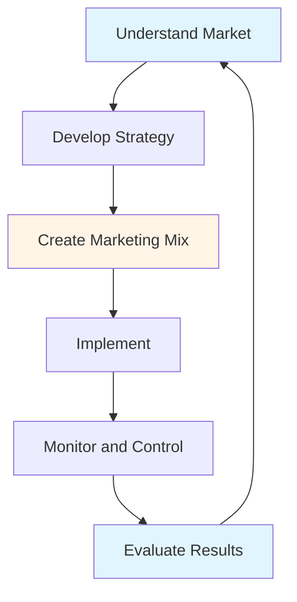
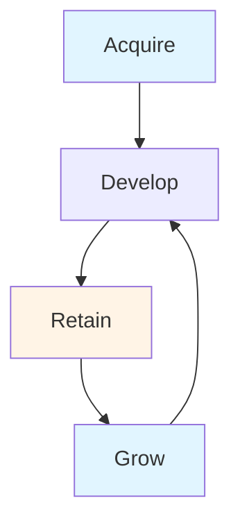

# Marketing Management Guide - Comprehensive

## Table of Contents
1. [Introduction](#introduction)
2. [Marketing Management Overview](#marketing-management-overview)
3. [Marketing Strategy](#marketing-strategy)
4. [Market Research and Analysis](#market-research-and-analysis)
5. [Marketing Mix](#marketing-mix)
6. [Digital Marketing](#digital-marketing)
7. [Brand Management](#brand-management)
8. [Customer Relationship Management](#customer-relationship-management)
9. [Marketing Metrics and KPIs](#marketing-metrics-and-kpis)
10. [Best Practices](#best-practices)
11. [Common Pitfalls](#common-pitfalls)
12. [Real-World Examples](#real-world-examples)
13. [Templates & Checklists](#templates--checklists)
14. [Tools & Software](#tools--software)
15. [Resources](#resources)
16. [Summary](#summary)

---

## Introduction

Modern marketing management involves creating, communicating, and delivering value to customers. This guide covers marketing strategy, market research, marketing mix, digital marketing, brand management, and CRM.

### Who This Guide Is For
- Marketing managers
- Business owners managing marketing
- Entrepreneurs marketing their business
- Anyone involved in marketing

### Key Learning Objectives
- Understand marketing management
- Develop marketing strategy
- Conduct market research
- Apply marketing mix (4Ps/7Ps)
- Master digital marketing
- Build and manage brands
- Implement CRM

---

## Marketing Management Overview

### Definition

**Marketing Management** is the process of planning, organizing, implementing, and controlling marketing activities to achieve organizational goals.

### Marketing Concept

**Customer-Oriented**: Focus on customer needs and satisfaction

**Key Principles**:
- Customer focus
- Integrated marketing
- Profitability through customer satisfaction
- Long-term relationships

### Marketing Process

---

## Marketing Strategy

### Overview

Marketing strategy aligns marketing activities with business objectives.

### STP Framework

#### Segmentation
- Divide market into groups
- Criteria: Demographics, psychographics, behavior, geography
- Homogeneous within, heterogeneous between

#### Targeting
- Select target segments
- Evaluate segments
- Choose segments to serve

#### Positioning
- Create distinct position in customer's mind
- Differentiate from competitors
- Communicate value proposition

### Marketing Strategy Types

#### 1. Market Penetration
- Increase market share in existing markets
- Methods: Price, promotion, distribution

#### 2. Market Development
- Enter new markets with existing products
- Methods: New geographies, new segments

#### 3. Product Development
- Develop new products for existing markets
- Methods: Innovation, line extensions

#### 4. Diversification
- New products in new markets
- Higher risk, higher potential

---

## Market Research and Analysis

### Overview

Market research provides information for marketing decisions.

### Market Research Process

1. **Define Problem**: What do we need to know?
2. **Develop Research Plan**: Methodology, data collection
3. **Collect Data**: Primary, secondary
4. **Analyze Data**: Statistical analysis
5. **Report Findings**: Present results
6. **Make Decisions**: Use insights

### Research Methods

#### Primary Research
- Surveys
- Interviews
- Focus groups
- Observations
- Experiments

#### Secondary Research
- Industry reports
- Government data
- Competitor analysis
- Published research

### Market Analysis

#### Competitor Analysis
- Identify competitors
- Analyze strengths/weaknesses
- Compare positioning
- Identify opportunities

#### Customer Analysis
- Customer segments
- Needs and wants
- Buying behavior
- Satisfaction levels

---

## Marketing Mix

### Overview

Marketing mix (4Ps) is the set of controllable marketing variables.

### Traditional 4Ps

#### 1. Product
- What to offer
- Features and benefits
- Quality
- Branding
- Packaging

**Product Decisions**:
- Product line
- Product mix
- New product development
- Product lifecycle

#### 2. Price
- Pricing strategy
- Price levels
- Discounts
- Payment terms

**Pricing Strategies**:
- Cost-plus pricing
- Value-based pricing
- Competitive pricing
- Penetration pricing
- Skimming pricing

#### 3. Place (Distribution)
- Where to sell
- Distribution channels
- Channel management
- Logistics

**Channel Types**:
- Direct: Manufacturer to customer
- Indirect: Through intermediaries
- Online: E-commerce
- Retail: Physical stores

#### 4. Promotion
- How to communicate
- Advertising
- Sales promotion
- Public relations
- Personal selling

**Promotion Mix**:
- Advertising: Paid media
- Sales promotion: Short-term incentives
- Public relations: Media relations
- Personal selling: Direct sales
- Digital marketing: Online channels

### Extended 7Ps (Services)

#### 5. People
- Employees
- Customer service
- Training
- Culture

#### 6. Process
- Service delivery
- Customer experience
- Efficiency
- Standardization

#### 7. Physical Evidence
- Environment
- Tangible elements
- Branding
- Atmosphere

---

## Digital Marketing

### Overview

Digital marketing uses digital channels to reach customers.

### Digital Marketing Channels

#### 1. Website
- Company website
- E-commerce
- Content marketing
- SEO optimization

#### 2. Search Engine Marketing (SEM)
- SEO: Organic search
- PPC: Paid search
- Keyword strategy
- Content optimization

#### 3. Social Media Marketing
- Platforms: Facebook, Instagram, LinkedIn, Twitter
- Content creation
- Community building
- Engagement
- Advertising

#### 4. Email Marketing
- Email campaigns
- Newsletter
- Automation
- Personalization

#### 5. Content Marketing
- Blog posts
- Videos
- Infographics
- E-books
- Webinars

#### 6. Influencer Marketing
- Partner with influencers
- Reach target audience
- Authentic promotion
- Brand awareness

### Digital Marketing Strategy

**Components**:
- Target audience
- Channel selection
- Content strategy
- Budget allocation
- Measurement

**Best Practices**:
- Integrated approach
- Mobile-first
- Personalization
- Data-driven
- Continuous optimization

---

## Brand Management

### Overview

Brand management builds and maintains brand equity.

### Brand Elements

#### 1. Brand Identity
- Name
- Logo
- Colors
- Typography
- Tagline

#### 2. Brand Positioning
- Unique value proposition
- Differentiation
- Target audience
- Competitive advantage

#### 3. Brand Personality
- Human characteristics
- Emotional connection
- Brand voice
- Brand values

### Brand Building

**Process**:
1. Define brand strategy
2. Develop brand identity
3. Create brand experience
4. Build brand awareness
5. Maintain brand consistency
6. Monitor brand health

### Brand Equity

**Components**:
- Brand awareness
- Brand associations
- Perceived quality
- Brand loyalty

**Building Brand Equity**:
- Consistent messaging
- Quality products
- Customer experience
- Marketing communications
- Brand extensions

---

## Customer Relationship Management

### Overview

CRM manages relationships with customers throughout lifecycle.

### CRM Process

### CRM Activities

#### 1. Customer Acquisition
- Identify prospects
- Lead generation
- Conversion
- Onboarding

#### 2. Customer Development
- Cross-selling
- Up-selling
- Product recommendations
- Value enhancement

#### 3. Customer Retention
- Customer service
- Loyalty programs
- Engagement
- Problem resolution

#### 4. Customer Growth
- Increase lifetime value
- Expand relationships
- Referral programs
- Advocacy

### CRM Systems

**Features**:
- Customer database
- Contact management
- Sales pipeline
- Marketing automation
- Analytics

**Benefits**:
- Better customer insights
- Improved service
- Increased sales
- Higher retention

---

## Marketing Metrics and KPIs

### Overview

Marketing metrics measure marketing performance.

### Key Metrics

#### 1. Awareness Metrics
- Brand awareness
- Reach
- Impressions
- Share of voice

#### 2. Engagement Metrics
- Click-through rate (CTR)
- Engagement rate
- Time on site
- Bounce rate

#### 3. Conversion Metrics
- Conversion rate
- Cost per acquisition (CPA)
- Customer acquisition cost (CAC)
- Return on ad spend (ROAS)

#### 4. Revenue Metrics
- Revenue
- Customer lifetime value (CLV)
- Average order value (AOV)
- Marketing ROI

#### 5. Retention Metrics
- Customer retention rate
- Churn rate
- Repeat purchase rate
- Net promoter score (NPS)

### Marketing Dashboard

**Components**:
- Key metrics
- Trends
- Comparisons
- Alerts
- Insights

---

## Best Practices

### Marketing Best Practices

1. **Customer Focus**
   - Understand customers
   - Meet needs
   - Create value
   - Build relationships

2. **Integrated Marketing**
   - Consistent messaging
   - Coordinated channels
   - Unified brand
   - Synergy

3. **Data-Driven**
   - Use data
   - Measure performance
   - Test and optimize
   - Make informed decisions

4. **Content Quality**
   - Valuable content
   - Relevant
   - Engaging
   - Consistent

5. **Mobile-First**
   - Mobile optimization
   - Responsive design
   - Mobile experience
   - Mobile advertising

6. **Personalization**
   - Tailored messages
   - Relevant offers
   - Individual experience
   - Customer segmentation

7. **Continuous Improvement**
   - Test and learn
   - Optimize campaigns
   - Adapt to changes
   - Innovation

---

## Common Pitfalls

### Marketing Pitfalls

1. **No Strategy**
   - Tactical only
   - No direction
   - Wasted resources
   - Poor results

2. **Ignoring Customers**
   - Product-focused
   - Not customer needs
   - Poor fit
   - Low satisfaction

3. **Poor Research**
   - Assumptions
   - No data
   - Wrong insights
   - Bad decisions

4. **Inconsistent Branding**
   - Mixed messages
   - Confused customers
   - Weak brand
   - Lost opportunities

5. **No Measurement**
   - Don't track results
   - Can't optimize
   - Wasted spend
   - Unknown ROI

6. **Ignoring Digital**
   - Traditional only
   - Missing opportunities
   - Behind competitors
   - Limited reach

---

## Real-World Examples

### Example 1: Successful Brand - Apple

**Strategy**: Premium positioning, innovation
**Marketing**: Integrated, consistent, emotional
**Result**: Strong brand, loyal customers, premium pricing

### Example 2: Digital Marketing Success

**Company**: E-commerce startup
**Strategy**: Content marketing + social media
**Result**: 300% growth in 1 year, strong brand awareness

### Example 3: CRM Implementation

**Company**: Service business
**Strategy**: CRM system, customer focus
**Result**: 25% increase in retention, 40% increase in CLV

---

## Templates & Checklists

### Marketing Plan Template

**Executive Summary**:
[Overview]

**Situation Analysis**:
- Market analysis
- Competitor analysis
- Customer analysis
- SWOT

**Marketing Objectives**:
- [Objective 1]
- [Objective 2]

**Marketing Strategy**:
- Target market
- Positioning
- Marketing mix

**Action Plan**:
- [Action 1]
- [Action 2]

**Budget**:
- [Budget breakdown]

**Measurement**:
- [KPIs]

### Marketing Campaign Checklist

- [ ] Objectives defined
- [ ] Target audience identified
- [ ] Message developed
- [ ] Channels selected
- [ ] Budget allocated
- [ ] Timeline set
- [ ] Team assigned
- [ ] Campaign launched
- [ ] Performance monitored
- [ ] Results analyzed

---

## Tools & Software

### Marketing Tools

1. **Google Analytics**: Web analytics
2. **HubSpot**: Marketing automation
3. **Mailchimp**: Email marketing
4. **Hootsuite**: Social media management
5. **SEMrush**: SEO and SEM

### CRM Tools

1. **Salesforce**: Enterprise CRM
2. **HubSpot CRM**: Free CRM
3. **Zoho CRM**: Small business CRM

### Design Tools

1. **Canva**: Graphic design
2. **Adobe Creative Suite**: Professional design
3. **Figma**: Design collaboration

---

## Resources

### Books

1. "Marketing Management" - Philip Kotler
2. "Positioning" - Al Ries & Jack Trout
3. "Influence" - Robert Cialdini

### Online Resources

1. **HubSpot**: Marketing resources
2. **Marketing Land**: Marketing news
3. **Google Digital Garage**: Free courses

---

## Summary

### Key Takeaways

1. **Marketing Management**: Customer-focused, integrated approach
2. **Marketing Strategy**: STP framework, strategic choices
3. **Market Research**: Data-driven decisions
4. **Marketing Mix**: 4Ps/7Ps framework
5. **Digital Marketing**: Essential in modern marketing
6. **Brand Management**: Build and maintain brand equity
7. **CRM**: Manage customer relationships

### Final Recommendations

1. **Know Your Customer**: Understand needs and behavior
2. **Develop Strategy**: Clear, focused strategy
3. **Use Marketing Mix**: Balanced approach
4. **Embrace Digital**: Digital-first mindset
5. **Build Brand**: Consistent, strong brand
6. **Manage Relationships**: CRM focus
7. **Measure and Optimize**: Data-driven improvement

Remember: Marketing is about creating value for customers and building relationships. Focus on customer needs, deliver value, and measure results.

---

**Last Updated**: 2024

**Related Guides**:
- [Strategic Management Guide](./STRATEGIC_MANAGEMENT_GUIDE.md)
- [Management Fundamentals Guide](./MANAGEMENT_FUNDAMENTALS_GUIDE.md)
- [Entrepreneurship Guide](./ENTREPRENEURSHIP_GUIDE.md)

