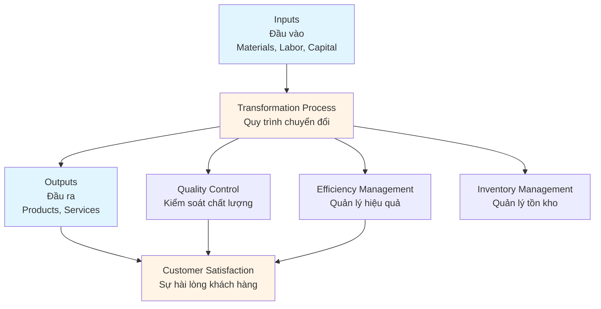
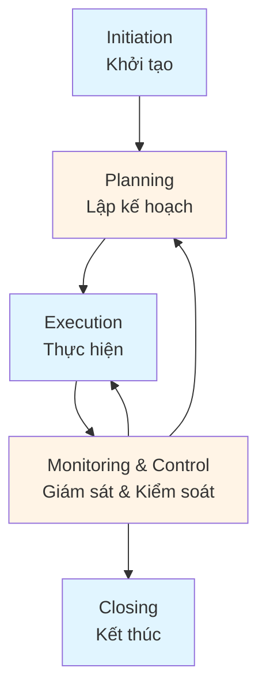
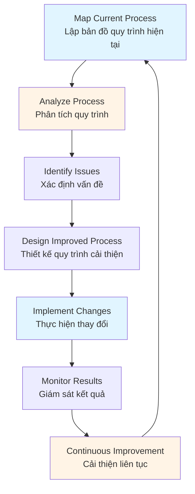
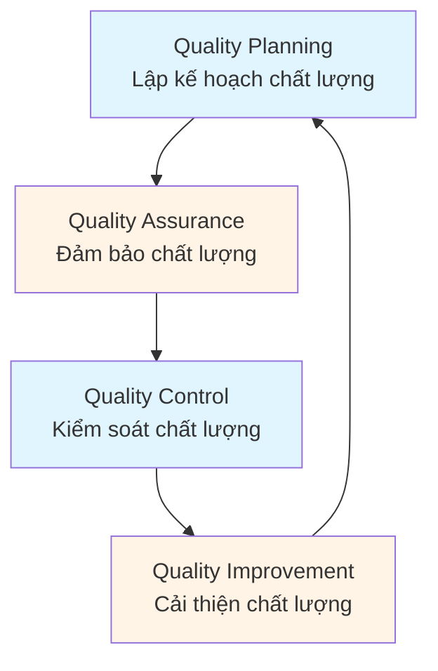
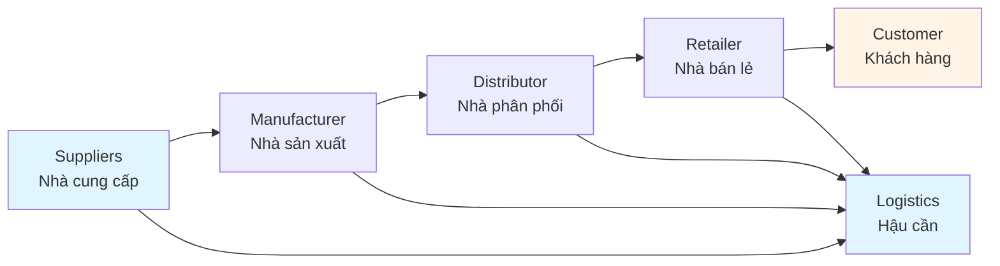

# Operations & Project Management Guide - Comprehensive

## Quản trị dự án và vận hành tổ chức / Operations & Project Management

## Table of Contents
1. [Introduction](#introduction)
2. [Operations Management Fundamentals](#operations-management-fundamentals)
3. [Project Management Basics](#project-management-basics)
4. [Process Optimization](#process-optimization)
5. [Quality Management](#quality-management)
6. [Supply Chain Management](#supply-chain-management)
7. [Lean and Six Sigma](#lean-and-six-sigma)
8. [Best Practices](#best-practices)
9. [Common Pitfalls](#common-pitfalls)
10. [Real-World Examples](#real-world-examples)
11. [Templates & Checklists](#templates--checklists)
12. [Tools & Software](#tools--software)
13. [Resources](#resources)
14. [Summary](#summary)

---

## Introduction

Operations and project management are essential for delivering products and services efficiently. This guide covers operations management fundamentals, project management basics, process optimization, quality management, and modern methodologies like Lean and Six Sigma.

Quản trị vận hành và dự án là điều cần thiết để cung cấp sản phẩm và dịch vụ hiệu quả. Hướng dẫn này bao gồm các nguyên tắc cơ bản về quản lý vận hành, cơ bản về quản lý dự án, tối ưu hóa quy trình, quản lý chất lượng và các phương pháp hiện đại như Lean và Six Sigma.

### Who This Guide Is For
- Operations managers
- Project managers
- Process improvement specialists
- Business managers overseeing operations
- Anyone responsible for delivering products or services

### Key Learning Objectives
- Understand operations management fundamentals
- Learn project management basics
- Master process optimization techniques
- Apply quality management principles
- Understand supply chain management
- Implement Lean and Six Sigma methodologies

---

## Operations Management Fundamentals

### Operations Management Overview / Tổng quan quản lý vận hành

Operations management is the administration of business practices to create the highest level of efficiency possible within an organization.

Quản lý vận hành là quản trị các thực hành kinh doanh để tạo ra mức hiệu quả cao nhất có thể trong tổ chức.

### Key Operations Functions / Chức năng vận hành chính



### Operations Strategy / Chiến lược vận hành

#### Competitive Priorities / Ưu tiên cạnh tranh

1. **Cost** - Low-cost operations
2. **Quality** - High-quality products/services
3. **Speed** - Fast delivery
4. **Flexibility** - Adaptability to changes
5. **Service** - Customer service excellence

### Operations Decisions / Quyết định vận hành

#### Strategic Decisions / Quyết định chiến lược
- Facility location and layout
- Technology selection
- Capacity planning
- Supply chain design

#### Tactical Decisions / Quyết định chiến thuật
- Production planning
- Inventory management
- Quality standards
- Workforce planning

#### Operational Decisions / Quyết định vận hành
- Scheduling
- Quality control
- Maintenance
- Daily operations

---

## Project Management Basics

### Project Management Lifecycle / Vòng đời quản lý dự án



### Project Management Knowledge Areas / Lĩnh vực kiến thức quản lý dự án

1. **Project Integration Management** - Coordinating all project elements
2. **Project Scope Management** - Defining and controlling scope
3. **Project Time Management** - Scheduling and time control
4. **Project Cost Management** - Budgeting and cost control
5. **Project Quality Management** - Quality planning and control
6. **Project Human Resource Management** - Team management
7. **Project Communications Management** - Information distribution
8. **Project Risk Management** - Risk identification and mitigation
9. **Project Procurement Management** - Acquiring resources

### Project Constraints / Ràng buộc dự án

**Triple Constraint / Ràng buộc ba yếu tố**:
- **Scope** - What needs to be done
- **Time** - When it needs to be completed
- **Cost** - Budget available

Changes to one constraint affect the others.

### Project Management Tools / Công cụ quản lý dự án

- **Work Breakdown Structure (WBS)** - Hierarchical task breakdown
- **Gantt Charts** - Visual timeline
- **Critical Path Method (CPM)** - Identify critical tasks
- **PERT Charts** - Network diagrams
- **Risk Register** - Risk tracking

---

## Process Optimization

### Process Optimization Framework / Khung tối ưu hóa quy trình



### Process Analysis Techniques / Kỹ thuật phân tích quy trình

#### 1. Value Stream Mapping
- Map entire process flow
- Identify value-added vs. non-value-added activities
- Identify waste and bottlenecks
- Design future state

#### 2. Process Flowcharts
- Visual representation of process steps
- Identify decision points
- Show process flow
- Identify improvement opportunities

#### 3. Root Cause Analysis
- **5 Whys** - Ask why five times
- **Fishbone Diagram** - Identify causes
- **Pareto Analysis** - Focus on vital few

### Optimization Strategies / Chiến lược tối ưu hóa

1. **Eliminate Waste** - Remove non-value activities
2. **Reduce Variation** - Standardize processes
3. **Improve Flow** - Reduce bottlenecks
4. **Increase Efficiency** - Optimize resource use
5. **Enhance Quality** - Reduce defects and errors

---

## Quality Management

### Quality Management Principles / Nguyên tắc quản lý chất lượng



### Quality Dimensions / Chiều kích chất lượng

#### For Products / Đối với sản phẩm
- Performance
- Features
- Reliability
- Conformance
- Durability
- Serviceability
- Aesthetics
- Perceived quality

#### For Services / Đối với dịch vụ
- Reliability
- Responsiveness
- Assurance
- Empathy
- Tangibles

### Quality Management Systems / Hệ thống quản lý chất lượng

#### ISO 9001
- Quality management standard
- Process-based approach
- Continuous improvement
- Customer focus

#### Total Quality Management (TQM)
- Organization-wide quality focus
- Employee involvement
- Customer satisfaction
- Continuous improvement

### Quality Tools / Công cụ chất lượng

- **Control Charts** - Monitor process variation
- **Pareto Charts** - Identify most significant issues
- **Cause-and-Effect Diagrams** - Analyze root causes
- **Check Sheets** - Collect data
- **Histograms** - Display data distribution
- **Scatter Diagrams** - Show relationships

---

## Supply Chain Management

### Supply Chain Overview / Tổng quan chuỗi cung ứng

Supply chain management coordinates and integrates activities from suppliers to customers.

Quản lý chuỗi cung ứng phối hợp và tích hợp các hoạt động từ nhà cung cấp đến khách hàng.

### Supply Chain Components / Thành phần chuỗi cung ứng



### Supply Chain Activities / Hoạt động chuỗi cung ứng

1. **Procurement** - Sourcing and purchasing
2. **Production** - Manufacturing and assembly
3. **Inventory Management** - Stock control
4. **Warehousing** - Storage and distribution
5. **Transportation** - Logistics and delivery
6. **Customer Service** - Order fulfillment

### Supply Chain Strategies / Chiến lược chuỗi cung ứng

#### Lean Supply Chain
- Eliminate waste
- Reduce inventory
- Improve flow
- Increase efficiency

#### Agile Supply Chain
- Respond quickly to changes
- Flexible operations
- Customer-focused
- Adaptable processes

---

## Lean and Six Sigma

### Lean Principles / Nguyên tắc Lean

**Eliminate Waste / Loại bỏ lãng phí**:

1. **Overproduction** - Producing more than needed
2. **Waiting** - Idle time
3. **Transportation** - Unnecessary movement
4. **Over-processing** - More work than required
5. **Inventory** - Excess stock
6. **Motion** - Unnecessary movement
7. **Defects** - Errors and rework
8. **Underutilized Talent** - Not using employee skills

### Lean Tools / Công cụ Lean

- **5S** - Sort, Set in order, Shine, Standardize, Sustain
- **Kanban** - Visual workflow management
- **Just-in-Time (JIT)** - Produce when needed
- **Value Stream Mapping** - Process visualization
- **Kaizen** - Continuous improvement

### Six Sigma / Sáu Sigma

**DMAIC Methodology / Phương pháp DMAIC**:

1. **Define** - Define problem and goals
2. **Measure** - Measure current performance
3. **Analyze** - Analyze root causes
4. **Improve** - Implement improvements
5. **Control** - Control and sustain improvements

### Six Sigma Levels / Cấp độ Six Sigma

- **3 Sigma** - 93.3% defect-free (66,807 defects per million)
- **4 Sigma** - 99.38% defect-free (6,210 defects per million)
- **5 Sigma** - 99.977% defect-free (233 defects per million)
- **6 Sigma** - 99.99966% defect-free (3.4 defects per million)

### Combining Lean and Six Sigma / Kết hợp Lean và Six Sigma

**Lean Six Sigma** combines:
- Lean's focus on waste elimination
- Six Sigma's focus on variation reduction
- Result: Faster, higher quality processes

---

## Best Practices

### Operations & Project Management Best Practices / Thực hành tốt

1. **Process Standardization**
   - Document processes
   - Standardize procedures
   - Train employees
   - Maintain consistency

2. **Continuous Improvement**
   - Regular process reviews
   - Employee suggestions
   - Kaizen events
   - Performance metrics

3. **Quality Focus**
   - Quality at source
   - Prevention over inspection
   - Customer focus
   - Zero defects mindset

4. **Effective Communication**
   - Clear project updates
   - Stakeholder engagement
   - Regular meetings
   - Transparent reporting

5. **Risk Management**
   - Identify risks early
   - Develop mitigation plans
   - Monitor continuously
   - Respond quickly

---

## Common Pitfalls

### Operations & Project Management Mistakes / Các sai lầm cần tránh

1. **Poor Planning**
   - **Problem**: Inadequate project planning
   - **Impact**: Delays, cost overruns, quality issues
   - **Solution**: Invest time in thorough planning

2. **Scope Creep**
   - **Problem**: Uncontrolled changes to scope
   - **Impact**: Delays, budget overruns
   - **Solution**: Strict change control process

3. **Ignoring Quality**
   - **Problem**: Focusing only on speed and cost
   - **Impact**: Defects, customer dissatisfaction
   - **Solution**: Build quality into processes

4. **Inadequate Communication**
   - **Problem**: Poor stakeholder communication
   - **Impact**: Misunderstandings, conflicts
   - **Solution**: Regular, clear communication

5. **Not Managing Risks**
   - **Problem**: Ignoring potential problems
   - **Impact**: Unexpected issues, project failure
   - **Solution**: Proactive risk management

---

## Real-World Examples

### Example 1: Manufacturing Process Optimization

**Situation**: Manufacturing company with high defect rates and long cycle times.

**Operations Approach**:
- Conducted value stream mapping
- Identified waste and bottlenecks
- Implemented 5S methodology
- Introduced quality control checkpoints
- Trained employees on Lean principles

**Result**: 50% reduction in defects, 30% reduction in cycle time, 20% cost savings.

### Example 2: Software Development Project

**Situation**: Software project behind schedule and over budget.

**Project Management Approach**:
- Revised project plan with realistic timelines
- Implemented daily stand-up meetings
- Used Agile methodology with sprints
- Improved communication with stakeholders
- Managed scope changes strictly

**Result**: Completed project on revised schedule, improved team productivity by 40%.

---

## Templates & Checklists

### Project Charter Template

```
Project Name: [Name]
Project Manager: [Name]
Start Date: [Date]
End Date: [Date]

Project Objectives:
- [Objective 1]
- [Objective 2]
- [Objective 3]

Scope:
- In Scope: [What's included]
- Out of Scope: [What's excluded]

Stakeholders:
- Sponsor: [Name]
- Team Members: [Names]
- Customers: [Names]

Budget: $[Amount]
Resources: [List resources]

Success Criteria:
- [Criterion 1]
- [Criterion 2]
- [Criterion 3]

Risks:
- [Risk 1]: [Mitigation]
- [Risk 2]: [Mitigation]
```

### Process Improvement Checklist

- [ ] Map current process
- [ ] Identify process owner and stakeholders
- [ ] Collect process data
- [ ] Analyze process for issues
- [ ] Identify root causes
- [ ] Design improved process
- [ ] Get stakeholder approval
- [ ] Plan implementation
- [ ] Train employees
- [ ] Implement changes
- [ ] Monitor results
- [ ] Adjust as needed
- [ ] Document new process

---

## Tools & Software

### Project Management
- **Microsoft Project** - Project planning and scheduling
- **Asana** - Team project management
- **Jira** - Agile project management
- **Trello** - Kanban board management

### Process Management
- **Lucidchart** - Process mapping and diagrams
- **Visio** - Diagramming and process visualization
- **Miro** - Collaborative process design

### Quality Management
- **Minitab** - Statistical analysis for Six Sigma
- **Quality Center** - Test and quality management
- **JIRA** - Issue and quality tracking

### Supply Chain
- **SAP SCM** - Supply chain management
- **Oracle SCM** - Supply chain solutions
- **Kinaxis** - Supply chain planning

---

## Resources

### Books
- "The Goal" by Eliyahu Goldratt
- "Lean Thinking" by James Womack
- "The Six Sigma Handbook" by Thomas Pyzdek
- "Project Management Body of Knowledge (PMBOK)" by PMI

### Professional Organizations
- **Project Management Institute (PMI)**
- **American Society for Quality (ASQ)**
- **Association for Operations Management (APICS)**

### Certifications
- **PMP** - Project Management Professional
- **Six Sigma Green Belt/Black Belt**
- **Lean Certification**
- **CPIM** - Certified in Production and Inventory Management

---

## Summary

### Key Takeaways / Điểm chính

1. **Operations management** focuses on efficient transformation of inputs to outputs.

2. **Project management** requires planning, execution, monitoring, and control.

3. **Process optimization** eliminates waste and improves efficiency.

4. **Quality management** ensures products and services meet standards.

5. **Supply chain management** coordinates activities from suppliers to customers.

6. **Lean and Six Sigma** provide methodologies for continuous improvement.

### Next Steps / Bước tiếp theo

- Assess current operations and processes
- Identify improvement opportunities
- Implement quality management systems
- Apply Lean and Six Sigma principles
- Develop project management capabilities
- Review Strategic Management Guide for operations strategy alignment

---

**Remember**: Operations and project management are about delivering value efficiently. Focus on processes, quality, and continuous improvement.

**Nhớ rằng**: Quản lý vận hành và dự án là về cung cấp giá trị hiệu quả. Tập trung vào quy trình, chất lượng và cải thiện liên tục.
