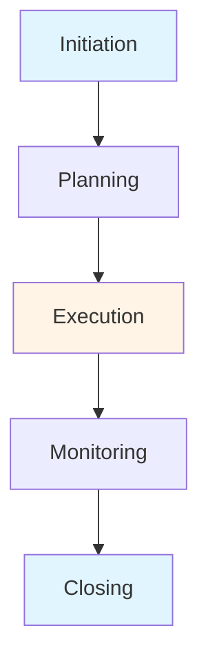

# Operations & Project Management Guide - Comprehensive

## Table of Contents
1. [Introduction](#introduction)
2. [Operations Management Overview](#operations-management-overview)
3. [Project Management Fundamentals](#project-management-fundamentals)
4. [Operations Strategy](#operations-strategy)
5. [Process Design and Improvement](#process-design-and-improvement)
6. [Quality Management](#quality-management)
7. [Supply Chain Management](#supply-chain-management)
8. [Inventory Management](#inventory-management)
9. [Lean Operations](#lean-operations)
10. [Six Sigma](#six-sigma)
11. [Operations Metrics](#operations-metrics)
12. [Best Practices](#best-practices)
13. [Common Pitfalls](#common-pitfalls)
14. [Real-World Examples](#real-world-examples)
15. [Templates & Checklists](#templates--checklists)
16. [Tools & Software](#tools--software)
17. [Resources](#resources)
18. [Summary](#summary)

---

## Introduction

Operations management and project management are essential for organizational success. This guide covers operations management, project management fundamentals, process improvement, quality management, supply chain, and operational excellence.

### Who This Guide Is For
- Operations managers
- Project managers
- Business owners managing operations
- Anyone involved in operations and projects

### Key Learning Objectives
- Understand operations management
- Master project management fundamentals
- Develop operations strategy
- Improve processes
- Manage quality
- Optimize supply chain
- Apply Lean and Six Sigma

---

## Operations Management Overview

### Definition

**Operations Management** is the administration of business practices to create the highest level of efficiency possible within an organization.

### Operations Management Functions

#### 1. Design
- Product design
- Process design
- Facility design
- System design

#### 2. Planning
- Production planning
- Capacity planning
- Resource planning
- Scheduling

#### 3. Control
- Quality control
- Inventory control
- Cost control
- Performance control

#### 4. Improvement
- Process improvement
- Quality improvement
- Efficiency improvement
- Continuous improvement

### Operations Objectives

1. **Quality**: Meet quality standards
2. **Speed**: Fast delivery
3. **Dependability**: Reliable delivery
4. **Flexibility**: Adapt to changes
5. **Cost**: Low cost operations

---

## Project Management Fundamentals

### Overview

Project management delivers projects on time, on budget, and to specification.

### Project Management Process

### Project Management Knowledge Areas

#### 1. Integration Management
- Project charter
- Project plan
- Change management
- Project closure

#### 2. Scope Management
- Scope definition
- WBS
- Scope control
- Change control

#### 3. Time Management
- Activity definition
- Scheduling
- Time estimation
- Schedule control

#### 4. Cost Management
- Cost estimation
- Budgeting
- Cost control
- Earned value

#### 5. Quality Management
- Quality planning
- Quality assurance
- Quality control
- Continuous improvement

#### 6. Human Resource Management
- Team acquisition
- Team development
- Team management
- Team performance

#### 7. Communications Management
- Communication planning
- Information distribution
- Performance reporting
- Stakeholder management

#### 8. Risk Management
- Risk identification
- Risk analysis
- Risk response
- Risk monitoring

#### 9. Procurement Management
- Procurement planning
- Vendor selection
- Contract management
- Procurement closure

---

## Operations Strategy

### Overview

Operations strategy aligns operations with business strategy.

### Operations Strategy Decisions

#### 1. Process Choice
- Job production
- Batch production
- Mass production
- Continuous production

#### 2. Capacity Strategy
- Capacity levels
- Capacity timing
- Capacity flexibility

#### 3. Location Strategy
- Facility location
- Geographic factors
- Cost factors
- Market factors

#### 4. Layout Strategy
- Process layout
- Product layout
- Fixed position layout
- Cellular layout

#### 5. Technology Strategy
- Automation level
- Technology investment
- Innovation
- Digital transformation

---

## Process Design and Improvement

### Overview

Process design creates efficient processes. Process improvement enhances existing processes.

### Process Design

**Steps**:
1. Define process objectives
2. Map current process
3. Design new process
4. Test process
5. Implement process
6. Monitor and improve

### Process Mapping

**Tools**:
- Flowcharts
- Value stream mapping
- Process flow diagrams
- Swimlane diagrams

### Process Improvement

**Methods**:
- Kaizen (continuous improvement)
- Business process reengineering
- Lean
- Six Sigma

---

## Quality Management

### Overview

Quality management ensures products/services meet requirements.

### Quality Management Principles

#### 1. Customer Focus
- Understand customer needs
- Meet requirements
- Exceed expectations

#### 2. Leadership
- Quality leadership
- Clear direction
- Engagement

#### 3. Process Approach
- Process focus
- Process management
- Continuous improvement

#### 4. Continuous Improvement
- Ongoing improvement
- Innovation
- Learning

### Quality Tools

#### 1. Cause and Effect Diagram (Fishbone)
- Identify root causes
- Problem analysis
- Brainstorming

#### 2. Pareto Chart
- Identify key issues
- 80/20 principle
- Prioritization

#### 3. Control Charts
- Monitor process
- Detect variation
- Process control

#### 4. Check Sheets
- Data collection
- Problem tracking
- Simple tool

---

## Supply Chain Management

### Overview

Supply chain management manages flow of goods and services.

### Supply Chain Components

#### 1. Suppliers
- Supplier selection
- Supplier management
- Supplier relationships

#### 2. Manufacturing
- Production
- Quality
- Efficiency

#### 3. Distribution
- Warehousing
- Transportation
- Logistics

#### 4. Customers
- Customer service
- Delivery
- Satisfaction

### Supply Chain Strategies

#### 1. Lean Supply Chain
- Eliminate waste
- Efficiency
- Cost reduction

#### 2. Agile Supply Chain
- Responsive
- Flexible
- Customer-focused

#### 3. Resilient Supply Chain
- Risk management
- Redundancy
- Recovery

---

## Inventory Management

### Overview

Inventory management optimizes inventory levels.

### Inventory Types

#### 1. Raw Materials
- Input materials
- Production inputs

#### 2. Work in Progress (WIP)
- Partially completed
- Production process

#### 3. Finished Goods
- Completed products
- Ready for sale

### Inventory Management Models

#### 1. Economic Order Quantity (EOQ)
- Optimal order quantity
- Minimize total cost
- Balance ordering and holding costs

#### 2. Just-in-Time (JIT)
- Minimal inventory
- Demand-driven
- Waste reduction

#### 3. ABC Analysis
- Classify inventory
- A: High value, low volume
- B: Medium value/volume
- C: Low value, high volume

---

## Lean Operations

### Overview

Lean eliminates waste and creates value.

### Lean Principles

#### 1. Value
- Define value from customer perspective
- What customer is willing to pay for

#### 2. Value Stream
- Map value stream
- Identify value-adding activities
- Eliminate waste

#### 3. Flow
- Create continuous flow
- Eliminate interruptions
- Smooth flow

#### 4. Pull
- Pull system
- Demand-driven
- Just-in-time

#### 5. Perfection
- Continuous improvement
- Pursue perfection
- Never-ending journey

### Types of Waste (Muda)

1. **Overproduction**: Producing more than needed
2. **Waiting**: Idle time
3. **Transportation**: Unnecessary movement
4. **Over-processing**: More than required
5. **Inventory**: Excess inventory
6. **Motion**: Unnecessary movement
7. **Defects**: Errors and rework
8. **Underutilized Talent**: Not using people's skills

---

## Six Sigma

### Overview

Six Sigma reduces defects and improves quality.

### Six Sigma Methodology

#### DMAIC (Improve Existing Process)
- **Define**: Problem and goals
- **Measure**: Current performance
- **Analyze**: Root causes
- **Improve**: Solutions
- **Control**: Sustain improvements

#### DMADV (Design New Process)
- **Define**: Requirements
- **Measure**: Customer needs
- **Analyze**: Design options
- **Design**: New process
- **Verify**: Validate design

### Six Sigma Levels

- **Yellow Belt**: Basic knowledge
- **Green Belt**: Project team member
- **Black Belt**: Project leader
- **Master Black Belt**: Trainer and mentor

---

## Operations Metrics

### Overview

Operations metrics measure operational performance.

### Key Metrics

#### 1. Efficiency Metrics
- Capacity utilization
- Labor productivity
- Machine efficiency
- Overall equipment effectiveness (OEE)

#### 2. Quality Metrics
- Defect rate
- First pass yield
- Customer complaints
- Rework rate

#### 3. Delivery Metrics
- On-time delivery
- Lead time
- Cycle time
- Delivery performance

#### 4. Cost Metrics
- Cost per unit
- Operating cost
- Cost variance
- Cost efficiency

---

## Best Practices

### Operations Best Practices

1. **Customer Focus**
   - Understand customer needs
   - Deliver value
   - Exceed expectations

2. **Continuous Improvement**
   - Kaizen mindset
   - Regular improvement
   - Innovation

3. **Process Excellence**
   - Well-designed processes
   - Standardization
   - Documentation

4. **Quality First**
   - Quality culture
   - Prevention focus
   - Zero defects mindset

5. **Lean Thinking**
   - Eliminate waste
   - Create value
   - Efficiency

6. **Data-Driven**
   - Use data
   - Metrics
   - Analytics

---

## Common Pitfalls

### Operations Pitfalls

1. **No Strategy**
   - Tactical only
   - No alignment
   - Wasted efforts

2. **Poor Quality**
   - Quality issues
   - Customer complaints
   - Rework

3. **Inefficient Processes**
   - Waste
   - Inefficiency
   - High costs

4. **No Improvement**
   - Status quo
   - No innovation
   - Falling behind

5. **Poor Planning**
   - No planning
   - Reactive
   - Problems

---

## Real-World Examples

### Example 1: Lean Implementation

**Company**: Manufacturing
**Approach**: Lean principles, waste elimination
**Result**: 30% cost reduction, improved quality

### Example 2: Six Sigma Project

**Company**: Service company
**Approach**: DMAIC, defect reduction
**Result**: 50% defect reduction, customer satisfaction improvement

### Example 3: Supply Chain Optimization

**Company**: Retail
**Approach**: Supply chain redesign, inventory optimization
**Result**: Reduced inventory, improved service

---

## Templates & Checklists

### Process Improvement Checklist

- [ ] Process identified
- [ ] Current process mapped
- [ ] Problems identified
- [ ] Root causes analyzed
- [ ] Solutions developed
- [ ] Implementation planned
- [ ] Changes implemented
- [ ] Results measured
- [ ] Improvements sustained

### Project Management Checklist

- [ ] Project charter approved
- [ ] Scope defined
- [ ] Schedule created
- [ ] Budget approved
- [ ] Team assigned
- [ ] Risks identified
- [ ] Communication plan
- [ ] Project started
- [ ] Progress monitored
- [ ] Project closed

---

## Tools & Software

### Operations Tools

1. **ERP Systems**: Enterprise resource planning
2. **MRP Systems**: Material requirements planning
3. **MES Systems**: Manufacturing execution systems

### Project Management Tools

1. **Microsoft Project**: Project planning
2. **Jira**: Agile project management
3. **Asana**: Task management

### Quality Tools

1. **Minitab**: Statistical analysis
2. **Quality Management Software**: QMS systems

---

## Resources

### Books

1. "Operations Management" - Jay Heizer
2. "The Lean Startup" - Eric Ries
3. "The Goal" - Eliyahu Goldratt

### Online Resources

1. **APICS**: Supply chain resources
2. **PMI**: Project management resources
3. **ASQ**: Quality resources

---

## Summary

### Key Takeaways

1. **Operations Management**: Design, plan, control, improve
2. **Project Management**: Deliver projects successfully
3. **Process Improvement**: Continuous improvement
4. **Quality Management**: Meet requirements
5. **Supply Chain**: Manage flow efficiently
6. **Lean**: Eliminate waste
7. **Six Sigma**: Reduce defects

### Final Recommendations

1. **Align Operations**: With business strategy
2. **Focus on Quality**: Quality first
3. **Improve Continuously**: Kaizen mindset
4. **Eliminate Waste**: Lean thinking
5. **Use Data**: Metrics and analytics
6. **Manage Projects**: Effectively
7. **Optimize Supply Chain**: Efficiency and resilience

Remember: Operations excellence drives business success. Focus on quality, efficiency, and continuous improvement.

---

**Last Updated**: 2024

**Related Guides**:
- [Management Fundamentals Guide](./MANAGEMENT_FUNDAMENTALS_GUIDE.md)
- [Strategic Management Guide](./STRATEGIC_MANAGEMENT_GUIDE.md)
- [Change Management Guide](./CHANGE_MANAGEMENT_GUIDE.md)

