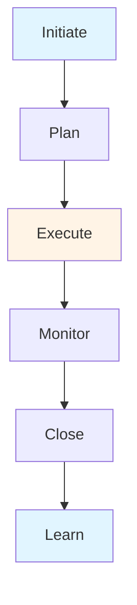

# Practical Application Guide - Comprehensive

## Table of Contents
1. [Introduction](#introduction)
2. [Practical Application Overview](#practical-application-overview)
3. [Mock Project 1: E-Commerce Platform Launch](#mock-project-1-e-commerce-platform-launch)
4. [Mock Project 2: Digital Transformation Initiative](#mock-project-2-digital-transformation-initiative)
5. [Mock Project 3: International Market Expansion](#mock-project-3-international-market-expansion)
6. [Project Frameworks](#project-frameworks)
7. [Case Study Methodology](#case-study-methodology)
8. [Learning Outcomes](#learning-outcomes)
9. [Real-World Application](#real-world-application)
10. [Best Practices](#best-practices)
11. [Common Pitfalls](#common-pitfalls)
12. [Templates & Checklists](#templates--checklists)
13. [Tools & Software](#tools--software)
14. [Resources](#resources)
15. [Summary](#summary)

---

## Introduction

Practical application through mock projects provides hands-on experience applying business management concepts. This guide presents 3 large mock projects covering different business scenarios and management areas.

### Who This Guide Is For
- Business students applying concepts
- Managers practicing skills
- Entrepreneurs planning businesses
- Anyone learning business management

### Key Learning Objectives
- Apply management concepts practically
- Work through complex business scenarios
- Integrate multiple management areas
- Develop problem-solving skills
- Build business acumen
- Prepare for real-world challenges

---

## Practical Application Overview

### Purpose

Mock projects simulate real business situations, allowing practice without real-world risks.

### Benefits

1. **Hands-On Learning**: Apply concepts practically
2. **Integration**: Connect different areas
3. **Problem-Solving**: Develop analytical skills
4. **Decision-Making**: Practice making decisions
5. **Risk-Free**: Learn from mistakes safely
6. **Portfolio**: Build portfolio of work

### Project Structure

Each mock project includes:
- Project description and context
- Objectives and deliverables
- Application areas (which concepts to apply)
- Evaluation criteria
- Resources and constraints
- Timeline and milestones

---

## Mock Project 1: E-Commerce Platform Launch

### Project Description

**Scenario**: You are the business manager for a mid-sized retail company that wants to launch an e-commerce platform to expand online sales. The company has been operating brick-and-mortar stores for 20 years and now wants to enter the digital market.

**Company Background**:
- 50 physical stores
- 500 employees
- Annual revenue: $50M
- Product categories: Fashion, accessories, home goods
- Target market: Middle-income consumers, ages 25-55

**Challenge**: Launch e-commerce platform within 6 months, achieve $5M online revenue in first year, maintain brand consistency, integrate with existing operations.

### Objectives

1. **Strategic Planning**
   - Develop e-commerce strategy
   - Define value proposition
   - Set objectives and KPIs

2. **Market Analysis**
   - Analyze e-commerce market
   - Identify target segments
   - Competitive analysis

3. **Business Model**
   - Design e-commerce business model
   - Revenue streams
   - Cost structure

4. **Operations Planning**
   - Supply chain integration
   - Inventory management
   - Fulfillment strategy
   - Customer service

5. **Marketing Strategy**
   - Digital marketing plan
   - Brand positioning
   - Customer acquisition
   - Retention strategy

6. **Financial Planning**
   - Budget and investment
   - Revenue projections
   - Cost analysis
   - ROI projections

7. **Implementation Plan**
   - Project timeline
   - Resource allocation
   - Risk management
   - Change management

### Application Areas

**From Management Fundamentals**:
- Management functions (Planning, Organizing, Leading, Controlling)
- Decision-making
- Team management

**From Strategic Management**:
- Strategic planning
- SWOT analysis
- Competitive strategy
- Business model canvas

**From Financial & Accounting**:
- Financial planning
- Budgeting
- Cost management
- Financial projections

**From Marketing Management**:
- Marketing strategy
- Digital marketing
- Brand management
- Customer acquisition

**From Operations & Project Management**:
- Operations planning
- Supply chain
- Project management
- Process design

**From Change Management**:
- Change planning
- Managing resistance
- Communication
- Implementation

### Deliverables

1. **Strategic Plan Document** (20-30 pages)
   - Executive summary
   - Market analysis
   - Strategy
   - Business model
   - Implementation plan

2. **Financial Model** (Excel)
   - 3-year projections
   - Budget breakdown
   - ROI analysis
   - Break-even analysis

3. **Marketing Plan** (15-20 pages)
   - Marketing strategy
   - Digital marketing plan
   - Budget allocation
   - Metrics and KPIs

4. **Operations Plan** (15-20 pages)
   - Operations strategy
   - Supply chain design
   - Process flows
   - Resource requirements

5. **Implementation Roadmap** (10-15 pages)
   - Timeline with milestones
   - Resource plan
   - Risk management
   - Change management

6. **Presentation** (20-30 slides)
   - Executive presentation
   - Key recommendations
   - Business case
   - Next steps

### Evaluation Criteria

**Strategic Thinking** (25%):
- Quality of analysis
- Strategic insights
- Business model design
- Competitive positioning

**Financial Planning** (20%):
- Financial model accuracy
- Revenue projections
- Cost analysis
- ROI justification

**Marketing Strategy** (20%):
- Market understanding
- Marketing plan quality
- Digital marketing approach
- Customer acquisition strategy

**Operations Planning** (15%):
- Operations design
- Supply chain integration
- Process efficiency
- Scalability

**Implementation** (10%):
- Realistic timeline
- Resource planning
- Risk management
- Change management

**Presentation** (10%):
- Clarity
- Professionalism
- Persuasiveness
- Completeness

### Timeline

**Week 1-2**: Research and analysis
**Week 3-4**: Strategy development
**Week 5-6**: Financial planning
**Week 7-8**: Marketing and operations planning
**Week 9-10**: Implementation planning
**Week 11-12**: Finalization and presentation

### Resources and Constraints

**Available Resources**:
- $2M budget for platform development
- Existing IT team (5 people)
- Marketing team (3 people)
- Operations team support
- Management support

**Constraints**:
- 6-month timeline
- Must integrate with existing systems
- Maintain brand consistency
- Limited technical expertise
- Budget constraints

---

## Mock Project 2: Digital Transformation Initiative

### Project Description

**Scenario**: You are the change management lead for a traditional manufacturing company undergoing digital transformation. The company needs to modernize operations, implement new technologies, and transform culture to compete in digital age.

**Company Background**:
- 30-year-old manufacturing company
- 1,000 employees
- Traditional processes
- Legacy systems
- Conservative culture
- Facing competitive pressure

**Challenge**: Lead digital transformation over 18 months, improve efficiency by 30%, reduce costs by 20%, modernize culture, implement Industry 4.0 technologies.

### Objectives

1. **Change Management**
   - Change strategy
   - Stakeholder management
   - Resistance management
   - Communication plan

2. **Digital Strategy**
   - Digital transformation roadmap
   - Technology selection
   - Digital capabilities
   - Innovation strategy

3. **Operations Transformation**
   - Process digitization
   - Automation
   - Data analytics
   - Quality improvement

4. **Culture Transformation**
   - Culture assessment
   - Culture change plan
   - Employee engagement
   - Leadership development

5. **Technology Implementation**
   - ERP implementation
   - IoT integration
   - Data analytics
   - Digital tools

6. **Financial Management**
   - Investment planning
   - Cost-benefit analysis
   - ROI tracking
   - Budget management

7. **Risk Management**
   - Risk identification
   - Mitigation strategies
   - Contingency planning
   - Monitoring

### Application Areas

**From Change Management**:
- Change models (Kotter, ADKAR, Lewin)
- Leading change
- Managing resistance
- Communication

**From Strategic Management**:
- Digital strategy
- Strategic planning
- Competitive analysis
- Innovation strategy

**From Operations & Project Management**:
- Process improvement
- Technology implementation
- Project management
- Quality management

**From Human Resource Management**:
- Culture change
- Employee engagement
- Training and development
- Change communication

**From Financial & Accounting**:
- Investment analysis
- Cost management
- ROI calculation
- Budget management

**From Management Fundamentals**:
- Leadership
- Team management
- Decision-making
- Communication

### Deliverables

1. **Change Management Plan** (25-30 pages)
   - Change strategy
   - Stakeholder analysis
   - Communication plan
   - Resistance management
   - Implementation plan

2. **Digital Transformation Roadmap** (20-25 pages)
   - Digital strategy
   - Technology roadmap
   - Implementation phases
   - Timeline and milestones

3. **Culture Transformation Plan** (15-20 pages)
   - Culture assessment
   - Culture change strategy
   - Engagement plan
   - Leadership development

4. **Financial Analysis** (Excel + Report)
   - Investment requirements
   - Cost-benefit analysis
   - ROI projections
   - Budget plan

5. **Risk Management Plan** (10-15 pages)
   - Risk register
   - Mitigation strategies
   - Contingency plans
   - Monitoring plan

6. **Presentation** (25-30 slides)
   - Transformation vision
   - Strategy and plan
   - Business case
   - Implementation approach

### Evaluation Criteria

**Change Management** (30%):
- Change strategy quality
- Stakeholder management
- Communication plan
- Resistance management

**Digital Strategy** (25%):
- Strategic thinking
- Technology selection
- Innovation approach
- Roadmap quality

**Implementation Planning** (20%):
- Realistic timeline
- Resource planning
- Phased approach
- Risk management

**Financial Analysis** (15%:
- Investment justification
- ROI analysis
- Cost management
- Budget planning

**Presentation** (10%):
- Clarity and persuasiveness
- Professionalism
- Completeness

### Timeline

**Month 1-2**: Assessment and planning
**Month 3-4**: Strategy development
**Month 5-6**: Detailed planning
**Month 7-12**: Phase 1 implementation
**Month 13-18**: Phase 2 implementation and scaling

---

## Mock Project 3: International Market Expansion

### Project Description

**Scenario**: You are the international business manager for a successful software company expanding into Southeast Asian markets. The company has strong presence in home market and wants to expand to Vietnam, Thailand, and Indonesia.

**Company Background**:
- Software-as-a-Service (SaaS) company
- 5 years old, profitable
- 200 employees
- $20M annual revenue
- B2B software solutions
- Strong in home market

**Challenge**: Enter 3 Southeast Asian markets within 2 years, achieve $5M revenue from region, build local presence, adapt to local markets, manage cultural and legal differences.

### Objectives

1. **Market Entry Strategy**
   - Market selection and prioritization
   - Entry mode selection
   - Market entry plan
   - Competitive strategy

2. **Market Analysis**
   - Market research for each country
   - Cultural analysis
   - Competitive landscape
   - Regulatory environment

3. **Business Model Adaptation**
   - Local business model
   - Pricing strategy
   - Distribution channels
   - Partnership strategy

4. **Legal and Compliance**
   - Legal structure
   - Regulatory compliance
   - Intellectual property
   - Contracts and agreements

5. **Marketing and Sales**
   - Localized marketing strategy
   - Brand positioning
   - Sales strategy
   - Channel strategy

6. **Operations Setup**
   - Local operations
   - Team building
   - Infrastructure
   - Support systems

7. **Financial Planning**
   - Investment requirements
   - Revenue projections
   - Cost structure
   - Financial management

8. **Risk Management**
   - Political and economic risks
   - Currency risks
   - Operational risks
   - Mitigation strategies

### Application Areas

**From Global Business & Legal**:
- Cultural dimensions
- Cross-cultural management
- International business strategies
- Legal frameworks
- Compliance

**From Strategic Management**:
- Market entry strategies
- Competitive strategy
- Strategic planning
- Business model adaptation

**From Marketing Management**:
- International marketing
- Localization
- Brand management
- Channel strategy

**From Financial & Accounting**:
- International finance
- Currency management
- Financial planning
- Cost management

**From Human Resource Management**:
- International HRM
- Cross-cultural teams
- Local talent acquisition
- Cultural training

**From Operations & Project Management**:
- International operations
- Supply chain
- Project management
- Process adaptation

**From Change Management**:
- Organizational change
- Cultural adaptation
- Communication
- Implementation

### Deliverables

1. **Market Entry Strategy** (30-35 pages)
   - Market analysis (3 countries)
   - Entry strategy for each
   - Competitive analysis
   - Strategic plan

2. **Business Plan** (25-30 pages)
   - Business model
   - Operations plan
   - Marketing plan
   - Financial plan

3. **Legal and Compliance Plan** (15-20 pages)
   - Legal structure
   - Regulatory requirements
   - Compliance plan
   - Risk mitigation

4. **Financial Model** (Excel)
   - 3-year projections for each market
   - Investment requirements
   - Revenue and cost projections
   - ROI analysis

5. **Implementation Roadmap** (20-25 pages)
   - Phased approach
   - Timeline and milestones
   - Resource requirements
   - Risk management

6. **Cultural Adaptation Plan** (15-20 pages)
   - Cultural analysis
   - Adaptation strategy
   - Team building
   - Training plan

7. **Presentation** (30-35 slides)
   - Expansion strategy
   - Market opportunity
   - Business case
   - Implementation plan

### Evaluation Criteria

**Market Analysis** (25%):
- Quality of research
- Market understanding
- Competitive analysis
- Opportunity identification

**Strategy** (25%):
- Entry strategy
- Business model
- Competitive positioning
- Strategic thinking

**Implementation Planning** (20%):
- Realistic plan
- Resource planning
- Risk management
- Phased approach

**Cultural and Legal** (15%):
- Cultural understanding
- Legal compliance
- Adaptation strategy
- Risk management

**Financial Planning** (10%):
- Financial model
- Investment justification
- Revenue projections
- Cost management

**Presentation** (5%):
- Clarity
- Professionalism
- Completeness

### Timeline

**Month 1-3**: Market research and analysis
**Month 4-6**: Strategy development
**Month 7-9**: Detailed planning
**Month 10-12**: Vietnam entry (pilot)
**Month 13-18**: Thailand entry
**Month 19-24**: Indonesia entry

---

## Project Frameworks

### Overview

Frameworks provide structure for completing mock projects.

### Project Management Framework

### Business Analysis Framework

1. **Situation Analysis**
   - Current state
   - Problem/opportunity
   - Stakeholders
   - Constraints

2. **Analysis**
   - Market analysis
   - Competitive analysis
   - Internal analysis
   - Financial analysis

3. **Strategy Development**
   - Options generation
   - Evaluation
   - Selection
   - Planning

4. **Implementation Planning**
   - Action plans
   - Resource allocation
   - Timeline
   - Risk management

5. **Execution and Monitoring**
   - Implementation
   - Monitoring
   - Adjustment
   - Evaluation

---

## Case Study Methodology

### Overview

Case study methodology provides systematic approach to analyzing business situations.

### Case Study Process

#### 1. Read and Understand
- Read case thoroughly
- Understand situation
- Identify key issues
- Note important facts

#### 2. Analyze
- Identify problems/opportunities
- Analyze causes
- Consider stakeholders
- Evaluate options

#### 3. Develop Solutions
- Generate alternatives
- Evaluate options
- Select best solution
- Develop plan

#### 4. Present
- Structure presentation
- Support with analysis
- Be clear and concise
- Address questions

### Analysis Tools

- SWOT analysis
- PESTEL analysis
- Porter's Five Forces
- Financial analysis
- Stakeholder analysis
- Root cause analysis

---

## Learning Outcomes

### Knowledge Outcomes

1. **Integrated Understanding**: Connect different management areas
2. **Practical Application**: Apply concepts to real scenarios
3. **Problem-Solving**: Develop analytical skills
4. **Decision-Making**: Practice making business decisions
5. **Strategic Thinking**: Think strategically

### Skill Outcomes

1. **Analysis Skills**: Analyze complex situations
2. **Planning Skills**: Develop comprehensive plans
3. **Communication Skills**: Present ideas clearly
4. **Financial Skills**: Create financial models
5. **Project Management**: Manage projects

### Competency Outcomes

1. **Business Acumen**: Understand business holistically
2. **Leadership**: Lead projects and teams
3. **Innovation**: Develop creative solutions
4. **Execution**: Implement plans
5. **Adaptability**: Adjust to situations

---

## Real-World Application

### Overview

Mock projects prepare for real-world business challenges.

### Application to Real Business

**Skills Transferable**:
- Strategic thinking
- Financial planning
- Market analysis
- Project management
- Change management
- Problem-solving

**Knowledge Applicable**:
- Business frameworks
- Management concepts
- Industry knowledge
- Best practices
- Tools and techniques

### Career Preparation

**For Managers**:
- Practice management skills
- Build portfolio
- Demonstrate capabilities
- Prepare for roles

**For Entrepreneurs**:
- Practice business planning
- Test ideas
- Build confidence
- Prepare for startup

**For Consultants**:
- Develop consulting skills
- Build case experience
- Analytical thinking
- Client presentation

---

## Best Practices

### Project Best Practices

1. **Start with Research**
   - Thorough research
   - Understand context
   - Gather data
   - Analyze thoroughly

2. **Use Frameworks**
   - Apply frameworks
   - Structure thinking
   - Comprehensive analysis
   - Professional approach

3. **Be Realistic**
   - Realistic assumptions
   - Practical solutions
   - Achievable goals
   - Consider constraints

4. **Integrate Concepts**
   - Connect areas
   - Holistic view
   - Comprehensive approach
   - Systems thinking

5. **Focus on Quality**
   - High-quality work
   - Professional presentation
   - Thorough analysis
   - Well-supported recommendations

6. **Iterate and Improve**
   - Review and refine
   - Get feedback
   - Improve continuously
   - Learn from mistakes

---

## Common Pitfalls

### Project Pitfalls

1. **Insufficient Research**
   - Not enough research
   - Superficial analysis
   - Missing information
   - Poor understanding

2. **No Integration**
   - Siloed thinking
   - Not connecting areas
   - Fragmented approach
   - Missing big picture

3. **Unrealistic Plans**
   - Unrealistic assumptions
   - Impractical solutions
   - Unachievable goals
   - Ignoring constraints

4. **Poor Presentation**
   - Unclear communication
   - Disorganized
   - Missing key points
   - Unprofessional

5. **No Analysis**
   - Jumping to solutions
   - No analysis
   - Assumptions only
   - Weak justification

---

## Templates & Checklists

### Project Planning Checklist

- [ ] Project scope defined
- [ ] Objectives clear
- [ ] Research plan created
- [ ] Timeline set
- [ ] Resources identified
- [ ] Team assigned (if team project)
- [ ] Framework selected
- [ ] Deliverables defined
- [ ] Evaluation criteria understood
- [ ] Project started

### Project Completion Checklist

- [ ] All deliverables completed
- [ ] Quality reviewed
- [ ] Analysis thorough
- [ ] Recommendations supported
- [ ] Presentation prepared
- [ ] Financial model accurate
- [ ] Documentation complete
- [ ] Ready for submission

---

## Tools & Software

### Project Tools

1. **Project Management**: Microsoft Project, Asana, Trello
2. **Analysis**: Excel, PowerPoint
3. **Financial Modeling**: Excel, financial templates
4. **Presentation**: PowerPoint, Prezi
5. **Collaboration**: Google Workspace, Microsoft 365

### Research Tools

1. **Market Research**: Industry reports, databases
2. **Financial Data**: Financial databases, company reports
3. **Analysis Tools**: Excel, statistical software

---

## Resources

### Case Study Resources

1. **Harvard Business School Cases**: Business cases
2. **Ivey Cases**: Business cases
3. **Business Journals**: Industry analysis

### Project Resources

1. **Templates**: Business plan, financial model templates
2. **Frameworks**: Strategy frameworks, analysis tools
3. **Guides**: Business management guides

---

## Summary

### Key Takeaways

1. **Mock Projects**: Practice without risk
2. **Integration**: Connect management areas
3. **Application**: Apply concepts practically
4. **Skills Development**: Build business skills
5. **Real-World Preparation**: Prepare for challenges

### Final Recommendations

1. **Take Projects Seriously**: Treat as real projects
2. **Research Thoroughly**: Comprehensive research
3. **Use Frameworks**: Structure your work
4. **Be Realistic**: Practical solutions
5. **Integrate Concepts**: Holistic approach
6. **Present Professionally**: Quality presentation
7. **Learn Continuously**: Improve from each project

Remember: Mock projects are learning opportunities. Apply concepts, think critically, and develop skills that prepare you for real-world business challenges.

---

**Last Updated**: 2024

**Related Guides**:
- [Management Fundamentals Guide](./MANAGEMENT_FUNDAMENTALS_GUIDE.md)
- [Strategic Management Guide](./STRATEGIC_MANAGEMENT_GUIDE.md)
- [All Other Business Management Guides](./README.md)

