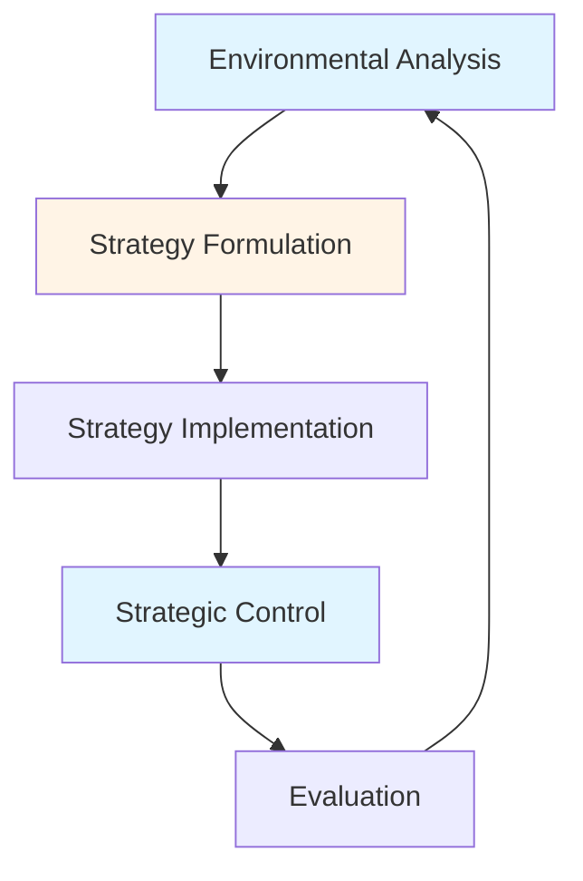
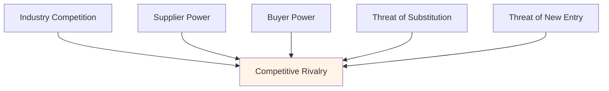
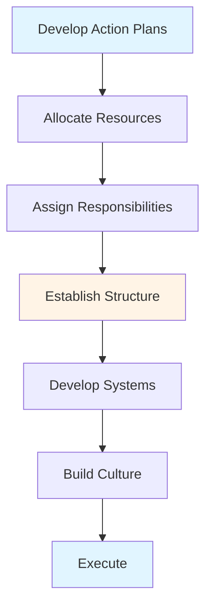

# Strategic Management Guide - Comprehensive

## Table of Contents
1. [Introduction](#introduction)
2. [Strategic Management Overview](#strategic-management-overview)
3. [Strategic Planning Process](#strategic-planning-process)
4. [Strategic Analysis Tools](#strategic-analysis-tools)
5. [Strategy Formulation](#strategy-formulation)
6. [Strategy Implementation](#strategy-implementation)
7. [Strategic Control](#strategic-control)
8. [Best Practices](#best-practices)
9. [Common Pitfalls](#common-pitfalls)
10. [Real-World Examples](#real-world-examples)
11. [Templates & Checklists](#templates--checklists)
12. [Tools & Software](#tools--software)
13. [Resources](#resources)
14. [Summary](#summary)

---

## Introduction

Strategic management is the art and science of formulating, implementing, and evaluating cross-functional decisions that enable an organization to achieve its objectives. This guide covers strategic business management, from analysis to implementation and control.

### Who This Guide Is For
- Managers developing business strategy
- Entrepreneurs planning business strategy
- Business students learning strategic management
- Anyone involved in strategic planning

### Key Learning Objectives
- Understand strategic management process
- Master strategic analysis tools (SWOT, Porter's Five Forces, PESTEL)
- Learn strategy formulation approaches
- Understand strategy implementation
- Learn strategic control and evaluation

---

## Strategic Management Overview

### Definition

**Strategic Management** is the continuous process of planning, monitoring, analysis, and assessment of all that is necessary for an organization to meet its goals and objectives.

### Key Concepts

#### Strategy vs Tactics

**Strategy**:
- Long-term direction
- Organization-wide
- High-level decisions
- "What" and "Why"
- 3-5+ years

**Tactics**:
- Short-term actions
- Department/function-specific
- Operational decisions
- "How"
- 1-2 years

#### Strategic Management Process



### Levels of Strategy

#### 1. Corporate Strategy
- Organization-wide
- What businesses to be in
- Resource allocation
- Portfolio management

#### 2. Business Strategy
- Business unit level
- How to compete
- Competitive advantage
- Market positioning

#### 3. Functional Strategy
- Department level
- Support business strategy
- Operations, marketing, HR, etc.
- Resource optimization

---

## Strategic Planning Process

### Overview

Strategic planning is a systematic process for developing strategy.

### Strategic Planning Steps

#### Step 1: Mission and Vision
**Mission**: What we do, who we serve, how we create value
**Vision**: Where we want to be in future

**Example Mission**: "To provide high-quality software solutions that help businesses succeed"

**Example Vision**: "To be the leading software provider in Southeast Asia by 2030"

#### Step 2: Environmental Analysis
- External environment (opportunities, threats)
- Internal environment (strengths, weaknesses)
- Use analysis tools (SWOT, PESTEL, Porter's)

#### Step 3: Strategy Formulation
- Develop strategic options
- Evaluate alternatives
- Select strategy
- Set objectives

#### Step 4: Strategy Implementation
- Develop action plans
- Allocate resources
- Assign responsibilities
- Execute strategy

#### Step 5: Strategic Control
- Monitor progress
- Measure performance
- Take corrective action
- Adjust strategy

---

## Strategic Analysis Tools

### 1. SWOT Analysis

**Definition**: Analysis of Strengths, Weaknesses, Opportunities, Threats

**SWOT Matrix**:

| Internal | Strengths | Weaknesses |
|----------|-----------|------------|
| **External** | | |
| Opportunities | SO Strategies | WO Strategies |
| Threats | ST Strategies | WT Strategies |

**How to Conduct**:

**Strengths** (Internal, Positive):
- What do we do well?
- What resources do we have?
- What advantages do we have?

**Weaknesses** (Internal, Negative):
- What could we improve?
- What resources are we lacking?
- What disadvantages do we have?

**Opportunities** (External, Positive):
- What trends could we leverage?
- What market gaps exist?
- What changes favor us?

**Threats** (External, Negative):
- What trends threaten us?
- What competition exists?
- What changes harm us?

**SWOT Best Practices**:
- Be specific
- Be honest
- Consider all perspectives
- Prioritize
- Use for strategy development

### 2. Porter's Five Forces

**Definition**: Framework for analyzing competitive environment

**Five Forces**:



**1. Competitive Rivalry**:
- Number of competitors
- Industry growth
- Product differentiation
- Exit barriers

**2. Supplier Power**:
- Number of suppliers
- Switching costs
- Supplier concentration
- Forward integration threat

**3. Buyer Power**:
- Number of buyers
- Switching costs
- Buyer concentration
- Price sensitivity

**4. Threat of Substitution**:
- Substitute availability
- Switching costs
- Price-performance trade-off
- Buyer propensity to substitute

**5. Threat of New Entry**:
- Barriers to entry
- Capital requirements
- Economies of scale
- Brand loyalty
- Government regulations

**Analysis**:
- High force = Less attractive industry
- Low force = More attractive industry
- Develop strategies to counter forces

### 3. PESTEL Analysis

**Definition**: Analysis of Political, Economic, Social, Technological, Environmental, Legal factors

**PESTEL Factors**:

**Political**:
- Government stability
- Tax policies
- Trade regulations
- Political risk

**Economic**:
- Economic growth
- Inflation rates
- Interest rates
- Exchange rates
- Unemployment

**Social**:
- Demographics
- Cultural trends
- Lifestyle changes
- Education levels
- Health consciousness

**Technological**:
- R&D activity
- Innovation
- Automation
- Technology infrastructure
- Rate of technological change

**Environmental**:
- Climate change
- Environmental regulations
- Sustainability
- Green initiatives
- Resource availability

**Legal**:
- Employment laws
- Health and safety
- Consumer protection
- Intellectual property
- Data protection

**PESTEL Best Practices**:
- Consider all factors
- Look for trends
- Assess impact
- Prioritize
- Update regularly

### 4. Business Model Canvas

**Definition**: Visual framework for describing business model

**Nine Building Blocks**:

1. **Value Propositions**: What value do we deliver?
2. **Customer Segments**: Who are our customers?
3. **Channels**: How do we reach customers?
4. **Customer Relationships**: What relationships do we establish?
5. **Revenue Streams**: How do we make money?
6. **Key Resources**: What resources are needed?
7. **Key Activities**: What activities are critical?
8. **Key Partnerships**: Who are our partners?
9. **Cost Structure**: What are our costs?

**Use**: Business model design, innovation, strategy development

---

## Strategy Formulation

### Overview

Strategy formulation involves developing strategic options and selecting the best strategy.

### Generic Competitive Strategies (Porter)

#### 1. Cost Leadership
**Strategy**: Lowest cost producer
**Focus**: Efficiency, economies of scale
**Example**: Walmart, Southwest Airlines

**Requirements**:
- Efficient operations
- Cost control
- Economies of scale
- Process innovation

**Risks**:
- Price wars
- Technology changes
- Imitation

#### 2. Differentiation
**Strategy**: Unique products/services
**Focus**: Innovation, quality, brand
**Example**: Apple, Tesla

**Requirements**:
- Innovation capability
- Strong brand
- Quality focus
- Customer loyalty

**Risks**:
- Cost disadvantage
- Imitation
- Changing customer preferences

#### 3. Focus (Niche)
**Strategy**: Focus on specific segment
**Focus**: Narrow market, specialized
**Example**: Rolex, Ferrari

**Types**:
- Cost focus: Low cost in niche
- Differentiation focus: Unique in niche

**Requirements**:
- Market knowledge
- Specialization
- Customer understanding

**Risks**:
- Market too small
- Competition from broad market

### Strategy Options

#### Growth Strategies

**1. Market Penetration**:
- Increase market share in existing markets
- Methods: Price, promotion, distribution

**2. Market Development**:
- Enter new markets with existing products
- Methods: New geographies, new segments

**3. Product Development**:
- Develop new products for existing markets
- Methods: Innovation, R&D

**4. Diversification**:
- Enter new markets with new products
- Types: Related, unrelated

#### Stability Strategies

**1. Pause/Proceed with Caution**:
- Temporary strategy
- Consolidate position
- Prepare for growth

**2. No Change**:
- Continue current strategy
- When: Successful, stable environment

**3. Profit**:
- Maximize short-term profits
- When: Declining industry

#### Retrenchment Strategies

**1. Turnaround**:
- Reverse decline
- Cost reduction
- Restructuring

**2. Divestiture**:
- Sell business unit
- When: Not strategic fit

**3. Liquidation**:
- Sell all assets
- Last resort

### Strategy Selection

**Criteria**:
- Feasibility: Can we do it?
- Suitability: Does it fit?
- Acceptability: Is it acceptable?

**Evaluation Methods**:
- Financial analysis
- Risk assessment
- Stakeholder analysis
- Scenario planning

---

## Strategy Implementation

### Overview

Strategy implementation is executing the chosen strategy.

### Implementation Framework



### Key Implementation Activities

#### 1. Develop Action Plans
- Break strategy into actions
- Set timelines
- Define milestones
- Assign owners

#### 2. Allocate Resources
- Financial resources
- Human resources
- Technology resources
- Prioritize allocation

#### 3. Establish Structure
- Organizational structure
- Reporting relationships
- Decision-making authority
- Coordination mechanisms

#### 4. Develop Systems
- Information systems
- Performance measurement
- Reward systems
- Communication systems

#### 5. Build Culture
- Align values
- Communicate vision
- Model behavior
- Reinforce culture

### Implementation Challenges

**Common Challenges**:
- Resistance to change
- Resource constraints
- Poor communication
- Lack of alignment
- Competing priorities

**Solutions**:
- Change management
- Clear communication
- Stakeholder engagement
- Alignment mechanisms
- Priority management

---

## Strategic Control

### Overview

Strategic control monitors strategy implementation and takes corrective action.

### Control Process

```mermaid
graph LR
    A[Set Standards] --> B[Measure Performance]
    B --> C{Compare]
    C -->|Meets| D[Continue]
    C -->|Doesn't Meet| E[Take Action]
    E --> B
    
    style A fill:#e1f5ff
    style C fill:#fff4e6
    style D fill:#e1f5ff
```

### Types of Strategic Control

#### 1. Premise Control
- Monitor assumptions
- Validate strategic premises
- Adjust if premises change

#### 2. Implementation Control
- Monitor implementation progress
- Check milestones
- Ensure on track

#### 3. Strategic Surveillance
- Monitor environment
- Identify opportunities/threats
- Early warning system

#### 4. Special Alert Control
- Crisis management
- Rapid response
- Contingency plans

### Key Performance Indicators (KPIs)

**Strategic KPIs**:
- Market share
- Revenue growth
- Profitability
- Customer satisfaction
- Employee engagement
- Innovation metrics

**Balanced Scorecard**:
- Financial perspective
- Customer perspective
- Internal process perspective
- Learning and growth perspective

---

## Best Practices

### Strategic Management Best Practices

1. **Involve Stakeholders**
   - Get input from all levels
   - Build commitment
   - Ensure alignment

2. **Be Realistic**
   - Honest assessment
   - Achievable goals
   - Realistic timelines

3. **Communicate Clearly**
   - Clear vision and mission
   - Communicate strategy
   - Regular updates

4. **Monitor Continuously**
   - Regular reviews
   - Track progress
   - Adjust as needed

5. **Balance Short and Long Term**
   - Long-term vision
   - Short-term actions
   - Balance priorities

6. **Be Flexible**
   - Adapt to changes
   - Adjust strategy
   - Learn and improve

7. **Focus on Execution**
   - Strategy is nothing without execution
   - Implementation focus
   - Results orientation

---

## Common Pitfalls

### Strategic Management Pitfalls

1. **Poor Analysis**
   - Incomplete analysis
   - Biased assessment
   - Missing key factors

2. **Unrealistic Goals**
   - Too ambitious
   - Not achievable
   - Unrealistic timelines

3. **Poor Communication**
   - Strategy not communicated
   - Unclear direction
   - Misalignment

4. **No Implementation Focus**
   - Strategy not implemented
   - No action plans
   - Poor execution

5. **No Monitoring**
   - Not tracking progress
   - No control
   - Late detection of issues

6. **Resistance to Change**
   - Not managing change
   - Resistance not addressed
   - Implementation failure

7. **Static Strategy**
   - Not adapting
   - Ignoring changes
   - Outdated strategy

---

## Real-World Examples

### Example 1: Successful Strategy - Apple

**Strategy**: Differentiation through innovation
**Implementation**: Focus on design, user experience, ecosystem
**Result**: Market leadership, high profitability

### Example 2: Strategic Turnaround - IBM

**Challenge**: Declining PC business
**Strategy**: Shift to services and cloud
**Implementation**: Divest PC business, invest in services
**Result**: Successful transformation

### Example 3: Market Entry - Starbucks in China

**Strategy**: Market development
**Analysis**: Understanding Chinese market
**Implementation**: Localized approach
**Result**: Successful expansion

---

## Templates & Checklists

### SWOT Analysis Template

**Strengths**:
- [Strength 1]
- [Strength 2]
- [Strength 3]

**Weaknesses**:
- [Weakness 1]
- [Weakness 2]
- [Weakness 3]

**Opportunities**:
- [Opportunity 1]
- [Opportunity 2]
- [Opportunity 3]

**Threats**:
- [Threat 1]
- [Threat 2]
- [Threat 3]

**Strategies**:
- SO: [Strategy leveraging strengths and opportunities]
- WO: [Strategy addressing weaknesses and opportunities]
- ST: [Strategy using strengths against threats]
- WT: [Strategy minimizing weaknesses and threats]

### Strategic Planning Checklist

- [ ] Mission and vision defined
- [ ] Environmental analysis completed
- [ ] SWOT analysis done
- [ ] Strategic options developed
- [ ] Strategy selected
- [ ] Objectives set
- [ ] Action plans developed
- [ ] Resources allocated
- [ ] Responsibilities assigned
- [ ] Implementation started
- [ ] Monitoring system in place

---

## Tools & Software

### Strategic Planning Tools

1. **SWOT Analysis**: Templates, software
2. **Business Model Canvas**: Online tools
3. **Strategic Planning Software**: Strategy software
4. **Analytics Tools**: Data analysis
5. **Project Management**: Implementation tracking

### Analysis Tools

1. **Market Research**: Industry reports, surveys
2. **Financial Analysis**: Financial modeling tools
3. **Competitive Intelligence**: Research tools
4. **Scenario Planning**: Planning software

---

## Resources

### Books

1. "Competitive Strategy" - Michael Porter
2. "Good to Great" - Jim Collins
3. "Blue Ocean Strategy" - W. Chan Kim
4. "The Art of Strategy" - Avinash Dixit

### Online Resources

1. **Harvard Business Review**: Strategy articles
2. **McKinsey Quarterly**: Strategic insights
3. **Strategy+Business**: Strategy resources

---

## Summary

### Key Takeaways

1. **Strategic Management**: Continuous process of planning, implementation, control
2. **Analysis Tools**: SWOT, Porter's Five Forces, PESTEL, Business Model Canvas
3. **Strategy Types**: Cost leadership, differentiation, focus
4. **Implementation**: Critical for success
5. **Control**: Monitor and adjust
6. **Best Practices**: Involve stakeholders, communicate, execute

### Final Recommendations

1. **Analyze Thoroughly**: Use multiple tools
2. **Formulate Carefully**: Consider all options
3. **Implement Effectively**: Focus on execution
4. **Monitor Continuously**: Track and adjust
5. **Be Flexible**: Adapt to changes
6. **Communicate**: Keep stakeholders informed
7. **Learn**: Improve from experience

Remember: Strategy without execution is just a plan. Focus on both strategy formulation and implementation for success.

---

**Last Updated**: 2024

**Related Guides**:
- [Management Fundamentals Guide](./MANAGEMENT_FUNDAMENTALS_GUIDE.md)
- [Financial & Accounting Guide](./FINANCIAL_ACCOUNTING_GUIDE.md)
- [Marketing Management Guide](./MARKETING_MANAGEMENT_GUIDE.md)

