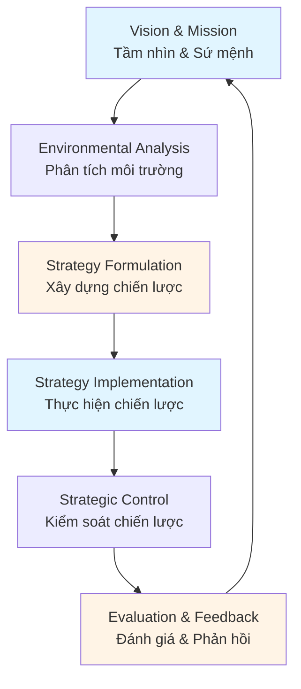
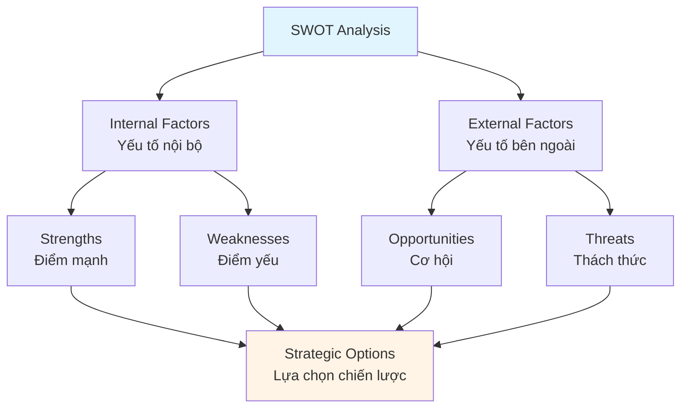
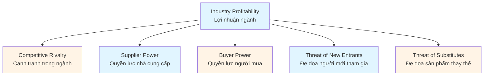
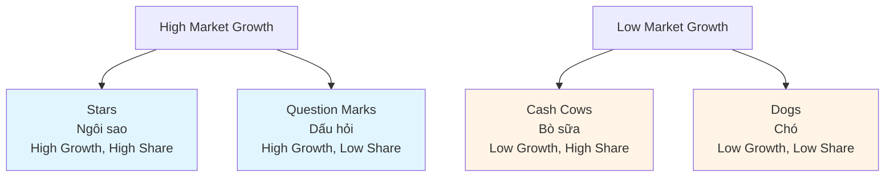
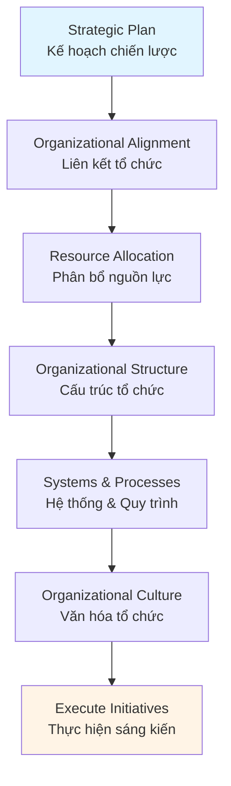

# Strategic Management Guide - Comprehensive

## Quản trị chiến lược kinh doanh / Strategic Business Management

## Table of Contents
1. [Introduction](#introduction)
2. [Strategic Planning Process](#strategic-planning-process)
3. [SWOT Analysis](#swot-analysis)
4. [Competitive Analysis](#competitive-analysis)
5. [Strategic Frameworks](#strategic-frameworks)
6. [Strategy Implementation](#strategy-implementation)
7. [Strategic Control and Evaluation](#strategic-control-and-evaluation)
8. [Best Practices](#best-practices)
9. [Common Pitfalls](#common-pitfalls)
10. [Real-World Examples](#real-world-examples)
11. [Templates & Checklists](#templates--checklists)
12. [Tools & Software](#tools--software)
13. [Resources](#resources)
14. [Summary](#summary)

---

## Introduction

Strategic management is the process of formulating, implementing, and evaluating strategies to achieve organizational goals. It involves analyzing the competitive environment, making strategic choices, and executing plans effectively.

Quản trị chiến lược là quá trình xây dựng, thực hiện và đánh giá các chiến lược để đạt được mục tiêu tổ chức. Nó bao gồm phân tích môi trường cạnh tranh, đưa ra lựa chọn chiến lược và thực hiện kế hoạch hiệu quả.

### Who This Guide Is For
- Senior executives and managers
- Strategic planners
- Business owners and entrepreneurs
- Anyone involved in strategic decision-making

### Key Learning Objectives
- Understand strategic planning process
- Master SWOT analysis
- Learn competitive analysis techniques
- Apply strategic frameworks
- Implement strategies effectively
- Evaluate strategic performance

---

## Strategic Planning Process

### Strategic Management Process / Quy trình quản trị chiến lược



### Strategic Planning Steps / Các bước lập kế hoạch chiến lược

#### 1. Establish Vision and Mission / Thiết lập tầm nhìn và sứ mệnh

**Vision** - Where the organization wants to be in the future
- Inspiring and aspirational
- Long-term perspective
- Guides strategic direction

**Mission** - What the organization does and why it exists
- Defines purpose
- Identifies stakeholders
- Guides daily operations

#### 2. Environmental Analysis / Phân tích môi trường

**External Analysis**:
- Industry analysis
- Competitive forces
- Market trends
- Economic factors
- Technological changes
- Regulatory environment

**Internal Analysis**:
- Resources and capabilities
- Core competencies
- Strengths and weaknesses
- Financial position
- Organizational culture

#### 3. Strategy Formulation / Xây dựng chiến lược

- Set strategic objectives
- Develop strategic alternatives
- Evaluate options
- Select strategies
- Create strategic plan

#### 4. Strategy Implementation / Thực hiện chiến lược

- Develop action plans
- Allocate resources
- Align organization
- Communicate strategy
- Execute initiatives

#### 5. Strategic Control / Kiểm soát chiến lược

- Monitor performance
- Measure progress
- Compare to objectives
- Take corrective action
- Adjust strategy

---

## SWOT Analysis

### SWOT Framework / Khung SWOT

SWOT analysis evaluates Strengths, Weaknesses, Opportunities, and Threats.

Phân tích SWOT đánh giá Điểm mạnh, Điểm yếu, Cơ hội và Thách thức.



### SWOT Components / Thành phần SWOT

#### Strengths / Điểm mạnh
Internal positive attributes and resources
- Strong brand
- Skilled workforce
- Financial resources
- Technology advantages
- Market position

#### Weaknesses / Điểm yếu
Internal negative attributes and limitations
- Limited resources
- Weak brand
- High costs
- Poor location
- Lack of expertise

#### Opportunities / Cơ hội
External favorable conditions
- Market growth
- New technologies
- Regulatory changes
- Competitor weaknesses
- Emerging markets

#### Threats / Thách thức
External unfavorable conditions
- Intense competition
- Economic downturn
- Changing regulations
- New technologies
- Market saturation

### SWOT Analysis Process / Quy trình phân tích SWOT

1. **Gather Information** - Collect internal and external data
2. **Identify Factors** - List strengths, weaknesses, opportunities, threats
3. **Prioritize** - Rank by importance
4. **Develop Strategies** - Create strategies using SWOT
5. **Implement** - Execute strategies
6. **Review** - Regularly update SWOT

### SWOT Strategy Matrix / Ma trận chiến lược SWOT

- **SO Strategies** - Use strengths to take advantage of opportunities
- **ST Strategies** - Use strengths to avoid threats
- **WO Strategies** - Overcome weaknesses by taking advantage of opportunities
- **WT Strategies** - Minimize weaknesses and avoid threats

---

## Competitive Analysis

### Porter's Five Forces / Năm lực lượng cạnh tranh của Porter



#### 1. Competitive Rivalry / Cạnh tranh trong ngành
- Number of competitors
- Industry growth
- Product differentiation
- Exit barriers
- Fixed costs

#### 2. Supplier Power / Quyền lực nhà cung cấp
- Number of suppliers
- Switching costs
- Supplier concentration
- Forward integration threat
- Importance of inputs

#### 3. Buyer Power / Quyền lực người mua
- Number of buyers
- Purchase volume
- Switching costs
- Price sensitivity
- Backward integration threat

#### 4. Threat of New Entrants / Đe dọa người mới tham gia
- Barriers to entry
- Capital requirements
- Economies of scale
- Brand loyalty
- Regulatory barriers

#### 5. Threat of Substitutes / Đe dọa sản phẩm thay thế
- Substitute availability
- Switching costs
- Price-performance trade-off
- Buyer propensity to substitute

### Competitive Positioning / Định vị cạnh tranh

#### Generic Competitive Strategies / Chiến lược cạnh tranh chung

1. **Cost Leadership** - Lowest cost producer
2. **Differentiation** - Unique products/services
3. **Focus** - Niche market focus
   - Cost focus
   - Differentiation focus

---

## Strategic Frameworks

### BCG Matrix / Ma trận BCG

Portfolio analysis framework classifying products/businesses:



**Strategies**:
- **Stars** - Invest and grow
- **Cash Cows** - Maintain and harvest
- **Question Marks** - Evaluate and decide
- **Dogs** - Divest or restructure

### Ansoff Matrix / Ma trận Ansoff

Growth strategy framework:

| | Existing Products | New Products |
|---|---|---|
| **Existing Markets** | Market Penetration | Product Development |
| **New Markets** | Market Development | Diversification |

### PEST Analysis / Phân tích PEST

External environment analysis:
- **Political** - Government policies, regulations
- **Economic** - Economic conditions, trends
- **Social** - Demographics, culture, trends
- **Technological** - Technology changes, innovation

### Value Chain Analysis / Phân tích chuỗi giá trị

Primary Activities:
- Inbound logistics
- Operations
- Outbound logistics
- Marketing and sales
- Service

Support Activities:
- Procurement
- Technology development
- Human resource management
- Firm infrastructure

---

## Strategy Implementation

### Strategy Implementation Framework / Khung thực hiện chiến lược



### Implementation Key Success Factors / Yếu tố thành công chính

1. **Clear Communication**
   - Communicate strategy clearly
   - Ensure understanding
   - Regular updates
   - Two-way communication

2. **Resource Allocation**
   - Allocate sufficient resources
   - Prioritize initiatives
   - Balance short and long-term

3. **Organizational Alignment**
   - Align structure with strategy
   - Align systems and processes
   - Align culture and values

4. **Change Management**
   - Manage resistance
   - Support employees
   - Provide training
   - Celebrate successes

5. **Project Management**
   - Break strategy into projects
   - Assign project managers
   - Monitor progress
   - Manage risks

---

## Strategic Control and Evaluation

### Strategic Control Process / Quy trình kiểm soát chiến lược

1. **Establish Standards** - Set performance targets
2. **Measure Performance** - Collect data
3. **Compare to Standards** - Identify variances
4. **Take Corrective Action** - Address issues
5. **Adjust Strategy** - Modify if needed

### Key Performance Indicators (KPIs) / Chỉ số hiệu suất chính

**Financial KPIs**:
- Revenue growth
- Profit margins
- Return on investment (ROI)
- Return on equity (ROE)

**Non-Financial KPIs**:
- Market share
- Customer satisfaction
- Employee engagement
- Innovation metrics

### Balanced Scorecard / Thẻ điểm cân bằng

Four perspectives:
1. **Financial** - Financial performance
2. **Customer** - Customer satisfaction
3. **Internal Processes** - Operational efficiency
4. **Learning & Growth** - Innovation and improvement

### Strategic Review / Đánh giá chiến lược

- Regular reviews (quarterly, annually)
- Assess progress toward objectives
- Evaluate strategy effectiveness
- Identify needed adjustments
- Update strategic plan

---

## Best Practices

### Strategic Management Best Practices / Thực hành quản trị chiến lược tốt

1. **Clear Vision and Mission**
   - Inspiring vision
   - Clear mission statement
   - Communicate widely
   - Align actions

2. **Comprehensive Analysis**
   - Thorough environmental analysis
   - Regular SWOT updates
   - Competitive intelligence
   - Market research

3. **Strategic Focus**
   - Focus on key priorities
   - Avoid overextension
   - Make trade-offs
   - Say no to non-strategic initiatives

4. **Effective Implementation**
   - Clear action plans
   - Adequate resources
   - Strong project management
   - Change management

5. **Continuous Monitoring**
   - Regular performance reviews
   - Key metrics tracking
   - Early warning systems
   - Quick response to changes

---

## Common Pitfalls

### Strategic Management Mistakes / Các sai lầm quản trị chiến lược

1. **Poor Execution**
   - **Problem**: Great strategy, poor implementation
   - **Solution**: Invest in implementation capabilities

2. **Lack of Focus**
   - **Problem**: Too many priorities
   - **Solution**: Focus on critical few

3. **Ignoring Competition**
   - **Problem**: Not monitoring competitors
   - **Solution**: Regular competitive analysis

4. **Static Strategy**
   - **Problem**: Not adapting to changes
   - **Solution**: Regular strategy reviews and updates

5. **Poor Communication**
   - **Problem**: Strategy not understood
   - **Solution**: Clear, frequent communication

---

## Real-World Examples

### Example 1: Technology Company Strategic Transformation

**Situation**: Technology company facing declining market share.

**Strategic Approach**:
- Conducted comprehensive SWOT analysis
- Identified core competencies in innovation
- Shifted strategy to focus on R&D and new products
- Divested non-core businesses
- Invested in emerging technologies

**Result**: Regained market leadership, 50% revenue growth in 3 years.

### Example 2: Retail Chain Market Expansion

**Situation**: Regional retailer planning national expansion.

**Strategic Approach**:
- Analyzed market opportunities using PEST
- Used Ansoff Matrix to plan expansion
- Developed market entry strategy
- Built strategic partnerships
- Implemented phased rollout

**Result**: Successfully expanded to 5 new markets, 200% revenue increase.

---

## Templates & Checklists

### Strategic Plan Template

```
Strategic Plan: [Organization Name]
Period: [Time Period]

1. Executive Summary
   - Vision statement
   - Mission statement
   - Key objectives

2. Environmental Analysis
   - External analysis (PEST, Five Forces)
   - Internal analysis (SWOT)
   - Competitive analysis

3. Strategic Objectives
   - Long-term objectives (3-5 years)
   - Short-term objectives (1 year)
   - Key performance indicators

4. Strategic Initiatives
   - Initiative 1: [Description, timeline, resources]
   - Initiative 2: [Description, timeline, resources]
   - Initiative 3: [Description, timeline, resources]

5. Implementation Plan
   - Action plans
   - Resource requirements
   - Timeline
   - Responsibilities

6. Risk Management
   - Key risks
   - Mitigation strategies

7. Performance Measurement
   - KPIs
   - Review schedule
   - Reporting structure
```

### Strategic Planning Checklist

- [ ] Review vision and mission
- [ ] Conduct environmental analysis
- [ ] Perform SWOT analysis
- [ ] Analyze competition
- [ ] Set strategic objectives
- [ ] Develop strategic options
- [ ] Select strategies
- [ ] Create implementation plan
- [ ] Allocate resources
- [ ] Communicate strategy
- [ ] Implement initiatives
- [ ] Monitor performance
- [ ] Review and adjust

---

## Tools & Software

### Strategic Planning
- **Lucidchart** - Strategy mapping and diagrams
- **Miro** - Collaborative strategic planning
- **Strategyzer** - Business model and strategy tools

### Analysis Tools
- **Tableau** - Data visualization and analysis
- **Power BI** - Business intelligence
- **Excel** - Financial modeling and analysis

### Project Management
- **Microsoft Project** - Strategic initiative management
- **Asana** - Strategy execution tracking
- **Monday.com** - Strategic planning and execution

---

## Resources

### Books
- "Competitive Strategy" by Michael Porter
- "Good to Great" by Jim Collins
- "Blue Ocean Strategy" by W. Chan Kim
- "The Art of Strategy" by Avinash Dixit

### Professional Organizations
- **Strategic Management Society (SMS)**
- **Academy of Management**
- **Strategic Planning Society**

---

## Summary

### Key Takeaways / Điểm chính

1. **Strategic management** involves formulation, implementation, and evaluation of strategies.

2. **SWOT analysis** evaluates internal strengths/weaknesses and external opportunities/threats.

3. **Competitive analysis** (Porter's Five Forces) assesses industry attractiveness.

4. **Strategic frameworks** (BCG, Ansoff, PEST) provide analytical tools.

5. **Strategy implementation** requires alignment, resources, and change management.

6. **Strategic control** monitors performance and enables adjustments.

### Next Steps / Bước tiếp theo

- Develop or review strategic plan
- Conduct comprehensive SWOT analysis
- Analyze competitive environment
- Apply strategic frameworks
- Implement strategies effectively
- Monitor and evaluate performance
- Review other management guides for functional strategies

---

**Remember**: Strategy without execution is just a plan. Focus on both strategic thinking and effective implementation.

**Nhớ rằng**: Chiến lược không có thực hiện chỉ là kế hoạch. Tập trung vào cả tư duy chiến lược và thực hiện hiệu quả.
