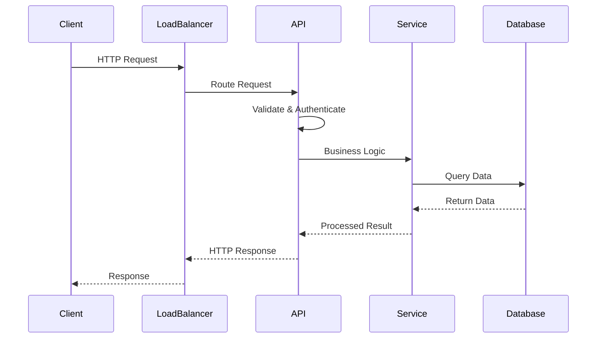
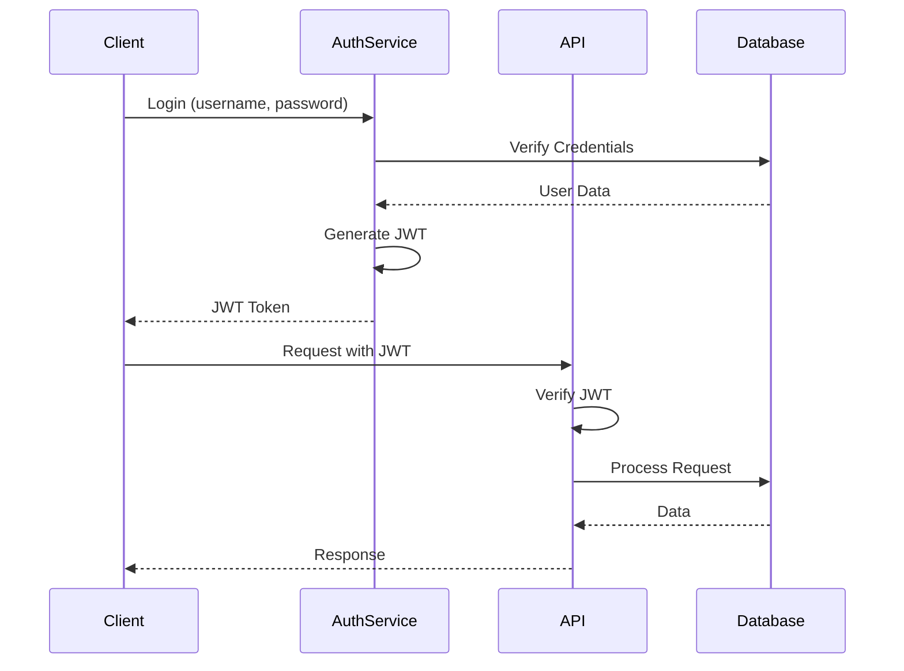

# API Design & Integration Guide - Comprehensive

## Table of Contents
1. [Introduction](#introduction)
2. [RESTful API Design](#restful-api-design)
3. [GraphQL Design](#graphql-design)
4. [gRPC for Microservices](#grpc-for-microservices)
5. [API Versioning](#api-versioning)
6. [Authentication & Authorization](#authentication--authorization)
7. [Rate Limiting and Throttling](#rate-limiting-and-throttling)
8. [API Documentation](#api-documentation)
9. [Error Handling](#error-handling)
10. [Pagination and Filtering](#pagination-and-filtering)
11. [API Testing](#api-testing)
12. [API Gateway Patterns](#api-gateway-patterns)
13. [Webhooks and Event-Driven APIs](#webhooks-and-event-driven-apis)
14. [API Security](#api-security)
15. [Performance Optimization](#performance-optimization)
16. [Resources](#resources)
17. [Summary](#summary)

---

## Introduction

This guide covers API design principles, best practices, and integration patterns for building robust, scalable APIs. Learn to design RESTful APIs, GraphQL schemas, and gRPC services.

### Who This Guide Is For
- Backend developers
- API architects
- Full stack developers
- Anyone building or consuming APIs

---

## RESTful API Design

### REST API Request Flow



### REST Principles

#### 1. Resource-Based URLs
```typescript
// GOOD: Resource-based
GET    /api/users
GET    /api/users/123
POST   /api/users
PUT    /api/users/123
DELETE /api/users/123

// BAD: Action-based
GET    /api/getUsers
POST   /api/createUser
POST   /api/deleteUser
```

#### 2. HTTP Methods
- **GET**: Retrieve resources
- **POST**: Create resources
- **PUT**: Update/replace resources
- **PATCH**: Partial update
- **DELETE**: Delete resources

#### 3. Status Codes

```typescript
// Success
200 OK - Successful GET, PUT, PATCH
201 Created - Successful POST
204 No Content - Successful DELETE

// Client Errors
400 Bad Request - Invalid request
401 Unauthorized - Authentication required
403 Forbidden - Insufficient permissions
404 Not Found - Resource doesn't exist
409 Conflict - Resource conflict

// Server Errors
500 Internal Server Error
502 Bad Gateway
503 Service Unavailable
```

### RESTful API Example

```typescript
// Express.js example
import express from 'express';
const app = express();

// GET /api/users
app.get('/api/users', async (req, res) => {
    const { page = 1, limit = 10 } = req.query;
    const users = await userService.findAll(page, limit);
    res.json({
        data: users,
        pagination: {
            page,
            limit,
            total: await userService.count()
        }
    });
});

// GET /api/users/:id
app.get('/api/users/:id', async (req, res) => {
    const user = await userService.findById(req.params.id);
    if (!user) {
        return res.status(404).json({ error: 'User not found' });
    }
    res.json({ data: user });
});

// POST /api/users
app.post('/api/users', async (req, res) => {
    try {
        const user = await userService.create(req.body);
        res.status(201).json({ data: user });
    } catch (error) {
        res.status(400).json({ error: error.message });
    }
});

// PUT /api/users/:id
app.put('/api/users/:id', async (req, res) => {
    try {
        const user = await userService.update(req.params.id, req.body);
        if (!user) {
            return res.status(404).json({ error: 'User not found' });
        }
        res.json({ data: user });
    } catch (error) {
        res.status(400).json({ error: error.message });
    }
});

// DELETE /api/users/:id
app.delete('/api/users/:id', async (req, res) => {
    const deleted = await userService.delete(req.params.id);
    if (!deleted) {
        return res.status(404).json({ error: 'User not found' });
    }
    res.status(204).send();
});
```

---

## GraphQL Design

### GraphQL Schema

```graphql
type User {
    id: ID!
    name: String!
    email: String!
    posts: [Post!]!
}

type Post {
    id: ID!
    title: String!
    content: String!
    author: User!
    comments: [Comment!]!
}

type Comment {
    id: ID!
    content: String!
    author: User!
}

type Query {
    user(id: ID!): User
    users(limit: Int, offset: Int): [User!]!
    post(id: ID!): Post
    posts(limit: Int, offset: Int): [Post!]!
}

type Mutation {
    createUser(input: CreateUserInput!): User!
    updateUser(id: ID!, input: UpdateUserInput!): User!
    deleteUser(id: ID!): Boolean!
}

input CreateUserInput {
    name: String!
    email: String!
}

input UpdateUserInput {
    name: String
    email: String
}
```

### GraphQL Resolvers

```typescript
const resolvers = {
    Query: {
        user: async (parent, { id }) => {
            return await userRepository.findById(id);
        },
        users: async (parent, { limit = 10, offset = 0 }) => {
            return await userRepository.findAll(limit, offset);
        }
    },
    Mutation: {
        createUser: async (parent, { input }) => {
            return await userRepository.create(input);
        },
        updateUser: async (parent, { id, input }) => {
            return await userRepository.update(id, input);
        },
        deleteUser: async (parent, { id }) => {
            await userRepository.delete(id);
            return true;
        }
    },
    User: {
        posts: async (user) => {
            return await postRepository.findByUserId(user.id);
        }
    },
    Post: {
        author: async (post) => {
            return await userRepository.findById(post.authorId);
        },
        comments: async (post) => {
            return await commentRepository.findByPostId(post.id);
        }
    }
};
```

---

## gRPC for Microservices

### Protocol Buffers Definition

```protobuf
syntax = "proto3";

package user;

service UserService {
    rpc GetUser(GetUserRequest) returns (User);
    rpc CreateUser(CreateUserRequest) returns (User);
    rpc ListUsers(ListUsersRequest) returns (ListUsersResponse);
}

message User {
    int64 id = 1;
    string name = 2;
    string email = 3;
}

message GetUserRequest {
    int64 id = 1;
}

message CreateUserRequest {
    string name = 1;
    string email = 2;
}

message ListUsersRequest {
    int32 page = 1;
    int32 limit = 2;
}

message ListUsersResponse {
    repeated User users = 1;
    int32 total = 2;
}
```

### gRPC Server (Node.js)

```typescript
import * as grpc from '@grpc/grpc-js';
import * as protoLoader from '@grpc/proto-loader';

const packageDefinition = protoLoader.loadSync('user.proto');
const userProto = grpc.loadPackageDefinition(packageDefinition).user as any;

const server = new grpc.Server();

server.addService(userProto.UserService.service, {
    GetUser: async (call: any, callback: any) => {
        const user = await userRepository.findById(call.request.id);
        callback(null, user);
    },
    CreateUser: async (call: any, callback: any) => {
        const user = await userRepository.create(call.request);
        callback(null, user);
    },
    ListUsers: async (call: any, callback: any) => {
        const { page, limit } = call.request;
        const users = await userRepository.findAll(page, limit);
        callback(null, { users, total: users.length });
    }
});

server.bindAsync('0.0.0.0:50051', grpc.ServerCredentials.createInsecure(), () => {
    server.start();
});
```

---

## API Versioning

### URL Versioning

```typescript
// Version in URL
GET /api/v1/users
GET /api/v2/users

app.use('/api/v1', v1Router);
app.use('/api/v2', v2Router);
```

### Header Versioning

```typescript
// Version in header
GET /api/users
Headers: API-Version: 2

app.use('/api', (req, res, next) => {
    const version = req.headers['api-version'] || '1';
    if (version === '2') {
        return v2Router(req, res, next);
    }
    return v1Router(req, res, next);
});
```

### Query Parameter Versioning

```typescript
// Version in query
GET /api/users?version=2

app.use('/api', (req, res, next) => {
    const version = req.query.version || '1';
    if (version === '2') {
        return v2Router(req, res, next);
    }
    return v1Router(req, res, next);
});
```

---

## Authentication & Authorization

### JWT Authentication Flow



### JWT Authentication

```typescript
import jwt from 'jsonwebtoken';

// Generate token
function generateToken(user: User): string {
    return jwt.sign(
        { id: user.id, email: user.email },
        process.env.JWT_SECRET!,
        { expiresIn: '1h' }
    );
}

// Verify token
function verifyToken(token: string): UserPayload {
    return jwt.verify(token, process.env.JWT_SECRET!) as UserPayload;
}

// Middleware
function authenticate(req: Request, res: Response, next: NextFunction) {
    const token = req.headers.authorization?.split(' ')[1];
    if (!token) {
        return res.status(401).json({ error: 'No token provided' });
    }
    try {
        req.user = verifyToken(token);
        next();
    } catch (error) {
        return res.status(401).json({ error: 'Invalid token' });
    }
}
```

### OAuth2

```typescript
// OAuth2 flow
app.get('/oauth/authorize', (req, res) => {
    const { client_id, redirect_uri, response_type } = req.query;
    // Show authorization page
    res.render('authorize', { client_id, redirect_uri });
});

app.post('/oauth/token', async (req, res) => {
    const { code, client_id, client_secret } = req.body;
    // Exchange code for token
    const token = await exchangeCodeForToken(code, client_id, client_secret);
    res.json({ access_token: token });
});
```

---

## Rate Limiting and Throttling

```typescript
import rateLimit from 'express-rate-limit';

// Rate limiter
const limiter = rateLimit({
    windowMs: 15 * 60 * 1000, // 15 minutes
    max: 100, // Limit each IP to 100 requests per windowMs
    message: 'Too many requests from this IP'
});

app.use('/api/', limiter);

// Per-route rate limiting
const createAccountLimiter = rateLimit({
    windowMs: 60 * 60 * 1000, // 1 hour
    max: 5, // Limit each IP to 5 account creation requests per hour
    message: 'Too many accounts created from this IP'
});

app.post('/api/users', createAccountLimiter, createUser);
```

---

## API Documentation

### OpenAPI/Swagger

```yaml
openapi: 3.0.0
info:
  title: User API
  version: 1.0.0
paths:
  /users:
    get:
      summary: List users
      parameters:
        - name: page
          in: query
          schema:
            type: integer
      responses:
        '200':
          description: Success
          content:
            application/json:
              schema:
                type: object
                properties:
                  data:
                    type: array
                    items:
                      $ref: '#/components/schemas/User'
  /users/{id}:
    get:
      summary: Get user
      parameters:
        - name: id
          in: path
          required: true
          schema:
            type: integer
      responses:
        '200':
          description: Success
components:
  schemas:
    User:
      type: object
      properties:
        id:
          type: integer
        name:
          type: string
        email:
          type: string
```

---

## Error Handling

```typescript
// Standard error response
interface ErrorResponse {
    error: {
        code: string;
        message: string;
        details?: any;
    };
}

// Error handler middleware
function errorHandler(err: Error, req: Request, res: Response, next: NextFunction) {
    if (err instanceof ValidationError) {
        return res.status(400).json({
            error: {
                code: 'VALIDATION_ERROR',
                message: err.message,
                details: err.details
            }
        });
    }
    
    if (err instanceof NotFoundError) {
        return res.status(404).json({
            error: {
                code: 'NOT_FOUND',
                message: err.message
            }
        });
    }
    
    // Default error
    res.status(500).json({
        error: {
            code: 'INTERNAL_ERROR',
            message: 'An unexpected error occurred'
        }
    });
}
```

---

## Pagination and Filtering

```typescript
// Cursor-based pagination
app.get('/api/users', async (req, res) => {
    const { cursor, limit = 10 } = req.query;
    const users = await userService.findAll(cursor, limit);
    
    res.json({
        data: users,
        pagination: {
            cursor: users[users.length - 1]?.id,
            hasMore: users.length === limit,
            limit
        }
    });
});

// Offset-based pagination
app.get('/api/users', async (req, res) => {
    const { page = 1, limit = 10 } = req.query;
    const offset = (page - 1) * limit;
    const { users, total } = await userService.findAll(offset, limit);
    
    res.json({
        data: users,
        pagination: {
            page,
            limit,
            total,
            totalPages: Math.ceil(total / limit)
        }
    });
});

// Filtering
app.get('/api/users', async (req, res) => {
    const { name, email, role } = req.query;
    const filters = { name, email, role };
    const users = await userService.findAll(filters);
    res.json({ data: users });
});
```

---

## API Testing

```typescript
// Jest + Supertest
import request from 'supertest';
import app from './app';

describe('User API', () => {
    it('should create a user', async () => {
        const response = await request(app)
            .post('/api/users')
            .send({
                name: 'John Doe',
                email: 'john@example.com'
            })
            .expect(201);
        
        expect(response.body.data).toHaveProperty('id');
        expect(response.body.data.name).toBe('John Doe');
    });
    
    it('should get a user', async () => {
        const response = await request(app)
            .get('/api/users/1')
            .expect(200);
        
        expect(response.body.data).toHaveProperty('id');
    });
});
```

---

## Common Pitfalls

### 1. Inconsistent Error Responses

```typescript
// BAD: Inconsistent error format
app.get('/api/users/:id', (req, res) => {
    if (!user) {
        return res.status(404).send('Not found'); // String
    }
    if (error) {
        return res.json({ message: 'Error' }); // Different format
    }
});

// GOOD: Consistent error format
app.get('/api/users/:id', (req, res) => {
    if (!user) {
        return res.status(404).json({
            error: {
                code: 'USER_NOT_FOUND',
                message: 'User not found'
            }
        });
    }
});
```

### 2. No Rate Limiting

```typescript
// BAD: No rate limiting
app.post('/api/login', (req, res) => {
    // Vulnerable to brute force attacks
});

// GOOD: Rate limiting
const loginLimiter = rateLimit({
    windowMs: 15 * 60 * 1000,
    max: 5
});
app.post('/api/login', loginLimiter, (req, res) => {
    // Protected
});
```

### 3. Missing Input Validation

```typescript
// BAD: No validation
app.post('/api/users', (req, res) => {
    const user = await createUser(req.body); // Unsafe
});

// GOOD: Validation
app.post('/api/users', validateUserSchema, (req, res) => {
    const user = await createUser(req.body); // Validated
});
```

---

## Best Practices

### API Design Best Practices

1. **Use RESTful Conventions**
   - Resource-based URLs
   - Proper HTTP methods
   - Appropriate status codes

2. **Version Your APIs**
   - Plan for evolution
   - Use URL or header versioning
   - Maintain backward compatibility

3. **Document Thoroughly**
   - Use OpenAPI/Swagger
   - Include examples
   - Document error responses

4. **Implement Security**
   - Authentication & authorization
   - Rate limiting
   - Input validation
   - HTTPS only

---

## Real-World Examples

### Example 1: RESTful E-Commerce API

```typescript
// Complete RESTful API implementation
app.get('/api/v1/products', async (req, res) => {
    const { page = 1, limit = 10, category, minPrice, maxPrice } = req.query;
    
    const filters = {};
    if (category) filters.category = category;
    if (minPrice || maxPrice) {
        filters.price = {};
        if (minPrice) filters.price.$gte = minPrice;
        if (maxPrice) filters.price.$lte = maxPrice;
    }
    
    const products = await Product.find(filters)
        .skip((page - 1) * limit)
        .limit(limit);
    
    const total = await Product.countDocuments(filters);
    
    res.json({
        data: products,
        pagination: {
            page,
            limit,
            total,
            totalPages: Math.ceil(total / limit)
        }
    });
});
```

### Example 2: GraphQL API with Authentication

```graphql
# Schema
type Query {
    me: User
    products(filter: ProductFilter): [Product!]!
}

type Mutation {
    createOrder(input: CreateOrderInput!): Order!
}

# Resolver with authentication
const resolvers = {
    Query: {
        me: async (parent, args, context) => {
            if (!context.user) {
                throw new AuthenticationError('Not authenticated');
            }
            return await User.findById(context.user.id);
        }
    }
};
```

---

## Resources

- [REST API Tutorial](https://restfulapi.net/)
- [GraphQL Documentation](https://graphql.org/)
- [gRPC Documentation](https://grpc.io/)

---

## Summary

Key takeaways for API design:

1. **RESTful Design**: Resource-based URLs, proper HTTP methods
2. **GraphQL**: Flexible queries, single endpoint
3. **gRPC**: High performance, type-safe microservices
4. **Versioning**: Plan for API evolution
5. **Authentication**: JWT, OAuth2
6. **Rate Limiting**: Protect your API
7. **Documentation**: OpenAPI/Swagger
8. **Error Handling**: Consistent error responses
9. **Pagination**: Efficient data retrieval
10. **Testing**: Comprehensive API tests

Master these concepts to build robust, scalable APIs.

