# Architecture Patterns Guide - Comprehensive

## Table of Contents
1. [Introduction](#introduction)
2. [Monolithic Architecture](#monolithic-architecture)
3. [Microservices Architecture](#microservices-architecture)
4. [Serverless Architecture](#serverless-architecture)
5. [Event-Driven Architecture](#event-driven-architecture)
6. [Layered Architecture](#layered-architecture)
7. [Hexagonal Architecture](#hexagonal-architecture)
8. [Clean Architecture](#clean-architecture)
9. [Domain-Driven Design (DDD)](#domain-driven-design-ddd)
10. [CQRS](#cqrs)
11. [Event Sourcing](#event-sourcing)
12. [API Gateway Pattern](#api-gateway-pattern)
13. [Service Mesh](#service-mesh)
14. [When to Use Which Architecture](#when-to-use-which-architecture)
15. [Resources](#resources)
16. [Summary](#summary)

---

## Introduction

This guide covers various software architecture patterns and when to use them. Learn to choose the right architecture for your project.

### Architecture Pattern Comparison

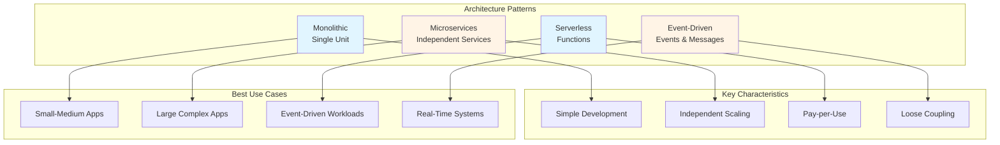

### Who This Guide Is For
- Software architects
- Senior developers
- Technical leads
- Anyone designing systems

---

## Monolithic Architecture

### Characteristics
- Single deployable unit
- Shared codebase
- Shared database
- Simple to develop and deploy

### When to Use
- Small to medium applications
- Team size is small
- Simple requirements
- Fast development needed

### Architecture Diagram

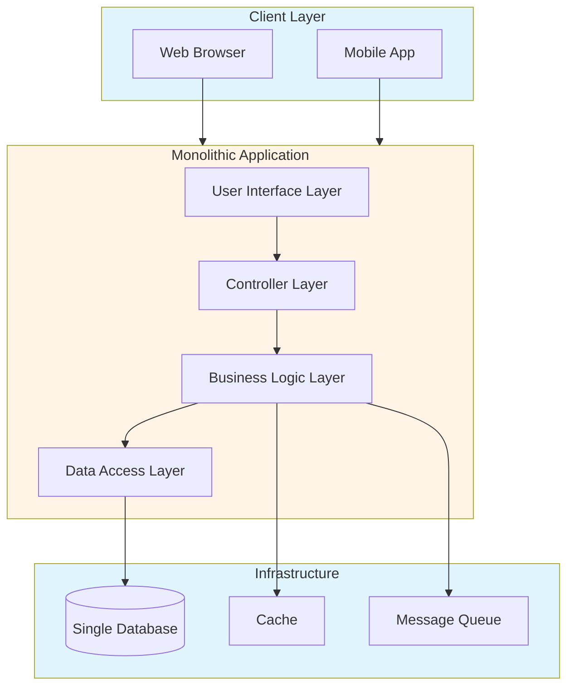

### Monolithic Request Flow

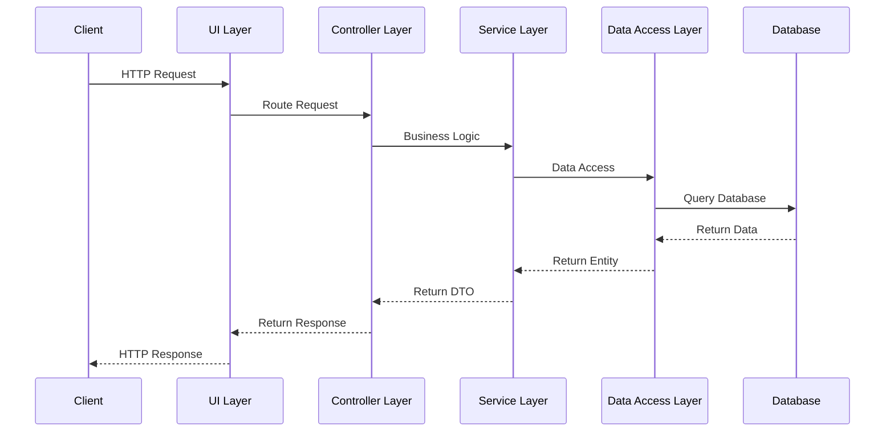

### Example Structure

```
monolith/
├── controllers/
├── services/
├── models/
├── views/
└── database/
```

---

## Microservices Architecture

### Characteristics
- Multiple independent services
- Each service has its own database
- Services communicate via APIs
- Independent deployment

### Architecture Diagram

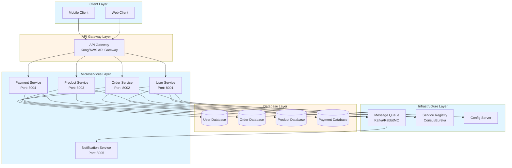

### Microservices Communication Flow

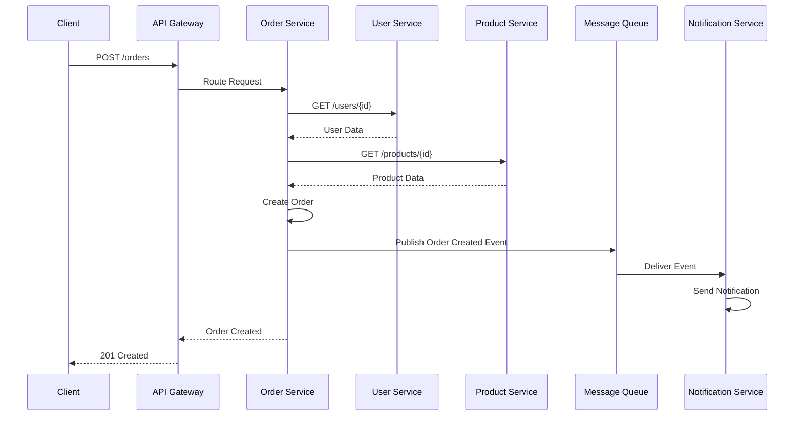

### When to Use
- Large, complex applications
- Multiple teams
- Different scaling requirements
- Technology diversity needed

### Example

```typescript
// User Service
class UserService {
    async getUser(id: number) {
        return await this.userRepository.findById(id);
    }
}

// Order Service
class OrderService {
    async createOrder(userId: number, items: Item[]) {
        // Call User Service
        const user = await userService.getUser(userId);
        // Create order
    }
}
```

---

## Serverless Architecture

### Serverless Architecture Diagram

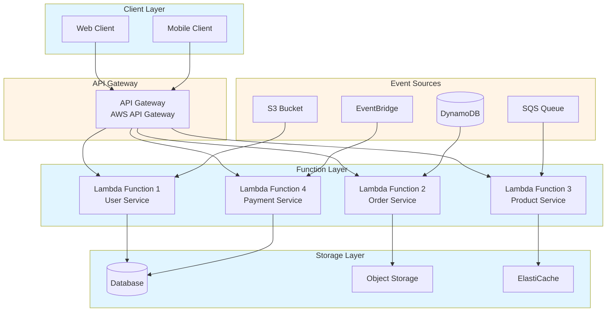

### Serverless Request Flow

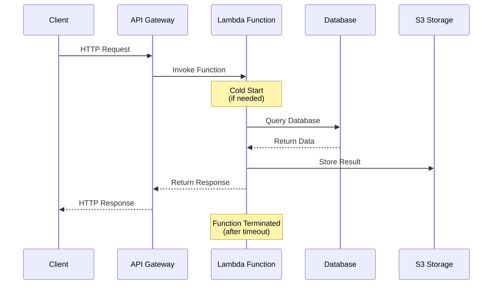

### Characteristics
- Functions as a service
- Pay per execution
- Auto-scaling
- No server management

### When to Use
- Event-driven workloads
- Variable traffic
- Cost optimization
- Rapid development

### Example

```typescript
// AWS Lambda
export const handler = async (event: any) => {
    const { userId } = event;
    const user = await getUser(userId);
    return {
        statusCode: 200,
        body: JSON.stringify(user)
    };
};
```

---

## Event-Driven Architecture

### Event-Driven Architecture Diagram

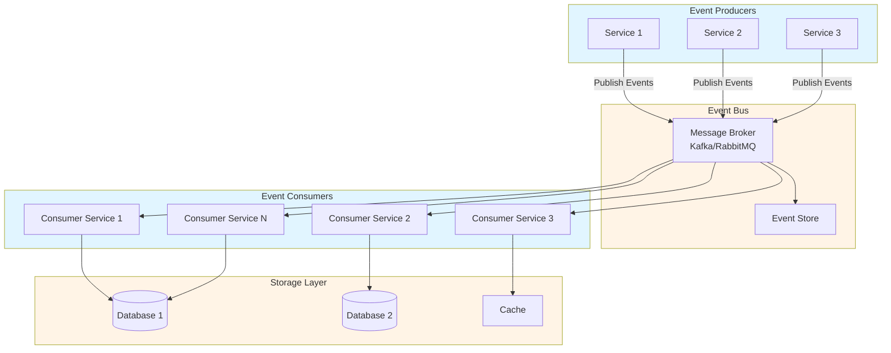

### Event-Driven Flow

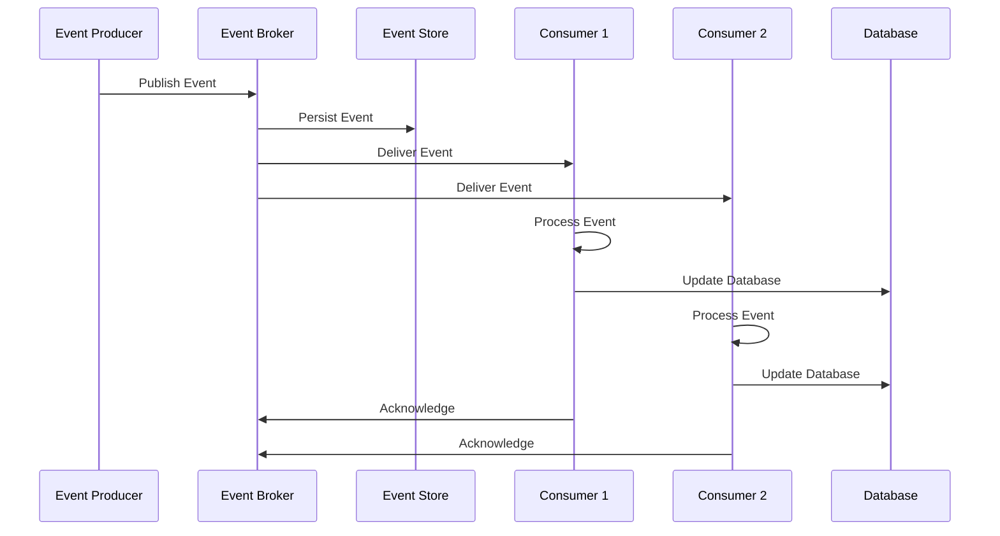

### Characteristics
- Loose coupling
- Event producers and consumers
- Asynchronous communication
- Scalable

### When to Use
- Real-time processing
- High throughput
- Decoupled systems
- Event streaming

### Example

```typescript
// Event producer
eventBus.publish('user.created', {
    userId: 1,
    email: 'user@example.com'
});

// Event consumer
eventBus.subscribe('user.created', async (event) => {
    await sendWelcomeEmail(event.email);
});
```

---

## Layered Architecture

### Layers
1. **Presentation**: UI, controllers
2. **Business**: Business logic
3. **Data Access**: Database operations

### Example

```typescript
// Presentation Layer
class UserController {
    constructor(private userService: UserService) {}
    
    async createUser(req: Request, res: Response) {
        const user = await this.userService.create(req.body);
        res.json(user);
    }
}

// Business Layer
class UserService {
    constructor(private userRepository: UserRepository) {}
    
    async create(data: CreateUserData) {
        // Business logic
        return await this.userRepository.save(data);
    }
}

// Data Access Layer
class UserRepository {
    async save(data: CreateUserData) {
        return await db.users.create(data);
    }
}
```

---

## Hexagonal Architecture

### Ports and Adapters
- **Ports**: Interfaces
- **Adapters**: Implementations

### Example

```typescript
// Port (interface)
interface UserRepository {
    findById(id: number): Promise<User>;
}

// Adapter (implementation)
class PostgreSQLUserRepository implements UserRepository {
    async findById(id: number) {
        return await db.query('SELECT * FROM users WHERE id = $1', [id]);
    }
}

// Domain
class UserService {
    constructor(private userRepository: UserRepository) {}
    
    async getUser(id: number) {
        return await this.userRepository.findById(id);
    }
}
```

---

## Clean Architecture

### Architecture Diagram

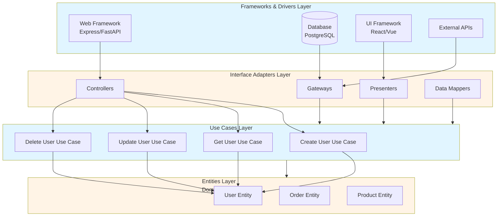

### Clean Architecture Dependency Flow

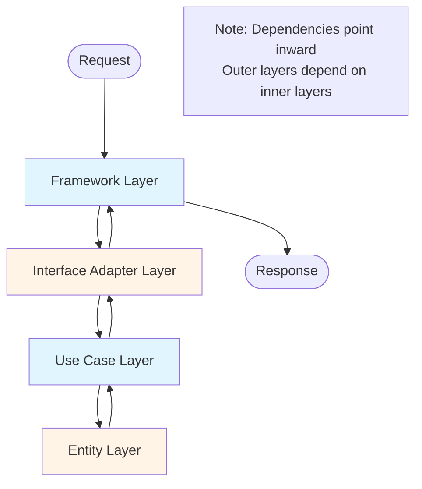

### Layers
1. **Entities**: Business objects
2. **Use Cases**: Application logic
3. **Interface Adapters**: Controllers, presenters
4. **Frameworks**: Database, web framework

### Example

```typescript
// Entity
class User {
    constructor(
        public id: number,
        public name: string,
        public email: string
    ) {}
}

// Use Case
class CreateUserUseCase {
    constructor(private userRepository: UserRepository) {}
    
    async execute(data: CreateUserData): Promise<User> {
        const user = new User(0, data.name, data.email);
        return await this.userRepository.save(user);
    }
}

// Interface Adapter
class UserController {
    constructor(private createUserUseCase: CreateUserUseCase) {}
    
    async create(req: Request, res: Response) {
        const user = await this.createUserUseCase.execute(req.body);
        res.json(user);
    }
}
```

---

## Domain-Driven Design (DDD)

### DDD Context Map

```mermaid
graph TB
    subgraph BC1[Bounded Context: Order Management]
        OrderAggregate[Order Aggregate]
        OrderEntity[Order Entity]
        OrderVO[Order Value Objects]
        OrderRepo[Order Repository]
    end
    
    subgraph BC2[Bounded Context: Inventory]
        InventoryAggregate[Inventory Aggregate]
        ProductEntity[Product Entity]
        StockVO[Stock Value Objects]
        InventoryRepo[Inventory Repository]
    end
    
    subgraph BC3[Bounded Context: Payment]
        PaymentAggregate[Payment Aggregate]
        PaymentEntity[Payment Entity]
        PaymentVO[Payment Value Objects]
        PaymentRepo[Payment Repository]
    end
    
    subgraph BC4[Bounded Context: Shipping]
        ShippingAggregate[Shipping Aggregate]
        ShipmentEntity[Shipment Entity]
        AddressVO[Address Value Objects]
        ShippingRepo[Shipping Repository]
    end
    
    OrderAggregate -->|Published Events| EventBus[Domain Events]
    InventoryAggregate -->|Published Events| EventBus
    PaymentAggregate -->|Published Events| EventBus
    ShippingAggregate -->|Published Events| EventBus
    
    EventBus -->|Consume Events| OrderAggregate
    EventBus -->|Consume Events| InventoryAggregate
    EventBus -->|Consume Events| PaymentAggregate
    EventBus -->|Consume Events| ShippingAggregate
    
    OrderAggregate -.->|Anti-Corruption Layer| InventoryAggregate
    OrderAggregate -.->|Anti-Corruption Layer| PaymentAggregate
    OrderAggregate -.->|Anti-Corruption Layer| ShippingAggregate
    
    style BC1 fill:#e1f5ff
    style BC2 fill:#fff4e6
    style BC3 fill:#e1f5ff
    style BC4 fill:#fff4e6
    style EventBus fill:#ffcccc
```

### DDD Aggregate Structure

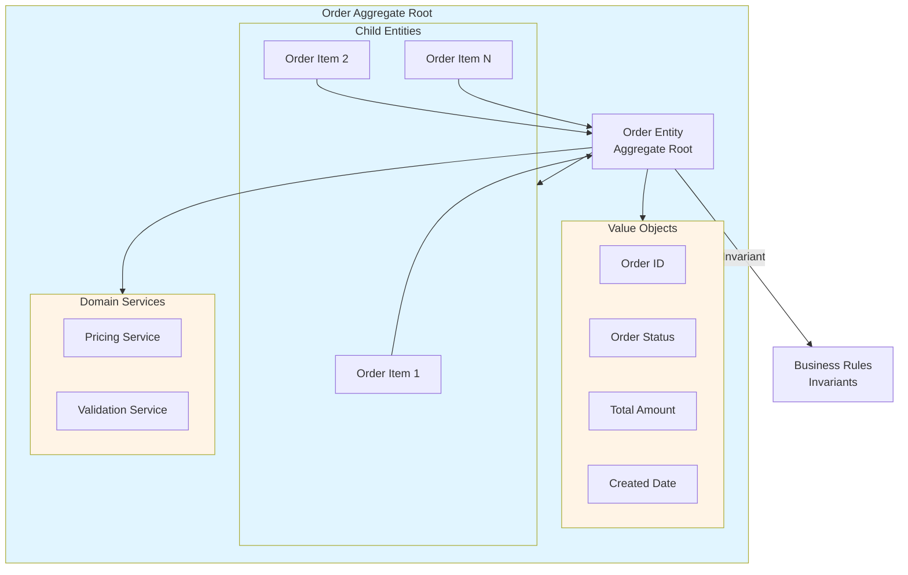

### DDD Layered Architecture

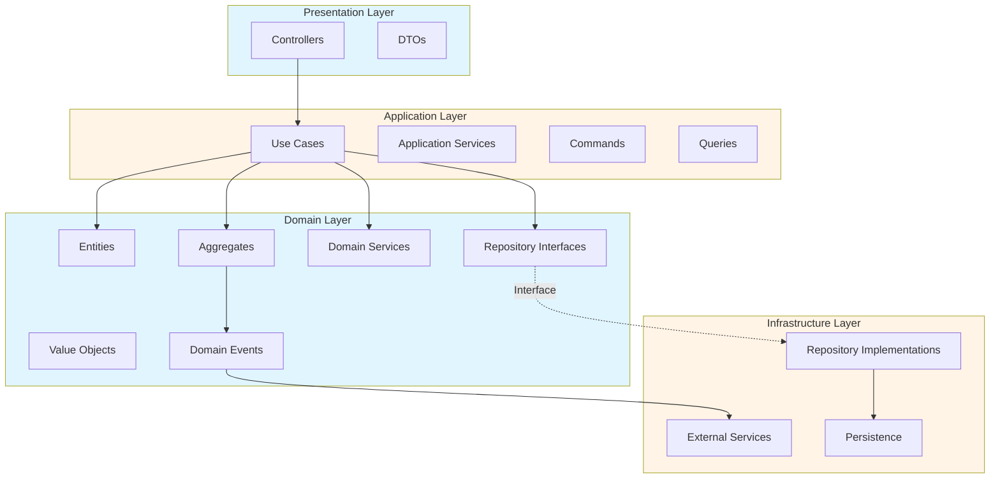

### Concepts
- **Entities**: Objects with identity
- **Value Objects**: Immutable objects
- **Aggregates**: Cluster of entities
- **Repositories**: Data access
- **Domain Services**: Domain logic

### Example

```typescript
// Entity
class User {
    constructor(
        private id: UserId,
        private name: UserName,
        private email: Email
    ) {}
    
    changeEmail(newEmail: Email) {
        this.email = newEmail;
    }
}

// Value Object
class Email {
    constructor(private value: string) {
        if (!this.isValid(value)) {
            throw new Error('Invalid email');
        }
    }
    
    private isValid(email: string): boolean {
        return /^[^\s@]+@[^\s@]+\.[^\s@]+$/.test(email);
    }
}
```

---

## CQRS (Command Query Responsibility Segregation)

### CQRS Architecture Diagram

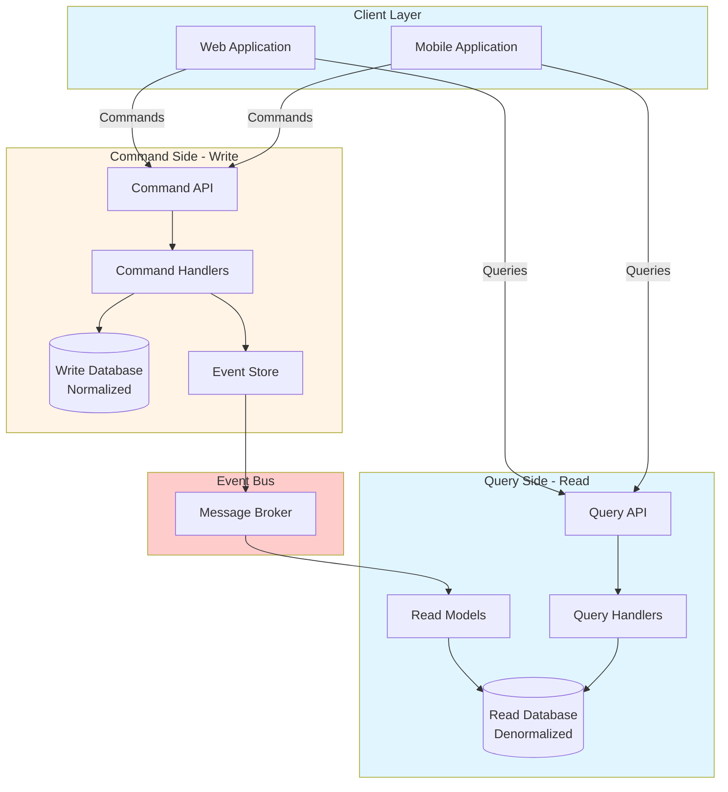

### CQRS Flow

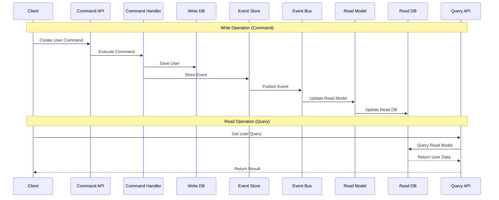

### CQRS with Event Sourcing

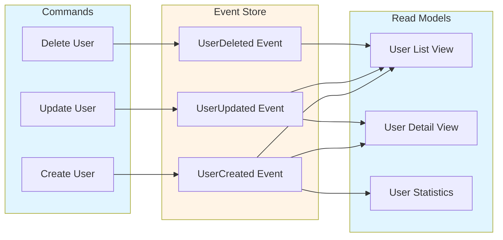

### Separation
- **Commands**: Write operations
- **Queries**: Read operations

### Example

```typescript
// Command
class CreateUserCommand {
    constructor(private userRepository: UserRepository) {}
    
    async execute(data: CreateUserData): Promise<void> {
        await this.userRepository.save(data);
    }
}

// Query
class GetUserQuery {
    constructor(private userRepository: UserRepository) {}
    
    async execute(id: number): Promise<User> {
        return await this.userRepository.findById(id);
    }
}
```

---

## Event Sourcing

### Event Sourcing Architecture

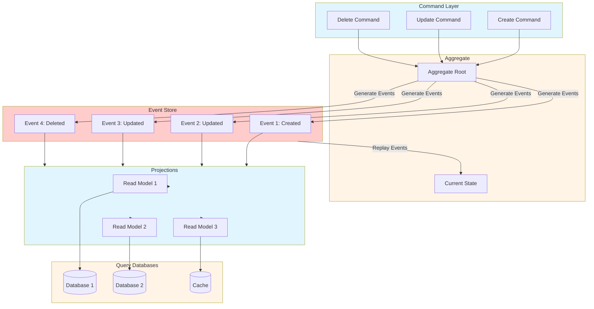

### Event Sourcing Flow

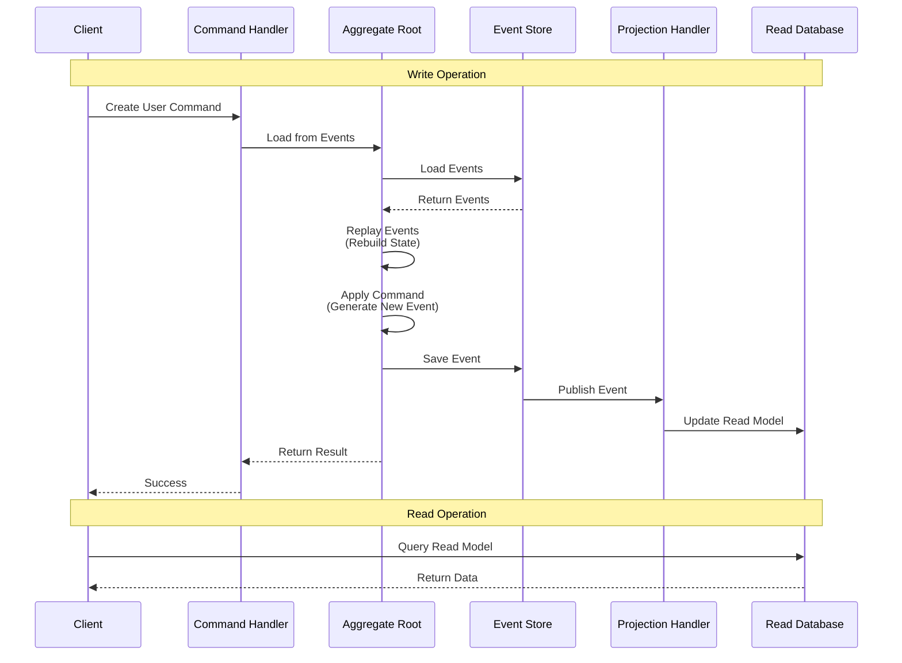

### Event Store Structure

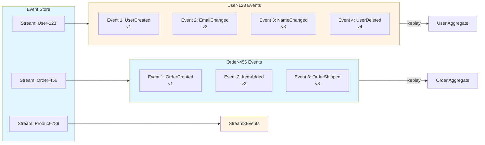

### Event Sourcing with Snapshots

```mermaid
graph TB
    subgraph EventStore[Event Store]
        Events[Events 1-1000]
        Snapshot[Snapshot at Event 1000]
        NewEvents[Events 1001-1500]
    end
    
    subgraph Aggregate[Aggregate]
        LoadSnapshot[Load Snapshot]
        ReplayEvents[Replay Events 1001-1500]
        CurrentState[Current State]
    end
    
    Events --> Snapshot
    Snapshot --> LoadSnapshot
    LoadSnapshot --> ReplayEvents
    NewEvents --> ReplayEvents
    ReplayEvents --> CurrentState
    
    CurrentState -->|Generate New Event| NewEvent[Event 1501]
    NewEvent --> EventStore
    
    style EventStore fill:#e1f5ff
    style Aggregate fill:#fff4e6
```

### Characteristics
- **Events as Source of Truth**: Store events instead of current state
- **Event Replay**: Rebuild state by replaying events
- **Audit Trail**: Complete history of all changes
- **Time Travel**: Query state at any point in time

### When to Use
- Audit requirements
- Complex business logic
- Event replay needs
- Temporal queries
- CQRS implementations

### Example

```typescript
// Event
interface UserCreatedEvent {
    type: 'UserCreated';
    userId: string;
    email: string;
    timestamp: Date;
}

// Aggregate
class User {
    private events: Event[] = [];
    
    static fromEvents(events: Event[]): User {
        const user = new User();
        events.forEach(event => user.apply(event));
        return user;
    }
    
    create(email: string) {
        const event = new UserCreatedEvent(email);
        this.apply(event);
        this.events.push(event);
    }
    
    private apply(event: Event) {
        // Apply event to rebuild state
        if (event.type === 'UserCreated') {
            this.email = event.email;
        }
    }
    
    getUncommittedEvents(): Event[] {
        return this.events;
    }
}
```

---

## API Gateway Pattern

### API Gateway Architecture

```mermaid
graph TB
    subgraph Clients[Client Layer]
        Web[Web Client]
        Mobile[Mobile Client]
        Desktop[Desktop Client]
    end
    
    subgraph Gateway[API Gateway]
        Auth[Authentication]
        RateLimit[Rate Limiting]
        Routing[Request Routing]
        LoadBalancer[Load Balancing]
        Transform[Request/Response<br/>Transformation]
        Caching[Response Caching]
        Monitoring[Monitoring & Logging]
    end
    
    subgraph Services[Microservices]
        UserService[User Service]
        OrderService[Order Service]
        ProductService[Product Service]
        PaymentService[Payment Service]
        InventoryService[Inventory Service]
    end
    
    subgraph Backend[Backend Services]
        UserDB[(User DB)]
        OrderDB[(Order DB)]
        ProductDB[(Product DB)]
        PaymentDB[(Payment DB)]
    end
    
    Web --> Gateway
    Mobile --> Gateway
    Desktop --> Gateway
    
    Gateway --> Auth
    Auth --> RateLimit
    RateLimit --> Routing
    Routing --> LoadBalancer
    LoadBalancer --> Transform
    Transform --> Caching
    
    Caching --> UserService
    Caching --> OrderService
    Caching --> ProductService
    Caching --> PaymentService
    Caching --> InventoryService
    
    UserService --> UserDB
    OrderService --> OrderDB
    ProductService --> ProductDB
    PaymentService --> PaymentDB
    InventoryService --> ProductDB
    
    Gateway --> Monitoring
    
    style Clients fill:#e1f5ff
    style Gateway fill:#fff4e6
    style Services fill:#e1f5ff
    style Backend fill:#fff4e6
```

### API Gateway Request Flow

```mermaid
sequenceDiagram
    participant Client
    participant Gateway as API Gateway
    participant Auth as Auth Service
    participant RateLimit as Rate Limiter
    participant Service as Microservice
    participant DB as Database
    
    Client->>Gateway: HTTP Request
    Gateway->>Auth: Authenticate Request
    Auth-->>Gateway: Token Valid
    Gateway->>RateLimit: Check Rate Limit
    RateLimit-->>Gateway: Within Limit
    Gateway->>Gateway: Route to Service
    Gateway->>Service: Forward Request
    Service->>DB: Query Database
    DB-->>Service: Return Data
    Service-->>Gateway: Response
    Gateway->>Gateway: Transform Response
    Gateway->>Gateway: Cache Response
    Gateway-->>Client: HTTP Response
```

### API Gateway Features

```mermaid
graph LR
    subgraph Features[API Gateway Features]
        Auth[Authentication<br/>& Authorization]
        RateLimit[Rate Limiting]
        Routing[Request Routing]
        LoadBalance[Load Balancing]
        Transform[Request/Response<br/>Transformation]
        Cache[Response Caching]
        Monitor[Monitoring &<br/>Analytics]
        Version[API Versioning]
        Circuit[Circuit Breaker]
        Retry[Retry Logic]
    end
    
    style Features fill:#e1f5ff
    style Auth fill:#fff4e6
    style RateLimit fill:#e1f5ff
    style Routing fill:#fff4e6
    style LoadBalance fill:#e1f5ff
    style Transform fill:#fff4e6
    style Cache fill:#e1f5ff
    style Monitor fill:#fff4e6
    style Version fill:#e1f5ff
    style Circuit fill:#fff4e6
    style Retry fill:#e1f5ff
```

### Characteristics
- **Single Entry Point**: All client requests go through gateway
- **Cross-Cutting Concerns**: Authentication, rate limiting, logging
- **Service Aggregation**: Combine multiple service responses
- **Protocol Translation**: HTTP to gRPC, WebSocket, etc.

### When to Use
- Microservices architecture
- Multiple client types
- Need for centralized security
- Service aggregation requirements

### Example

```typescript
// API Gateway Configuration
const gateway = new APIGateway({
    routes: [
        {
            path: '/api/users/*',
            service: 'user-service',
            authentication: true,
            rateLimit: { requests: 100, window: '1m' }
        },
        {
            path: '/api/orders/*',
            service: 'order-service',
            authentication: true,
            rateLimit: { requests: 50, window: '1m' }
        }
    ]
});
```

---

## Service Mesh

### Service Mesh Architecture

```mermaid
graph TB
    subgraph Clients[Client Applications]
        Client1[Client 1]
        Client2[Client 2]
    end
    
    subgraph Gateway[Ingress Gateway]
        Ingress[Ingress Controller]
    end
    
    subgraph Services[Microservices]
        Service1[Service 1<br/>+ Sidecar Proxy]
        Service2[Service 2<br/>+ Sidecar Proxy]
        Service3[Service 3<br/>+ Sidecar Proxy]
        Service4[Service 4<br/>+ Sidecar Proxy]
    end
    
    subgraph ControlPlane[Control Plane]
        Config[Configuration]
        Security[Security Policies]
        Traffic[Traffic Management]
        Observability[Observability]
    end
    
    subgraph DataPlane[Data Plane]
        Sidecar1[Sidecar Proxy 1]
        Sidecar2[Sidecar Proxy 2]
        Sidecar3[Sidecar Proxy 3]
        Sidecar4[Sidecar Proxy 4]
    end
    
    Client1 --> Ingress
    Client2 --> Ingress
    
    Ingress --> Service1
    Ingress --> Service2
    
    Service1 --> Service3
    Service2 --> Service4
    Service3 --> Service4
    
    Service1 -.->|Managed by| Sidecar1
    Service2 -.->|Managed by| Sidecar2
    Service3 -.->|Managed by| Sidecar3
    Service4 -.->|Managed by| Sidecar4
    
    ControlPlane --> Sidecar1
    ControlPlane --> Sidecar2
    ControlPlane --> Sidecar3
    ControlPlane --> Sidecar4
    
    style Clients fill:#e1f5ff
    style Gateway fill:#fff4e6
    style Services fill:#e1f5ff
    style ControlPlane fill:#ffcccc
    style DataPlane fill:#fff4e6
```

### Service Mesh Communication Flow

```mermaid
sequenceDiagram
    participant Service1 as Service 1
    participant Sidecar1 as Sidecar Proxy 1
    participant Sidecar2 as Sidecar Proxy 2
    participant Service2 as Service 2
    participant ControlPlane as Control Plane
    
    Note over Service1,ControlPlane: Service-to-Service Communication
    Service1->>Sidecar1: Outbound Request
    Sidecar1->>ControlPlane: Get Service Discovery
    ControlPlane-->>Sidecar1: Service 2 Location
    Sidecar1->>Sidecar1: Apply Policies<br/>(Auth, Rate Limit)
    Sidecar1->>Sidecar2: Forward Request<br/>(mTLS)
    Sidecar2->>Sidecar2: Validate Request<br/>(Auth, Policies)
    Sidecar2->>Service2: Forward to Service
    Service2-->>Sidecar2: Response
    Sidecar2->>Sidecar2: Apply Policies
    Sidecar2->>Sidecar1: Return Response<br/>(mTLS)
    Sidecar1->>Sidecar1: Log Metrics
    Sidecar1-->>Service1: Return Response
    Sidecar1->>ControlPlane: Report Metrics
```

### Service Mesh Components

```mermaid
graph TB
    subgraph ControlPlane[Control Plane]
        ConfigManager[Configuration Manager]
        ServiceDiscovery[Service Discovery]
        SecurityManager[Security Manager]
        TrafficManager[Traffic Manager]
        PolicyManager[Policy Manager]
    end
    
    subgraph DataPlane[Data Plane - Sidecar Proxies]
        Proxy1[Envoy/Istio Proxy]
        Proxy2[Envoy/Istio Proxy]
        Proxy3[Envoy/Istio Proxy]
    end
    
    subgraph Features[Service Mesh Features]
        mTLS[mTLS Encryption]
        LoadBalance[Load Balancing]
        CircuitBreaker[Circuit Breaker]
        Retry[Retry Logic]
        Timeout[Timeout Management]
        Tracing[Distributed Tracing]
        Metrics[Metrics Collection]
        Logging[Logging]
    end
    
    ControlPlane --> Proxy1
    ControlPlane --> Proxy2
    ControlPlane --> Proxy3
    
    Proxy1 --> Features
    Proxy2 --> Features
    Proxy3 --> Features
    
    style ControlPlane fill:#e1f5ff
    style DataPlane fill:#fff4e6
    style Features fill:#ffcccc
```

### Service Mesh Benefits

```mermaid
mindmap
    root((Service Mesh))
        Security
            mTLS Encryption
            Authentication
            Authorization
            Policy Enforcement
        Observability
            Distributed Tracing
            Metrics Collection
            Logging
            Health Monitoring
        Traffic Management
            Load Balancing
            Circuit Breaking
            Retry Logic
            Timeout Management
            A/B Testing
        Resilience
            Fault Injection
            Chaos Engineering
            Health Checks
            Auto Recovery
```

### Characteristics
- **Sidecar Pattern**: Proxy runs alongside each service
- **Transparent**: Services don't need to know about mesh
- **Control Plane**: Centralized configuration and management
- **Data Plane**: Handles actual service-to-service communication

### When to Use
- Microservices architecture
- Need for service-to-service security
- Complex traffic management
- Observability requirements
- Multi-cloud deployments

### Example

```yaml
# Istio Service Mesh Configuration
apiVersion: networking.istio.io/v1alpha3
kind: VirtualService
metadata:
  name: user-service
spec:
  hosts:
  - user-service
  http:
  - match:
    - headers:
        version:
          exact: v2
    route:
    - destination:
        host: user-service
        subset: v2
  - route:
    - destination:
        host: user-service
        subset: v1
      weight: 90
    - destination:
        host: user-service
        subset: v2
      weight: 10
```

---

## When to Use Which Architecture

### Monolithic
- Small to medium apps
- Simple requirements
- Small team

### Microservices
- Large, complex apps
- Multiple teams
- Different scaling needs

### Serverless
- Event-driven
- Variable traffic
- Cost optimization

### Event-Driven
- Real-time processing
- High throughput
- Decoupled systems

---

## Common Pitfalls

### 1. Over-Engineering

```typescript
// BAD: Microservices for simple app
// 10 services for a blog application

// GOOD: Start simple
// Monolith first, extract services when needed
```

### 2. Wrong Architecture Choice

```typescript
// BAD: Using microservices for small team
// Complex setup, no benefits

// GOOD: Match architecture to needs
// Small team = monolith
// Large team = microservices
```

### 3. Tight Coupling

```typescript
// BAD: Direct dependencies
class OrderService {
    private userService = new UserService(); // Tight coupling
}

// GOOD: Dependency injection
class OrderService {
    constructor(private userService: UserService) {} // Loose coupling
}
```

---

## Best Practices

### Architecture Best Practices

1. **Start Simple**
   - Begin with monolith
   - Extract when needed
   - Don't over-engineer

2. **Choose Based on Context**
   - Team size
   - Project complexity
   - Scaling needs

3. **Design for Change**
   - Loose coupling
   - High cohesion
   - Clear boundaries

4. **Document Decisions**
   - Architecture Decision Records (ADRs)
   - Document trade-offs
   - Keep updated

---

## Real-World Examples

### Example 1: E-Commerce System Architecture

```mermaid
graph TB
    Client[Web/Mobile Client] --> Gateway[API Gateway]
    
    Gateway --> AuthService[Auth Service]
    Gateway --> ProductService[Product Service]
    Gateway --> OrderService[Order Service]
    Gateway --> PaymentService[Payment Service]
    
    ProductService --> ProductDB[(Product DB)]
    OrderService --> OrderDB[(Order DB)]
    PaymentService --> PaymentDB[(Payment DB)]
    
    OrderService --> MessageQueue[Message Queue]
    MessageQueue --> NotificationService[Notification Service]
    MessageQueue --> InventoryService[Inventory Service]
    
    PaymentService --> ExternalPayment[External Payment Gateway]
```

### Example 2: Clean Architecture Implementation

```typescript
// Domain layer (entities)
class User {
    constructor(
        private id: UserId,
        private email: Email,
        private name: UserName
    ) {}
    
    changeEmail(newEmail: Email) {
        this.email = newEmail;
    }
}

// Application layer (use cases)
class CreateUserUseCase {
    constructor(
        private userRepository: UserRepository,
        private emailService: EmailService
    ) {}
    
    async execute(data: CreateUserData): Promise<User> {
        const user = new User(
            UserId.generate(),
            new Email(data.email),
            new UserName(data.name)
        );
        
        await this.userRepository.save(user);
        await this.emailService.sendWelcomeEmail(user.email);
        
        return user;
    }
}

// Infrastructure layer (adapters)
class PostgreSQLUserRepository implements UserRepository {
    async save(user: User): Promise<void> {
        await db.users.create({
            id: user.id.value,
            email: user.email.value,
            name: user.name.value
        });
    }
}
```

---

## Resources

- [Martin Fowler's Architecture Patterns](https://martinfowler.com/architecture/)
- [Clean Architecture by Robert C. Martin](https://blog.cleancoder.com/uncle-bob/2012/08/13/the-clean-architecture.html)

---

## Summary

Key architecture patterns:

1. **Monolithic**: Simple, single deployable unit
2. **Microservices**: Independent, scalable services
3. **Serverless**: Functions as a service
4. **Event-Driven**: Asynchronous, decoupled
5. **Layered**: Separation of concerns
6. **Hexagonal**: Ports and adapters
7. **Clean**: Dependency inversion
8. **DDD**: Domain-focused design
9. **CQRS**: Separate reads and writes
10. **Event Sourcing**: Events as source of truth
11. **API Gateway**: Single entry point for clients
12. **Service Mesh**: Service-to-service communication layer

### Architecture Pattern Comparison Matrix

```mermaid
graph TB
    subgraph Comparison[Architecture Pattern Comparison]
        Monolithic[Monolithic<br/>✅ Simple<br/>✅ Single Deploy<br/>❌ Limited Scale]
        Microservices[Microservices<br/>✅ Independent Scale<br/>✅ Team Autonomy<br/>❌ Complexity]
        Serverless[Serverless<br/>✅ Auto Scale<br/>✅ Cost Effective<br/>❌ Cold Start]
        EventDriven[Event-Driven<br/>✅ Decoupled<br/>✅ Real-time<br/>❌ Eventual Consistency]
        Clean[Clean Architecture<br/>✅ Testable<br/>✅ Maintainable<br/>❌ Overhead]
        DDD[DDD<br/>✅ Domain Focus<br/>✅ Rich Model<br/>❌ Learning Curve]
        CQRS[CQRS<br/>✅ Scale Reads/Writes<br/>✅ Optimized<br/>❌ Complexity]
        EventSourcing[Event Sourcing<br/>✅ Audit Trail<br/>✅ Time Travel<br/>❌ Storage]
    end
    
    style Monolithic fill:#e1f5ff
    style Microservices fill:#fff4e6
    style Serverless fill:#e1f5ff
    style EventDriven fill:#fff4e6
    style Clean fill:#e1f5ff
    style DDD fill:#fff4e6
    style CQRS fill:#e1f5ff
    style EventSourcing fill:#fff4e6
```

Choose the right architecture based on your requirements.

