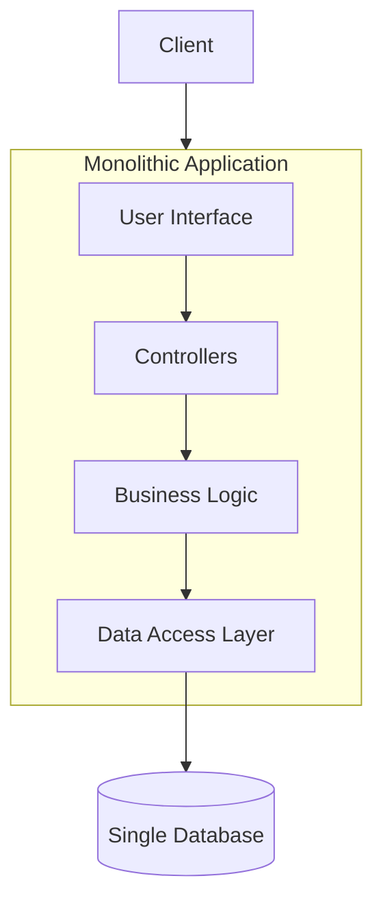
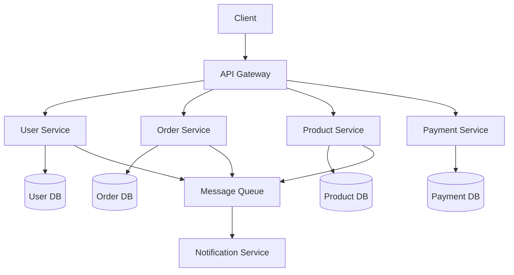
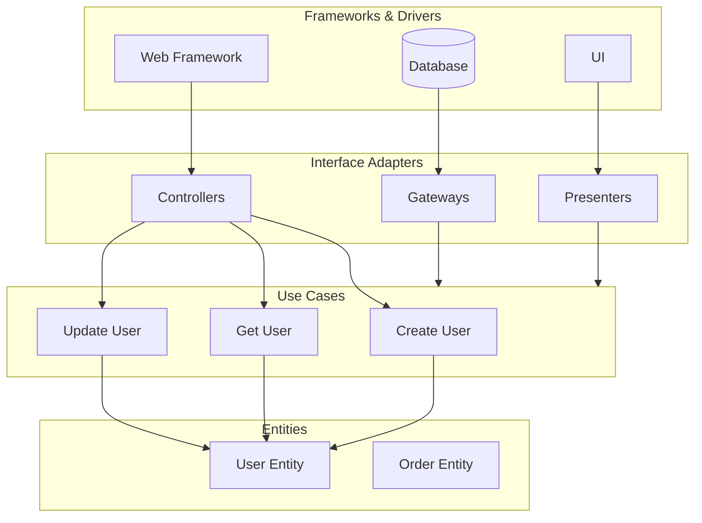
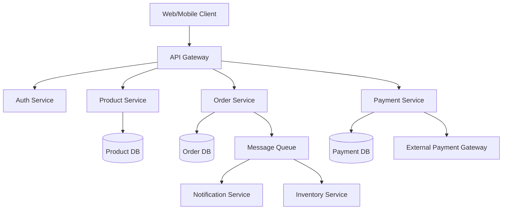

# Architecture Patterns Guide - Comprehensive

## Table of Contents
1. [Introduction](#introduction)
2. [Monolithic Architecture](#monolithic-architecture)
3. [Microservices Architecture](#microservices-architecture)
4. [Serverless Architecture](#serverless-architecture)
5. [Event-Driven Architecture](#event-driven-architecture)
6. [Layered Architecture](#layered-architecture)
7. [Hexagonal Architecture](#hexagonal-architecture)
8. [Clean Architecture](#clean-architecture)
9. [Domain-Driven Design (DDD)](#domain-driven-design-ddd)
10. [CQRS](#cqrs)
11. [Event Sourcing](#event-sourcing)
12. [API Gateway Pattern](#api-gateway-pattern)
13. [Service Mesh](#service-mesh)
14. [When to Use Which Architecture](#when-to-use-which-architecture)
15. [Resources](#resources)
16. [Summary](#summary)

---

## Introduction

This guide covers various software architecture patterns and when to use them. Learn to choose the right architecture for your project.

### Who This Guide Is For
- Software architects
- Senior developers
- Technical leads
- Anyone designing systems

---

## Monolithic Architecture

### Characteristics
- Single deployable unit
- Shared codebase
- Shared database
- Simple to develop and deploy

### When to Use
- Small to medium applications
- Team size is small
- Simple requirements
- Fast development needed

### Architecture Diagram



### Example Structure

```
monolith/
├── controllers/
├── services/
├── models/
├── views/
└── database/
```

---

## Microservices Architecture

### Characteristics
- Multiple independent services
- Each service has its own database
- Services communicate via APIs
- Independent deployment

### Architecture Diagram



### When to Use
- Large, complex applications
- Multiple teams
- Different scaling requirements
- Technology diversity needed

### Example

```typescript
// User Service
class UserService {
    async getUser(id: number) {
        return await this.userRepository.findById(id);
    }
}

// Order Service
class OrderService {
    async createOrder(userId: number, items: Item[]) {
        // Call User Service
        const user = await userService.getUser(userId);
        // Create order
    }
}
```

---

## Serverless Architecture

### Characteristics
- Functions as a service
- Pay per execution
- Auto-scaling
- No server management

### When to Use
- Event-driven workloads
- Variable traffic
- Cost optimization
- Rapid development

### Example

```typescript
// AWS Lambda
export const handler = async (event: any) => {
    const { userId } = event;
    const user = await getUser(userId);
    return {
        statusCode: 200,
        body: JSON.stringify(user)
    };
};
```

---

## Event-Driven Architecture

### Characteristics
- Loose coupling
- Event producers and consumers
- Asynchronous communication
- Scalable

### When to Use
- Real-time processing
- High throughput
- Decoupled systems
- Event streaming

### Example

```typescript
// Event producer
eventBus.publish('user.created', {
    userId: 1,
    email: 'user@example.com'
});

// Event consumer
eventBus.subscribe('user.created', async (event) => {
    await sendWelcomeEmail(event.email);
});
```

---

## Layered Architecture

### Layers
1. **Presentation**: UI, controllers
2. **Business**: Business logic
3. **Data Access**: Database operations

### Example

```typescript
// Presentation Layer
class UserController {
    constructor(private userService: UserService) {}
    
    async createUser(req: Request, res: Response) {
        const user = await this.userService.create(req.body);
        res.json(user);
    }
}

// Business Layer
class UserService {
    constructor(private userRepository: UserRepository) {}
    
    async create(data: CreateUserData) {
        // Business logic
        return await this.userRepository.save(data);
    }
}

// Data Access Layer
class UserRepository {
    async save(data: CreateUserData) {
        return await db.users.create(data);
    }
}
```

---

## Hexagonal Architecture

### Ports and Adapters
- **Ports**: Interfaces
- **Adapters**: Implementations

### Example

```typescript
// Port (interface)
interface UserRepository {
    findById(id: number): Promise<User>;
}

// Adapter (implementation)
class PostgreSQLUserRepository implements UserRepository {
    async findById(id: number) {
        return await db.query('SELECT * FROM users WHERE id = $1', [id]);
    }
}

// Domain
class UserService {
    constructor(private userRepository: UserRepository) {}
    
    async getUser(id: number) {
        return await this.userRepository.findById(id);
    }
}
```

---

## Clean Architecture

### Architecture Diagram



### Layers
1. **Entities**: Business objects
2. **Use Cases**: Application logic
3. **Interface Adapters**: Controllers, presenters
4. **Frameworks**: Database, web framework

### Example

```typescript
// Entity
class User {
    constructor(
        public id: number,
        public name: string,
        public email: string
    ) {}
}

// Use Case
class CreateUserUseCase {
    constructor(private userRepository: UserRepository) {}
    
    async execute(data: CreateUserData): Promise<User> {
        const user = new User(0, data.name, data.email);
        return await this.userRepository.save(user);
    }
}

// Interface Adapter
class UserController {
    constructor(private createUserUseCase: CreateUserUseCase) {}
    
    async create(req: Request, res: Response) {
        const user = await this.createUserUseCase.execute(req.body);
        res.json(user);
    }
}
```

---

## Domain-Driven Design (DDD)

### Concepts
- **Entities**: Objects with identity
- **Value Objects**: Immutable objects
- **Aggregates**: Cluster of entities
- **Repositories**: Data access
- **Domain Services**: Domain logic

### Example

```typescript
// Entity
class User {
    constructor(
        private id: UserId,
        private name: UserName,
        private email: Email
    ) {}
    
    changeEmail(newEmail: Email) {
        this.email = newEmail;
    }
}

// Value Object
class Email {
    constructor(private value: string) {
        if (!this.isValid(value)) {
            throw new Error('Invalid email');
        }
    }
    
    private isValid(email: string): boolean {
        return /^[^\s@]+@[^\s@]+\.[^\s@]+$/.test(email);
    }
}
```

---

## CQRS (Command Query Responsibility Segregation)

### Separation
- **Commands**: Write operations
- **Queries**: Read operations

### Example

```typescript
// Command
class CreateUserCommand {
    constructor(private userRepository: UserRepository) {}
    
    async execute(data: CreateUserData): Promise<void> {
        await this.userRepository.save(data);
    }
}

// Query
class GetUserQuery {
    constructor(private userRepository: UserRepository) {}
    
    async execute(id: number): Promise<User> {
        return await this.userRepository.findById(id);
    }
}
```

---

## When to Use Which Architecture

### Monolithic
- Small to medium apps
- Simple requirements
- Small team

### Microservices
- Large, complex apps
- Multiple teams
- Different scaling needs

### Serverless
- Event-driven
- Variable traffic
- Cost optimization

### Event-Driven
- Real-time processing
- High throughput
- Decoupled systems

---

## Common Pitfalls

### 1. Over-Engineering

```typescript
// BAD: Microservices for simple app
// 10 services for a blog application

// GOOD: Start simple
// Monolith first, extract services when needed
```

### 2. Wrong Architecture Choice

```typescript
// BAD: Using microservices for small team
// Complex setup, no benefits

// GOOD: Match architecture to needs
// Small team = monolith
// Large team = microservices
```

### 3. Tight Coupling

```typescript
// BAD: Direct dependencies
class OrderService {
    private userService = new UserService(); // Tight coupling
}

// GOOD: Dependency injection
class OrderService {
    constructor(private userService: UserService) {} // Loose coupling
}
```

---

## Best Practices

### Architecture Best Practices

1. **Start Simple**
   - Begin with monolith
   - Extract when needed
   - Don't over-engineer

2. **Choose Based on Context**
   - Team size
   - Project complexity
   - Scaling needs

3. **Design for Change**
   - Loose coupling
   - High cohesion
   - Clear boundaries

4. **Document Decisions**
   - Architecture Decision Records (ADRs)
   - Document trade-offs
   - Keep updated

---

## Real-World Examples

### Example 1: E-Commerce System Architecture



### Example 2: Clean Architecture Implementation

```typescript
// Domain layer (entities)
class User {
    constructor(
        private id: UserId,
        private email: Email,
        private name: UserName
    ) {}
    
    changeEmail(newEmail: Email) {
        this.email = newEmail;
    }
}

// Application layer (use cases)
class CreateUserUseCase {
    constructor(
        private userRepository: UserRepository,
        private emailService: EmailService
    ) {}
    
    async execute(data: CreateUserData): Promise<User> {
        const user = new User(
            UserId.generate(),
            new Email(data.email),
            new UserName(data.name)
        );
        
        await this.userRepository.save(user);
        await this.emailService.sendWelcomeEmail(user.email);
        
        return user;
    }
}

// Infrastructure layer (adapters)
class PostgreSQLUserRepository implements UserRepository {
    async save(user: User): Promise<void> {
        await db.users.create({
            id: user.id.value,
            email: user.email.value,
            name: user.name.value
        });
    }
}
```

---

## Resources

- [Martin Fowler's Architecture Patterns](https://martinfowler.com/architecture/)
- [Clean Architecture by Robert C. Martin](https://blog.cleancoder.com/uncle-bob/2012/08/13/the-clean-architecture.html)

---

## Summary

Key architecture patterns:

1. **Monolithic**: Simple, single deployable unit
2. **Microservices**: Independent, scalable services
3. **Serverless**: Functions as a service
4. **Event-Driven**: Asynchronous, decoupled
5. **Layered**: Separation of concerns
6. **Hexagonal**: Ports and adapters
7. **Clean**: Dependency inversion
8. **DDD**: Domain-focused design
9. **CQRS**: Separate reads and writes

Choose the right architecture based on your requirements.

