# Database Design & Optimization Guide - Comprehensive

## Table of Contents
1. [Introduction](#introduction)
2. [Database Fundamentals](#database-fundamentals)
3. [Normalization](#normalization)
4. [Denormalization Strategies](#denormalization-strategies)
5. [Indexing Strategies](#indexing-strategies)
6. [Query Optimization](#query-optimization)
7. [Transaction Management](#transaction-management)
8. [Database Design Patterns](#database-design-patterns)
9. [Scaling Strategies](#scaling-strategies)
10. [Performance Tuning](#performance-tuning)
11. [Backup and Recovery](#backup-and-recovery)
12. [SQL and NoSQL Best Practices](#sql-and-nosql-best-practices)
13. [Resources](#resources)
14. [Summary](#summary)

---

## Introduction

This guide covers database design principles, optimization techniques, and best practices for both SQL and NoSQL databases. Master these concepts to build scalable, performant data storage solutions.

### Database Design Process

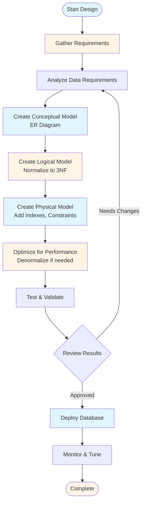
```mermaid
flowchart TD
    Start([Start Design]) --> Requirements[Gather Requirements]
    Requirements --> Analyze[Analyze Data Requirements]
    Analyze --> Conceptual[Create Conceptual Model<br/>ER Diagram]
    Conceptual --> Logical[Create Logical Model<br/>Normalize to 3NF]
    Logical --> Physical[Create Physical Model<br/>Add Indexes, Constraints]
    Physical --> Optimize[Optimize for Performance<br/>Denormalize if needed]
    Optimize --> Test[Test & Validate]
    Test --> Review{Review Results}
    Review -->|Needs Changes| Analyze
    Review -->|Approved| Deploy[Deploy Database]
    Deploy --> Monitor[Monitor & Tune]
    Monitor --> End([Complete])
    
    style Start fill:#e1f5ff
    style Requirements fill:#fff4e6
    style Conceptual fill:#e1f5ff
    style Logical fill:#fff4e6
    style Physical fill:#e1f5ff
    style Optimize fill:#fff4e6
    style Deploy fill:#e1f5ff
    style End fill:#fff4e6
```

### Who This Guide Is For
- Database administrators
- Backend developers
- System architects
- Anyone working with data storage

---

## Database Fundamentals

### Database Types Comparison

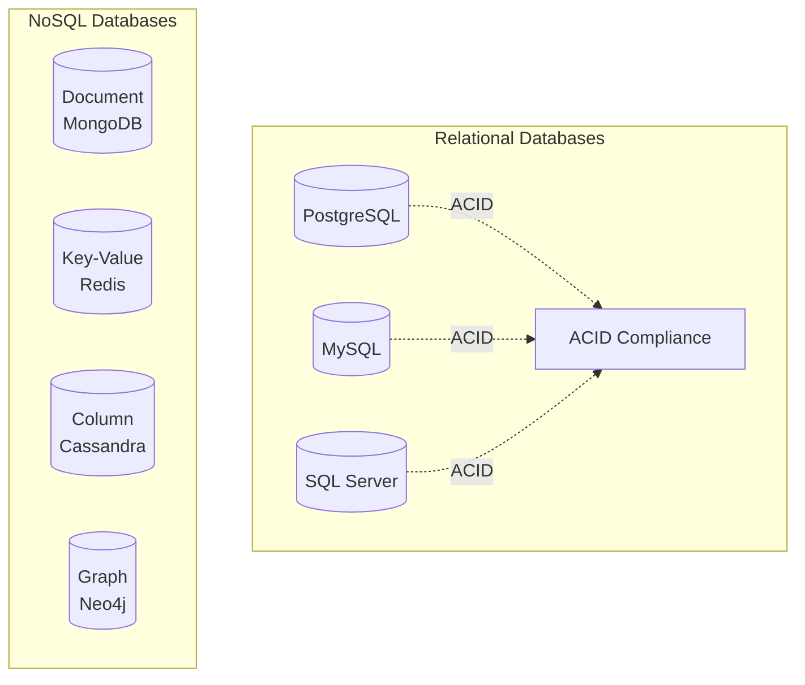
```mermaid
graph TB
    subgraph Relational["Relational Databases"]
        SQL1[(PostgreSQL)]
        SQL2[(MySQL)]
        SQL3[(SQL Server)]
        SQL1 -.ACID.-> ACID[ACID Compliance]
        SQL2 -.ACID.-> ACID
        SQL3 -.ACID.-> ACID
    end
    
    subgraph NoSQL["NoSQL Databases"]
        Doc[(Document<br/>MongoDB)]
        KeyVal[(Key-Value<br/>Redis)]
        Column[(Column<br/>Cassandra)]
        Graph[(Graph<br/>Neo4j)]
    end
```

### Relational vs NoSQL

#### Relational Databases (SQL)
- **ACID compliance**: Atomicity, Consistency, Isolation, Durability
- **Structured data**: Tables with relationships
- **SQL queries**: Powerful query language
- **Examples**: PostgreSQL, MySQL, SQL Server, Oracle

#### NoSQL Databases
- **Types**:
  - **Document**: MongoDB, CouchDB
  - **Key-Value**: Redis, DynamoDB
  - **Column**: Cassandra, HBase
  - **Graph**: Neo4j, ArangoDB
- **Flexible schema**: Schema-less or schema-flexible
- **Horizontal scaling**: Easier to scale out
- **Eventual consistency**: May sacrifice consistency for availability

### When to Use Which

**Use SQL when:**
- Data is structured and relational
- ACID transactions are critical
- Complex queries and joins are needed
- Data integrity is paramount

**Use NoSQL when:**
- Unstructured or semi-structured data
- High write throughput
- Horizontal scaling is priority
- Schema flexibility is needed

---

## Normalization

### Normalization Process Flow

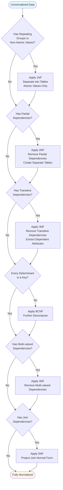
```mermaid
flowchart TD
    Start([Unnormalized Data]) --> Check1{Has Repeating<br/>Groups or<br/>Non-Atomic Values?}
    Check1 -->|Yes| Apply1NF[Apply 1NF<br/>Separate into Tables<br/>Atomic Values Only]
    Check1 -->|No| Check2{Has Partial<br/>Dependencies?}
    Apply1NF --> Check2
    Check2 -->|Yes| Apply2NF[Apply 2NF<br/>Remove Partial Dependencies<br/>Create Separate Tables]
    Check2 -->|No| Check3{Has Transitive<br/>Dependencies?}
    Apply2NF --> Check3
    Check3 -->|Yes| Apply3NF[Apply 3NF<br/>Remove Transitive Dependencies<br/>Extract Dependent Attributes]
    Check3 -->|No| CheckBCNF{Every Determinant<br/>is a Key?}
    Apply3NF --> CheckBCNF
    CheckBCNF -->|No| ApplyBCNF[Apply BCNF<br/>Further Decompose]
    CheckBCNF -->|Yes| Check4NF{Has Multi-valued<br/>Dependencies?}
    ApplyBCNF --> Check4NF
    Check4NF -->|Yes| Apply4NF[Apply 4NF<br/>Remove Multi-valued Dependencies]
    Check4NF -->|No| Check5NF{Has Join<br/>Dependencies?}
    Apply4NF --> Check5NF
    Check5NF -->|Yes| Apply5NF[Apply 5NF<br/>Project-Join Normal Form]
    Check5NF -->|No| Normalized([Fully Normalized])
    Apply5NF --> Normalized
    
    style Start fill:#e1f5ff
    style Normalized fill:#fff4e6
```

### Normalization Levels

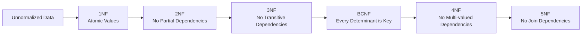
```mermaid
graph LR
    Unnormalized[Unnormalized Data] --> 1NF[1NF<br/>Atomic Values]
    1NF --> 2NF[2NF<br/>No Partial Dependencies]
    2NF --> 3NF[3NF<br/>No Transitive Dependencies]
    3NF --> BCNF[BCNF<br/>Every Determinant is Key]
    BCNF --> 4NF[4NF<br/>No Multi-valued Dependencies]
    4NF --> 5NF[5NF<br/>No Join Dependencies]
```

### First Normal Form (1NF)
- Each column contains atomic values
- No repeating groups
- Each row is unique

```sql
-- BAD: Violates 1NF
CREATE TABLE Users (
    id INT PRIMARY KEY,
    name VARCHAR(100),
    phones VARCHAR(200)  -- Multiple phones in one column
);

-- GOOD: 1NF
CREATE TABLE Users (
    id INT PRIMARY KEY,
    name VARCHAR(100)
);

CREATE TABLE UserPhones (
    user_id INT,
    phone VARCHAR(20),
    PRIMARY KEY (user_id, phone),
    FOREIGN KEY (user_id) REFERENCES Users(id)
);
```

### Second Normal Form (2NF)
- In 1NF
- All non-key attributes fully depend on the primary key

```sql
-- BAD: Violates 2NF
CREATE TABLE Orders (
    order_id INT PRIMARY KEY,
    product_id INT,
    product_name VARCHAR(100),  -- Depends on product_id, not order_id
    quantity INT,
    price DECIMAL
);

-- GOOD: 2NF
CREATE TABLE Orders (
    order_id INT PRIMARY KEY,
    product_id INT,
    quantity INT,
    price DECIMAL,
    FOREIGN KEY (product_id) REFERENCES Products(id)
);

CREATE TABLE Products (
    id INT PRIMARY KEY,
    name VARCHAR(100)
);
```

### Third Normal Form (3NF)
- In 2NF
- No transitive dependencies

```sql
-- BAD: Violates 3NF
CREATE TABLE Employees (
    id INT PRIMARY KEY,
    name VARCHAR(100),
    department_id INT,
    department_name VARCHAR(100),  -- Depends on department_id
    department_location VARCHAR(100)  -- Depends on department_id
);

-- GOOD: 3NF
CREATE TABLE Employees (
    id INT PRIMARY KEY,
    name VARCHAR(100),
    department_id INT,
    FOREIGN KEY (department_id) REFERENCES Departments(id)
);

CREATE TABLE Departments (
    id INT PRIMARY KEY,
    name VARCHAR(100),
    location VARCHAR(100)
);
```

### Boyce-Codd Normal Form (BCNF)
- In 3NF
- Every determinant is a candidate key

### Fourth Normal Form (4NF)
- In BCNF
- No multi-valued dependencies

### Fifth Normal Form (5NF)
- In 4NF
- No join dependencies

---

## Denormalization Strategies

Sometimes denormalization improves performance.

### When to Denormalize
- Read-heavy workloads
- Reporting and analytics
- Performance is critical
- Data doesn't change frequently

### Denormalization Techniques

```sql
-- Denormalized for performance
CREATE TABLE OrderSummary (
    order_id INT PRIMARY KEY,
    customer_name VARCHAR(100),  -- Denormalized from Customers
    total_amount DECIMAL,
    item_count INT,  -- Pre-calculated
    last_updated TIMESTAMP
);
```

---

## Indexing Strategies

### Index Strategy Decision Flow

```mermaid
flowchart TD
    Start([Query Performance Issue?]) --> Analyze[Analyze Query Pattern]
    Analyze --> CheckType{Query Type?}
    
    CheckType -->|Equality Lookup| HashIndex[Consider Hash Index<br/>O(1) Lookup]
    CheckType -->|Range Query| BTreeIndex[Use B-Tree Index<br/>O(log n) Lookup]
    CheckType -->|Full Text Search| FullTextIndex[Use Full-Text Index<br/>Inverted Index]
    CheckType -->|Spatial Data| SpatialIndex[Use Spatial Index<br/>R-Tree/GiST]
    
    HashIndex --> CheckColumns{Multiple Columns?}
    BTreeIndex --> CheckColumns
    FullTextIndex --> CheckColumns
    SpatialIndex --> CheckColumns
    
    CheckColumns -->|Yes| CompositeIndex[Create Composite Index<br/>Order Matters]
    CheckColumns -->|No| SingleIndex[Single Column Index]
    
    CompositeIndex --> CheckCovering{Covering Index<br/>Possible?}
    SingleIndex --> CheckCovering
    
    CheckCovering -->|Yes| CoveringIndex[Create Covering Index<br/>Include All Query Columns]
    CheckCovering -->|No| StandardIndex[Standard Index]
    
    CoveringIndex --> Monitor[Monitor Index Usage]
    StandardIndex --> Monitor
    Monitor --> End([Optimized])
    
    style Start fill:#e1f5ff
    style End fill:#fff4e6
```

### Index Architecture

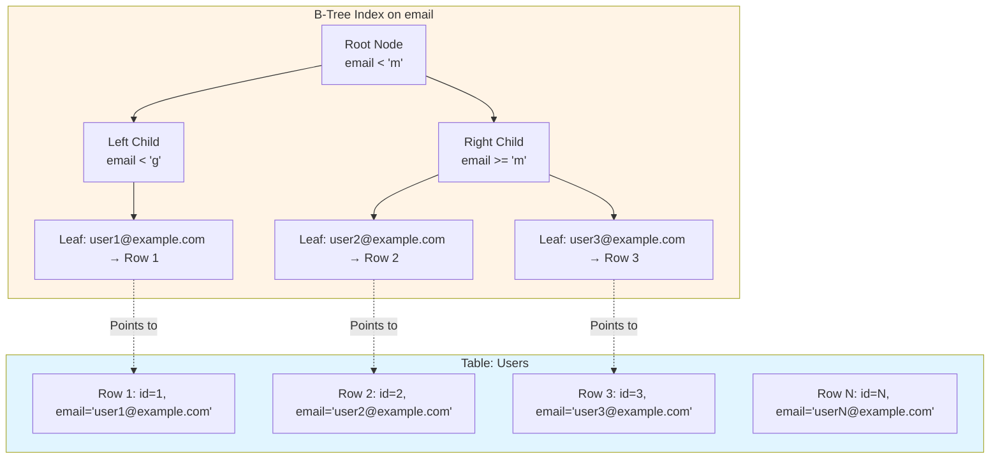
```mermaid
graph TB
    subgraph Table[Table: Users]
        Row1[Row 1: id=1, email='user1@example.com']
        Row2[Row 2: id=2, email='user2@example.com']
        Row3[Row 3: id=3, email='user3@example.com']
        RowN[Row N: id=N, email='userN@example.com']
    end
    
    subgraph BTreeIndex[B-Tree Index on email]
        Root[Root Node<br/>email < 'm']
        Left[Left Child<br/>email < 'g']
        Right[Right Child<br/>email >= 'm']
        Leaf1[Leaf: user1@example.com → Row 1]
        Leaf2[Leaf: user2@example.com → Row 2]
        Leaf3[Leaf: user3@example.com → Row 3]
    end
    
    Root --> Left
    Root --> Right
    Left --> Leaf1
    Right --> Leaf2
    Right --> Leaf3
    
    Leaf1 -.->|Points to| Row1
    Leaf2 -.->|Points to| Row2
    Leaf3 -.->|Points to| Row3
    
    style Table fill:#e1f5ff
    style BTreeIndex fill:#fff4e6
```

### B-Tree Indexes
- Default index type in most databases
- Good for equality and range queries
- Balanced tree structure

```sql
-- Single column index
CREATE INDEX idx_user_email ON Users(email);

-- Composite index
CREATE INDEX idx_user_name_email ON Users(name, email);

-- Partial index (PostgreSQL)
CREATE INDEX idx_active_users ON Users(email) WHERE active = true;
```

### Hash Indexes
- Fast equality lookups
- Not good for range queries
- Used in memory tables

### Covering Indexes
- Contains all columns needed for a query
- Avoids table lookups

```sql
-- Covering index
CREATE INDEX idx_order_covering ON Orders(order_id, customer_id, total, status);
-- Query can be satisfied from index alone
SELECT order_id, customer_id, total, status FROM Orders WHERE customer_id = 123;
```

### Index Best Practices
- Index foreign keys
- Index frequently queried columns
- Don't over-index (slows writes)
- Monitor index usage
- Consider partial indexes for filtered queries

---

## Query Optimization

### Query Execution Flow

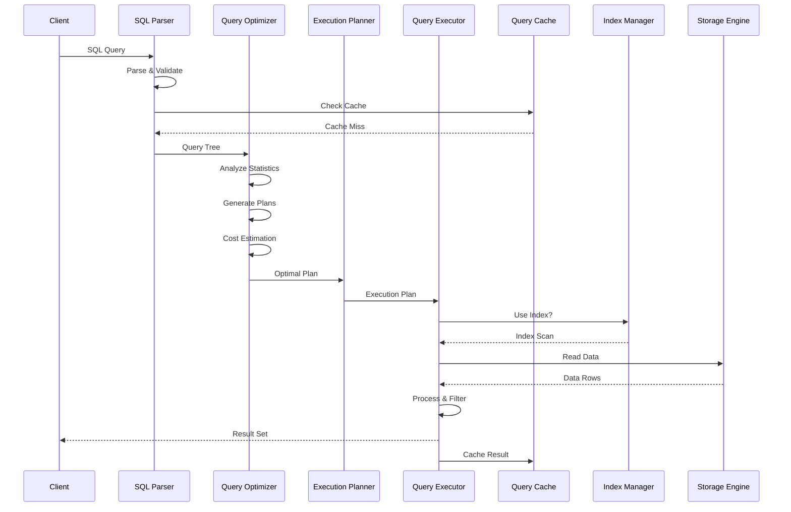
```mermaid
sequenceDiagram
    participant Client
    participant Parser as SQL Parser
    participant Optimizer as Query Optimizer
    participant Planner as Execution Planner
    participant Executor as Query Executor
    participant Cache as Query Cache
    participant Index as Index Manager
    participant Storage as Storage Engine
    
    Client->>Parser: SQL Query
    Parser->>Parser: Parse & Validate
    Parser->>Cache: Check Cache
    Cache-->>Parser: Cache Miss
    
    Parser->>Optimizer: Query Tree
    Optimizer->>Optimizer: Analyze Statistics
    Optimizer->>Optimizer: Generate Plans
    Optimizer->>Optimizer: Cost Estimation
    Optimizer->>Planner: Optimal Plan
    
    Planner->>Executor: Execution Plan
    Executor->>Index: Use Index?
    Index-->>Executor: Index Scan
    Executor->>Storage: Read Data
    Storage-->>Executor: Data Rows
    Executor->>Executor: Process & Filter
    Executor-->>Client: Result Set
    
    Executor->>Cache: Cache Result
```

### Query Optimization Process

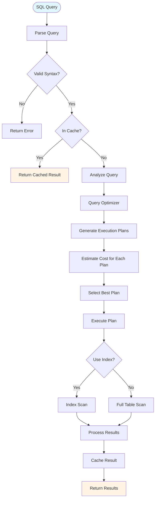
```mermaid
flowchart TD
    Start([SQL Query]) --> Parse[Parse Query]
    Parse --> Validate{Valid Syntax?}
    Validate -->|No| Error[Return Error]
    Validate -->|Yes| CheckCache{In Cache?}
    
    CheckCache -->|Yes| ReturnCache[Return Cached Result]
    CheckCache -->|No| Analyze[Analyze Query]
    
    Analyze --> Optimize[Query Optimizer]
    Optimize --> GeneratePlans[Generate Execution Plans]
    GeneratePlans --> EstimateCost[Estimate Cost for Each Plan]
    EstimateCost --> SelectPlan[Select Best Plan]
    
    SelectPlan --> Execute[Execute Plan]
    Execute --> UseIndex{Use Index?}
    UseIndex -->|Yes| IndexScan[Index Scan]
    UseIndex -->|No| TableScan[Full Table Scan]
    
    IndexScan --> Process[Process Results]
    TableScan --> Process
    Process --> Cache[Cache Result]
    Cache --> Return[Return Results]
    
    style Start fill:#e1f5ff
    style Return fill:#fff4e6
    style ReturnCache fill:#fff4e6
```

### EXPLAIN Plans

```sql
-- PostgreSQL
EXPLAIN ANALYZE SELECT * FROM Users WHERE email = 'user@example.com';

-- MySQL
EXPLAIN SELECT * FROM Users WHERE email = 'user@example.com';
```

### Query Optimization Techniques

#### 1. Use Indexes
```sql
-- BAD: Full table scan
SELECT * FROM Users WHERE UPPER(name) = 'JOHN';

-- GOOD: Use index-friendly query
SELECT * FROM Users WHERE name = 'John';
```

#### 2. Avoid SELECT *
```sql
-- BAD: Selects all columns
SELECT * FROM Users;

-- GOOD: Select only needed columns
SELECT id, name, email FROM Users;
```

#### 3. Use LIMIT
```sql
-- BAD: Fetches all rows
SELECT * FROM Orders ORDER BY created_at DESC;

-- GOOD: Limit results
SELECT * FROM Orders ORDER BY created_at DESC LIMIT 10;
```

#### 4. Avoid Functions on Indexed Columns
```sql
-- BAD: Can't use index
SELECT * FROM Users WHERE YEAR(created_at) = 2024;

-- GOOD: Range query uses index
SELECT * FROM Users WHERE created_at >= '2024-01-01' AND created_at < '2025-01-01';
```

#### 5. Use JOINs Efficiently
```sql
-- BAD: Multiple queries
SELECT * FROM Orders WHERE customer_id = 1;
SELECT * FROM Customers WHERE id = 1;

-- GOOD: Single JOIN
SELECT o.*, c.name 
FROM Orders o
JOIN Customers c ON o.customer_id = c.id
WHERE c.id = 1;
```

---

## Transaction Management

### Transaction Flow

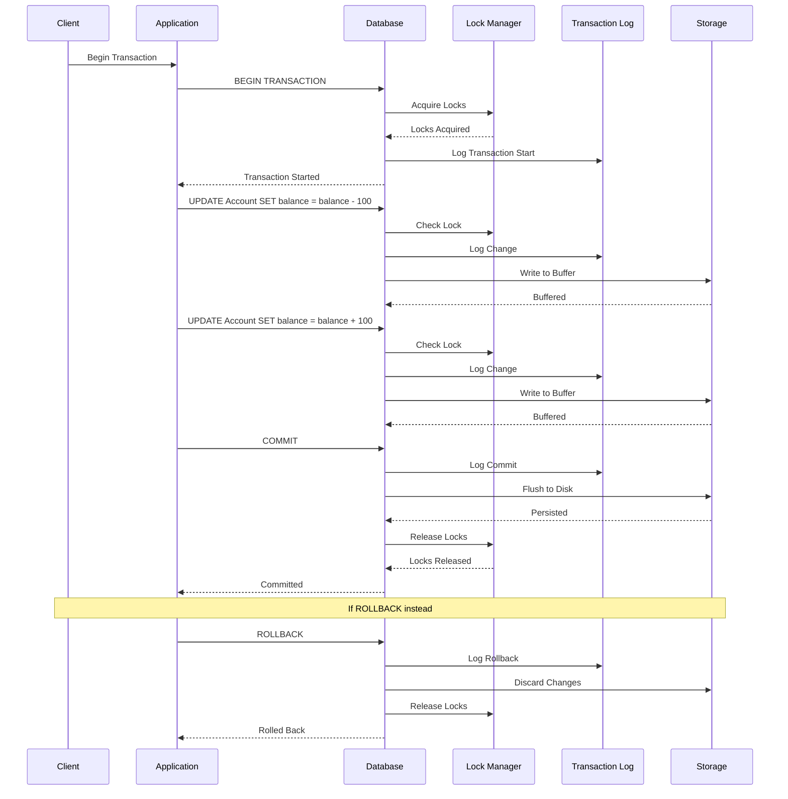
```mermaid
sequenceDiagram
    participant Client
    participant App as Application
    participant DB as Database
    participant Lock as Lock Manager
    participant Log as Transaction Log
    participant Storage as Storage
    
    Client->>App: Begin Transaction
    App->>DB: BEGIN TRANSACTION
    DB->>Lock: Acquire Locks
    Lock-->>DB: Locks Acquired
    DB->>Log: Log Transaction Start
    DB-->>App: Transaction Started
    
    App->>DB: UPDATE Account SET balance = balance - 100
    DB->>Lock: Check Lock
    DB->>Log: Log Change
    DB->>Storage: Write to Buffer
    Storage-->>DB: Buffered
    
    App->>DB: UPDATE Account SET balance = balance + 100
    DB->>Lock: Check Lock
    DB->>Log: Log Change
    DB->>Storage: Write to Buffer
    Storage-->>DB: Buffered
    
    App->>DB: COMMIT
    DB->>Log: Log Commit
    DB->>Storage: Flush to Disk
    Storage-->>DB: Persisted
    DB->>Lock: Release Locks
    Lock-->>DB: Locks Released
    DB-->>App: Committed
    
    Note over Client,Storage: If ROLLBACK instead
    App->>DB: ROLLBACK
    DB->>Log: Log Rollback
    DB->>Storage: Discard Changes
    DB->>Lock: Release Locks
    DB-->>App: Rolled Back
```

### Transaction States

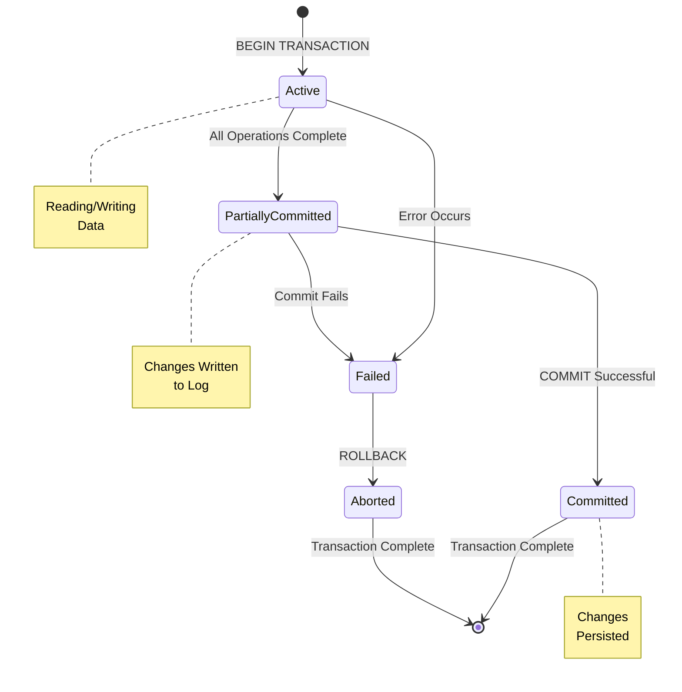
```mermaid
stateDiagram-v2
    [*] --> Active: BEGIN TRANSACTION
    Active --> PartiallyCommitted: All Operations Complete
    Active --> Failed: Error Occurs
    PartiallyCommitted --> Committed: COMMIT Successful
    PartiallyCommitted --> Failed: Commit Fails
    Failed --> Aborted: ROLLBACK
    Committed --> [*]: Transaction Complete
    Aborted --> [*]: Transaction Complete
    
    note right of Active
        Reading/Writing
        Data
    end note
    
    note right of PartiallyCommitted
        Changes Written
        to Log
    end note
    
    note right of Committed
        Changes
        Persisted
    end note
```

### ACID Properties

#### Atomicity
- All or nothing
- Transactions are indivisible

#### Consistency
- Database remains in valid state
- Constraints are maintained

#### Isolation
- Concurrent transactions don't interfere
- Isolation levels control visibility

#### Durability
- Committed changes persist
- Survives system failures

### Isolation Levels

```sql
-- Read Uncommitted (lowest isolation)
SET TRANSACTION ISOLATION LEVEL READ UNCOMMITTED;

-- Read Committed (default in most databases)
SET TRANSACTION ISOLATION LEVEL READ COMMITTED;

-- Repeatable Read
SET TRANSACTION ISOLATION LEVEL REPEATABLE READ;

-- Serializable (highest isolation)
SET TRANSACTION ISOLATION LEVEL SERIALIZABLE;
```

### Deadlocks

```sql
-- Transaction 1
BEGIN;
UPDATE Accounts SET balance = balance - 100 WHERE id = 1;
UPDATE Accounts SET balance = balance + 100 WHERE id = 2;
COMMIT;

-- Transaction 2 (deadlock if run concurrently)
BEGIN;
UPDATE Accounts SET balance = balance - 50 WHERE id = 2;
UPDATE Accounts SET balance = balance + 50 WHERE id = 1;
COMMIT;
```

**Prevention:**
- Always acquire locks in same order
- Keep transactions short
- Use appropriate isolation levels

---

## Database Design Patterns

### Entity-Relationship Diagram Examples

#### E-Commerce ER Diagram

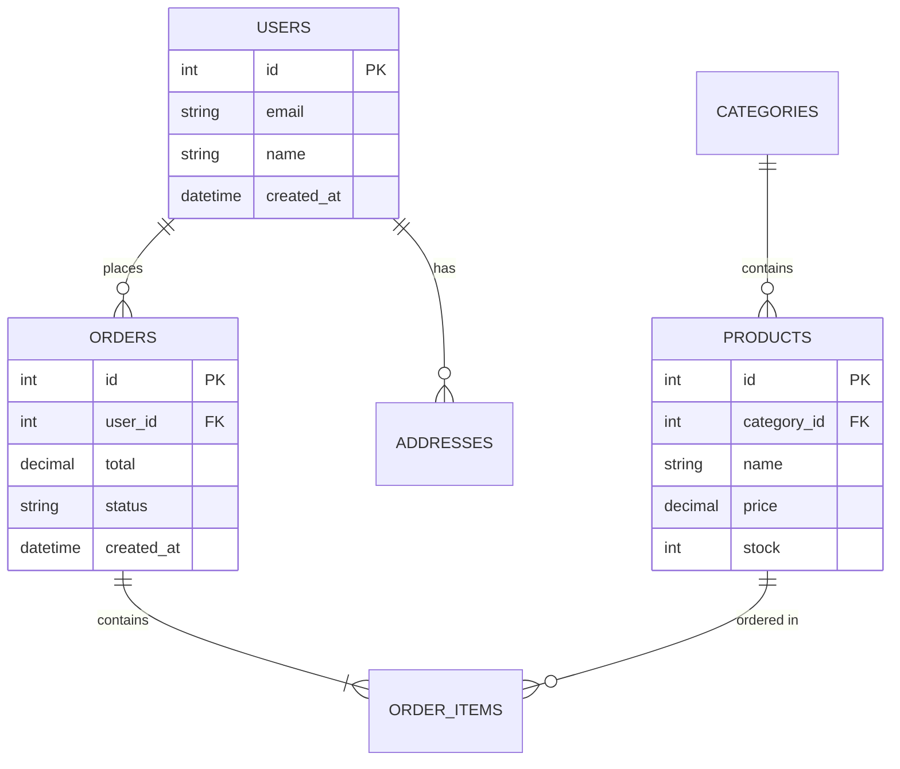
```mermaid
erDiagram
    USERS ||--o{ ORDERS : places
    USERS ||--o{ ADDRESSES : has
    ORDERS ||--|{ ORDER_ITEMS : contains
    PRODUCTS ||--o{ ORDER_ITEMS : "ordered in"
    CATEGORIES ||--o{ PRODUCTS : contains
    
    USERS {
        int id PK
        string email
        string name
        datetime created_at
    }
    
    ORDERS {
        int id PK
        int user_id FK
        decimal total
        string status
        datetime created_at
    }
    
    PRODUCTS {
        int id PK
        int category_id FK
        string name
        decimal price
        int stock
    }
```

#### Social Media ER Diagram

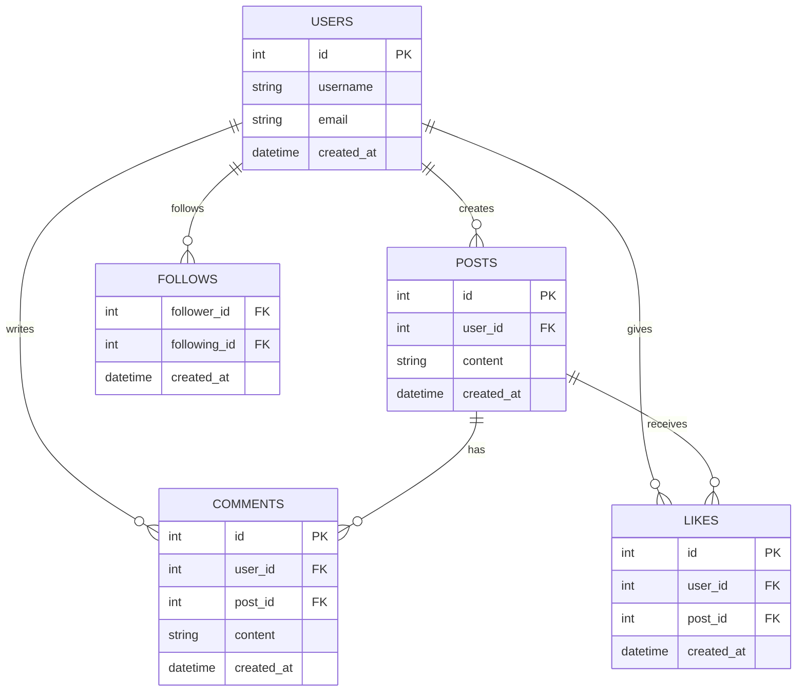
```mermaid
erDiagram
    USERS ||--o{ POSTS : creates
    USERS ||--o{ COMMENTS : writes
    USERS ||--o{ LIKES : gives
    USERS ||--o{ FOLLOWS : follows
    POSTS ||--o{ COMMENTS : has
    POSTS ||--o{ LIKES : receives
    
    USERS {
        int id PK
        string username
        string email
        datetime created_at
    }
    
    POSTS {
        int id PK
        int user_id FK
        string content
        datetime created_at
    }
    
    COMMENTS {
        int id PK
        int user_id FK
        int post_id FK
        string content
        datetime created_at
    }
    
    LIKES {
        int id PK
        int user_id FK
        int post_id FK
        datetime created_at
    }
    
    FOLLOWS {
        int follower_id FK
        int following_id FK
        datetime created_at
    }
```

#### Blog System ER Diagram

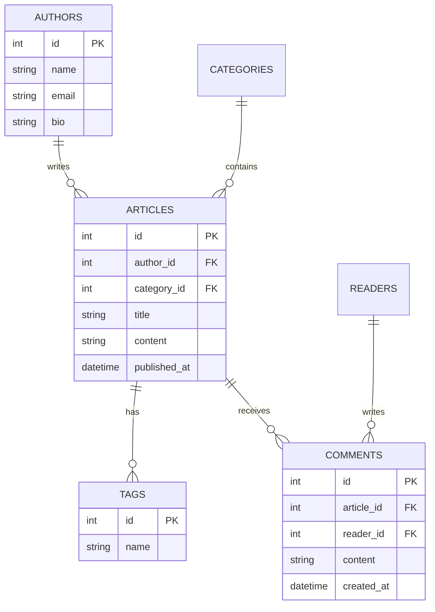
```mermaid
erDiagram
    AUTHORS ||--o{ ARTICLES : writes
    ARTICLES ||--o{ TAGS : has
    ARTICLES ||--o{ COMMENTS : receives
    READERS ||--o{ COMMENTS : writes
    CATEGORIES ||--o{ ARTICLES : contains
    
    AUTHORS {
        int id PK
        string name
        string email
        string bio
    }
    
    ARTICLES {
        int id PK
        int author_id FK
        int category_id FK
        string title
        string content
        datetime published_at
    }
    
    TAGS {
        int id PK
        string name
    }
    
    COMMENTS {
        int id PK
        int article_id FK
        int reader_id FK
        string content
        datetime created_at
    }
```

### Repository Pattern

```typescript
interface UserRepository {
    findById(id: number): Promise<User | null>;
    findAll(): Promise<User[]>;
    save(user: User): Promise<User>;
    delete(id: number): Promise<void>;
}

class PostgreSQLUserRepository implements UserRepository {
    async findById(id: number): Promise<User | null> {
        const result = await db.query('SELECT * FROM users WHERE id = $1', [id]);
        return result.rows[0] || null;
    }
    // ... other methods
}
```

### Unit of Work Pattern

```typescript
class UnitOfWork {
    private newEntities: Entity[] = [];
    private modifiedEntities: Entity[] = [];
    private deletedEntities: Entity[] = [];
    
    registerNew(entity: Entity) {
        this.newEntities.push(entity);
    }
    
    registerModified(entity: Entity) {
        this.modifiedEntities.push(entity);
    }
    
    registerDeleted(entity: Entity) {
        this.deletedEntities.push(entity);
    }
    
    async commit() {
        // Save all changes in a single transaction
        await db.transaction(async (tx) => {
            for (const entity of this.newEntities) {
                await tx.insert(entity);
            }
            for (const entity of this.modifiedEntities) {
                await tx.update(entity);
            }
            for (const entity of this.deletedEntities) {
                await tx.delete(entity);
            }
        });
    }
}
```

### CQRS (Command Query Responsibility Segregation)

```typescript
// Command side (writes)
class UserCommandService {
    async createUser(data: CreateUserData) {
        // Write to primary database
        return await writeDb.users.create(data);
    }
}

// Query side (reads)
class UserQueryService {
    async getUser(id: number) {
        // Read from read replica or cache
        return await readDb.users.findById(id);
    }
}
```

---

## Scaling Strategies

### Database Scaling Decision Flow

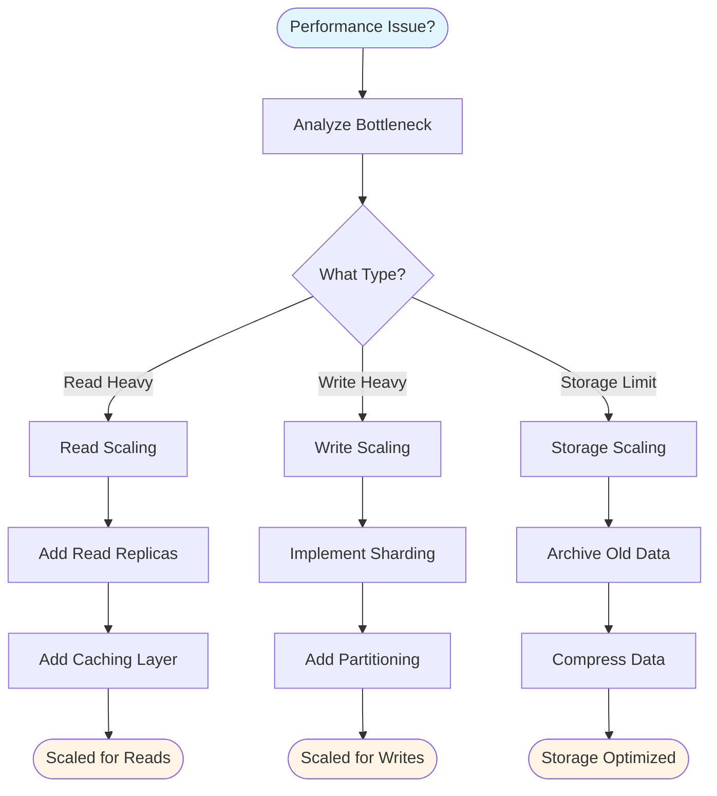
```mermaid
flowchart TD
    Start([Performance Issue?]) --> Analyze[Analyze Bottleneck]
    Analyze --> CheckType{What Type?}
    
    CheckType -->|Read Heavy| ReadScaling[Read Scaling]
    CheckType -->|Write Heavy| WriteScaling[Write Scaling]
    CheckType -->|Storage Limit| StorageScaling[Storage Scaling]
    
    ReadScaling --> ReadReplicas[Add Read Replicas]
    ReadReplicas --> Cache[Add Caching Layer]
    Cache --> ReadEnd([Scaled for Reads])
    
    WriteScaling --> Sharding[Implement Sharding]
    Sharding --> Partitioning[Add Partitioning]
    Partitioning --> WriteEnd([Scaled for Writes])
    
    StorageScaling --> Archive[Archive Old Data]
    Archive --> Compress[Compress Data]
    Compress --> StorageEnd([Storage Optimized])
    
    style Start fill:#e1f5ff
    style ReadEnd fill:#fff4e6
    style WriteEnd fill:#fff4e6
    style StorageEnd fill:#fff4e6
```

### Scaling Strategies Comparison

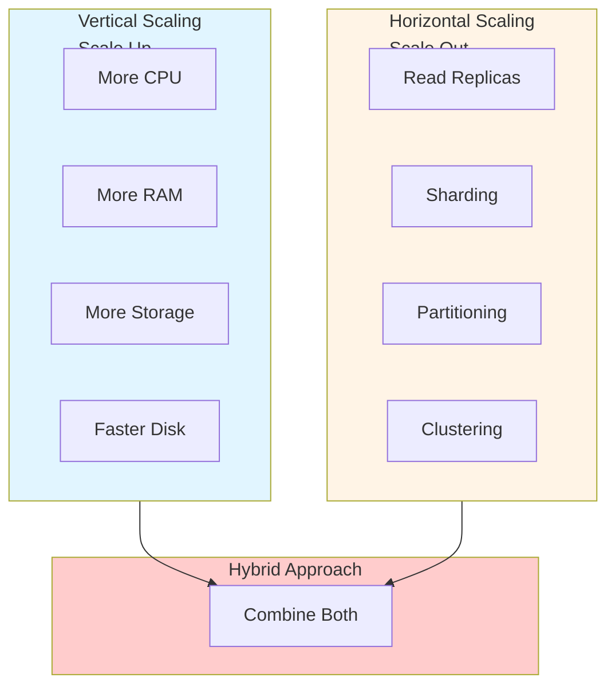
```mermaid
graph TB
    subgraph Vertical[Vertical Scaling<br/>Scale Up]
        MoreCPU[More CPU]
        MoreRAM[More RAM]
        MoreStorage[More Storage]
        FasterDisk[Faster Disk]
    end
    
    subgraph Horizontal[Horizontal Scaling<br/>Scale Out]
        Replicas[Read Replicas]
        Sharding[Sharding]
        Partitioning[Partitioning]
        Clustering[Clustering]
    end
    
    subgraph Hybrid[Hybrid Approach]
        Both[Combine Both]
    end
    
    Vertical --> Both
    Horizontal --> Both
    
    style Vertical fill:#e1f5ff
    style Horizontal fill:#fff4e6
    style Hybrid fill:#ffcccc
```

### Database Replication Architecture

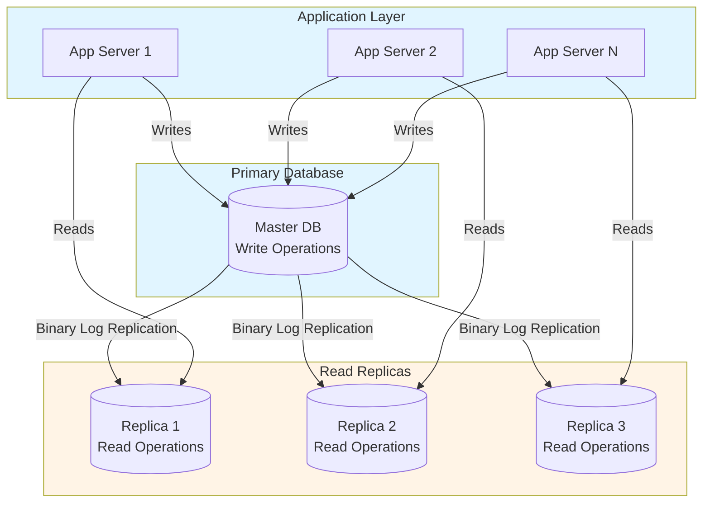
```mermaid
graph TB
    subgraph Primary[Primary Database]
        Master[(Master DB<br/>Write Operations)]
    end
    
    subgraph Replicas[Read Replicas]
        Replica1[(Replica 1<br/>Read Operations)]
        Replica2[(Replica 2<br/>Read Operations)]
        Replica3[(Replica 3<br/>Read Operations)]
    end
    
    subgraph Application[Application Layer]
        App1[App Server 1]
        App2[App Server 2]
        App3[App Server N]
    end
    
    Master -->|Binary Log Replication| Replica1
    Master -->|Binary Log Replication| Replica2
    Master -->|Binary Log Replication| Replica3
    
    App1 -->|Writes| Master
    App2 -->|Writes| Master
    App3 -->|Writes| Master
    
    App1 -->|Reads| Replica1
    App2 -->|Reads| Replica2
    App3 -->|Reads| Replica3
    
    style Primary fill:#e1f5ff
    style Replicas fill:#fff4e6
    style Application fill:#e1f5ff
```

### Replication Flow

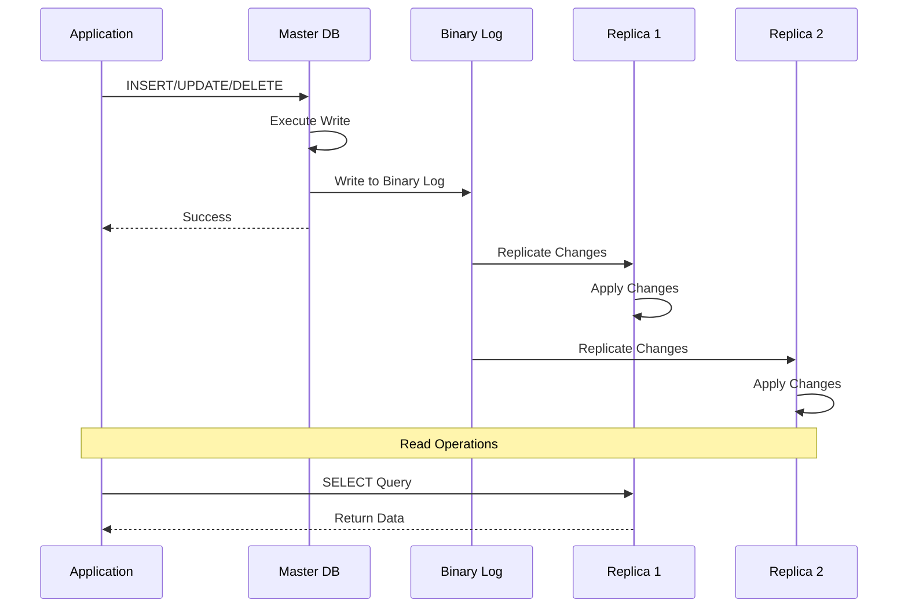
```mermaid
sequenceDiagram
    participant App as Application
    participant Master as Master DB
    participant BinLog as Binary Log
    participant Replica1 as Replica 1
    participant Replica2 as Replica 2
    
    App->>Master: INSERT/UPDATE/DELETE
    Master->>Master: Execute Write
    Master->>BinLog: Write to Binary Log
    Master-->>App: Success
    
    BinLog->>Replica1: Replicate Changes
    Replica1->>Replica1: Apply Changes
    BinLog->>Replica2: Replicate Changes
    Replica2->>Replica2: Apply Changes
    
    Note over App,Replica2: Read Operations
    App->>Replica1: SELECT Query
    Replica1-->>App: Return Data
```

### Read Replicas

```sql
-- Primary database (writes)
-- Replica databases (reads)

-- Application code
const readDb = getReadReplica();
const writeDb = getPrimaryDatabase();

// Read from replica
const user = await readDb.query('SELECT * FROM users WHERE id = $1', [id]);

// Write to primary
await writeDb.query('INSERT INTO users ...');
```

### Sharding

### Sharding Architecture

```mermaid
graph TB
    subgraph Application[Application Layer]
        App[Application]
        Router[Shard Router]
    end
    
    subgraph Shards[Database Shards]
        Shard1[(Shard 1<br/>Users 0-999)]
        Shard2[(Shard 2<br/>Users 1000-1999)]
        Shard3[(Shard 3<br/>Users 2000-2999)]
        ShardN[(Shard N<br/>Users N*1000-...)]
    end
    
    App --> Router
    Router -->|Hash(user_id) % N = 0| Shard1
    Router -->|Hash(user_id) % N = 1| Shard2
    Router -->|Hash(user_id) % N = 2| Shard3
    Router -->|Hash(user_id) % N = N-1| ShardN
    
    style Application fill:#e1f5ff
    style Shards fill:#fff4e6
```

### Sharding Strategies

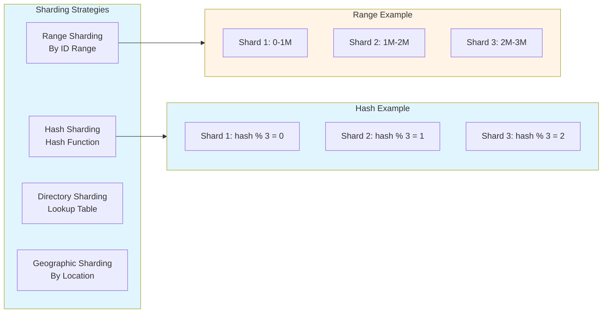
```mermaid
graph LR
    subgraph Strategies[Sharding Strategies]
        Range[Range Sharding<br/>By ID Range]
        Hash[Hash Sharding<br/>Hash Function]
        Directory[Directory Sharding<br/>Lookup Table]
        Geographic[Geographic Sharding<br/>By Location]
    end
    
    subgraph RangeExample[Range Example]
        R1[Shard 1: 0-1M]
        R2[Shard 2: 1M-2M]
        R3[Shard 3: 2M-3M]
    end
    
    subgraph HashExample[Hash Example]
        H1[Shard 1: hash % 3 = 0]
        H2[Shard 2: hash % 3 = 1]
        H3[Shard 3: hash % 3 = 2]
    end
    
    Range --> RangeExample
    Hash --> HashExample
    
    style Strategies fill:#e1f5ff
    style RangeExample fill:#fff4e6
    style HashExample fill:#e1f5ff
```

### Sharding Implementation

```typescript
// Shard by user_id
function getShard(userId: number): Database {
    const shardNumber = userId % SHARD_COUNT;
    return shards[shardNumber];
}

async function getUser(userId: number) {
    const shard = getShard(userId);
    return await shard.query('SELECT * FROM users WHERE id = $1', [userId]);
}
```

### Partitioning

```sql
-- Range partitioning
CREATE TABLE Orders (
    id INT,
    customer_id INT,
    order_date DATE,
    total DECIMAL
) PARTITION BY RANGE (order_date) (
    PARTITION p2024_q1 VALUES LESS THAN ('2024-04-01'),
    PARTITION p2024_q2 VALUES LESS THAN ('2024-07-01'),
    PARTITION p2024_q3 VALUES LESS THAN ('2024-10-01'),
    PARTITION p2024_q4 VALUES LESS THAN ('2025-01-01')
);
```

---

## Performance Tuning

### Connection Pooling

```typescript
// Configure connection pool
const pool = new Pool({
    host: 'localhost',
    database: 'mydb',
    user: 'user',
    password: 'password',
    max: 20, // Maximum connections
    idleTimeoutMillis: 30000,
    connectionTimeoutMillis: 2000,
});
```

### Query Caching

```typescript
// Cache frequently accessed data
const cache = new Map();

async function getUser(id: number) {
    if (cache.has(id)) {
        return cache.get(id);
    }
    
    const user = await db.query('SELECT * FROM users WHERE id = $1', [id]);
    cache.set(id, user);
    return user;
}
```

### Batch Operations

```sql
-- BAD: Multiple queries
INSERT INTO users (name, email) VALUES ('User1', 'user1@example.com');
INSERT INTO users (name, email) VALUES ('User2', 'user2@example.com');
INSERT INTO users (name, email) VALUES ('User3', 'user3@example.com');

-- GOOD: Batch insert
INSERT INTO users (name, email) VALUES
    ('User1', 'user1@example.com'),
    ('User2', 'user2@example.com'),
    ('User3', 'user3@example.com');
```

---

## Backup and Recovery

### Backup Strategies

```bash
# PostgreSQL backup
pg_dump -h localhost -U user -d mydb -F c -f backup.dump

# MySQL backup
mysqldump -u user -p mydb > backup.sql

# Automated backups
0 2 * * * pg_dump -h localhost -U user -d mydb -f /backups/mydb_$(date +\%Y\%m\%d).dump
```

### Recovery

```bash
# PostgreSQL restore
pg_restore -h localhost -U user -d mydb backup.dump

# MySQL restore
mysql -u user -p mydb < backup.sql
```

---

## Common Pitfalls

### 1. Over-Normalization

```sql
-- BAD: Over-normalized (too many joins)
SELECT u.name, u.email, a.street, a.city, c.name as country
FROM users u
JOIN addresses a ON u.id = a.user_id
JOIN cities ci ON a.city_id = ci.id
JOIN countries c ON ci.country_id = c.id;

-- GOOD: Denormalized for performance
SELECT name, email, street, city, country
FROM users_with_addresses;
```

### 2. Missing Indexes

```sql
-- BAD: No index on frequently queried column
SELECT * FROM orders WHERE customer_id = 123; -- Full table scan

-- GOOD: Indexed column
CREATE INDEX idx_orders_customer_id ON orders(customer_id);
SELECT * FROM orders WHERE customer_id = 123; -- Index scan
```

### 3. N+1 Query Problem

```typescript
// BAD: N+1 queries
const users = await db.users.findAll();
for (const user of users) {
    const orders = await db.orders.findByUserId(user.id); // N queries
}

// GOOD: Single query with JOIN
const users = await db.users.findAll({
    include: { orders: true } // Eager loading
});
```

### 4. Ignoring Connection Pooling

```typescript
// BAD: Creating new connections for each request
function getData() {
    const connection = new Connection(); // New connection each time
    return connection.query('SELECT * FROM users');
}

// GOOD: Connection pooling
const pool = new Pool({ max: 20 });
function getData() {
    return pool.query('SELECT * FROM users'); // Reuse connections
}
```

---

## Best Practices

### Database Design Best Practices

1. **Normalize First, Denormalize When Needed**
   - Start with normalized design
   - Denormalize only for performance
   - Document denormalization decisions

2. **Index Strategically**
   - Index foreign keys
   - Index frequently queried columns
   - Don't over-index (slows writes)
   - Monitor index usage

3. **Use Appropriate Data Types**
   - Use smallest data type that fits
   - Use ENUM for fixed value sets
   - Use TIMESTAMP for dates

4. **Plan for Growth**
   - Design for scalability from start
   - Consider partitioning early
   - Plan for sharding if needed

---

## Real-World Examples

### Example 1: E-Commerce Database Design

```sql
-- Users table
CREATE TABLE users (
    id SERIAL PRIMARY KEY,
    email VARCHAR(255) UNIQUE NOT NULL,
    name VARCHAR(255) NOT NULL,
    created_at TIMESTAMP DEFAULT NOW(),
    INDEX idx_users_email (email)
);

-- Products table
CREATE TABLE products (
    id SERIAL PRIMARY KEY,
    name VARCHAR(255) NOT NULL,
    price DECIMAL(10, 2) NOT NULL,
    stock INTEGER DEFAULT 0,
    category_id INTEGER,
    INDEX idx_products_category (category_id),
    INDEX idx_products_price (price)
);

-- Orders table with partitioning
CREATE TABLE orders (
    id SERIAL,
    user_id INTEGER NOT NULL,
    total DECIMAL(10, 2) NOT NULL,
    status VARCHAR(50) NOT NULL,
    created_at TIMESTAMP DEFAULT NOW(),
    PRIMARY KEY (id, created_at)
) PARTITION BY RANGE (created_at);

-- Partition by month
CREATE TABLE orders_2024_01 PARTITION OF orders
    FOR VALUES FROM ('2024-01-01') TO ('2024-02-01');
```

### Example 2: Social Media Database with Denormalization

```sql
-- Posts table
CREATE TABLE posts (
    id SERIAL PRIMARY KEY,
    user_id INTEGER NOT NULL,
    content TEXT NOT NULL,
    likes_count INTEGER DEFAULT 0, -- Denormalized
    comments_count INTEGER DEFAULT 0, -- Denormalized
    created_at TIMESTAMP DEFAULT NOW()
);

-- Update counts via triggers
CREATE TRIGGER update_likes_count
AFTER INSERT ON likes
FOR EACH ROW
UPDATE posts SET likes_count = likes_count + 1
WHERE id = NEW.post_id;
```

---

## SQL and NoSQL Best Practices

### SQL Best Practices
- Use transactions for related operations
- Normalize appropriately (don't over-normalize)
- Index strategically
- Use prepared statements
- Monitor slow queries
- Regular maintenance (VACUUM, ANALYZE)

### NoSQL Best Practices
- Design for access patterns
- Denormalize when needed
- Use appropriate data types
- Implement proper sharding
- Consider consistency requirements
- Monitor performance metrics

---

## Resources

- [PostgreSQL Documentation](https://www.postgresql.org/docs/)
- [MySQL Documentation](https://dev.mysql.com/doc/)
- [MongoDB Best Practices](https://docs.mongodb.com/manual/administration/production-notes/)

---

## Summary

Key takeaways for database design and optimization:

1. **Normalization**: Balance between normalization and performance
2. **Indexing**: Strategic index creation for query performance
3. **Query Optimization**: Write efficient queries
4. **Transactions**: Understand ACID and isolation levels
5. **Scaling**: Read replicas, sharding, partitioning
6. **Performance**: Connection pooling, caching, batch operations
7. **Backup**: Regular backups and recovery procedures

Master these concepts to build scalable, performant database systems.

