# DevOps & CI/CD Guide - Comprehensive

## Table of Contents
1. [Introduction](#introduction)
2. [CI/CD Fundamentals](#cicd-fundamentals)
3. [GitHub Actions](#github-actions)
4. [GitLab CI](#gitlab-ci)
5. [Jenkins](#jenkins)
6. [Docker Containerization](#docker-containerization)
7. [Kubernetes Orchestration](#kubernetes-orchestration)
8. [Infrastructure as Code](#infrastructure-as-code)
9. [Monitoring and Logging](#monitoring-and-logging)
10. [Deployment Strategies](#deployment-strategies)
11. [Environment Management](#environment-management)
12. [Secrets Management in CI/CD](#secrets-management-in-cicd)
13. [Cloud Platforms](#cloud-platforms)
14. [Resources](#resources)
15. [Summary](#summary)

---

## Introduction

This guide covers DevOps practices, CI/CD pipelines, containerization, orchestration, and cloud deployment. Learn to automate development workflows and deploy applications reliably.

### Who This Guide Is For
- DevOps engineers
- Backend developers
- System administrators
- Anyone involved in deployment

---

## CI/CD Fundamentals

### CI/CD Pipeline Flow

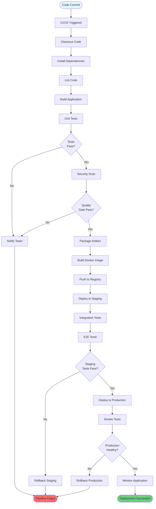

### CI/CD Pipeline Architecture

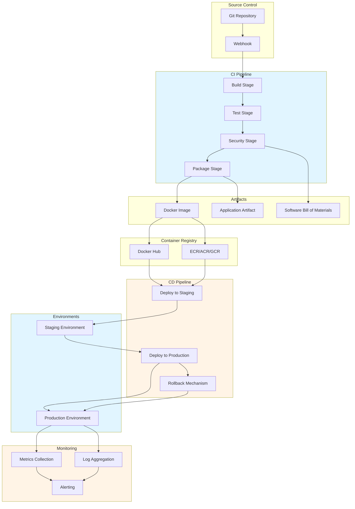

### Continuous Integration (CI)
- Automatically build and test code on every commit
- Catch bugs early
- Ensure code quality
- Run automated tests

### Continuous Deployment (CD)
- Automatically deploy to production
- Reduce manual errors
- Faster releases
- Rollback capabilities

### CI/CD Pipeline Stages

1. **Source**: Code repository
2. **Build**: Compile/build application
3. **Test**: Run automated tests
4. **Deploy**: Deploy to environments
5. **Monitor**: Monitor application

---

## GitHub Actions

### Basic Workflow

```yaml
# .github/workflows/ci.yml
name: CI

on:
  push:
    branches: [ main, develop ]
  pull_request:
    branches: [ main ]

jobs:
  test:
    runs-on: ubuntu-latest
    
    steps:
    - uses: actions/checkout@v3
    
    - name: Setup Node.js
      uses: actions/setup-node@v3
      with:
        node-version: '18'
        cache: 'npm'
    
    - name: Install dependencies
      run: npm ci
    
    - name: Run tests
      run: npm test
    
    - name: Run linter
      run: npm run lint
    
    - name: Build
      run: npm run build
```

### Deployment Workflow

```yaml
# .github/workflows/deploy.yml
name: Deploy

on:
  push:
    branches: [ main ]

jobs:
  deploy:
    runs-on: ubuntu-latest
    
    steps:
    - uses: actions/checkout@v3
    
    - name: Setup Node.js
      uses: actions/setup-node@v3
      with:
        node-version: '18'
    
    - name: Install dependencies
      run: npm ci
    
    - name: Build
      run: npm run build
    
    - name: Deploy to production
      uses: peaceiris/actions-gh-pages@v3
      with:
        github_token: ${{ secrets.GITHUB_TOKEN }}
        publish_dir: ./dist
```

---

## GitLab CI

### GitLab CI Configuration

```yaml
# .gitlab-ci.yml
stages:
  - build
  - test
  - deploy

variables:
  DOCKER_IMAGE: myapp:latest

build:
  stage: build
  script:
    - docker build -t $DOCKER_IMAGE .
    - docker push $DOCKER_IMAGE
  only:
    - main
    - develop

test:
  stage: test
  script:
    - npm install
    - npm test
    - npm run lint

deploy:
  stage: deploy
  script:
    - kubectl set image deployment/myapp myapp=$DOCKER_IMAGE
  only:
    - main
  environment:
    name: production
```

---

## Jenkins

### Jenkins Pipeline

```groovy
// Jenkinsfile
pipeline {
    agent any
    
    environment {
        DOCKER_IMAGE = 'myapp:latest'
        REGISTRY = 'registry.example.com'
    }
    
    stages {
        stage('Checkout') {
            steps {
                checkout scm
            }
        }
        
        stage('Build') {
            steps {
                sh 'docker build -t ${DOCKER_IMAGE} .'
            }
        }
        
        stage('Test') {
            steps {
                sh 'npm test'
            }
        }
        
        stage('Push') {
            steps {
                sh 'docker push ${REGISTRY}/${DOCKER_IMAGE}'
            }
        }
        
        stage('Deploy') {
            steps {
                sh 'kubectl apply -f k8s/deployment.yaml'
            }
        }
    }
    
    post {
        success {
            echo 'Pipeline succeeded!'
        }
        failure {
            echo 'Pipeline failed!'
        }
    }
}
```

### Jenkins Declarative Pipeline

```groovy
pipeline {
    agent any
    
    tools {
        nodejs 'NodeJS-18'
    }
    
    stages {
        stage('Build') {
            steps {
                sh 'npm install'
                sh 'npm run build'
            }
        }
        
        stage('Test') {
            parallel {
                stage('Unit Tests') {
                    steps {
                        sh 'npm run test:unit'
                    }
                }
                stage('Integration Tests') {
                    steps {
                        sh 'npm run test:integration'
                    }
                }
            }
        }
    }
}
```

---

## Docker Containerization

### Docker Container Architecture

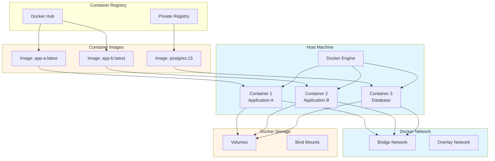

### Docker Build Process

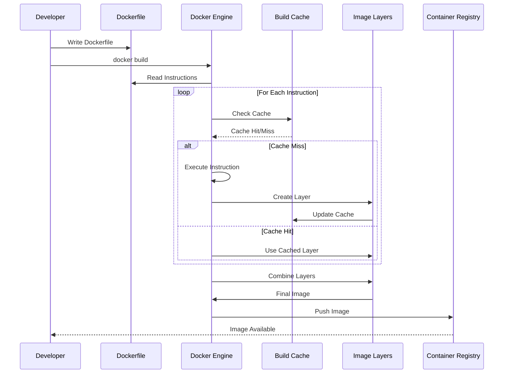

### Dockerfile

```dockerfile
# Multi-stage build
FROM node:18-alpine AS builder

WORKDIR /app

COPY package*.json ./
RUN npm ci

COPY . .
RUN npm run build

FROM node:18-alpine AS production

WORKDIR /app

COPY package*.json ./
RUN npm ci --only=production

COPY --from=builder /app/dist ./dist

EXPOSE 3000

CMD ["node", "dist/index.js"]
```

### Docker Compose

```yaml
version: '3.8'

services:
  app:
    build: .
    ports:
      - "3000:3000"
    environment:
      - NODE_ENV=production
      - DATABASE_URL=postgresql://user:pass@db:5432/mydb
    depends_on:
      - db
      - redis
  
  db:
    image: postgres:15
    environment:
      - POSTGRES_USER=user
      - POSTGRES_PASSWORD=pass
      - POSTGRES_DB=mydb
    volumes:
      - postgres_data:/var/lib/postgresql/data
  
  redis:
    image: redis:7-alpine
    volumes:
      - redis_data:/data

volumes:
  postgres_data:
  redis_data:
```

---

## Kubernetes Orchestration

### Kubernetes Cluster Architecture

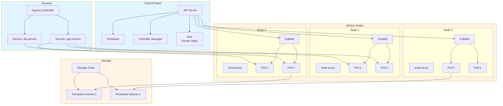

### Kubernetes Deployment Flow

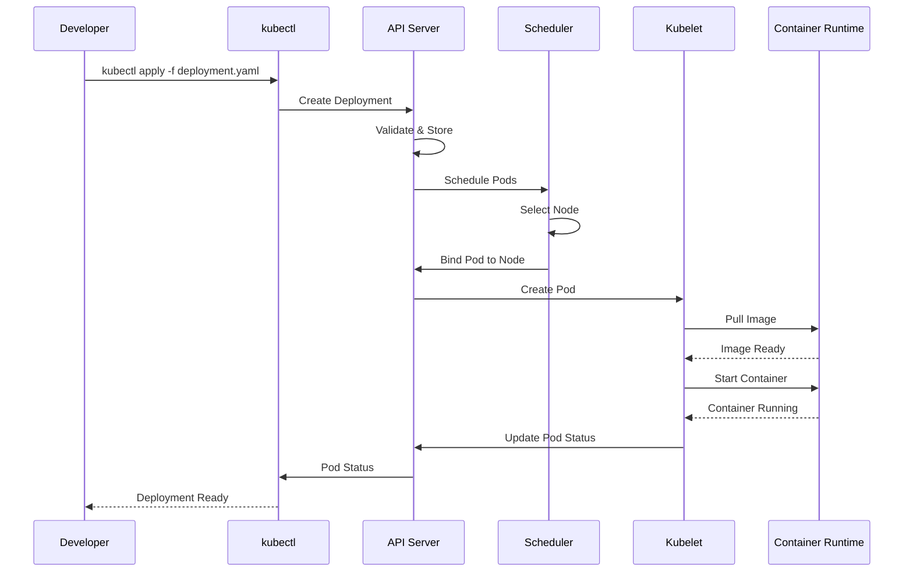

### Deployment

```yaml
apiVersion: apps/v1
kind: Deployment
metadata:
  name: myapp
spec:
  replicas: 3
  selector:
    matchLabels:
      app: myapp
  template:
    metadata:
      labels:
        app: myapp
    spec:
      containers:
      - name: myapp
        image: myapp:latest
        ports:
        - containerPort: 3000
        env:
        - name: NODE_ENV
          value: "production"
        resources:
          requests:
            memory: "256Mi"
            cpu: "250m"
          limits:
            memory: "512Mi"
            cpu: "500m"
```

### Service

```yaml
apiVersion: v1
kind: Service
metadata:
  name: myapp-service
spec:
  selector:
    app: myapp
  ports:
  - protocol: TCP
    port: 80
    targetPort: 3000
  type: LoadBalancer
```

---

## Infrastructure as Code

### Infrastructure as Code Flow

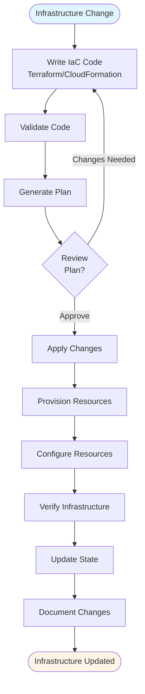

### Infrastructure as Code Architecture

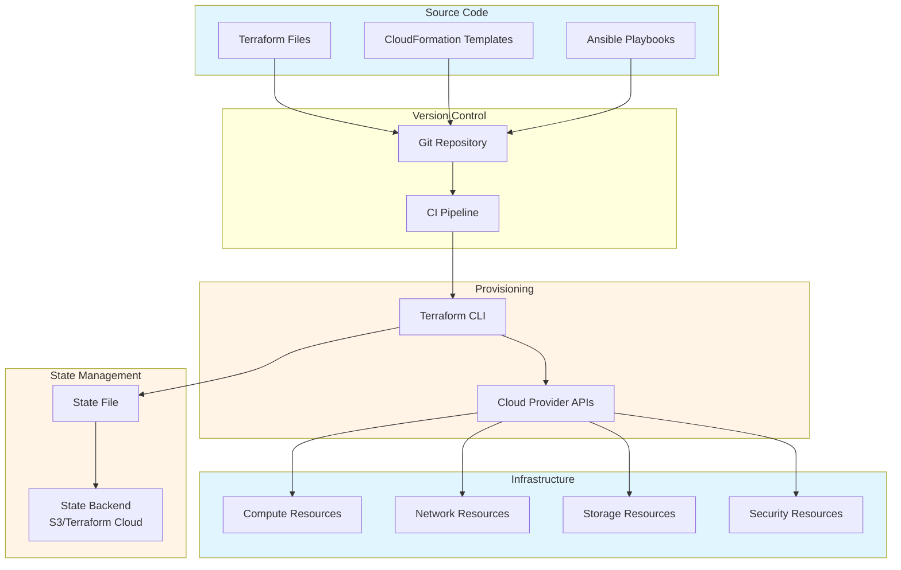

### Terraform

```hcl
# main.tf
provider "aws" {
  region = "us-east-1"
}

resource "aws_instance" "app" {
  ami           = "ami-0c55b159cbfafe1f0"
  instance_type = "t2.micro"
  
  tags = {
    Name = "MyApp"
  }
}

resource "aws_s3_bucket" "app_bucket" {
  bucket = "myapp-bucket"
  
  versioning {
    enabled = true
  }
}
```

---

## Monitoring and Logging

### Monitoring and Logging Architecture

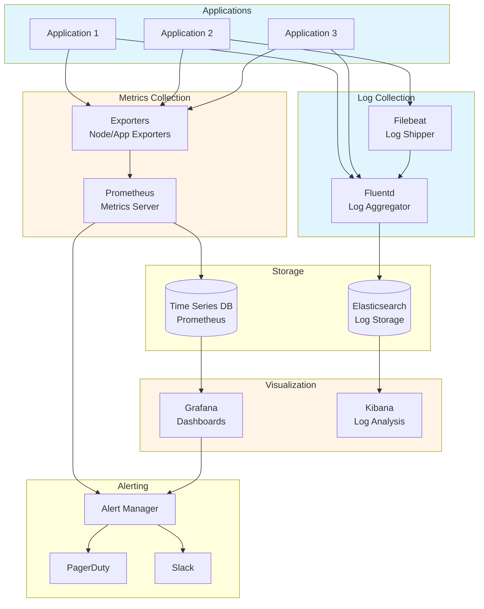

### Monitoring Data Flow

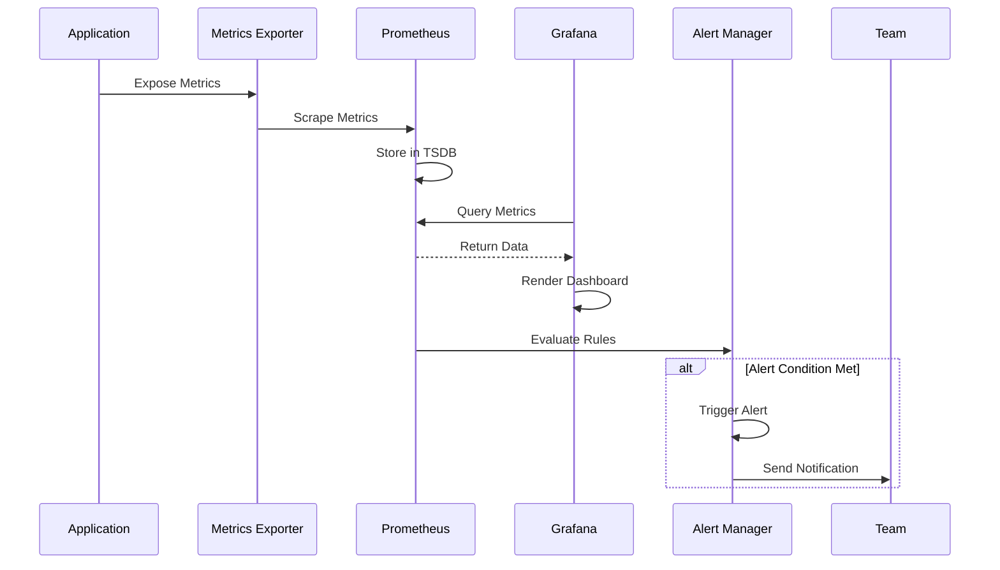

### Prometheus

```yaml
# prometheus.yml
global:
  scrape_interval: 15s

scrape_configs:
  - job_name: 'myapp'
    static_configs:
      - targets: ['localhost:3000']
```

### Grafana Dashboard

```json
{
  "dashboard": {
    "title": "MyApp Metrics",
    "panels": [
      {
        "title": "Request Rate",
        "targets": [
          {
            "expr": "rate(http_requests_total[5m])"
          }
        ]
      }
    ]
  }
}
```

---

## Deployment Strategies

### Deployment Strategies Comparison

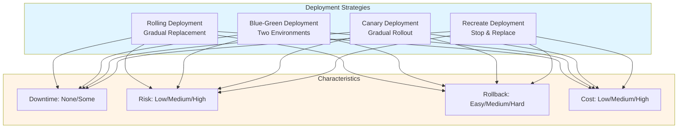

### Blue-Green Deployment Flow

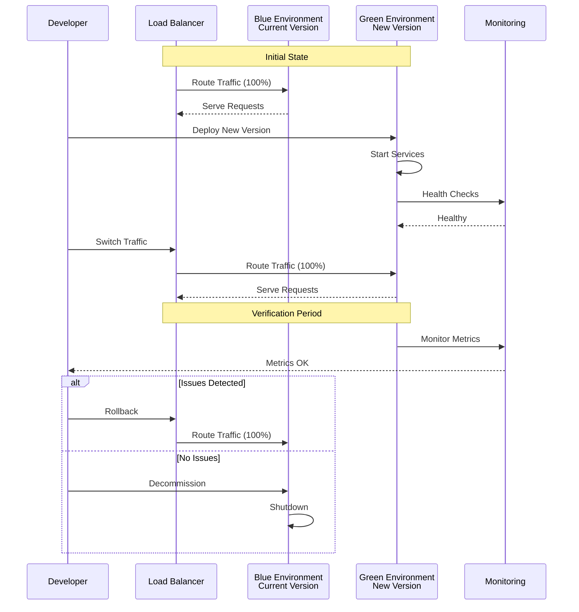

### Canary Deployment Flow

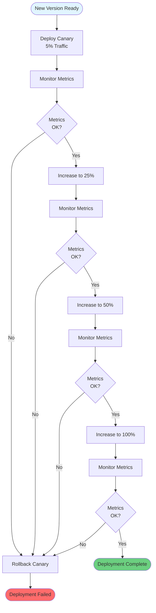

### Deployment Strategies Comparison

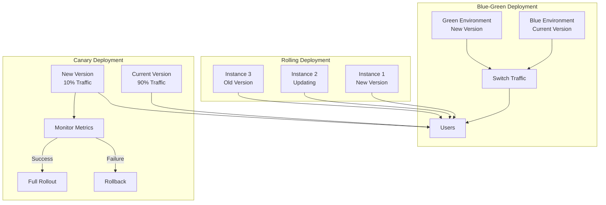

### Blue-Green Deployment

```yaml
# Deploy new version (green)
# Switch traffic from blue to green
# Keep blue for rollback
```

### Canary Deployment

```yaml
# Deploy new version to small percentage
# Monitor metrics
# Gradually increase traffic
# Full rollout or rollback
```

### Rolling Deployment

```yaml
# Gradually replace old instances
# Zero downtime
# Automatic rollback on failure
```

---

## Common Pitfalls

### 1. Not Testing in CI/CD

```yaml
# BAD: No tests in pipeline
- name: Build
  run: npm run build
- name: Deploy
  run: npm run deploy

# GOOD: Tests in pipeline
- name: Test
  run: npm test
- name: Build
  run: npm run build
- name: Deploy
  run: npm run deploy
```

### 2. Hardcoding Secrets

```yaml
# BAD: Hardcoded secrets
env:
  API_KEY: "sk_live_1234567890"

# GOOD: Use secrets
env:
  API_KEY: ${{ secrets.API_KEY }}
```

### 3. No Rollback Strategy

```yaml
# BAD: No rollback plan
- name: Deploy
  run: kubectl apply -f deployment.yaml

# GOOD: With rollback
- name: Deploy
  run: kubectl apply -f deployment.yaml
- name: Health Check
  run: ./health-check.sh
- name: Rollback on Failure
  if: failure()
  run: kubectl rollout undo deployment/app
```

---

## Best Practices

### DevOps Best Practices

1. **Infrastructure as Code**
   - Version control infrastructure
   - Use Terraform or CloudFormation
   - Review infrastructure changes

2. **Automate Everything**
   - CI/CD pipelines
   - Testing
   - Deployment
   - Monitoring

3. **Security First**
   - Scan for vulnerabilities
   - Use secrets management
   - Implement least privilege

4. **Monitor and Alert**
   - Set up monitoring
   - Configure alerts
   - Track metrics

---

## Real-World Examples

### Example 1: Complete CI/CD Pipeline

```yaml
name: CI/CD Pipeline

on:
  push:
    branches: [ main, develop ]

jobs:
  test:
    runs-on: ubuntu-latest
    steps:
      - uses: actions/checkout@v3
      - uses: actions/setup-node@v3
        with:
          node-version: '18'
      - run: npm ci
      - run: npm test
      - run: npm run lint
  
  build:
    needs: test
    runs-on: ubuntu-latest
    steps:
      - uses: actions/checkout@v3
      - uses: actions/setup-node@v3
      - run: npm ci
      - run: npm run build
      - uses: actions/upload-artifact@v3
        with:
          name: dist
          path: dist
  
  deploy:
    needs: build
    runs-on: ubuntu-latest
    if: github.ref == 'refs/heads/main'
    steps:
      - uses: actions/download-artifact@v3
        with:
          name: dist
      - name: Deploy to production
        run: |
          # Deployment commands
```

### Example 2: Docker Multi-Stage Build

```dockerfile
# Build stage
FROM node:18-alpine AS builder
WORKDIR /app
COPY package*.json ./
RUN npm ci
COPY . .
RUN npm run build

# Production stage
FROM node:18-alpine AS production
WORKDIR /app
COPY package*.json ./
RUN npm ci --only=production
COPY --from=builder /app/dist ./dist
EXPOSE 3000
CMD ["node", "dist/index.js"]
```

---

## Environment Management

### Environment Variables

```yaml
# docker-compose.yml
version: '3.8'

services:
  app:
    image: myapp:latest
    environment:
      - NODE_ENV=production
      - DATABASE_URL=${DATABASE_URL}
      - API_KEY=${API_KEY}
    env_file:
      - .env.production
```

### Configuration Management

```typescript
// config.ts
interface Config {
    database: {
        host: string;
        port: number;
        name: string;
    };
    api: {
        baseUrl: string;
        timeout: number;
    };
}

function loadConfig(): Config {
    return {
        database: {
            host: process.env.DB_HOST || 'localhost',
            port: parseInt(process.env.DB_PORT || '5432'),
            name: process.env.DB_NAME || 'mydb'
        },
        api: {
            baseUrl: process.env.API_BASE_URL || 'http://localhost:3000',
            timeout: parseInt(process.env.API_TIMEOUT || '5000')
        }
    };
}
```

---

## Secrets Management in CI/CD

### GitHub Secrets

```yaml
# .github/workflows/deploy.yml
name: Deploy

on:
  push:
    branches: [ main ]

jobs:
  deploy:
    runs-on: ubuntu-latest
    steps:
      - name: Deploy
        env:
          API_KEY: ${{ secrets.API_KEY }}
          DATABASE_URL: ${{ secrets.DATABASE_URL }}
        run: |
          echo "Deploying with secrets..."
```

### HashiCorp Vault

```typescript
import { Vault } from 'node-vault';

const vault = Vault({
    endpoint: process.env.VAULT_ADDR,
    token: process.env.VAULT_TOKEN
});

async function getSecret(path: string): Promise<any> {
    const response = await vault.read(path);
    return response.data;
}

// Usage
const dbPassword = await getSecret('secret/data/database');
```

### AWS Secrets Manager

```typescript
import { SecretsManager } from '@aws-sdk/client-secrets-manager';

const client = new SecretsManager({ region: 'us-east-1' });

async function getSecret(secretName: string): Promise<string> {
    const response = await client.getSecretValue({ SecretId: secretName });
    return JSON.parse(response.SecretString || '{}');
}
```

---

## Cloud Platforms

### AWS Deployment

```yaml
# AWS CloudFormation
Resources:
  AppFunction:
    Type: AWS::Lambda::Function
    Properties:
      FunctionName: myapp
      Runtime: nodejs18.x
      Handler: index.handler
      Code:
        ZipFile: |
          exports.handler = async (event) => {
            return { statusCode: 200, body: 'Hello' };
          };
```

### Google Cloud Platform (GCP)

```yaml
# cloudbuild.yaml
steps:
  - name: 'gcr.io/cloud-builders/docker'
    args: ['build', '-t', 'gcr.io/$PROJECT_ID/myapp', '.']
  - name: 'gcr.io/cloud-builders/docker'
    args: ['push', 'gcr.io/$PROJECT_ID/myapp']
  - name: 'gcr.io/cloud-builders/kubectl'
    args: ['set', 'image', 'deployment/myapp', 'myapp=gcr.io/$PROJECT_ID/myapp']
```

### Azure

```yaml
# azure-pipelines.yml
trigger:
  - main

pool:
  vmImage: 'ubuntu-latest'

steps:
  - task: Docker@2
    inputs:
      containerRegistry: 'AzureContainerRegistry'
      repository: 'myapp'
      command: 'buildAndPush'
      Dockerfile: '**/Dockerfile'
```

---

## Serverless Deployment

### AWS Lambda

```typescript
// lambda.ts
import { APIGatewayProxyEvent, APIGatewayProxyResult } from 'aws-lambda';

export const handler = async (
    event: APIGatewayProxyEvent
): Promise<APIGatewayProxyResult> => {
    return {
        statusCode: 200,
        body: JSON.stringify({
            message: 'Hello from Lambda',
            path: event.path
        })
    };
};
```

### Serverless Framework

```yaml
# serverless.yml
service: myapp

provider:
  name: aws
  runtime: nodejs18.x
  region: us-east-1

functions:
  hello:
    handler: handler.hello
    events:
      - http:
          path: hello
          method: get
```

---

## Disaster Recovery

### Backup Strategy

```bash
# Automated backup script
#!/bin/bash
DATE=$(date +%Y%m%d_%H%M%S)
BACKUP_DIR="/backups"
DB_NAME="mydb"

# Database backup
pg_dump $DB_NAME > $BACKUP_DIR/db_$DATE.sql

# Application backup
tar -czf $BACKUP_DIR/app_$DATE.tar.gz /app

# Upload to S3
aws s3 cp $BACKUP_DIR/db_$DATE.sql s3://backups/database/
aws s3 cp $BACKUP_DIR/app_$DATE.tar.gz s3://backups/application/
```

### Recovery Procedures

```bash
# Database recovery
psql mydb < /backups/db_20240101_120000.sql

# Application recovery
tar -xzf /backups/app_20240101_120000.tar.gz -C /app

# Rollback deployment
kubectl rollout undo deployment/myapp
```

### High Availability Setup

```yaml
# High availability configuration
apiVersion: apps/v1
kind: Deployment
metadata:
  name: myapp
spec:
  replicas: 3
  strategy:
    type: RollingUpdate
    rollingUpdate:
      maxSurge: 1
      maxUnavailable: 0
  template:
    spec:
      containers:
      - name: app
        image: myapp:latest
        livenessProbe:
          httpGet:
            path: /health
            port: 8080
          initialDelaySeconds: 30
          periodSeconds: 10
```

---

## Resources

- [GitHub Actions Documentation](https://docs.github.com/en/actions)
- [Docker Documentation](https://docs.docker.com/)
- [Kubernetes Documentation](https://kubernetes.io/docs/)

---

## Summary

Key DevOps and CI/CD practices:

1. **CI/CD**: Automate build, test, and deployment
2. **Docker**: Containerize applications
3. **Kubernetes**: Orchestrate containers
4. **Infrastructure as Code**: Manage infrastructure
5. **Monitoring**: Monitor applications
6. **Deployment Strategies**: Blue-green, canary, rolling
7. **Secrets Management**: Secure secret handling
8. **Cloud Platforms**: AWS, GCP, Azure

Master these practices to build reliable deployment pipelines.

