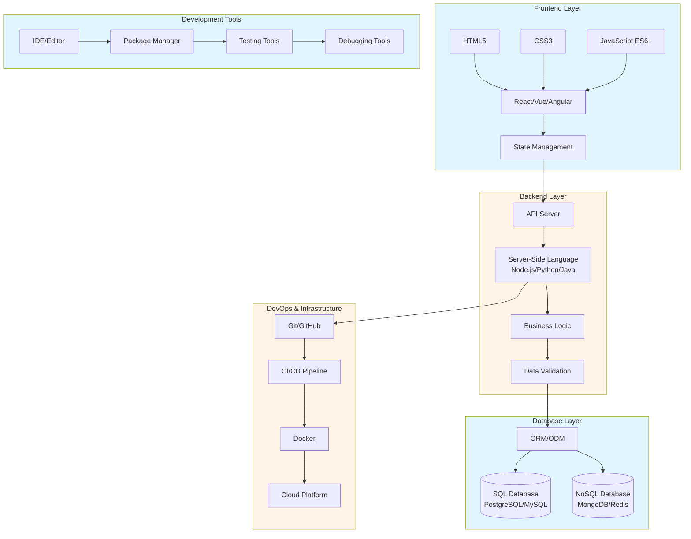
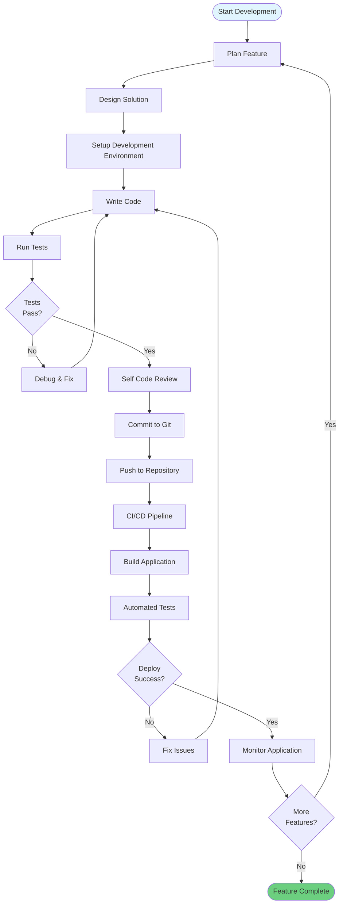

# **📘 NỘI DUNG KHÓA ĐÀO TẠO LẬP TRÌNH VIÊN FULL-STACK LEVEL JUNIOR**
## Full-Stack Junior Developer Training Course Content

Dưới đây là **phần Nội dung khóa đào tạo** được viết lại **cực kỳ chi tiết, đầy đủ, rõ ràng**, giúp học viên hiểu chính xác mình sẽ học gì, đạt được gì và lộ trình tăng cấp kỹ năng ra sao.

**English:** This is a comprehensive self-learning guide for becoming a Full-Stack Junior Developer, with detailed content, practical examples, and exercises.

---

## 🎯 Self-Learning Guide

### Full-Stack Architecture Overview



### Learning Path Flow

```mermaid
flowchart TD
    Start([Start Learning]) --> Foundation[Foundation Review<br/>Group 1]
    Foundation --> BasicFunctions[Basic Functions<br/>Group 2]
    BasicFunctions --> Algorithms[Algorithms & Optimization<br/>Group 3]
    Algorithms --> Research[Research & Q&A<br/>Group 4]
    Research --> AICoding[AI-Assisted Coding<br/>Group 5]
    AICoding --> Database[Database & SQL<br/>Group 6]
    Database --> Testing[Testing & Debugging<br/>Group 7]
    Testing --> CodeReview[Code Review<br/>Group 8]
    CodeReview --> ComplexFeatures[Complex Features<br/>Group 9]
    ComplexFeatures --> TeamWork[Team Collaboration<br/>Group 10]
    TeamWork --> Agile[Agile & Scrum<br/>Group 11]
    Agile --> Estimation[Estimation & Management<br/>Group 12]
    Estimation --> DesignPatterns[Design Patterns<br/>Group 13]
    DesignPatterns --> AdvancedTech[Advanced Technologies<br/>Group 14]
    AdvancedTech --> SoftSkills[Soft Skills<br/>Group 15]
    SoftSkills --> Performance[Performance & Optimization<br/>Group 16]
    Performance --> DevOps[DevOps & Automation<br/>Group 17]
    DevOps --> JuniorReady([Junior Developer Ready])
    
    style Start fill:#e1f5ff
    style JuniorReady fill:#6bcf7f
```



### Technology Stack Diagram

```mermaid
graph TB
    subgraph FrontendStack[Frontend Stack]
        HTML5[HTML5]
        CSS3[CSS3]
        JavaScript[JavaScript ES6+]
        Framework[React/Vue/Angular]
        BuildTools[Webpack/Vite]
    end
    
    subgraph BackendStack[Backend Stack]
        NodeJS[Node.js]
        Python[Python]
        Java[Java]
        Express[Express/FastAPI/Spring]
        APIDesign[API Design]
    end
    
    subgraph DatabaseStack[Database Stack]
        PostgreSQL[PostgreSQL]
        MySQL[MySQL]
        MongoDB[MongoDB]
        Redis[Redis]
        ORM[TypeORM/Sequelize/Mongoose]
    end
    
    subgraph DevOpsStack[DevOps Stack]
        Git[Git/GitHub]
        Docker[Docker]
        CI[CI/CD]
        Cloud[AWS/Azure/GCP]
    end
    
    subgraph ToolsStack[Tools Stack]
        VS Code[VS Code]
        Postman[Postman]
        Jest[Jest/Mocha]
        ChromeDevTools[Chrome DevTools]
    end
    
    HTML5 --> Framework
    CSS3 --> Framework
    JavaScript --> Framework
    Framework --> BuildTools
    
    NodeJS --> Express
    Python --> Express
    Java --> Express
    Express --> APIDesign
    
    PostgreSQL --> ORM
    MySQL --> ORM
    MongoDB --> ORM
    Redis --> ORM
    
    Git --> Docker
    Docker --> CI
    CI --> Cloud
    
    VS Code --> Postman
    Postman --> Jest
    Jest --> ChromeDevTools
    
    style FrontendStack fill:#e1f5ff
    style BackendStack fill:#fff4e6
    style DatabaseStack fill:#e1f5ff
    style DevOpsStack fill:#fff4e6
    style ToolsStack fill:#e1f5ff
```

### Development Workflow



This course includes **260+ topics** organized into **17 content groups**. Each group is designed to take you from foundation → practical → Junior-ready.

### 📁 Folder Structure

All content is organized in folders for easy navigation:

- **17 Group Folders** - Each group has its own folder (e.g., `Group-01-Foundation-Review/`)
- **260+ Topic Folders** - Each topic has its own folder with:
  - `README.md` - Topic content and explanation
  - `examples/` - Working code examples
  - `exercises/` - Practice exercises
  - `solutions/` - Reference solutions
  - `resources.md` - External learning resources

See [FOLDER_STRUCTURE.md](FOLDER_STRUCTURE.md) for detailed navigation guide.

### 🗺️ Learning Path

**Recommended Learning Sequence:**

1. **Start with Group 1** - Foundation Review (Essential prerequisites)
2. **Continue with Group 2** - Basic Functions (Core programming skills)
3. **Progress through Groups 3-17** - Build advanced skills systematically

**Estimated Time:**
- Foundation topics: 2-4 hours each
- Intermediate topics: 4-6 hours each
- Advanced topics: 6-8 hours each
- **Total estimated time:** 800-1200 hours

### 📚 Quick Links

- [📁 Folder Structure Guide](FOLDER_STRUCTURE.md) - Navigate the folder structure
- [🏋️ Practice Exercises](PRACTICE_EXERCISES.md) - All exercises index
- [📚 Learning Resources](RESOURCES.md) - External resources
- [✅ Self-Assessment](SELF_ASSESSMENT.md) - Track your progress
- [📖 Detailed Topics](NOI_DUNG_KHOA_HOC_CHI_TIET.md) - Complete topic list

### 🎓 How to Use This Course

1. **Read the topic README** - Understand concepts first
2. **Study code examples** - Review examples in `examples/` folder
3. **Practice exercises** - Complete exercises in `exercises/` folder
4. **Check solutions** - Compare with solutions in `solutions/` folder
5. **Track progress** - Update [SELF_ASSESSMENT.md](SELF_ASSESSMENT.md)

### 🎯 Practice Projects

**Mini Projects (2-4 hours each):**
- **Todo List App** (Group 2) - CRUD, validation, search, pagination
- **User Management System** (Group 2) - Authentication, authorization, audit log
- **File Sharing App** (Group 2) - File upload/download, access control
- **Algorithm Visualizer** (Group 3) - Visualize sorting/searching algorithms
- **Code Review Tool** (Group 8) - Automated code quality checks

**Capstone Projects (1-2 weeks each):**
- **E-Commerce Platform** - Combines Groups 1-9: Full CRUD, authentication, payments, reports
- **Social Media App** - Groups 1-9: Real-time features, file handling, complex queries
- **Project Management Tool** - Groups 1-12: Full-stack app with team collaboration
- **Blog Platform** - Groups 1-6: Content management, search, comments, file uploads

**Project Templates:**
- Starter templates available in topic folders
- Each project includes requirements checklist
- Reference implementations provided

---

## 📋 Course Overview

---

## **🔹 Nhóm 1: Ôn lại kiến thức nền tảng (Level Fresher)**

Giúp học viên kiểm tra và củng cố toàn bộ nền tảng trước khi vào phần khó hơn:

- Cấu trúc dữ liệu & giải thuật cơ bản (array, list, map, set…)
    
- Cách hoạt động của HTTP, RESTful API
    
- OOP (kế thừa, đa hình, đóng gói, interface, abstract)
    
- MVC / MVVM / Layered Architecture
    
- Git căn bản: commit, branch, merge, resolve conflict
    
- Web cơ bản: HTML5, CSS3, JavaScript ES6+
    

👉 _Mục tiêu_: Không còn “lỗ hổng kiến thức Fresher” khi bước vào phần khó.

---

## **🔹 Nhóm 2: Lập trình chức năng cơ bản → nâng cấp năng suất**

- CRUD chuẩn dự án (create, read, update, delete)
    
- Tìm kiếm nâng cao, filter, sort
    
- Pagination (client-side & server-side)
    
- Upload file, download file
    
- Authentication/Authorization cơ bản (JWT, session…)
    
- Deploy mini project
    

**Đặc biệt:**  
Bạn sẽ làm CRUD kiểu _Fresher_ khoảng thời gian đầu, sau đó trainer ép tốc độ lên ngang _Junior_ (tối ưu code, clean code, logic tốt, ít bug, đúng deadline).

---

## **🔹 Nhóm 3: Phân tích thuật toán & tối ưu code**

- Đánh giá độ phức tạp Big-O
    
- Tư duy tối ưu hiệu năng
    
- Nhận diện và tránh 20 lỗi phổ biến của lập trình viên mới
    
- Clean Code, SOLID, DRY, KISS
    
- Code như kể chuyện: viết code rõ ràng, dễ đọc, dễ review
    

👉 _Đây là nhóm giúp năng suất tăng mạnh nhất_.

---

## **🔹 Nhóm 4: Research yêu cầu & viết Q&A như trong dự án thật**

- Cách phân tích yêu cầu nghiệp vụ (BA-level)
    
- Cách viết câu hỏi Q&A gửi khách hàng
    
- Cách đọc và hiểu user story, acceptance criteria
    
- Tránh hiểu sai yêu cầu – kỹ năng rất quan trọng để trở thành Junior
    

---

## **🔹 Nhóm 5: Vibe Coding – dùng AI hỗ trợ lập trình chuyên nghiệp**

- Prompt kỹ thuật để AI viết code đúng
    
- 12 mẫu prompt để debug bằng AI
    
- Prompt kiểm tra security, hiệu năng
    
- Cách dùng AI review code tự động
    

---

## **🔹 Nhóm 6: Phân tích database & tối ưu SQL**

- Cách phân tích bảng theo nghiệp vụ thật
    
- Chuẩn hóa database: 1NF → 3NF
    
- Index: khi nào nên dùng, khi nào không
    
- Join tối ưu, subquery vs CTE
    
- Các lỗi nặng thường gặp với SQL
    
- So sánh SQL DB vs NoSQL DB (Mongo, Firebase)
    

---

## **🔹 Nhóm 7: Unit Test, Debug, Fix Bug, Lifecycle của Bug**

- Cách debug nhanh (breakpoint, logs, step-in/out)
    
- Cách đọc error message
    
- Quy trình fix bug như trong công ty
    
- Cách viết unit test cơ bản → trung cấp
    
- Mock data test, coverage test
    

👉 _Kỹ năng giúp bạn được đánh giá “Junior bền vững”, không phải Junior giấy._

---

## **🔹 Nhóm 8: Tự review code & review code người khác**

- Checklist 20 điểm review code chuẩn công ty
    
- Cách tìm lỗi ẩn trong code backend & frontend
    
- Cách refactor code cũ mà không phá hệ thống
    
- Kỹ năng trao đổi khi review: lịch sự, đúng trọng tâm
    

---

## **🔹 Nhóm 9: Chức năng phức tạp của hệ thống thực tế**

Bạn sẽ làm những module mà 80% Fresher ngoài kia không làm nổi:

- Report phức tạp (lọc dữ liệu lớn + export Excel/PDF)
    
- Multi-threading, xử lý song song
    
- Real-time: WebSocket / SSE
    
- Batch job
    
- Xử lý dữ liệu lớn (millions of rows)
    
- Transaction management
    

---

## **🔹 Nhóm 10: Làm việc với team trong dự án**

- Cách viết tài liệu rõ ràng
    
- Cách gửi mail công việc
    
- Cách trao đổi với QA, BA, PM, DevOps
    
- Cách bàn giao task
    
- Simulate 1 sprint Agile thực tế
    

---

## **🔹 Nhóm 11: Agile vs Waterfall – nắm vững Scrum**

- Sprint – Backlog – Retro – Demo
    
- Daily standup (đúng cách)
    
- Task breakdown chuẩn Junior
    
- Antipattern trong Agile
    

---

## **🔹 Nhóm 12: Estimate thời gian & tự quản lý tiến độ**

- Cách ước lượng thời gian theo kinh nghiệm thật
    
- Buffer time
    
- Kỹ thuật tự quản lý tiến độ, tránh trễ deadline
    
- Cách báo cáo tiến độ đúng format công ty
    

---

## **🔹 Nhóm 13: Design Patterns quan trọng & cách ứng dụng**

Bạn sẽ được học **15–20 Design Pattern** phổ biến:

- Singleton
    
- Factory & Abstract Factory
    
- Strategy
    
- Builder
    
- Observer
    
- Decorator
    
- Repository Pattern
    
- Dependency Injection
    

**Quan trọng:**  
Không chỉ học lý thuyết mà _phải giải thích được tại sao DP đang dùng trong dự án_.

---

## **🔹 Nhóm 14: Công nghệ nâng cao**

Mở rộng tư duy công nghệ để sẵn sàng lên Middle:

- Microservices cơ bản
    
- Kafka – message queue
    
- Redis – lưu cache tốc độ cao
    
- Elasticsearch – full-text search
    
- API Gateway, Rate limit, Circuit breaker (overview)
    

---

## **🔹 Nhóm 15: Soft Skills – kỹ năng mềm của lập trình viên Junior**

- Giao tiếp trong team
    
- Trình bày vấn đề rõ ràng
    
- Kỹ năng chống stress dự án
    
- Cách kiểm soát khối lượng công việc bằng số liệu
    
- Tư duy nghề nghiệp & mindset của Junior
    

---

## **🔹 Nhóm 16: Performance Testing & Tối ưu hệ thống**

- Load test với JMeter / k6
    
- Nhận diện bottleneck
    
- Cache strategy
    
- Tối ưu API slow, query slow
    
- Thiết kế hệ thống real-time, scale lớn
    

---

## **🔹 Nhóm 17: DevOps cơ bản & Low-Code AI Automation**

- AWS cơ bản (EC2, S3, IAM)
    
- CI/CD pipelines
    
- Docker cơ bản
    
- n8n automation
    
- LangFlow – xây AI workflow
    

---
