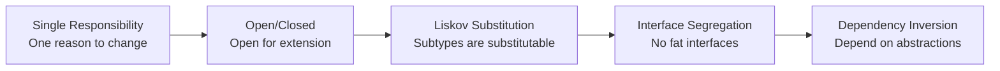
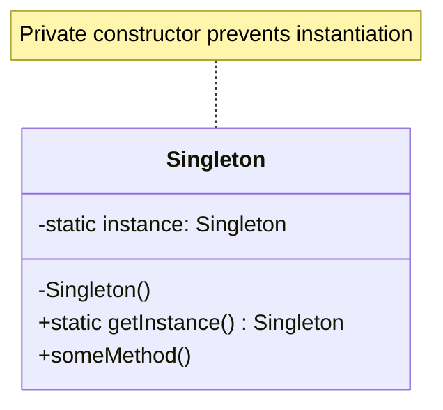
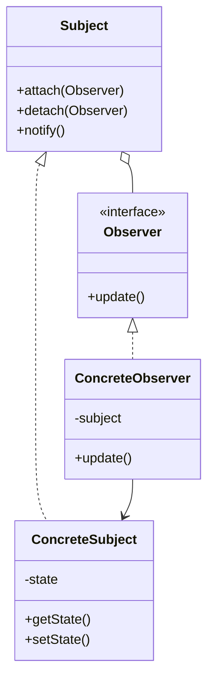
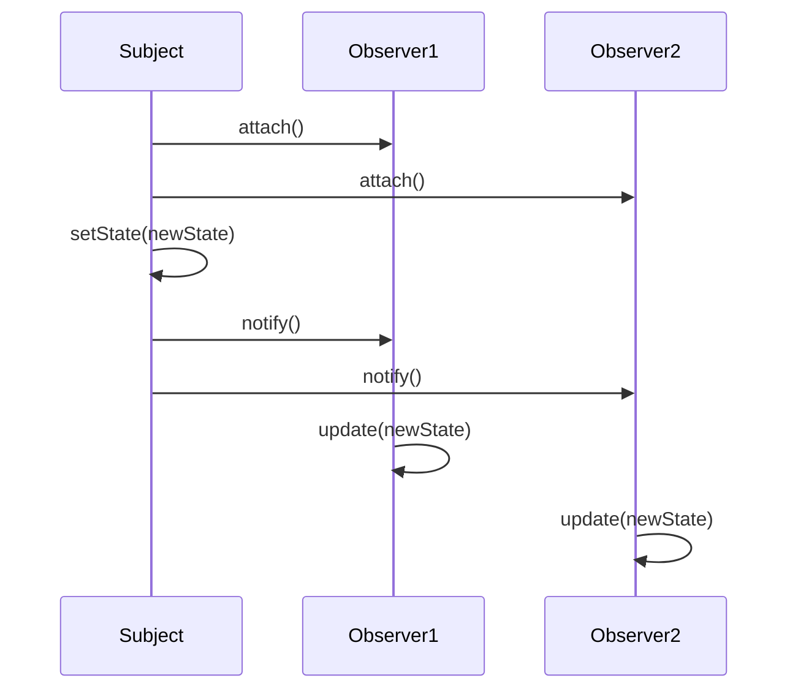

# OOP Design Patterns Guide - Comprehensive

## Table of Contents
1. [Introduction](#introduction)
2. [SOLID Principles](#solid-principles)
3. [Creational Patterns](#creational-patterns)
4. [Structural Patterns](#structural-patterns)
5. [Behavioral Patterns](#behavioral-patterns)
6. [Pattern Combinations](#pattern-combinations)
7. [Anti-Patterns](#anti-patterns)
8. [When to Use Which Pattern](#when-to-use-which-pattern)
9. [Modern Alternatives](#modern-alternatives)
10. [Real-World Examples](#real-world-examples)
11. [Resources](#resources)
12. [Summary](#summary)

---

## Introduction

Design patterns are reusable solutions to common problems in software design. This guide covers all 23 GoF (Gang of Four) design patterns plus SOLID principles, with examples in both JavaScript/TypeScript and Java.

### What Are Design Patterns?
- **Creational**: Object creation mechanisms
- **Structural**: Object composition and relationships
- **Behavioral**: Communication between objects

### Benefits
- Proven solutions to common problems
- Improved code reusability
- Better communication between developers
- Easier maintenance and extension

---

## SOLID Principles

### SOLID Principles Overview



### 1. Single Responsibility Principle (SRP)

A class should have only one reason to change.

```typescript
// BAD: Multiple responsibilities
class User {
    name: string;
    email: string;
    
    saveToDatabase() { /* ... */ }
    sendEmail() { /* ... */ }
    generateReport() { /* ... */ }
}

// GOOD: Single responsibility
class User {
    name: string;
    email: string;
}

class UserRepository {
    save(user: User) { /* ... */ }
}

class EmailService {
    sendEmail(user: User, message: string) { /* ... */ }
}

class ReportGenerator {
    generateReport(user: User) { /* ... */ }
}
```

```java
// Java example
public class User {
    private String name;
    private String email;
    // Only user data, no business logic
}

public class UserRepository {
    public void save(User user) { /* ... */ }
}

public class EmailService {
    public void sendEmail(User user, String message) { /* ... */ }
}
```

### 2. Open/Closed Principle (OCP)

Open for extension, closed for modification.

```typescript
// BAD: Modifying existing code
class AreaCalculator {
    calculate(shape: any) {
        if (shape.type === 'circle') {
            return Math.PI * shape.radius ** 2;
        } else if (shape.type === 'rectangle') {
            return shape.width * shape.height;
        }
        // Adding new shape requires modifying this method
    }
}

// GOOD: Open for extension
interface Shape {
    area(): number;
}

class Circle implements Shape {
    constructor(private radius: number) {}
    area() { return Math.PI * this.radius ** 2; }
}

class Rectangle implements Shape {
    constructor(private width: number, private height: number) {}
    area() { return this.width * this.height; }
}

class AreaCalculator {
    calculate(shape: Shape) {
        return shape.area(); // No modification needed for new shapes
    }
}
```

### 3. Liskov Substitution Principle (LSP)

Subtypes must be substitutable for their base types.

```typescript
// BAD: Violates LSP
class Rectangle {
    width: number;
    height: number;
    
    setWidth(w: number) { this.width = w; }
    setHeight(h: number) { this.height = h; }
}

class Square extends Rectangle {
    setWidth(w: number) {
        this.width = w;
        this.height = w; // Breaks rectangle behavior
    }
}

// GOOD: Proper inheritance
interface Shape {
    area(): number;
}

class Rectangle implements Shape {
    constructor(private width: number, private height: number) {}
    area() { return this.width * this.height; }
}

class Square implements Shape {
    constructor(private side: number) {}
    area() { return this.side ** 2; }
}
```

### 4. Interface Segregation Principle (ISP)

Clients shouldn't depend on interfaces they don't use.

```typescript
// BAD: Fat interface
interface Worker {
    work(): void;
    eat(): void;
    sleep(): void;
}

class Human implements Worker {
    work() { /* ... */ }
    eat() { /* ... */ }
    sleep() { /* ... */ }
}

class Robot implements Worker {
    work() { /* ... */ }
    eat() { /* ... */ } // Robots don't eat!
    sleep() { /* ... */ } // Robots don't sleep!
}

// GOOD: Segregated interfaces
interface Workable {
    work(): void;
}

interface Eatable {
    eat(): void;
}

interface Sleepable {
    sleep(): void;
}

class Human implements Workable, Eatable, Sleepable {
    work() { /* ... */ }
    eat() { /* ... */ }
    sleep() { /* ... */ }
}

class Robot implements Workable {
    work() { /* ... */ }
}
```

### 5. Dependency Inversion Principle (DIP)

Depend on abstractions, not concretions.

```typescript
// BAD: Dependency on concrete class
class MySQLDatabase {
    save(data: string) { /* ... */ }
}

class UserService {
    private db = new MySQLDatabase(); // Tight coupling
    
    saveUser(user: User) {
        this.db.save(JSON.stringify(user));
    }
}

// GOOD: Dependency on abstraction
interface Database {
    save(data: string): void;
}

class MySQLDatabase implements Database {
    save(data: string) { /* ... */ }
}

class PostgreSQLDatabase implements Database {
    save(data: string) { /* ... */ }
}

class UserService {
    constructor(private db: Database) {} // Dependency injection
    
    saveUser(user: User) {
        this.db.save(JSON.stringify(user));
    }
}
```

---

## Creational Patterns

### 1. Singleton Pattern

Ensure a class has only one instance and provide global access.

#### Class Diagram



```typescript
// TypeScript implementation
class DatabaseConnection {
    private static instance: DatabaseConnection;
    
    private constructor() {
        // Private constructor prevents instantiation
    }
    
    static getInstance(): DatabaseConnection {
        if (!DatabaseConnection.instance) {
            DatabaseConnection.instance = new DatabaseConnection();
        }
        return DatabaseConnection.instance;
    }
    
    connect() {
        console.log('Connected to database');
    }
}

// Usage
const db1 = DatabaseConnection.getInstance();
const db2 = DatabaseConnection.getInstance();
console.log(db1 === db2); // true
```

```java
// Java implementation (thread-safe)
public class DatabaseConnection {
    private static volatile DatabaseConnection instance;
    
    private DatabaseConnection() {}
    
    public static DatabaseConnection getInstance() {
        if (instance == null) {
            synchronized (DatabaseConnection.class) {
                if (instance == null) {
                    instance = new DatabaseConnection();
                }
            }
        }
        return instance;
    }
}
```

### 2. Factory Method Pattern

Define an interface for creating objects, but let subclasses decide which class to instantiate.

```typescript
// Product interface
interface Logger {
    log(message: string): void;
}

// Concrete products
class FileLogger implements Logger {
    log(message: string) {
        console.log(`File: ${message}`);
    }
}

class ConsoleLogger implements Logger {
    log(message: string) {
        console.log(`Console: ${message}`);
    }
}

// Creator
abstract class LoggerFactory {
    abstract createLogger(): Logger;
    
    log(message: string) {
        const logger = this.createLogger();
        logger.log(message);
    }
}

// Concrete creators
class FileLoggerFactory extends LoggerFactory {
    createLogger(): Logger {
        return new FileLogger();
    }
}

class ConsoleLoggerFactory extends LoggerFactory {
    createLogger(): Logger {
        return new ConsoleLogger();
    }
}
```

### 3. Abstract Factory Pattern

Provide an interface for creating families of related objects.

```typescript
// Abstract products
interface Button {
    render(): void;
}

interface Checkbox {
    render(): void;
}

// Concrete products - Windows
class WindowsButton implements Button {
    render() { console.log('Windows button'); }
}

class WindowsCheckbox implements Checkbox {
    render() { console.log('Windows checkbox'); }
}

// Concrete products - Mac
class MacButton implements Button {
    render() { console.log('Mac button'); }
}

class MacCheckbox implements Checkbox {
    render() { console.log('Mac checkbox'); }
}

// Abstract factory
interface UIFactory {
    createButton(): Button;
    createCheckbox(): Checkbox;
}

// Concrete factories
class WindowsFactory implements UIFactory {
    createButton(): Button { return new WindowsButton(); }
    createCheckbox(): Checkbox { return new WindowsCheckbox(); }
}

class MacFactory implements UIFactory {
    createButton(): Button { return new MacButton(); }
    createCheckbox(): Checkbox { return new MacCheckbox(); }
}
```

### 4. Builder Pattern

Construct complex objects step by step.

```typescript
class Pizza {
    size: string = '';
    cheese: boolean = false;
    pepperoni: boolean = false;
    bacon: boolean = false;
    
    toString(): string {
        return `Pizza: ${this.size}, cheese: ${this.cheese}, pepperoni: ${this.pepperoni}, bacon: ${this.bacon}`;
    }
}

class PizzaBuilder {
    private pizza: Pizza = new Pizza();
    
    setSize(size: string): PizzaBuilder {
        this.pizza.size = size;
        return this;
    }
    
    addCheese(): PizzaBuilder {
        this.pizza.cheese = true;
        return this;
    }
    
    addPepperoni(): PizzaBuilder {
        this.pizza.pepperoni = true;
        return this;
    }
    
    addBacon(): PizzaBuilder {
        this.pizza.bacon = true;
        return this;
    }
    
    build(): Pizza {
        return this.pizza;
    }
}

// Usage
const pizza = new PizzaBuilder()
    .setSize('large')
    .addCheese()
    .addPepperoni()
    .build();
```

### 5. Prototype Pattern

Create objects by cloning existing instances.

```typescript
interface Cloneable {
    clone(): Cloneable;
}

class Shape implements Cloneable {
    constructor(
        public x: number,
        public y: number,
        public color: string
    ) {}
    
    clone(): Shape {
        return new Shape(this.x, this.y, this.color);
    }
}

// Usage
const original = new Shape(10, 20, 'red');
const copy = original.clone();
```

---

## Structural Patterns

### 1. Adapter Pattern

Allow incompatible interfaces to work together.

```typescript
// Target interface
interface MediaPlayer {
    play(audioType: string, fileName: string): void;
}

// Adaptee
class AdvancedMediaPlayer {
    playVlc(fileName: string) {
        console.log(`Playing VLC: ${fileName}`);
    }
    
    playMp4(fileName: string) {
        console.log(`Playing MP4: ${fileName}`);
    }
}

// Adapter
class MediaAdapter implements MediaPlayer {
    private advancedPlayer: AdvancedMediaPlayer;
    
    constructor(audioType: string) {
        if (audioType === 'vlc' || audioType === 'mp4') {
            this.advancedPlayer = new AdvancedMediaPlayer();
        }
    }
    
    play(audioType: string, fileName: string) {
        if (audioType === 'vlc') {
            this.advancedPlayer.playVlc(fileName);
        } else if (audioType === 'mp4') {
            this.advancedPlayer.playMp4(fileName);
        }
    }
}
```

### 2. Decorator Pattern

Attach additional responsibilities to objects dynamically.

```typescript
interface Coffee {
    cost(): number;
    description(): string;
}

class SimpleCoffee implements Coffee {
    cost() { return 5; }
    description() { return 'Simple coffee'; }
}

class CoffeeDecorator implements Coffee {
    constructor(protected coffee: Coffee) {}
    
    cost() { return this.coffee.cost(); }
    description() { return this.coffee.description(); }
}

class MilkDecorator extends CoffeeDecorator {
    cost() { return this.coffee.cost() + 2; }
    description() { return this.coffee.description() + ', milk'; }
}

class SugarDecorator extends CoffeeDecorator {
    cost() { return this.coffee.cost() + 1; }
    description() { return this.coffee.description() + ', sugar'; }
}

// Usage
let coffee: Coffee = new SimpleCoffee();
coffee = new MilkDecorator(coffee);
coffee = new SugarDecorator(coffee);
console.log(coffee.description()); // Simple coffee, milk, sugar
console.log(coffee.cost()); // 8
```

### 3. Facade Pattern

Provide a simplified interface to a complex subsystem.

```typescript
class CPU {
    freeze() { console.log('CPU freeze'); }
    jump(position: number) { console.log(`CPU jump to ${position}`); }
    execute() { console.log('CPU execute'); }
}

class Memory {
    load(position: number, data: string) {
        console.log(`Memory load at ${position}: ${data}`);
    }
}

class HardDrive {
    read(lba: number, size: number) {
        console.log(`HardDrive read LBA ${lba}, size ${size}`);
        return 'data';
    }
}

// Facade
class ComputerFacade {
    private cpu: CPU;
    private memory: Memory;
    private hardDrive: HardDrive;
    
    constructor() {
        this.cpu = new CPU();
        this.memory = new Memory();
        this.hardDrive = new HardDrive();
    }
    
    start() {
        this.cpu.freeze();
        this.memory.load(0, this.hardDrive.read(0, 1024));
        this.cpu.jump(0);
        this.cpu.execute();
    }
}

// Usage
const computer = new ComputerFacade();
computer.start();
```

### 4. Proxy Pattern

Provide a surrogate or placeholder for another object.

```typescript
interface Image {
    display(): void;
}

class RealImage implements Image {
    private fileName: string;
    
    constructor(fileName: string) {
        this.fileName = fileName;
        this.loadFromDisk();
    }
    
    private loadFromDisk() {
        console.log(`Loading ${this.fileName}`);
    }
    
    display() {
        console.log(`Displaying ${this.fileName}`);
    }
}

class ProxyImage implements Image {
    private realImage: RealImage | null = null;
    private fileName: string;
    
    constructor(fileName: string) {
        this.fileName = fileName;
    }
    
    display() {
        if (!this.realImage) {
            this.realImage = new RealImage(this.fileName);
        }
        this.realImage.display();
    }
}
```

### 5. Bridge Pattern

Decouple an abstraction from its implementation so they can vary independently.

```typescript
// Implementation interface
interface Renderer {
    renderCircle(radius: number): void;
    renderSquare(side: number): void;
}

// Concrete implementations
class VectorRenderer implements Renderer {
    renderCircle(radius: number) {
        console.log(`Drawing a circle of radius ${radius} as vector`);
    }
    renderSquare(side: number) {
        console.log(`Drawing a square of side ${side} as vector`);
    }
}

class RasterRenderer implements Renderer {
    renderCircle(radius: number) {
        console.log(`Drawing a circle of radius ${radius} as pixels`);
    }
    renderSquare(side: number) {
        console.log(`Drawing a square of side ${side} as pixels`);
    }
}

// Abstraction
abstract class Shape {
    constructor(protected renderer: Renderer) {}
    abstract draw(): void;
}

class Circle extends Shape {
    constructor(renderer: Renderer, private radius: number) {
        super(renderer);
    }
    
    draw() {
        this.renderer.renderCircle(this.radius);
    }
}

class Square extends Shape {
    constructor(renderer: Renderer, private side: number) {
        super(renderer);
    }
    
    draw() {
        this.renderer.renderSquare(this.side);
    }
}
```

### 6. Composite Pattern

Compose objects into tree structures to represent part-whole hierarchies.

```typescript
interface Component {
    operation(): void;
    add(component: Component): void;
    remove(component: Component): void;
    getChild(index: number): Component | null;
}

class Leaf implements Component {
    constructor(private name: string) {}
    
    operation() {
        console.log(`Leaf ${this.name} operation`);
    }
    
    add(component: Component) {
        throw new Error('Cannot add to leaf');
    }
    
    remove(component: Component) {
        throw new Error('Cannot remove from leaf');
    }
    
    getChild(index: number) {
        return null;
    }
}

class Composite implements Component {
    private children: Component[] = [];
    
    constructor(private name: string) {}
    
    operation() {
        console.log(`Composite ${this.name} operation`);
        this.children.forEach(child => child.operation());
    }
    
    add(component: Component) {
        this.children.push(component);
    }
    
    remove(component: Component) {
        const index = this.children.indexOf(component);
        if (index > -1) {
            this.children.splice(index, 1);
        }
    }
    
    getChild(index: number) {
        return this.children[index] || null;
    }
}
```

### 7. Flyweight Pattern

Use sharing to support large numbers of fine-grained objects efficiently.

```typescript
// Flyweight interface
interface TreeType {
    name: string;
    color: string;
    texture: string;
    draw(canvas: string, x: number, y: number): void;
}

// Concrete flyweight
class ConcreteTreeType implements TreeType {
    constructor(
        public name: string,
        public color: string,
        public texture: string
    ) {}
    
    draw(canvas: string, x: number, y: number) {
        console.log(`Drawing ${this.name} tree at (${x}, ${y})`);
    }
}

// Flyweight factory
class TreeTypeFactory {
    private static treeTypes: Map<string, TreeType> = new Map();
    
    static getTreeType(name: string, color: string, texture: string): TreeType {
        const key = `${name}_${color}_${texture}`;
        if (!this.treeTypes.has(key)) {
            this.treeTypes.set(key, new ConcreteTreeType(name, color, texture));
        }
        return this.treeTypes.get(key)!;
    }
}

// Context (extrinsic state)
class Tree {
    constructor(
        private x: number,
        private y: number,
        private type: TreeType
    ) {}
    
    draw(canvas: string) {
        this.type.draw(canvas, this.x, this.y);
    }
}
```

```typescript
interface Image {
    display(): void;
}

class RealImage implements Image {
    private fileName: string;
    
    constructor(fileName: string) {
        this.fileName = fileName;
        this.loadFromDisk();
    }
    
    private loadFromDisk() {
        console.log(`Loading ${this.fileName}`);
    }
    
    display() {
        console.log(`Displaying ${this.fileName}`);
    }
}

class ProxyImage implements Image {
    private realImage: RealImage | null = null;
    private fileName: string;
    
    constructor(fileName: string) {
        this.fileName = fileName;
    }
    
    display() {
        if (!this.realImage) {
            this.realImage = new RealImage(this.fileName);
        }
        this.realImage.display();
    }
}
```

---

## Behavioral Patterns

### 1. Observer Pattern

Define a one-to-many dependency between objects.

#### Class Diagram



#### Sequence Diagram



```typescript
interface Observer {
    update(data: any): void;
}

interface Subject {
    attach(observer: Observer): void;
    detach(observer: Observer): void;
    notify(): void;
}

class ConcreteSubject implements Subject {
    private observers: Observer[] = [];
    private state: any;
    
    attach(observer: Observer) {
        this.observers.push(observer);
    }
    
    detach(observer: Observer) {
        const index = this.observers.indexOf(observer);
        if (index > -1) {
            this.observers.splice(index, 1);
        }
    }
    
    notify() {
        this.observers.forEach(observer => observer.update(this.state));
    }
    
    setState(state: any) {
        this.state = state;
        this.notify();
    }
}

class ConcreteObserver implements Observer {
    constructor(private name: string) {}
    
    update(data: any) {
        console.log(`${this.name} received: ${data}`);
    }
}

// Usage
const subject = new ConcreteSubject();
const observer1 = new ConcreteObserver('Observer 1');
const observer2 = new ConcreteObserver('Observer 2');

subject.attach(observer1);
subject.attach(observer2);
subject.setState('New state');
```

### 2. Strategy Pattern

Define a family of algorithms, encapsulate each one, and make them interchangeable.

```typescript
interface PaymentStrategy {
    pay(amount: number): void;
}

class CreditCardStrategy implements PaymentStrategy {
    constructor(private cardNumber: string) {}
    
    pay(amount: number) {
        console.log(`Paid ${amount} using credit card ${this.cardNumber}`);
    }
}

class PayPalStrategy implements PaymentStrategy {
    constructor(private email: string) {}
    
    pay(amount: number) {
        console.log(`Paid ${amount} using PayPal ${this.email}`);
    }
}

class ShoppingCart {
    private paymentStrategy: PaymentStrategy;
    
    setPaymentStrategy(strategy: PaymentStrategy) {
        this.paymentStrategy = strategy;
    }
    
    checkout(amount: number) {
        this.paymentStrategy.pay(amount);
    }
}

// Usage
const cart = new ShoppingCart();
cart.setPaymentStrategy(new CreditCardStrategy('1234-5678'));
cart.checkout(100);
```

### 3. Command Pattern

Encapsulate a request as an object.

```typescript
interface Command {
    execute(): void;
    undo(): void;
}

class Light {
    on() { console.log('Light is on'); }
    off() { console.log('Light is off'); }
}

class LightOnCommand implements Command {
    constructor(private light: Light) {}
    
    execute() { this.light.on(); }
    undo() { this.light.off(); }
}

class LightOffCommand implements Command {
    constructor(private light: Light) {}
    
    execute() { this.light.off(); }
    undo() { this.light.on(); }
}

class RemoteControl {
    private command: Command;
    
    setCommand(command: Command) {
        this.command = command;
    }
    
    pressButton() {
        this.command.execute();
    }
    
    pressUndo() {
        this.command.undo();
    }
}
```

### 4. Iterator Pattern

Provide a way to access elements of an aggregate object sequentially.

```typescript
interface Iterator<T> {
    hasNext(): boolean;
    next(): T;
}

interface Iterable<T> {
    createIterator(): Iterator<T>;
}

class BookIterator implements Iterator<Book> {
    private position = 0;
    
    constructor(private books: Book[]) {}
    
    hasNext(): boolean {
        return this.position < this.books.length;
    }
    
    next(): Book {
        return this.books[this.position++];
    }
}

class BookCollection implements Iterable<Book> {
    private books: Book[] = [];
    
    add(book: Book) {
        this.books.push(book);
    }
    
    createIterator(): Iterator<Book> {
        return new BookIterator(this.books);
    }
}
```

### 5. State Pattern

Allow an object to alter its behavior when its internal state changes.

```typescript
interface State {
    handle(context: Context): void;
}

class ConcreteStateA implements State {
    handle(context: Context) {
        console.log('State A handling');
        context.setState(new ConcreteStateB());
    }
}

class ConcreteStateB implements State {
    handle(context: Context) {
        console.log('State B handling');
        context.setState(new ConcreteStateA());
    }
}

class Context {
    private state: State;
    
    constructor(state: State) {
        this.state = state;
    }
    
    setState(state: State) {
        this.state = state;
    }
    
    request() {
        this.state.handle(this);
    }
}
```

### 6. Template Method Pattern

Define the skeleton of an algorithm, deferring some steps to subclasses.

```typescript
abstract class DataProcessor {
    // Template method
    process() {
        const data = this.readData();
        const processed = this.processData(data);
        this.saveData(processed);
    }
    
    abstract readData(): string;
    abstract processData(data: string): string;
    
    saveData(data: string) {
        console.log(`Saving: ${data}`);
    }
}

class XMLProcessor extends DataProcessor {
    readData() {
        return 'XML data';
    }
    
    processData(data: string) {
        return `Processed ${data}`;
    }
}

class JSONProcessor extends DataProcessor {
    readData() {
        return 'JSON data';
    }
    
    processData(data: string) {
        return `Processed ${data}`;
    }
}
```

### 7. Chain of Responsibility Pattern

Pass requests along a chain of handlers.

```typescript
interface Handler {
    setNext(handler: Handler): Handler;
    handle(request: string): string | null;
}

abstract class AbstractHandler implements Handler {
    private nextHandler: Handler | null = null;
    
    setNext(handler: Handler): Handler {
        this.nextHandler = handler;
        return handler;
    }
    
    handle(request: string): string | null {
        if (this.nextHandler) {
            return this.nextHandler.handle(request);
        }
        return null;
    }
}

class MonkeyHandler extends AbstractHandler {
    handle(request: string): string | null {
        if (request === 'Banana') {
            return `Monkey: I'll eat the ${request}`;
        }
        return super.handle(request);
    }
}

class SquirrelHandler extends AbstractHandler {
    handle(request: string): string | null {
        if (request === 'Nut') {
            return `Squirrel: I'll eat the ${request}`;
        }
        return super.handle(request);
    }
}

class DogHandler extends AbstractHandler {
    handle(request: string): string | null {
        if (request === 'MeatBall') {
            return `Dog: I'll eat the ${request}`;
        }
        return super.handle(request);
    }
}
```

### 8. Mediator Pattern

Define an object that encapsulates how a set of objects interact.

```typescript
interface Mediator {
    notify(sender: Component, event: string): void;
}

class ConcreteMediator implements Mediator {
    private component1: Component1;
    private component2: Component2;
    
    setComponent1(component: Component1) {
        this.component1 = component;
    }
    
    setComponent2(component: Component2) {
        this.component2 = component;
    }
    
    notify(sender: Component, event: string) {
        if (event === 'A') {
            console.log('Mediator reacts on A and triggers:');
            this.component2.doC();
        }
        if (event === 'D') {
            console.log('Mediator reacts on D and triggers:');
            this.component1.doB();
        }
    }
}

class BaseComponent {
    constructor(protected mediator: Mediator) {}
}

class Component1 extends BaseComponent {
    doA() {
        console.log('Component 1 does A');
        this.mediator.notify(this, 'A');
    }
    
    doB() {
        console.log('Component 1 does B');
    }
}

class Component2 extends BaseComponent {
    doC() {
        console.log('Component 2 does C');
    }
    
    doD() {
        console.log('Component 2 does D');
        this.mediator.notify(this, 'D');
    }
}
```

### 9. Memento Pattern

Capture and restore an object's internal state.

```typescript
class Memento {
    constructor(private state: string) {}
    
    getState(): string {
        return this.state;
    }
}

class Originator {
    private state: string = '';
    
    setState(state: string) {
        this.state = state;
    }
    
    getState(): string {
        return this.state;
    }
    
    save(): Memento {
        return new Memento(this.state);
    }
    
    restore(memento: Memento) {
        this.state = memento.getState();
    }
}

class Caretaker {
    private mementos: Memento[] = [];
    
    addMemento(memento: Memento) {
        this.mementos.push(memento);
    }
    
    getMemento(index: number): Memento {
        return this.mementos[index];
    }
}
```

### 10. Visitor Pattern

Represent an operation to be performed on elements of an object structure.

```typescript
interface Visitor {
    visitConcreteElementA(element: ConcreteElementA): void;
    visitConcreteElementB(element: ConcreteElementB): void;
}

interface Element {
    accept(visitor: Visitor): void;
}

class ConcreteElementA implements Element {
    accept(visitor: Visitor) {
        visitor.visitConcreteElementA(this);
    }
    
    operationA() {
        return 'A';
    }
}

class ConcreteElementB implements Element {
    accept(visitor: Visitor) {
        visitor.visitConcreteElementB(this);
    }
    
    operationB() {
        return 'B';
    }
}

class ConcreteVisitor1 implements Visitor {
    visitConcreteElementA(element: ConcreteElementA) {
        console.log(`Visitor1: ${element.operationA()}`);
    }
    
    visitConcreteElementB(element: ConcreteElementB) {
        console.log(`Visitor1: ${element.operationB()}`);
    }
}

class ConcreteVisitor2 implements Visitor {
    visitConcreteElementA(element: ConcreteElementA) {
        console.log(`Visitor2: ${element.operationA()}`);
    }
    
    visitConcreteElementB(element: ConcreteElementB) {
        console.log(`Visitor2: ${element.operationB()}`);
    }
}
```

```typescript
interface Command {
    execute(): void;
    undo(): void;
}

class Light {
    on() { console.log('Light is on'); }
    off() { console.log('Light is off'); }
}

class LightOnCommand implements Command {
    constructor(private light: Light) {}
    
    execute() { this.light.on(); }
    undo() { this.light.off(); }
}

class LightOffCommand implements Command {
    constructor(private light: Light) {}
    
    execute() { this.light.off(); }
    undo() { this.light.on(); }
}

class RemoteControl {
    private command: Command;
    
    setCommand(command: Command) {
        this.command = command;
    }
    
    pressButton() {
        this.command.execute();
    }
    
    pressUndo() {
        this.command.undo();
    }
}
```

---

## Pattern Combinations

### Repository + Factory

```typescript
interface Repository<T> {
    findById(id: string): Promise<T | null>;
    save(entity: T): Promise<T>;
}

class UserRepository implements Repository<User> {
    async findById(id: string) { /* ... */ }
    async save(user: User) { /* ... */ }
}

class RepositoryFactory {
    static create<T>(type: string): Repository<T> {
        switch (type) {
            case 'user':
                return new UserRepository() as Repository<T>;
            default:
                throw new Error('Unknown repository type');
        }
    }
}
```

---

## Anti-Patterns

### 1. God Object

A class that knows too much or does too much.

```typescript
// BAD: God object
class UserManager {
    // Too many responsibilities
    createUser() { /* ... */ }
    deleteUser() { /* ... */ }
    sendEmail() { /* ... */ }
    generateReport() { /* ... */ }
    processPayment() { /* ... */ }
    updateDatabase() { /* ... */ }
}

// GOOD: Separated concerns
class UserService {
    createUser() { /* ... */ }
    deleteUser() { /* ... */ }
}

class EmailService {
    sendEmail() { /* ... */ }
}

class ReportService {
    generateReport() { /* ... */ }
}
```

### 2. Anemic Domain Model

Objects with no behavior, only data.

```typescript
// BAD: Anemic model
class User {
    name: string;
    email: string;
    age: number;
}

class UserService {
    calculateAge(user: User) { /* ... */ }
    validateEmail(user: User) { /* ... */ }
}

// GOOD: Rich domain model
class User {
    constructor(
        private name: string,
        private email: string,
        private birthDate: Date
    ) {}
    
    getAge(): number {
        return new Date().getFullYear() - this.birthDate.getFullYear();
    }
    
    isValidEmail(): boolean {
        return this.email.includes('@');
    }
}
```

---

## When to Use Which Pattern

### Creational Patterns
- **Singleton**: When you need exactly one instance
- **Factory**: When object creation logic is complex
- **Builder**: When constructing complex objects step by step
- **Prototype**: When object creation is expensive

### Structural Patterns
- **Adapter**: When integrating incompatible interfaces
- **Decorator**: When adding behavior dynamically
- **Facade**: When simplifying complex subsystems
- **Proxy**: When controlling access to objects
- **Bridge**: When you want to separate abstraction from implementation
- **Composite**: When you need to represent part-whole hierarchies
- **Flyweight**: When you need to support large numbers of fine-grained objects

### Behavioral Patterns
- **Observer**: When objects need to notify others of changes
- **Strategy**: When algorithms are interchangeable
- **Command**: When requests need to be queued or logged
- **Iterator**: When you need to traverse collections
- **State**: When object behavior depends on its state
- **Template Method**: When you want to define algorithm skeleton
- **Chain of Responsibility**: When you want to pass requests along a chain
- **Mediator**: When you want to reduce coupling between objects
- **Memento**: When you need to save/restore object state
- **Visitor**: When you need to perform operations on object structures

---

## Modern Alternatives

### Dependency Injection vs Service Locator

```typescript
// Service Locator (anti-pattern)
class ServiceLocator {
    static getService<T>(name: string): T {
        // Returns service from registry
    }
}

// Dependency Injection (better)
class UserService {
    constructor(
        private userRepository: UserRepository,
        private emailService: EmailService
    ) {}
}
```

---

## Resources

- [Design Patterns: Elements of Reusable Object-Oriented Software](https://en.wikipedia.org/wiki/Design_Patterns)
- [Refactoring Guru - Design Patterns](https://refactoring.guru/design-patterns)

---

## Summary

Design patterns provide proven solutions to common design problems:

1. **SOLID Principles**: Foundation of good object-oriented design
2. **Creational Patterns**: Object creation mechanisms
3. **Structural Patterns**: Object composition
4. **Behavioral Patterns**: Object communication
5. **Pattern Combinations**: Using multiple patterns together
6. **Anti-Patterns**: What to avoid
7. **Modern Alternatives**: Contemporary approaches

Master these patterns to write maintainable, extensible, and robust code.

