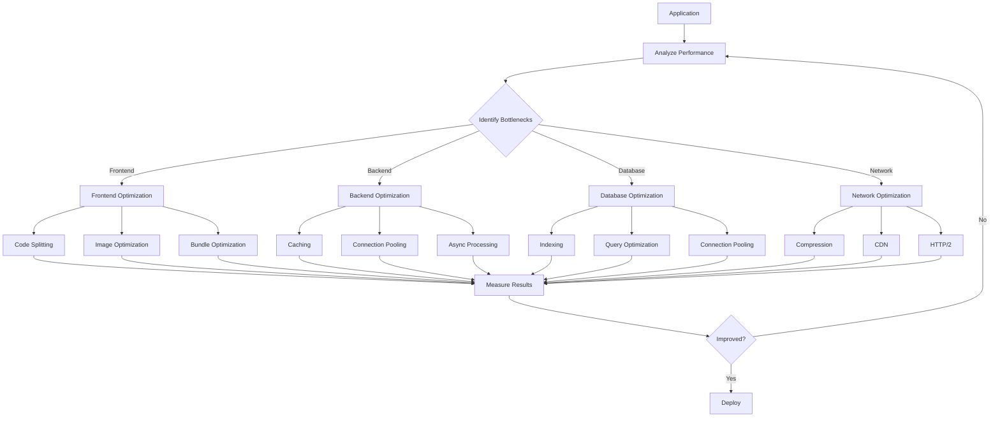

# Performance Optimization Guide - Comprehensive

## Table of Contents
1. [Introduction](#introduction)
2. [Frontend Performance](#frontend-performance)
3. [Backend Performance](#backend-performance)
4. [Database Performance](#database-performance)
5. [API Performance](#api-performance)
6. [Memory Optimization](#memory-optimization)
7. [CPU Optimization](#cpu-optimization)
8. [Network Optimization](#network-optimization)
9. [Profiling and Monitoring](#profiling-and-monitoring)
10. [Core Web Vitals](#core-web-vitals)
11. [Common Pitfalls](#common-pitfalls)
12. [Best Practices](#best-practices)
13. [Real-World Examples](#real-world-optimization-case-studies)
14. [Resources](#resources)
15. [Summary](#summary)

---

## Introduction

This guide covers performance optimization techniques for frontend, backend, databases, and APIs. Learn to build fast, efficient applications.

### Who This Guide Is For
- Frontend developers
- Backend developers
- Full stack developers
- Performance engineers

---

## Frontend Performance

### Performance Optimization Flow



### Code Splitting

```typescript
// Dynamic imports
const HeavyComponent = dynamic(() => import('./HeavyComponent'), {
    loading: () => <div>Loading...</div>
});

// Route-based splitting
const AdminPanel = dynamic(() => import('./AdminPanel'));
```

### Image Optimization

```typescript
// Next.js Image component
import Image from 'next/image';

<Image
    src="/image.jpg"
    width={500}
    height={300}
    alt="Description"
    loading="lazy"
    placeholder="blur"
/>
```

### Bundle Optimization

```javascript
// webpack.config.js
module.exports = {
    optimization: {
        splitChunks: {
            chunks: 'all',
            cacheGroups: {
                vendor: {
                    test: /[\\/]node_modules[\\/]/,
                    name: 'vendors',
                    chunks: 'all',
                },
            },
        },
    },
};
```

---

## Backend Performance

### Caching

```typescript
import Redis from 'ioredis';

const redis = new Redis();

async function getUser(id: number) {
    const cacheKey = `user:${id}`;
    
    // Check cache
    const cached = await redis.get(cacheKey);
    if (cached) {
        return JSON.parse(cached);
    }
    
    // Fetch from database
    const user = await db.users.findById(id);
    
    // Cache for 1 hour
    await redis.setex(cacheKey, 3600, JSON.stringify(user));
    
    return user;
}
```

### Connection Pooling

```typescript
import { Pool } from 'pg';

const pool = new Pool({
    max: 20,
    idleTimeoutMillis: 30000,
    connectionTimeoutMillis: 2000,
});
```

---

## Database Performance

### Indexing

```sql
-- Create indexes
CREATE INDEX idx_user_email ON users(email);
CREATE INDEX idx_order_date ON orders(created_at);

-- Composite index
CREATE INDEX idx_user_name_email ON users(name, email);
```

### Query Optimization

```sql
-- Use EXPLAIN to analyze queries
EXPLAIN ANALYZE SELECT * FROM users WHERE email = 'user@example.com';

-- Avoid SELECT *
SELECT id, name, email FROM users;

-- Use LIMIT
SELECT * FROM orders ORDER BY created_at DESC LIMIT 10;
```

---

## API Performance

### Response Compression

```typescript
import compression from 'compression';

app.use(compression());
```

### Rate Limiting

```typescript
import rateLimit from 'express-rate-limit';

const limiter = rateLimit({
    windowMs: 15 * 60 * 1000,
    max: 100
});

app.use('/api/', limiter);
```

---

## Core Web Vitals

### Largest Contentful Paint (LCP)
- Target: < 2.5 seconds
- Optimize images
- Preload critical resources

### First Input Delay (FID)
- Target: < 100 milliseconds
- Reduce JavaScript execution time
- Code splitting

### Cumulative Layout Shift (CLS)
- Target: < 0.1
- Set image dimensions
- Reserve space for ads

---

## Common Pitfalls

### 1. Premature Optimization

```typescript
// BAD: Optimizing without measuring
function processData(data: any[]) {
    // Complex optimization that may not be needed
    return data.map(/* complex transformation */);
}

// GOOD: Measure first, then optimize
function processData(data: any[]) {
    // Simple implementation first
    const result = data.map(item => transform(item));
    // Profile and optimize bottlenecks
    return result;
}
```

### 2. Ignoring Bundle Size

```typescript
// BAD: Importing entire library
import _ from 'lodash';
const result = _.map(data, fn);

// GOOD: Tree-shakeable imports
import map from 'lodash/map';
const result = map(data, fn);
```

### 3. Not Caching

```typescript
// BAD: No caching
async function getUser(id: number) {
    return await db.users.findById(id); // Always queries DB
}

// GOOD: With caching
const cache = new Map();
async function getUser(id: number) {
    if (cache.has(id)) return cache.get(id);
    const user = await db.users.findById(id);
    cache.set(id, user);
    return user;
}
```

---

## Best Practices

### Performance Best Practices

1. **Measure First**
   - Profile before optimizing
   - Use performance tools
   - Set performance budgets

2. **Optimize Critical Path**
   - Focus on user-facing code
   - Optimize hot paths
   - Defer non-critical work

3. **Use Caching Strategically**
   - Cache expensive operations
   - Set appropriate TTLs
   - Invalidate when needed

4. **Monitor Continuously**
   - Track Core Web Vitals
   - Monitor API response times
   - Alert on degradation

---

## Real-World Examples

### Example 1: Optimized React Component

```typescript
// Optimized component with memoization
const ExpensiveComponent = memo(({ data, onUpdate }: Props) => {
    const processedData = useMemo(() => {
        return expensiveCalculation(data);
    }, [data]);
    
    const handleClick = useCallback(() => {
        onUpdate(processedData);
    }, [processedData, onUpdate]);
    
    return (
        <div onClick={handleClick}>
            {processedData.map(item => (
                <Item key={item.id} data={item} />
            ))}
        </div>
    );
});
```

### Example 2: Database Query Optimization

```sql
-- Before: Slow query
SELECT * FROM orders o
JOIN users u ON o.user_id = u.id
WHERE o.created_at > '2024-01-01'
ORDER BY o.created_at DESC;

-- After: Optimized with indexes
CREATE INDEX idx_orders_created_at ON orders(created_at);
CREATE INDEX idx_orders_user_id ON orders(user_id);

SELECT o.id, o.total, u.name
FROM orders o
JOIN users u ON o.user_id = u.id
WHERE o.created_at > '2024-01-01'
ORDER BY o.created_at DESC
LIMIT 20;
```

---

## Real-World Optimization Case Studies

### Case Study 1: E-Commerce Site Performance Improvement

**Problem**: Page load time was 8 seconds, high bounce rate

**Analysis**:
- Large JavaScript bundles (2MB)
- Unoptimized images (5MB total)
- No caching strategy
- Blocking API calls

**Solutions Implemented**:

1. **Code Splitting**
```typescript
// Before: Single bundle
import { ProductList, Cart, Checkout } from './components';

// After: Code splitting
const ProductList = lazy(() => import('./components/ProductList'));
const Cart = lazy(() => import('./components/Cart'));
const Checkout = lazy(() => import('./components/Checkout'));
```

2. **Image Optimization**
```typescript
// Before: Full-size images


// After: Optimized with Next.js Image
<Image
    src="/images/product.jpg"
    width={500}
    height={500}
    loading="lazy"
    placeholder="blur"
/>
```

3. **API Optimization**
```typescript
// Before: Sequential API calls
const user = await fetchUser();
const orders = await fetchOrders();
const recommendations = await fetchRecommendations();

// After: Parallel requests
const [user, orders, recommendations] = await Promise.all([
    fetchUser(),
    fetchOrders(),
    fetchRecommendations()
]);
```

**Results**: 
- Page load time: 8s → 1.2s (85% improvement)
- Bounce rate: 45% → 15% (67% reduction)
- Conversion rate: +23%

### Case Study 2: Database Query Optimization

**Problem**: Slow product search (5-10 seconds)

**Analysis**:
- Full table scans on products table (10M rows)
- Missing indexes
- N+1 query problem
- No query caching

**Solutions**:

1. **Add Indexes**
```sql
-- Before: No index
SELECT * FROM products WHERE name LIKE '%laptop%';

-- After: Full-text index
CREATE INDEX idx_products_name_fulltext ON products USING gin(to_tsvector('english', name));
SELECT * FROM products WHERE to_tsvector('english', name) @@ to_tsquery('laptop');
```

2. **Query Optimization**
```sql
-- Before: Multiple queries
SELECT * FROM products WHERE category_id = 1;
SELECT * FROM products WHERE category_id = 2;

-- After: Single query with IN
SELECT * FROM products WHERE category_id IN (1, 2);
```

3. **Caching**
```typescript
// Cache popular searches
const cacheKey = `search:${query}:${category}`;
const cached = await redis.get(cacheKey);
if (cached) return JSON.parse(cached);

const results = await db.query(searchQuery);
await redis.setex(cacheKey, 3600, JSON.stringify(results));
```

**Results**:
- Search time: 5-10s → 50-200ms (98% improvement)
- Database load: Reduced by 70%
- User satisfaction: Significantly improved

### Case Study 3: API Response Time Optimization

**Problem**: API response time averaging 2 seconds

**Analysis**:
- No response caching
- Sequential database queries
- Large response payloads
- No compression

**Solutions**:

1. **Response Caching**
```typescript
// Add Redis caching
app.get('/api/products', cacheMiddleware(3600), async (req, res) => {
    const products = await productService.findAll();
    res.json(products);
});
```

2. **Database Query Optimization**
```typescript
// Before: N+1 queries
const orders = await Order.findAll();
for (const order of orders) {
    order.user = await User.findById(order.userId);
}

// After: Eager loading
const orders = await Order.findAll({
    include: [{ model: User }]
});
```

3. **Response Compression**
```typescript
import compression from 'compression';
app.use(compression());
```

4. **Pagination**
```typescript
// Before: Return all records
app.get('/api/products', async (req, res) => {
    const products = await Product.findAll(); // Could be 10,000 records
    res.json(products);
});

// After: Paginated
app.get('/api/products', async (req, res) => {
    const { page = 1, limit = 20 } = req.query;
    const products = await Product.findAll({
        limit,
        offset: (page - 1) * limit
    });
    res.json(products);
});
```

**Results**:
- API response time: 2s → 150ms (92% improvement)
- Throughput: 100 req/s → 1000 req/s (10x improvement)
- Server costs: Reduced by 60%

---

## Resources

- [Web.dev Performance](https://web.dev/performance/)
- [Lighthouse](https://developers.google.com/web/tools/lighthouse)

---

## Summary

Key performance optimization techniques:

1. **Frontend**: Code splitting, image optimization, bundle optimization
2. **Backend**: Caching, connection pooling, async processing
3. **Database**: Indexing, query optimization
4. **API**: Compression, rate limiting
5. **Monitoring**: Profiling, metrics
6. **Core Web Vitals**: LCP, FID, CLS

Master these techniques to build fast applications.

