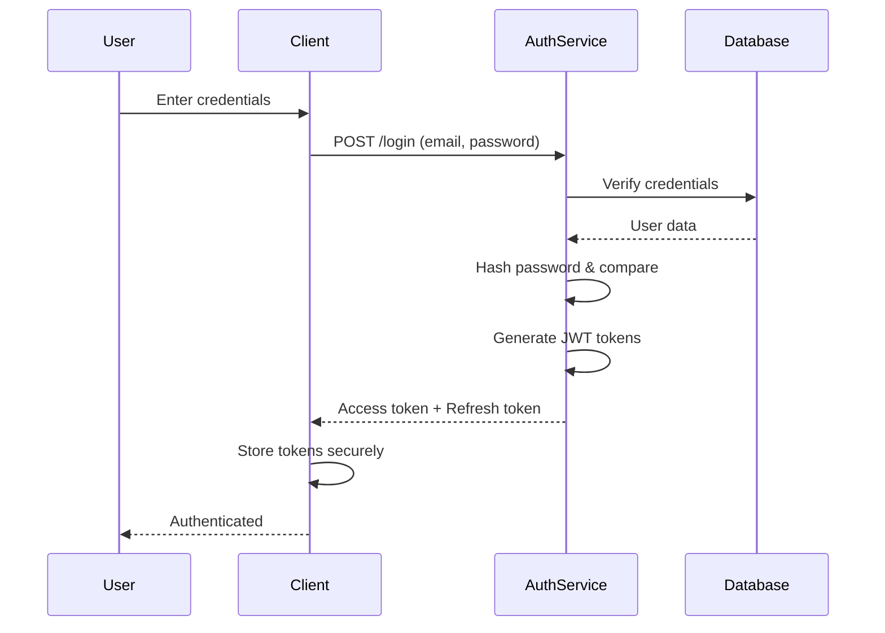
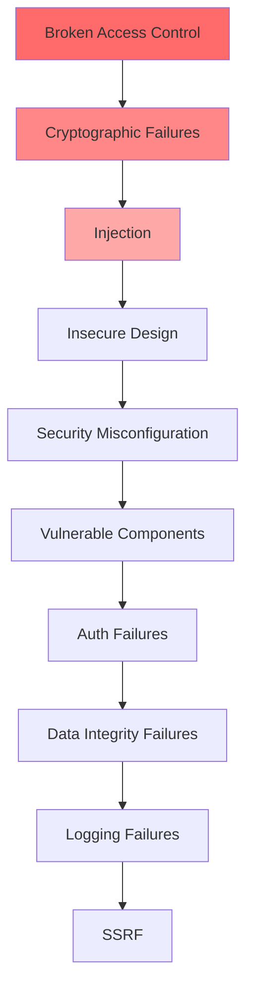

# Security Best Practices Guide - Comprehensive

## Table of Contents
1. [Introduction](#introduction)
2. [Authentication & Authorization](#authentication--authorization)
3. [OWASP Top 10](#owasp-top-10)
4. [Input Validation & Sanitization](#input-validation--sanitization)
5. [Cryptography](#cryptography)
6. [HTTPS/TLS Configuration](#httpstls-configuration)
7. [Secrets Management](#secrets-management)
8. [Security Headers](#security-headers)
9. [Security Testing](#security-testing)
10. [Incident Response](#incident-response)
11. [Compliance](#compliance)
12. [Security in CI/CD](#security-in-cicd)
13. [Resources](#resources)
14. [Summary](#summary)

---

## Introduction

This guide covers security best practices for web applications, APIs, and systems. Learn to protect against common vulnerabilities and implement robust security measures.

### Who This Guide Is For
- Developers
- Security engineers
- DevOps engineers
- Anyone building secure applications

---

## Authentication & Authorization

### Authentication Flow



### Password Hashing

```typescript
import bcrypt from 'bcrypt';

// Hash password
async function hashPassword(password: string): Promise<string> {
    const saltRounds = 12;
    return await bcrypt.hash(password, saltRounds);
}

// Verify password
async function verifyPassword(password: string, hash: string): Promise<boolean> {
    return await bcrypt.compare(password, hash);
}

// Usage
const hashedPassword = await hashPassword('userPassword123');
const isValid = await verifyPassword('userPassword123', hashedPassword);
```

### JWT Best Practices

```typescript
import jwt from 'jsonwebtoken';

// Generate token with expiration
function generateToken(user: User): string {
    return jwt.sign(
        {
            id: user.id,
            email: user.email,
            role: user.role
        },
        process.env.JWT_SECRET!,
        {
            expiresIn: '15m',
            issuer: 'myapp',
            audience: 'myapp-users'
        }
    );
}

// Refresh token
function generateRefreshToken(user: User): string {
    return jwt.sign(
        { id: user.id, type: 'refresh' },
        process.env.JWT_REFRESH_SECRET!,
        { expiresIn: '7d' }
    );
}

// Verify token
function verifyToken(token: string): UserPayload {
    return jwt.verify(token, process.env.JWT_SECRET!, {
        issuer: 'myapp',
        audience: 'myapp-users'
    }) as UserPayload;
}
```

### Role-Based Access Control (RBAC)

```typescript
interface User {
    id: number;
    role: 'admin' | 'user' | 'moderator';
    permissions: string[];
}

function hasPermission(user: User, permission: string): boolean {
    return user.permissions.includes(permission) || user.role === 'admin';
}

function requirePermission(permission: string) {
    return (req: Request, res: Response, next: NextFunction) => {
        if (!hasPermission(req.user, permission)) {
            return res.status(403).json({ error: 'Forbidden' });
        }
        next();
    };
}

// Usage
app.delete('/api/users/:id', 
    authenticate,
    requirePermission('users:delete'),
    deleteUser
);
```

---

## OWASP Top 10

### OWASP Top 10 Overview



### 1. Broken Access Control

```typescript
// BAD: No access control
app.get('/api/users/:id', async (req, res) => {
    const user = await getUser(req.params.id);
    res.json(user); // Anyone can access any user
});

// GOOD: Access control
app.get('/api/users/:id', authenticate, async (req, res) => {
    const userId = req.params.id;
    if (req.user.id !== userId && req.user.role !== 'admin') {
        return res.status(403).json({ error: 'Forbidden' });
    }
    const user = await getUser(userId);
    res.json(user);
});
```

### 2. Cryptographic Failures

```typescript
// BAD: Plain text storage
await db.users.create({
    password: userPassword // Never store plain text
});

// GOOD: Proper hashing
await db.users.create({
    password: await bcrypt.hash(userPassword, 12)
});

// GOOD: Encrypt sensitive data
import crypto from 'crypto';

function encrypt(text: string): string {
    const cipher = crypto.createCipheriv(
        'aes-256-gcm',
        Buffer.from(process.env.ENCRYPTION_KEY!, 'hex'),
        crypto.randomBytes(16)
    );
    let encrypted = cipher.update(text, 'utf8', 'hex');
    encrypted += cipher.final('hex');
    return encrypted;
}
```

### 3. Injection

```typescript
// BAD: SQL injection
app.get('/api/users', async (req, res) => {
    const query = `SELECT * FROM users WHERE name = '${req.query.name}'`;
    const users = await db.query(query); // Vulnerable!
});

// GOOD: Parameterized queries
app.get('/api/users', async (req, res) => {
    const query = 'SELECT * FROM users WHERE name = $1';
    const users = await db.query(query, [req.query.name]);
});

// BAD: NoSQL injection
app.post('/api/users', async (req, res) => {
    const user = await User.findOne({ email: req.body.email }); // Vulnerable if email is user-controlled
});

// GOOD: Input validation
import { z } from 'zod';

const userSchema = z.object({
    email: z.string().email(),
    name: z.string().min(1).max(100)
});

app.post('/api/users', async (req, res) => {
    const validated = userSchema.parse(req.body);
    const user = await User.findOne({ email: validated.email });
});
```

### 4. Insecure Design

```typescript
// BAD: Weak password requirements
function validatePassword(password: string): boolean {
    return password.length >= 4; // Too weak
}

// GOOD: Strong password requirements
function validatePassword(password: string): boolean {
    return password.length >= 12 &&
           /[A-Z]/.test(password) &&
           /[a-z]/.test(password) &&
           /[0-9]/.test(password) &&
           /[^A-Za-z0-9]/.test(password);
}
```

### 5. Security Misconfiguration

```typescript
// BAD: Exposed sensitive information
app.get('/api/config', (req, res) => {
    res.json({
        database: process.env.DATABASE_URL,
        apiKey: process.env.API_KEY // Never expose!
    });
});

// GOOD: Secure configuration
app.get('/api/config', (req, res) => {
    res.json({
        version: process.env.APP_VERSION,
        environment: process.env.NODE_ENV
        // Only expose non-sensitive config
    });
});
```

### 6. Vulnerable Components

```bash
# Regularly update dependencies
npm audit
npm audit fix

# Use dependency scanning in CI/CD
# Check for known vulnerabilities
```

### 7. Authentication Failures

```typescript
// BAD: No rate limiting on login
app.post('/api/login', async (req, res) => {
    // Vulnerable to brute force
});

// GOOD: Rate limiting and account lockout
import rateLimit from 'express-rate-limit';

const loginLimiter = rateLimit({
    windowMs: 15 * 60 * 1000,
    max: 5, // 5 attempts per 15 minutes
    message: 'Too many login attempts'
});

app.post('/api/login', loginLimiter, async (req, res) => {
    const { email, password } = req.body;
    const user = await User.findOne({ email });
    
    if (!user || user.failedAttempts >= 5) {
        return res.status(401).json({ error: 'Invalid credentials' });
    }
    
    const isValid = await bcrypt.compare(password, user.password);
    if (!isValid) {
        user.failedAttempts += 1;
        await user.save();
        return res.status(401).json({ error: 'Invalid credentials' });
    }
    
    // Reset failed attempts on success
    user.failedAttempts = 0;
    await user.save();
    
    const token = generateToken(user);
    res.json({ token });
});
```

### 8. Software and Data Integrity Failures

```typescript
// Use package lock files
// Verify package integrity
// Use signed packages when possible
```

### 9. Security Logging Failures

```typescript
import winston from 'winston';

const logger = winston.createLogger({
    level: 'info',
    format: winston.format.json(),
    transports: [
        new winston.transports.File({ filename: 'security.log' })
    ]
});

// Log security events
function logSecurityEvent(event: string, details: any) {
    logger.warn('Security Event', {
        event,
        details,
        timestamp: new Date().toISOString(),
        ip: req.ip
    });
}

app.post('/api/login', async (req, res) => {
    // ... login logic
    if (failed) {
        logSecurityEvent('LOGIN_FAILED', { email: req.body.email });
    }
});
```

### 10. Server-Side Request Forgery (SSRF)

```typescript
// BAD: User-controlled URL
app.get('/api/fetch', async (req, res) => {
    const url = req.query.url;
    const response = await fetch(url); // Dangerous!
    res.json(await response.json());
});

// GOOD: Validate and whitelist URLs
const ALLOWED_DOMAINS = ['api.example.com', 'cdn.example.com'];

function isValidUrl(url: string): boolean {
    try {
        const parsed = new URL(url);
        return ALLOWED_DOMAINS.includes(parsed.hostname);
    } catch {
        return false;
    }
}

app.get('/api/fetch', async (req, res) => {
    const url = req.query.url;
    if (!isValidUrl(url)) {
        return res.status(400).json({ error: 'Invalid URL' });
    }
    const response = await fetch(url);
    res.json(await response.json());
});
```

---

## Input Validation & Sanitization

### Validation

```typescript
import { z } from 'zod';

const userSchema = z.object({
    name: z.string().min(1).max(100),
    email: z.string().email(),
    age: z.number().int().min(0).max(150),
    website: z.string().url().optional()
});

app.post('/api/users', async (req, res) => {
    try {
        const validated = userSchema.parse(req.body);
        // Use validated data
    } catch (error) {
        res.status(400).json({ error: 'Validation failed' });
    }
});
```

### Sanitization

```typescript
import DOMPurify from 'isomorphic-dompurify';

// Sanitize HTML
function sanitizeHtml(html: string): string {
    return DOMPurify.sanitize(html);
}

// Sanitize user input
function sanitizeInput(input: string): string {
    return input
        .trim()
        .replace(/[<>]/g, '') // Remove HTML tags
        .substring(0, 1000); // Limit length
}
```

---

## Cryptography

### Encryption

```typescript
import crypto from 'crypto';

const algorithm = 'aes-256-gcm';
const key = crypto.scryptSync(process.env.ENCRYPTION_KEY!, 'salt', 32);

function encrypt(text: string): { encrypted: string; iv: string; tag: string } {
    const iv = crypto.randomBytes(16);
    const cipher = crypto.createCipheriv(algorithm, key, iv);
    
    let encrypted = cipher.update(text, 'utf8', 'hex');
    encrypted += cipher.final('hex');
    const tag = cipher.getAuthTag();
    
    return {
        encrypted,
        iv: iv.toString('hex'),
        tag: tag.toString('hex')
    };
}

function decrypt(encrypted: string, iv: string, tag: string): string {
    const decipher = crypto.createDecipheriv(
        algorithm,
        key,
        Buffer.from(iv, 'hex')
    );
    decipher.setAuthTag(Buffer.from(tag, 'hex'));
    
    let decrypted = decipher.update(encrypted, 'hex', 'utf8');
    decrypted += decipher.final('utf8');
    
    return decrypted;
}
```

---

## HTTPS/TLS Configuration

```typescript
import https from 'https';
import fs from 'fs';

const options = {
    key: fs.readFileSync('private-key.pem'),
    cert: fs.readFileSync('certificate.pem'),
    // Security headers
    secureProtocol: 'TLSv1_2_method',
    ciphers: 'ECDHE-RSA-AES128-GCM-SHA256:ECDHE-RSA-AES256-GCM-SHA384'
};

const server = https.createServer(options, app);
```

---

## Secrets Management

```typescript
// BAD: Hardcoded secrets
const apiKey = 'sk_live_1234567890'; // Never do this!

// GOOD: Environment variables
const apiKey = process.env.API_KEY;

// BETTER: Use secret management service
import { SecretsManager } from '@aws-sdk/client-secrets-manager';

async function getSecret(secretName: string): Promise<string> {
    const client = new SecretsManager({ region: 'us-east-1' });
    const response = await client.getSecretValue({ SecretId: secretName });
    return response.SecretString!;
}
```

---

## Security Headers

```typescript
import helmet from 'helmet';

app.use(helmet({
    contentSecurityPolicy: {
        directives: {
            defaultSrc: ["'self'"],
            styleSrc: ["'self'", "'unsafe-inline'"],
            scriptSrc: ["'self'"],
            imgSrc: ["'self'", 'data:', 'https:']
        }
    },
    hsts: {
        maxAge: 31536000,
        includeSubDomains: true,
        preload: true
    }
}));
```

---

## Security Testing

```typescript
// Security testing with Jest
describe('Security Tests', () => {
    it('should prevent SQL injection', async () => {
        const response = await request(app)
            .get('/api/users')
            .query({ name: "'; DROP TABLE users; --" })
            .expect(400);
    });
    
    it('should require authentication', async () => {
        const response = await request(app)
            .get('/api/users/1')
            .expect(401);
    });
    
    it('should prevent XSS', async () => {
        const response = await request(app)
            .post('/api/users')
            .send({ name: '<script>alert("XSS")</script>' })
            .expect(400);
    });
});
```

---

## Common Pitfalls

### 1. Storing Passwords in Plain Text

```typescript
// BAD: Plain text storage
await db.users.create({
    email: 'user@example.com',
    password: 'password123' // Never do this!
});

// GOOD: Hashed passwords
await db.users.create({
    email: 'user@example.com',
    password: await bcrypt.hash('password123', 12)
});
```

### 2. Exposing Sensitive Data in Errors

```typescript
// BAD: Exposing database errors
try {
    await db.query('SELECT * FROM users');
} catch (error) {
    res.json({ error: error.message }); // May expose DB structure
}

// GOOD: Generic error messages
try {
    await db.query('SELECT * FROM users');
} catch (error) {
    logger.error(error);
    res.json({ error: 'An error occurred' });
}
```

### 3. No Input Validation

```typescript
// BAD: No validation
app.post('/api/users', (req, res) => {
    const user = await createUser(req.body); // Unsafe
});

// GOOD: Validation
const userSchema = z.object({
    email: z.string().email(),
    name: z.string().min(1).max(100)
});

app.post('/api/users', (req, res) => {
    const validated = userSchema.parse(req.body);
    const user = await createUser(validated);
});
```

---

## Best Practices

### Security Best Practices

1. **Defense in Depth**
   - Multiple security layers
   - Don't rely on single control
   - Fail securely

2. **Least Privilege**
   - Minimum necessary permissions
   - Principle of least access
   - Regular permission reviews

3. **Secure by Default**
   - Secure configurations
   - Encrypt by default
   - Validate all inputs

4. **Stay Updated**
   - Regular dependency updates
   - Security patches
   - Vulnerability scanning

---

## Real-World Examples

### Example 1: Secure Authentication System

```typescript
// Complete secure authentication
class AuthService {
    async login(email: string, password: string) {
        // Rate limiting
        await this.checkRateLimit(email);
        
        // Find user
        const user = await this.userRepository.findByEmail(email);
        if (!user) {
            await this.recordFailedAttempt(email);
            throw new Error('Invalid credentials');
        }
        
        // Verify password
        const isValid = await bcrypt.compare(password, user.password);
        if (!isValid) {
            await this.recordFailedAttempt(email);
            throw new Error('Invalid credentials');
        }
        
        // Check if account is locked
        if (user.failedAttempts >= 5) {
            throw new Error('Account locked');
        }
        
        // Generate tokens
        const accessToken = this.generateAccessToken(user);
        const refreshToken = this.generateRefreshToken(user);
        
        // Reset failed attempts
        await this.userRepository.resetFailedAttempts(user.id);
        
        return { accessToken, refreshToken };
    }
}
```

### Example 2: Secure API with Multiple Layers

```typescript
// Multi-layer security
app.use(helmet()); // Security headers
app.use(rateLimit({ windowMs: 15 * 60 * 1000, max: 100 })); // Rate limiting
app.use(authenticate); // Authentication middleware
app.use(authorize); // Authorization middleware
app.use(validateInput); // Input validation

app.post('/api/orders', requirePermission('orders:create'), async (req, res) => {
    const validated = orderSchema.parse(req.body);
    const order = await orderService.create(validated);
    res.json(order);
});
```

---

## Incident Response

### Incident Response Plan

```typescript
// Incident response workflow
class IncidentResponse {
    async handleSecurityIncident(incident: SecurityIncident) {
        // 1. Identify
        const severity = this.assessSeverity(incident);
        
        // 2. Contain
        if (severity === 'critical') {
            await this.isolateAffectedSystems(incident);
        }
        
        // 3. Eradicate
        await this.removeThreat(incident);
        
        // 4. Recover
        await this.restoreSystems(incident);
        
        // 5. Lessons Learned
        await this.documentIncident(incident);
    }
    
    private assessSeverity(incident: SecurityIncident): string {
        if (incident.type === 'data_breach') return 'critical';
        if (incident.type === 'unauthorized_access') return 'high';
        return 'medium';
    }
}
```

### Incident Response Checklist

1. **Detection**
   - Monitor security logs
   - Set up alerts
   - Regular security audits

2. **Response**
   - Isolate affected systems
   - Preserve evidence
   - Notify stakeholders

3. **Recovery**
   - Patch vulnerabilities
   - Restore from backups
   - Verify system integrity

4. **Post-Incident**
   - Document incident
   - Review procedures
   - Update security measures

---

## Compliance

### GDPR Compliance

```typescript
// GDPR compliance requirements
class GDPRCompliance {
    // Right to access
    async getUserData(userId: string) {
        return await this.dataRepository.findAllUserData(userId);
    }
    
    // Right to erasure
    async deleteUserData(userId: string) {
        await this.dataRepository.deleteAllUserData(userId);
        await this.auditLog.record('DATA_DELETION', userId);
    }
    
    // Data portability
    async exportUserData(userId: string) {
        const data = await this.getUserData(userId);
        return JSON.stringify(data, null, 2);
    }
    
    // Consent management
    async recordConsent(userId: string, consent: Consent) {
        await this.consentRepository.save({
            userId,
            consentType: consent.type,
            granted: consent.granted,
            timestamp: new Date()
        });
    }
}
```

### PCI-DSS Compliance

```typescript
// PCI-DSS requirements for payment processing
class PaymentProcessor {
    // Never store full card numbers
    async processPayment(cardData: CardData) {
        // Tokenize card data
        const token = await this.tokenize(cardData);
        
        // Process with token only
        const result = await this.paymentGateway.charge(token, cardData.amount);
        
        // Log only last 4 digits
        await this.auditLog.record('PAYMENT', {
            last4: cardData.number.slice(-4),
            amount: cardData.amount
        });
        
        return result;
    }
    
    private async tokenize(cardData: CardData): Promise<string> {
        // Use PCI-compliant tokenization service
        return await this.tokenService.createToken(cardData);
    }
}
```

### Compliance Checklist

- **Data Protection**: Encrypt sensitive data
- **Access Control**: Implement proper authentication
- **Audit Logging**: Log all access and changes
- **Data Retention**: Implement retention policies
- **Right to Deletion**: Allow users to delete their data
- **Consent Management**: Track and manage user consent

---

## Security in CI/CD

### Security Scanning in Pipeline

```yaml
# .github/workflows/security.yml
name: Security Scan

on: [push, pull_request]

jobs:
  security:
    runs-on: ubuntu-latest
    steps:
      - uses: actions/checkout@v3
      
      - name: Run Snyk security scan
        uses: snyk/actions/node@master
        env:
          SNYK_TOKEN: ${{ secrets.SNYK_TOKEN }}
      
      - name: Run OWASP Dependency Check
        uses: dependency-check/Dependency-Check_Action@main
      
      - name: Run SAST scan
        uses: github/super-linter@v4
```

### Secure Secrets Management

```yaml
# Use secrets in CI/CD
- name: Deploy
  env:
    AWS_ACCESS_KEY_ID: ${{ secrets.AWS_ACCESS_KEY_ID }}
    AWS_SECRET_ACCESS_KEY: ${{ secrets.AWS_SECRET_ACCESS_KEY }}
  run: |
    aws s3 sync ./dist s3://my-bucket
```

### Security Testing in Pipeline

```yaml
- name: Security Tests
  run: |
    npm run test:security
    npm audit --audit-level=moderate
    npm run lint:security
```

---

## Resources

- [OWASP Top 10](https://owasp.org/www-project-top-ten/)
- [OWASP Cheat Sheets](https://cheatsheetseries.owasp.org/)
- [CWE Top 25](https://cwe.mitre.org/top25/)

---

## Summary

Key security best practices:

1. **Authentication**: Strong passwords, secure tokens
2. **Authorization**: Proper access control
3. **Input Validation**: Validate and sanitize all inputs
4. **Cryptography**: Proper encryption and hashing
5. **HTTPS**: Always use encrypted connections
6. **Secrets Management**: Never hardcode secrets
7. **Security Headers**: Use security headers
8. **OWASP Top 10**: Protect against common vulnerabilities
9. **Security Testing**: Regular security audits
10. **Incident Response**: Plan for security incidents

Master these practices to build secure applications.

