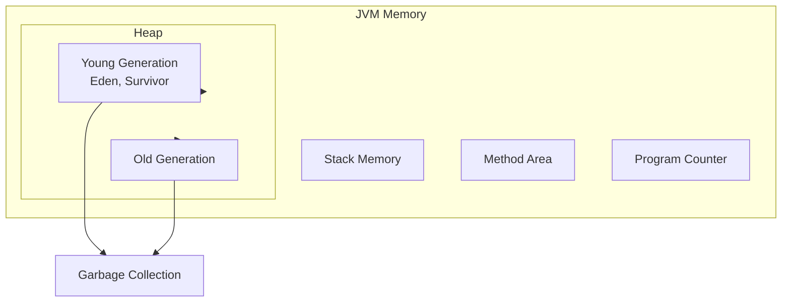
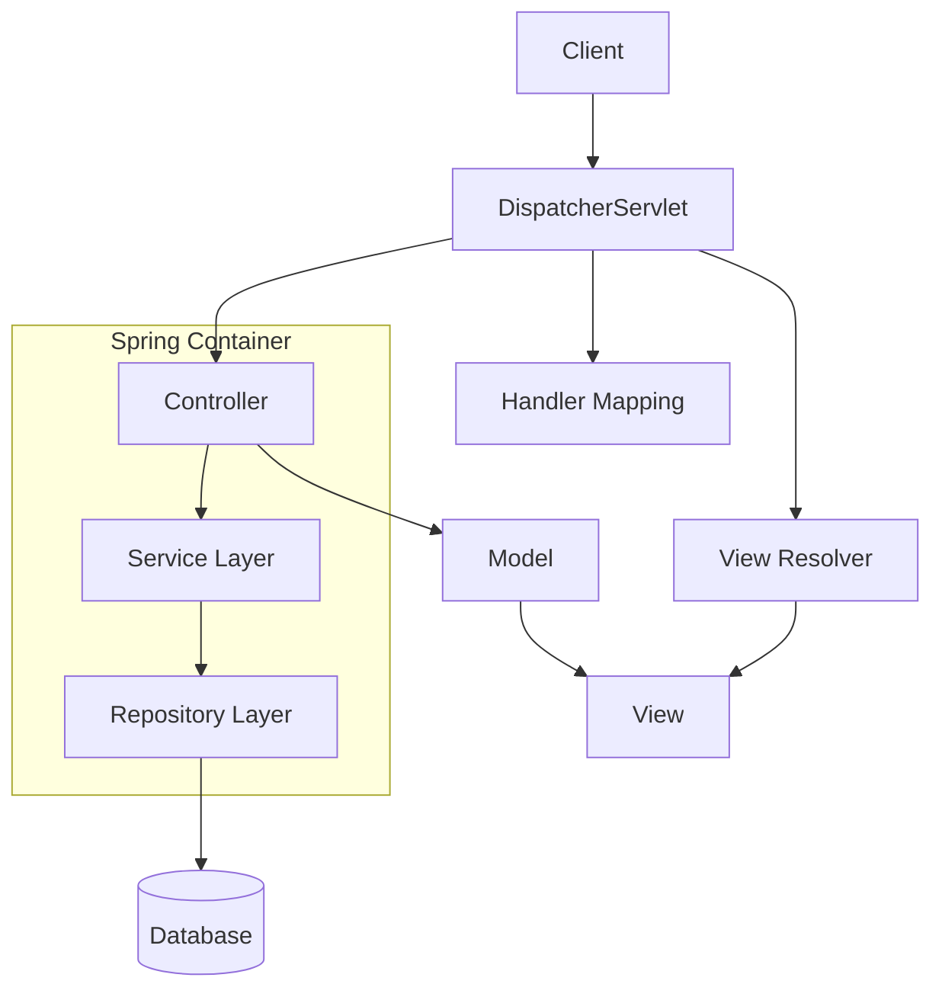
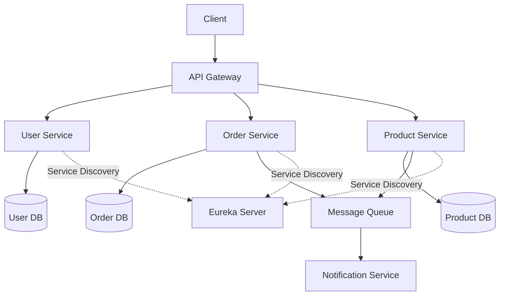

# Senior Java Full Stack Developer Guide - Comprehensive

## Table of Contents
1. [Introduction](#introduction)
2. [Core Java Expertise](#core-java-expertise)
3. [Spring Framework Ecosystem](#spring-framework-ecosystem)
4. [Backend Architecture](#backend-architecture)
5. [Database & Persistence](#database--persistence)
6. [Frontend Technologies](#frontend-technologies)
7. [API Design & Integration](#api-design--integration)
8. [Microservices Architecture](#microservices-architecture)
9. [Testing & Quality Assurance](#testing--quality-assurance)
10. [DevOps & Infrastructure](#devops--infrastructure)
11. [Security](#security)
12. [Performance Optimization](#performance-optimization)
13. [Code Quality & Best Practices](#code-quality--best-practices)
14. [Team Leadership](#team-leadership)
15. [Real-World Examples](#real-world-examples)
16. [Common Pitfalls](#common-pitfalls)
17. [Resources](#resources)
18. [Summary](#summary)

---

## Introduction

This comprehensive guide covers everything a senior Java full stack developer needs to master. It includes advanced Java concepts, Spring Framework ecosystem, microservices, testing, and production-ready patterns.

### Who This Guide Is For
- Senior Java developers
- Full stack developers working with Java
- Technical leads and architects
- Developers building enterprise applications

### Prerequisites
- Solid understanding of Java fundamentals
- Experience with Spring Framework
- Basic knowledge of web development
- Understanding of database concepts

---

## Core Java Expertise

### JVM Memory Model



### Advanced Java Concepts

#### 1. **Java Language Features (Java 8-21)**

```java
// Records (Java 14+)
public record User(String name, String email, int age) {
    public User {
        if (age < 0) throw new IllegalArgumentException("Age cannot be negative");
        if (email == null || !email.contains("@")) {
            throw new IllegalArgumentException("Invalid email");
        }
    }
    
    public String displayName() {
        return name + " (" + email + ")";
    }
}

// Pattern matching (Java 16+)
public String processObject(Object obj) {
    return switch (obj) {
        case String s when s.length() > 10 -> "Long string: " + s;
        case String s -> "String: " + s;
        case Integer i when i > 100 -> "Large number: " + i;
        case Integer i -> "Number: " + i;
        case null -> "Null object";
        default -> "Unknown: " + obj;
    };
}

// Sealed classes (Java 17+)
public sealed class Shape permits Circle, Rectangle, Triangle {
    public abstract double area();
}

public final class Circle extends Shape {
    private final double radius;
    
    public Circle(double radius) {
        this.radius = radius;
    }
    
    @Override
    public double area() {
        return Math.PI * radius * radius;
    }
}

// Virtual threads (Java 21)
public class VirtualThreadExample {
    public void processRequests(List<Request> requests) {
        try (var executor = Executors.newVirtualThreadPerTaskExecutor()) {
            requests.forEach(request -> 
                executor.submit(() -> processRequest(request))
            );
        }
    }
}
```

#### 2. **Concurrency & Multithreading**

```java
// CompletableFuture patterns
public class AsyncService {
    public CompletableFuture<User> getUserAsync(Long id) {
        return CompletableFuture
            .supplyAsync(() -> userRepository.findById(id))
            .thenApply(user -> {
                if (user == null) {
                    throw new UserNotFoundException(id);
                }
                return user;
            })
            .exceptionally(ex -> {
                log.error("Error fetching user", ex);
                return null;
            });
    }
    
    public CompletableFuture<List<User>> getUsersWithDetails(List<Long> ids) {
        List<CompletableFuture<User>> futures = ids.stream()
            .map(this::getUserAsync)
            .toList();
        
        return CompletableFuture.allOf(futures.toArray(new CompletableFuture[0]))
            .thenApply(v -> futures.stream()
                .map(CompletableFuture::join)
                .filter(Objects::nonNull)
                .toList());
    }
}

// Thread-safe singleton
public class ThreadSafeSingleton {
    private static volatile ThreadSafeSingleton instance;
    
    private ThreadSafeSingleton() {}
    
    public static ThreadSafeSingleton getInstance() {
        if (instance == null) {
            synchronized (ThreadSafeSingleton.class) {
                if (instance == null) {
                    instance = new ThreadSafeSingleton();
                }
            }
        }
        return instance;
    }
}
```

#### 3. **Streams API**

```java
// Advanced stream operations
public class StreamExamples {
    // Grouping and partitioning
    public Map<String, List<User>> groupUsersByRole(List<User> users) {
        return users.stream()
            .collect(Collectors.groupingBy(User::getRole));
    }
    
    // Custom collector
    public Map<String, Long> countUsersByRole(List<User> users) {
        return users.stream()
            .collect(Collectors.groupingBy(
                User::getRole,
                Collectors.counting()
            ));
    }
    
    // Parallel processing
    public List<String> processInParallel(List<String> data) {
        return data.parallelStream()
            .map(this::expensiveOperation)
            .filter(Objects::nonNull)
            .collect(Collectors.toList());
    }
    
    // Chaining operations
    public Optional<User> findActiveAdmin(List<User> users) {
        return users.stream()
            .filter(User::isActive)
            .filter(u -> "ADMIN".equals(u.getRole()))
            .findFirst();
    }
}
```

---

## Spring Framework Ecosystem

### Spring Framework Architecture



### Spring Boot Configuration

```java
// Application configuration
@SpringBootApplication
@EnableScheduling
@EnableAsync
@EnableJpaAuditing
public class Application {
    public static void main(String[] args) {
        SpringApplication.run(Application.class, args);
    }
}

// Configuration properties
@ConfigurationProperties(prefix = "app")
@Data
public class AppProperties {
    private String name;
    private String version;
    private Security security = new Security();
    
    @Data
    public static class Security {
        private String secret;
        private long tokenValidity;
    }
}

// application.yml
app:
  name: MyApplication
  version: 1.0.0
  security:
    secret: ${JWT_SECRET:default-secret}
    token-validity: 3600000
```

### Spring MVC Controllers

```java
@RestController
@RequestMapping("/api/v1/users")
@Validated
public class UserController {
    
    private final UserService userService;
    
    @GetMapping
    public ResponseEntity<Page<UserDTO>> getUsers(
            @RequestParam(defaultValue = "0") int page,
            @RequestParam(defaultValue = "10") int size,
            @RequestParam(required = false) String sort) {
        Pageable pageable = PageRequest.of(page, size, 
            Sort.by(sort != null ? sort : "id"));
        Page<UserDTO> users = userService.findAll(pageable);
        return ResponseEntity.ok(users);
    }
    
    @GetMapping("/{id}")
    public ResponseEntity<UserDTO> getUser(@PathVariable Long id) {
        return userService.findById(id)
            .map(ResponseEntity::ok)
            .orElse(ResponseEntity.notFound().build());
    }
    
    @PostMapping
    public ResponseEntity<UserDTO> createUser(
            @Valid @RequestBody CreateUserRequest request) {
        UserDTO user = userService.create(request);
        return ResponseEntity.status(HttpStatus.CREATED)
            .body(user);
    }
    
    @PutMapping("/{id}")
    public ResponseEntity<UserDTO> updateUser(
            @PathVariable Long id,
            @Valid @RequestBody UpdateUserRequest request) {
        return userService.update(id, request)
            .map(ResponseEntity::ok)
            .orElse(ResponseEntity.notFound().build());
    }
    
    @DeleteMapping("/{id}")
    public ResponseEntity<Void> deleteUser(@PathVariable Long id) {
        userService.delete(id);
        return ResponseEntity.noContent().build();
    }
}
```

### Spring Data JPA

```java
@Repository
public interface UserRepository extends JpaRepository<User, Long> {
    
    // Query methods
    List<User> findByEmailContaining(String email);
    Optional<User> findByEmail(String email);
    List<User> findByAgeBetween(int min, int max);
    
    // Custom queries
    @Query("SELECT u FROM User u WHERE u.role = :role AND u.active = true")
    List<User> findActiveUsersByRole(@Param("role") String role);
    
    @Query(value = "SELECT * FROM users WHERE age > :age", nativeQuery = true)
    List<User> findUsersOlderThan(@Param("age") int age);
    
    // Modifying queries
    @Modifying
    @Query("UPDATE User u SET u.active = false WHERE u.lastLogin < :date")
    int deactivateInactiveUsers(@Param("date") LocalDateTime date);
    
    // Specifications for dynamic queries
    default List<User> findUsers(UserSpecification spec) {
        return findAll(spec);
    }
}

// Specification example
public class UserSpecification {
    public static Specification<User> hasRole(String role) {
        return (root, query, cb) -> cb.equal(root.get("role"), role);
    }
    
    public static Specification<User> isActive() {
        return (root, query, cb) -> cb.isTrue(root.get("active"));
    }
    
    public static Specification<User> ageGreaterThan(int age) {
        return (root, query, cb) -> cb.greaterThan(root.get("age"), age);
    }
}
```

### Spring Security

```java
@Configuration
@EnableWebSecurity
@EnableMethodSecurity
public class SecurityConfig {
    
    @Bean
    public SecurityFilterChain filterChain(HttpSecurity http) throws Exception {
        http
            .csrf(csrf -> csrf.disable())
            .authorizeHttpRequests(auth -> auth
                .requestMatchers("/api/public/**").permitAll()
                .requestMatchers("/api/admin/**").hasRole("ADMIN")
                .anyRequest().authenticated()
            )
            .oauth2ResourceServer(oauth2 -> oauth2
                .jwt(jwt -> jwt.jwtDecoder(jwtDecoder()))
            )
            .sessionManagement(session -> session
                .sessionCreationPolicy(SessionCreationPolicy.STATELESS)
            );
        return http.build();
    }
    
    @Bean
    public JwtDecoder jwtDecoder() {
        return NimbusJwtDecoder.withJwkSetUri("https://example.com/.well-known/jwks.json")
            .build();
    }
}
```

---

## Backend Architecture

### Layered Architecture

```java
// Service layer
@Service
@Transactional
public class UserService {
    
    private final UserRepository userRepository;
    private final UserMapper userMapper;
    
    public UserDTO create(CreateUserRequest request) {
        User user = userMapper.toEntity(request);
        user = userRepository.save(user);
        return userMapper.toDTO(user);
    }
    
    public Optional<UserDTO> findById(Long id) {
        return userRepository.findById(id)
            .map(userMapper::toDTO);
    }
    
    public Page<UserDTO> findAll(Pageable pageable) {
        return userRepository.findAll(pageable)
            .map(userMapper::toDTO);
    }
}

// DTOs
public record UserDTO(Long id, String name, String email, String role) {}
public record CreateUserRequest(String name, String email, String role) {}
```

### Hexagonal Architecture

```java
// Port (interface)
public interface UserRepository {
    User save(User user);
    Optional<User> findById(Long id);
    List<User> findAll();
}

// Adapter (implementation)
@Repository
public class JpaUserRepository implements UserRepository {
    private final UserJpaRepository jpaRepository;
    
    @Override
    public User save(User user) {
        return jpaRepository.save(user);
    }
    
    // ... other methods
}

// Domain service
@Service
public class UserDomainService {
    public void validateUser(User user) {
        if (user.getEmail() == null || !user.getEmail().contains("@")) {
            throw new InvalidUserException("Invalid email");
        }
    }
}
```

---

## Database & Persistence

### JPA Entities

```java
@Entity
@Table(name = "users")
@EntityListeners(AuditingEntityListener.class)
public class User {
    @Id
    @GeneratedValue(strategy = GenerationType.IDENTITY)
    private Long id;
    
    @Column(nullable = false, unique = true)
    private String email;
    
    @Column(nullable = false)
    private String name;
    
    @Enumerated(EnumType.STRING)
    private UserRole role;
    
    @OneToMany(mappedBy = "user", cascade = CascadeType.ALL, fetch = FetchType.LAZY)
    private List<Order> orders = new ArrayList<>();
    
    @CreatedDate
    private LocalDateTime createdAt;
    
    @LastModifiedDate
    private LocalDateTime updatedAt;
    
    @Version
    private Long version;
    
    // Getters and setters
}
```

### Transaction Management

```java
@Service
@Transactional
public class OrderService {
    
    @Transactional(readOnly = true)
    public OrderDTO getOrder(Long id) {
        // Read-only transaction
        return orderRepository.findById(id)
            .map(orderMapper::toDTO)
            .orElseThrow(() -> new OrderNotFoundException(id));
    }
    
    @Transactional(rollbackFor = Exception.class)
    public OrderDTO createOrder(CreateOrderRequest request) {
        // Transactional with rollback on any exception
        Order order = orderMapper.toEntity(request);
        order = orderRepository.save(order);
        return orderMapper.toDTO(order);
    }
    
    @Transactional(propagation = Propagation.REQUIRES_NEW)
    public void logOrderCreation(Long orderId) {
        // New transaction, independent of parent
        auditLogRepository.save(new AuditLog("ORDER_CREATED", orderId));
    }
}
```

---

## Microservices Architecture

### Microservices Communication



### Spring Cloud Gateway

```java
@Configuration
public class GatewayConfig {
    
    @Bean
    public RouteLocator customRouteLocator(RouteLocatorBuilder builder) {
        return builder.routes()
            .route("user-service", r -> r
                .path("/api/users/**")
                .uri("lb://user-service"))
            .route("order-service", r -> r
                .path("/api/orders/**")
                .uri("lb://order-service"))
            .build();
    }
    
    @Bean
    public GlobalFilter customGlobalFilter() {
        return (exchange, chain) -> {
            ServerHttpRequest request = exchange.getRequest();
            // Add custom headers
            ServerHttpRequest modifiedRequest = request.mutate()
                .header("X-Gateway-Request", "true")
                .build();
            return chain.filter(exchange.mutate().request(modifiedRequest).build());
        };
    }
}
```

### Service Discovery

```java
@SpringBootApplication
@EnableEurekaClient
public class UserServiceApplication {
    public static void main(String[] args) {
        SpringApplication.run(UserServiceApplication.class, args);
    }
}
```

---

## Frontend Technologies

### React Integration with Spring Boot

```java
// Backend: REST Controller
@RestController
@RequestMapping("/api/users")
@CrossOrigin(origins = "http://localhost:3000")
public class UserController {
    
    @Autowired
    private UserService userService;
    
    @GetMapping
    public ResponseEntity<List<UserDTO>> getUsers() {
        return ResponseEntity.ok(userService.findAll());
    }
    
    @PostMapping
    public ResponseEntity<UserDTO> createUser(@RequestBody CreateUserRequest request) {
        return ResponseEntity.status(HttpStatus.CREATED)
            .body(userService.create(request));
    }
}
```

```typescript
// Frontend: React component
import { useEffect, useState } from 'react';

function UsersList() {
    const [users, setUsers] = useState([]);
    
    useEffect(() => {
        fetch('http://localhost:8080/api/users')
            .then(res => res.json())
            .then(data => setUsers(data));
    }, []);
    
    return (
        <div>
            {users.map(user => (
                <div key={user.id}>{user.name}</div>
            ))}
        </div>
    );
}
```

### Vue.js Integration

```typescript
// Vue component
<template>
    <div>
        <div v-for="user in users" :key="user.id">
            {{ user.name }}
        </div>
    </div>
</template>

<script>
export default {
    data() {
        return {
            users: []
        };
    },
    mounted() {
        fetch('http://localhost:8080/api/users')
            .then(res => res.json())
            .then(data => this.users = data);
    }
};
</script>
```

### Angular Integration

```typescript
// Angular service
@Injectable({
    providedIn: 'root'
})
export class UserService {
    constructor(private http: HttpClient) {}
    
    getUsers(): Observable<User[]> {
        return this.http.get<User[]>('http://localhost:8080/api/users');
    }
}

// Angular component
@Component({
    selector: 'app-users',
    template: `
        <div *ngFor="let user of users$ | async">
            {{ user.name }}
        </div>
    `
})
export class UsersComponent {
    users$ = this.userService.getUsers();
    
    constructor(private userService: UserService) {}
}
```

### Thymeleaf (Server-Side Rendering)

```html
<!-- templates/users.html -->
<!DOCTYPE html>
<html xmlns:th="http://www.thymeleaf.org">
<head>
    <title>Users</title>
</head>
<body>
    <h1>Users</h1>
    <table>
        <tr th:each="user : ${users}">
            <td th:text="${user.name}"></td>
            <td th:text="${user.email}"></td>
        </tr>
    </table>
</body>
</html>
```

```java
// Controller
@Controller
public class UserViewController {
    
    @Autowired
    private UserService userService;
    
    @GetMapping("/users")
    public String getUsers(Model model) {
        model.addAttribute("users", userService.findAll());
        return "users";
    }
}
```

---

## API Design & Integration

### RESTful API Design

```java
@RestController
@RequestMapping("/api/v1/users")
public class UserController {
    
    @GetMapping
    public ResponseEntity<Page<UserDTO>> getUsers(
            @RequestParam(defaultValue = "0") int page,
            @RequestParam(defaultValue = "10") int size) {
        Pageable pageable = PageRequest.of(page, size);
        Page<UserDTO> users = userService.findAll(pageable);
        return ResponseEntity.ok(users);
    }
    
    @PostMapping
    public ResponseEntity<UserDTO> createUser(
            @Valid @RequestBody CreateUserRequest request) {
        UserDTO user = userService.create(request);
        return ResponseEntity.status(HttpStatus.CREATED).body(user);
    }
}
```

### API Documentation with Swagger

```java
@Configuration
public class SwaggerConfig {
    @Bean
    public OpenAPI customOpenAPI() {
        return new OpenAPI()
            .info(new Info()
                .title("User API")
                .version("1.0.0")
                .description("User management API"));
    }
}
```

---

## Testing & Quality Assurance

### Testing Strategy

```java
// Unit Tests: Fast, isolated
@ExtendWith(MockitoExtension.class)
class UserServiceTest { /* ... */ }

// Integration Tests: Test with real dependencies
@SpringBootTest
class UserControllerIntegrationTest { /* ... */ }

// E2E Tests: Test complete flows
@SpringBootTest(webEnvironment = SpringBootTest.WebEnvironment.RANDOM_PORT)
class UserE2ETest { /* ... */ }
```

---

## Testing

### Unit Testing

```java
@ExtendWith(MockitoExtension.class)
class UserServiceTest {
    
    @Mock
    private UserRepository userRepository;
    
    @InjectMocks
    private UserService userService;
    
    @Test
    void shouldCreateUser() {
        // Given
        CreateUserRequest request = new CreateUserRequest("John", "john@example.com", "USER");
        User savedUser = new User(1L, "John", "john@example.com", UserRole.USER);
        
        when(userRepository.save(any(User.class))).thenReturn(savedUser);
        
        // When
        UserDTO result = userService.create(request);
        
        // Then
        assertThat(result.name()).isEqualTo("John");
        verify(userRepository).save(any(User.class));
    }
}
```

### Integration Testing

```java
@SpringBootTest
@AutoConfigureMockMvc
@Transactional
class UserControllerIntegrationTest {
    
    @Autowired
    private MockMvc mockMvc;
    
    @Autowired
    private UserRepository userRepository;
    
    @Test
    void shouldCreateUser() throws Exception {
        CreateUserRequest request = new CreateUserRequest("John", "john@example.com", "USER");
        
        mockMvc.perform(post("/api/v1/users")
                .contentType(MediaType.APPLICATION_JSON)
                .content(objectMapper.writeValueAsString(request)))
            .andExpect(status().isCreated())
            .andExpect(jsonPath("$.name").value("John"));
    }
}
```

---

## Security

### Spring Security Configuration

```java
@Configuration
@EnableWebSecurity
public class SecurityConfig {
    
    @Bean
    public SecurityFilterChain filterChain(HttpSecurity http) throws Exception {
        http
            .authorizeHttpRequests(auth -> auth
                .requestMatchers("/api/public/**").permitAll()
                .requestMatchers("/api/admin/**").hasRole("ADMIN")
                .anyRequest().authenticated()
            )
            .oauth2ResourceServer(oauth2 -> oauth2
                .jwt(jwt -> jwt.jwtDecoder(jwtDecoder()))
            );
        return http.build();
    }
}
```

### OAuth2 Implementation

```java
@RestController
@RequestMapping("/api/users")
public class UserController {
    
    @GetMapping("/me")
    public ResponseEntity<UserDTO> getCurrentUser(
            @AuthenticationPrincipal Jwt jwt) {
        String userId = jwt.getSubject();
        UserDTO user = userService.findById(userId);
        return ResponseEntity.ok(user);
    }
}
```

---

## Performance Optimization

### JVM Tuning

```bash
# JVM options for production
java -Xms2g -Xmx4g \
     -XX:+UseG1GC \
     -XX:MaxGCPauseMillis=200 \
     -XX:+HeapDumpOnOutOfMemoryError \
     -jar myapp.jar
```

### Caching with Spring Cache

```java
@Service
public class UserService {
    
    @Cacheable(value = "users", key = "#id")
    public UserDTO findById(Long id) {
        return userRepository.findById(id)
            .map(userMapper::toDTO)
            .orElseThrow();
    }
    
    @CacheEvict(value = "users", key = "#id")
    public void delete(Long id) {
        userRepository.deleteById(id);
    }
}
```

### Async Processing

```java
@Service
public class EmailService {
    
    @Async
    public CompletableFuture<Void> sendEmail(String to, String subject, String body) {
        // Async email sending
        return CompletableFuture.completedFuture(null);
    }
}

@Configuration
@EnableAsync
public class AsyncConfig {
    @Bean
    public Executor taskExecutor() {
        ThreadPoolTaskExecutor executor = new ThreadPoolTaskExecutor();
        executor.setCorePoolSize(5);
        executor.setMaxPoolSize(10);
        executor.setQueueCapacity(100);
        executor.initialize();
        return executor;
    }
}
```

---

## Common Pitfalls

### 1. **N+1 Query Problem**

```java
// BAD: N+1 queries
List<User> users = userRepository.findAll();
users.forEach(user -> {
    List<Order> orders = orderRepository.findByUserId(user.getId()); // N queries
});

// GOOD: Use JOIN FETCH
@Query("SELECT u FROM User u JOIN FETCH u.orders")
List<User> findAllWithOrders();
```

### 2. **Transaction Boundaries**

```java
// BAD: Transaction too large
@Transactional
public void processLargeBatch(List<Item> items) {
    items.forEach(item -> {
        // Processing each item in same transaction
        processItem(item);
    });
}

// GOOD: Batch processing
public void processLargeBatch(List<Item> items) {
    items.forEach(item -> {
        processItemInTransaction(item);
    });
}

@Transactional(propagation = Propagation.REQUIRES_NEW)
private void processItemInTransaction(Item item) {
    processItem(item);
}
```

---

## Real-World Examples

### Example 1: E-Commerce Order Processing System

```java
// OrderService.java - Complete order processing
@Service
@Transactional
public class OrderService {
    
    private final OrderRepository orderRepository;
    private final PaymentService paymentService;
    private final InventoryService inventoryService;
    private final NotificationService notificationService;
    
    public OrderDTO processOrder(CreateOrderRequest request) {
        // 1. Validate inventory
        inventoryService.reserveItems(request.getItems());
        
        // 2. Process payment
        PaymentResult payment = paymentService.processPayment(
            request.getPaymentMethod(), 
            request.getTotal()
        );
        
        if (!payment.isSuccess()) {
            inventoryService.releaseItems(request.getItems());
            throw new PaymentException("Payment failed");
        }
        
        // 3. Create order
        Order order = new Order();
        order.setUserId(request.getUserId());
        order.setItems(request.getItems());
        order.setTotal(request.getTotal());
        order.setStatus(OrderStatus.CONFIRMED);
        order = orderRepository.save(order);
        
        // 4. Send notification
        notificationService.sendOrderConfirmation(order);
        
        return orderMapper.toDTO(order);
    }
}
```

### Example 2: Microservices with Spring Cloud

```java
// UserService - Service A
@RestController
@RequestMapping("/api/users")
public class UserController {
    
    @Autowired
    private OrderServiceClient orderServiceClient;
    
    @GetMapping("/{id}/orders")
    public ResponseEntity<List<OrderDTO>> getUserOrders(@PathVariable Long id) {
        // Call Order Service via Feign Client
        List<OrderDTO> orders = orderServiceClient.getOrdersByUserId(id);
        return ResponseEntity.ok(orders);
    }
}

// OrderServiceClient - Feign Client
@FeignClient(name = "order-service", url = "${order.service.url}")
public interface OrderServiceClient {
    @GetMapping("/orders/user/{userId}")
    List<OrderDTO> getOrdersByUserId(@PathVariable Long userId);
}
```

---

## DevOps & Infrastructure

### Docker Configuration

```dockerfile
# Dockerfile
FROM openjdk:17-jdk-slim
WORKDIR /app
COPY target/myapp.jar app.jar
EXPOSE 8080
ENTRYPOINT ["java", "-jar", "app.jar"]
```

### Kubernetes Deployment

```yaml
apiVersion: apps/v1
kind: Deployment
metadata:
  name: java-app
spec:
  replicas: 3
  selector:
    matchLabels:
      app: java-app
  template:
    metadata:
      labels:
        app: java-app
    spec:
      containers:
      - name: java-app
        image: myapp:latest
        ports:
        - containerPort: 8080
        env:
        - name: SPRING_PROFILES_ACTIVE
          value: "production"
```

### CI/CD with Jenkins

```groovy
// Jenkinsfile
pipeline {
    agent any
    
    stages {
        stage('Build') {
            steps {
                sh 'mvn clean package'
            }
        }
        stage('Test') {
            steps {
                sh 'mvn test'
            }
        }
        stage('Deploy') {
            steps {
                sh 'kubectl apply -f k8s/deployment.yaml'
            }
        }
    }
}
```

---

## Code Quality & Best Practices

### Code Standards

```java
// Use meaningful names
// BAD
int d; // elapsed time in days
int ds; // elapsed time in days

// GOOD
int elapsedTimeInDays;
int daysSinceCreation;
```

### Exception Handling

```java
// BAD: Swallowing exceptions
try {
    processData();
} catch (Exception e) {
    // Silent failure
}

// GOOD: Proper exception handling
try {
    processData();
} catch (DataProcessingException e) {
    logger.error("Failed to process data", e);
    throw new ServiceException("Unable to process data", e);
}
```

### Documentation

```java
/**
 * Calculates the total price including tax.
 * 
 * @param basePrice the base price before tax
 * @param taxRate the tax rate as a decimal (e.g., 0.1 for 10%)
 * @return the total price including tax
 * @throws IllegalArgumentException if basePrice is negative or taxRate is invalid
 */
public BigDecimal calculateTotalPrice(BigDecimal basePrice, BigDecimal taxRate) {
    if (basePrice.compareTo(BigDecimal.ZERO) < 0) {
        throw new IllegalArgumentException("Base price cannot be negative");
    }
    return basePrice.multiply(BigDecimal.ONE.add(taxRate));
}
```

---

## Team Leadership

### Code Review Best Practices

1. **Be Constructive**
   - Focus on code, not person
   - Suggest improvements
   - Explain why changes are needed

2. **Review Checklist**
   - Code follows style guide
   - Tests are included
   - Documentation is updated
   - Performance considered
   - Security reviewed

### Mentoring

```java
// Guide junior developers
// Explain design decisions
// Share knowledge through:
// - Pair programming
// - Code reviews
// - Technical discussions
// - Documentation
```

### Technical Decision Making

- Evaluate technologies objectively
- Consider team skills
- Assess long-term maintenance
- Document decisions (ADRs)

---

## Resources

- [Spring Framework Documentation](https://spring.io/projects/spring-framework)
- [Spring Boot Reference](https://docs.spring.io/spring-boot/docs/current/reference/html/)
- [Java Documentation](https://docs.oracle.com/javase/)

---

## Summary

This guide covers essential knowledge for senior Java full stack developers:

1. **Core Java**: Modern features, concurrency, streams
2. **Spring Framework**: Boot, MVC, Data, Security, Cloud
3. **Architecture**: Layered, hexagonal, clean architecture
4. **Database**: JPA, transactions, optimization
5. **Microservices**: Spring Cloud, service discovery
6. **Testing**: Unit, integration, E2E testing
7. **Security**: Spring Security, OAuth2, JWT
8. **Performance**: JVM tuning, caching, async processing
9. **Best Practices**: Code quality, documentation

Master these concepts to build scalable, maintainable enterprise applications.

