# Senior JavaScript/TypeScript/Next.js Developer Guide - Comprehensive

## Table of Contents
1. [Introduction](#introduction)
2. [Core JavaScript Expertise](#core-javascript-expertise)
3. [TypeScript Mastery](#typescript-mastery)
4. [Next.js Framework](#nextjs-framework)
5. [React Advanced Patterns](#react-advanced-patterns)
6. [State Management](#state-management)
7. [Performance Optimization](#performance-optimization)
8. [Testing](#testing)
9. [Architecture & Design Patterns](#architecture--design-patterns)
10. [DevOps & Deployment](#devops--deployment)
11. [Security](#security)
12. [Code Quality & Best Practices](#code-quality--best-practices)
13. [Team Leadership](#team-leadership)
14. [Real-World Examples](#real-world-examples)
15. [Common Pitfalls](#common-pitfalls)
16. [Resources](#resources)
17. [Summary](#summary)

---

## Introduction

This comprehensive guide covers everything a senior JavaScript/TypeScript/Next.js developer needs to know. It includes advanced concepts, best practices, real-world examples, and production-ready patterns.

### Who This Guide Is For
- Senior developers looking to deepen their expertise
- Mid-level developers aspiring to senior roles
- Technical leads and architects
- Anyone building production-ready web applications

### Prerequisites
- Solid understanding of JavaScript fundamentals
- Experience with React
- Basic knowledge of TypeScript
- Understanding of web development concepts

---

## Core JavaScript Expertise

### Advanced JavaScript Concepts

#### 1. **Closures and Scope**

Closures are fundamental to JavaScript. Understanding them deeply is crucial for senior developers.

```javascript
// Advanced closure pattern for module-like behavior
function createModule(namespace) {
    const privateState = new Map();
    
    return {
        set: (key, value) => {
            if (typeof key !== 'string') {
                throw new TypeError('Key must be a string');
            }
            privateState.set(key, value);
        },
        get: (key) => {
            if (!privateState.has(key)) {
                throw new ReferenceError(`Key "${key}" not found`);
            }
            return privateState.get(key);
        },
        has: (key) => privateState.has(key),
        delete: (key) => privateState.delete(key),
        clear: () => privateState.clear(),
        getNamespace: () => namespace
    };
}

// Usage
const userModule = createModule('user');
userModule.set('name', 'John');
console.log(userModule.get('name')); // 'John'
```

**Key Points:**
- Closures preserve the lexical scope
- Useful for data privacy and module patterns
- Be aware of memory leaks with closures

#### 2. **Prototypes and Inheritance**

Understanding the prototype chain is essential for advanced JavaScript.

```javascript
// Prototype-based inheritance
function Animal(name) {
    this.name = name;
}

Animal.prototype.speak = function() {
    return `${this.name} makes a sound`;
};

function Dog(name, breed) {
    Animal.call(this, name);
    this.breed = breed;
}

// Set up inheritance
Dog.prototype = Object.create(Animal.prototype);
Dog.prototype.constructor = Dog;

Dog.prototype.speak = function() {
    return `${this.name} barks`;
};

// Modern class syntax (syntactic sugar)
class Animal {
    constructor(name) {
        this.name = name;
    }
    
    speak() {
        return `${this.name} makes a sound`;
    }
}

class Dog extends Animal {
    constructor(name, breed) {
        super(name);
        this.breed = breed;
    }
    
    speak() {
        return `${this.name} barks`;
    }
}
```

#### 3. **Asynchronous Programming**

Master async/await, Promises, and the event loop.

```javascript
// Advanced Promise patterns
class PromiseQueue {
    constructor(concurrency = 1) {
        this.concurrency = concurrency;
        this.running = 0;
        this.queue = [];
    }
    
    async add(promiseFactory) {
        return new Promise((resolve, reject) => {
            this.queue.push({
                promiseFactory,
                resolve,
                reject
            });
            this.process();
        });
    }
    
    async process() {
        if (this.running >= this.concurrency || this.queue.length === 0) {
            return;
        }
        
        this.running++;
        const { promiseFactory, resolve, reject } = this.queue.shift();
        
        try {
            const result = await promiseFactory();
            resolve(result);
        } catch (error) {
            reject(error);
        } finally {
            this.running--;
            this.process();
        }
    }
}

// Usage
const queue = new PromiseQueue(3);
const results = await Promise.all([
    queue.add(() => fetch('/api/1')),
    queue.add(() => fetch('/api/2')),
    queue.add(() => fetch('/api/3'))
]);
```

#### 4. **Memory Management**

Understanding memory management prevents leaks and improves performance.

```javascript
// Memory leak example (BAD)
function createLeak() {
    const largeData = new Array(1000000).fill(0);
    const element = document.getElementById('myElement');
    
    element.addEventListener('click', () => {
        // Closure keeps reference to largeData
        console.log(largeData.length);
    });
}

// Fixed version (GOOD)
function createNoLeak() {
    const element = document.getElementById('myElement');
    
    function handleClick() {
        // No closure over large data
        console.log('Clicked');
    }
    
    element.addEventListener('click', handleClick);
    
    // Clean up when done
    return () => {
        element.removeEventListener('click', handleClick);
    };
}

// Using WeakMap for garbage collection-friendly caching
const cache = new WeakMap();

function getExpensiveValue(obj) {
    if (cache.has(obj)) {
        return cache.get(obj);
    }
    
    const value = expensiveCalculation(obj);
    cache.set(obj, value);
    return value;
}
```

### Modern JavaScript Features (ES2020-2024)

#### ES2020 Features

```javascript
// Optional chaining
const user = {
    profile: {
        address: {
            city: 'New York'
        }
    }
};

const city = user?.profile?.address?.city; // 'New York'
const zip = user?.profile?.address?.zip; // undefined (no error)

// Nullish coalescing
const apiUrl = process.env.API_URL ?? 'https://api.default.com';
const count = user.count ?? 0; // Only if null or undefined

// BigInt
const bigNumber = 9007199254740991n;
const anotherBig = BigInt('9007199254740991');

// Dynamic imports
const module = await import('./module.js');
```

#### ES2021 Features

```javascript
// Logical assignment operators
let user = { name: 'John' };
user.name ||= 'Anonymous'; // Only assigns if falsy
user.age ??= 0; // Only assigns if null/undefined
user.tags &&= [...user.tags, 'new']; // Only assigns if truthy

// String.replaceAll
const text = 'hello world world';
const replaced = text.replaceAll('world', 'universe');

// Promise.any (first fulfilled)
const promises = [
    fetch('/api/slow'),
    fetch('/api/fast'),
    fetch('/api/medium')
];
const fastest = await Promise.any(promises);
```

#### ES2022 Features

```javascript
// Top-level await
const config = await fetch('/config.json').then(r => r.json());

// Class fields
class User {
    #privateField = 'private';
    publicField = 'public';
    
    static staticField = 'static';
    
    #privateMethod() {
        return this.#privateField;
    }
    
    getPrivate() {
        return this.#privateMethod();
    }
}

// Static blocks
class Config {
    static {
        // Initialize static properties
        this.apiUrl = process.env.API_URL;
    }
}
```

#### ES2023 Features

```javascript
// Array methods that return new arrays
const numbers = [3, 1, 4, 1, 5];
const sorted = numbers.toSorted(); // [1, 1, 3, 4, 5]
const reversed = numbers.toReversed(); // [5, 1, 4, 1, 3]
const spliced = numbers.toSpliced(1, 2, 9); // [3, 9, 1, 5]

// Find from end
const lastEven = numbers.findLast(n => n % 2 === 0); // 4
const lastEvenIndex = numbers.findLastIndex(n => n % 2 === 0); // 2
```

---

## TypeScript Mastery

### TypeScript Type System Overview

```mermaid
graph TB
    subgraph Types["Type System"]
        Primitive[Primitive Types<br/>string, number, boolean]
        Object[Object Types<br/>interfaces, classes]
        Union[Union Types<br/>string | number]
        Intersection[Intersection Types<br/>A & B]
        Generic[Generic Types<br/>Array<T>]
        Utility[Utility Types<br/>Partial, Pick, Omit]
    end
    
    Primitive --> Object
    Object --> Union
    Object --> Intersection
    Union --> Generic
    Intersection --> Generic
    Generic --> Utility
```

### Advanced TypeScript Features

#### 1. **Advanced Types**

```typescript
// Discriminated unions
type Result<T> =
    | { success: true; data: T }
    | { success: false; error: string };

function handleResult<T>(result: Result<T>) {
    if (result.success) {
        console.log(result.data); // TypeScript knows this is safe
    } else {
        console.error(result.error);
    }
}

// Conditional types
type NonNullable<T> = T extends null | undefined ? never : T;
type ArrayElement<T> = T extends (infer U)[] ? U : never;

// Template literal types
type EventName = `on${Capitalize<string>}`;
type ApiEndpoint = `/api/${string}`;

// Mapped types
type Readonly<T> = {
    readonly [P in keyof T]: T[P];
};

type Partial<T> = {
    [P in keyof T]?: T[P];
};

// Recursive types
type JsonValue = 
    | string
    | number
    | boolean
    | null
    | JsonObject
    | JsonArray;

interface JsonObject {
    [key: string]: JsonValue;
}

interface JsonArray extends Array<JsonValue> {}
```

#### 2. **Generic Programming**

```typescript
// Generic constraints
interface HasLength {
    length: number;
}

function logLength<T extends HasLength>(item: T): T {
    console.log(item.length);
    return item;
}

// Higher-order generics
type FunctionProperty<T> = {
    [K in keyof T]: T[K] extends Function ? K : never;
}[keyof T];

// Utility types
type User = {
    id: number;
    name: string;
    email: string;
    age?: number;
};

type UserUpdate = Partial<Pick<User, 'name' | 'email'>>;
type UserPublic = Omit<User, 'email'>;
type UserRequired = Required<User>;
```

### TypeScript 5.9 Highlights (2025)

- **`--erasableSyntaxOnly` flag**: run TypeScript directly in Node.js 23.6+ without emitting JS as long as the code only uses syntax the runtime can erase safely.
- **Better conditional inference**: reducers and state machines get correct discriminated unions without `as const`, thanks to smarter return-type analysis.
- **`moduleResolution: "nodenext"` parity**: `require()` fallbacks now honor `package.json` `"exports"`, fixing the last gaps between the compiler and Node 22/23 loaders.
- **Lean default configs**: the refreshed `tsconfig.json --init` output sticks to modern targets (`ES2022`, `NodeNext`) so greenfield apps match the tooling ecosystem.

> 📌 **Upgrade tip**: set `"target": "ES2022"` / `"module": "NodeNext"`, enable `strict`, and run `npx @tsconfig/upgrade` before adopting TS 5.9 in monorepos.

### Node.js 23.6+ Native TypeScript Execution

Modern Node can execute `.ts` files directly—no Babel or ts-node CLI wiring required:

```bash
# One-off execution
NODE_OPTIONS="--import ts-node/register" node src/server.ts

# package.json script
"scripts": {
  "dev": "NODE_OPTIONS='--import ts-node/register' node app.ts"
}
```

- Node currently ignores `tsconfig.json`, so path aliases, legacy downlevel transforms, and experimental decorators still need a build step.
- Ideal for tooling scripts, CLIs, and Server Actions prototypes.
- Still compile to JavaScript for production bundles (Next.js, Vite, Remix) to keep deploy artifacts deterministic.

### Native Compiler Roadmap (TypeScript 7)

- **Project Corsa**: the TypeScript team is porting the compiler and language service to native code, yielding faster cold builds and lower memory pressure in large workspaces.
- **Editor tooling**: the VS Code native preview is already usable—test it early to surface plugin incompatibilities.
- **Action item**: audit custom transformers and language-service plugins now, because TypeScript 7 will ship as the first native-by-default release in 2026.

#### 3. **Type Guards and Narrowing**

```typescript
// Type guards
function isString(value: unknown): value is string {
    return typeof value === 'string';
}

function isUser(obj: unknown): obj is User {
    return (
        typeof obj === 'object' &&
        obj !== null &&
        'id' in obj &&
        'name' in obj
    );
}

// Assertion functions
function assertIsNumber(value: unknown): asserts value is number {
    if (typeof value !== 'number') {
        throw new TypeError('Expected number');
    }
}

// Usage
function processValue(value: unknown) {
    if (isString(value)) {
        // TypeScript knows value is string here
        console.log(value.toUpperCase());
    }
}
```

---

## Next.js Framework

### Next.js App Router Architecture

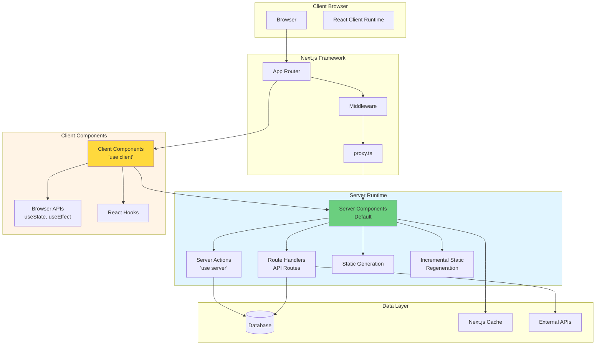

### Next.js Request Flow

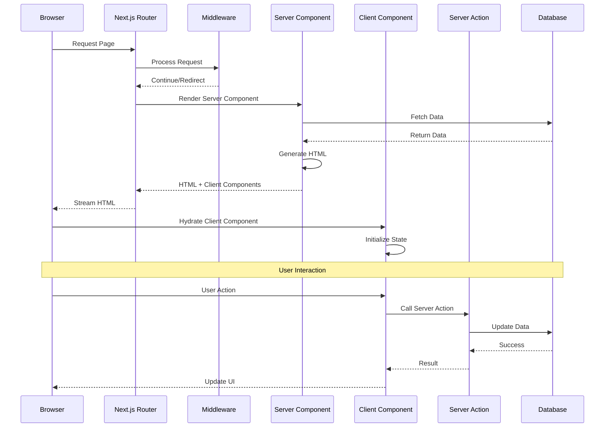

### App Router (Next.js 13+)

#### Server Components vs Client Components

```typescript
// app/users/page.tsx - Server Component (default)
import { db } from '@/lib/db';

export default async function UsersPage() {
    // This runs on the server
    const users = await db.users.findMany();
    
    return (
        <div>
            <h1>Users</h1>
            <UsersList users={users} />
        </div>
    );
}

// app/components/UsersList.tsx - Client Component
'use client';

import { useState } from 'react';

export function UsersList({ users }: { users: User[] }) {
    const [selected, setSelected] = useState<number | null>(null);
    
    return (
        <ul>
            {users.map(user => (
                <li key={user.id} onClick={() => setSelected(user.id)}>
                    {user.name}
                </li>
            ))}
        </ul>
    );
}
```

#### Server Actions

```typescript
// app/actions/user.ts
'use server';

import { db } from '@/lib/db';
import { revalidatePath } from 'next/cache';

export async function createUser(formData: FormData) {
    const name = formData.get('name') as string;
    const email = formData.get('email') as string;
    
    const user = await db.users.create({
        data: { name, email }
    });
    
    revalidatePath('/users');
    return user;
}

// app/components/CreateUserForm.tsx
'use client';

import { createUser } from '@/app/actions/user';

export function CreateUserForm() {
    return (
        <form action={createUser}>
            <input name="name" required />
            <input name="email" type="email" required />
            <button type="submit">Create User</button>
        </form>
    );
}
```

#### Server-Side Rendering (SSR) Flow

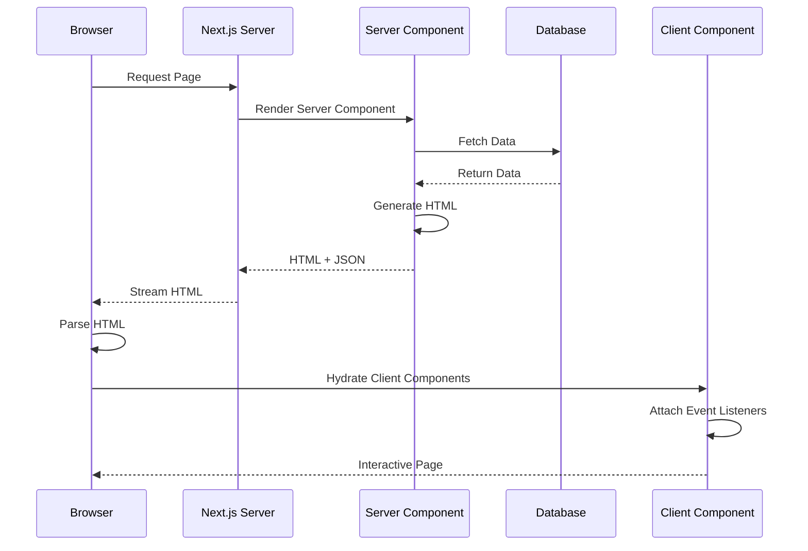

#### Client-Side Rendering (CSR) Flow

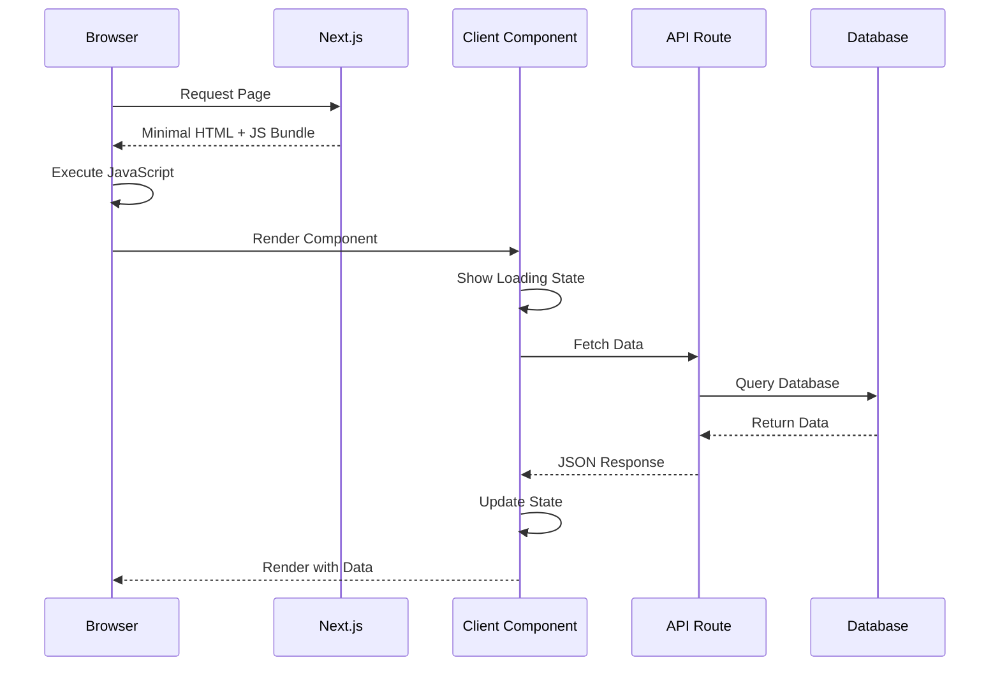

#### API Route Flow

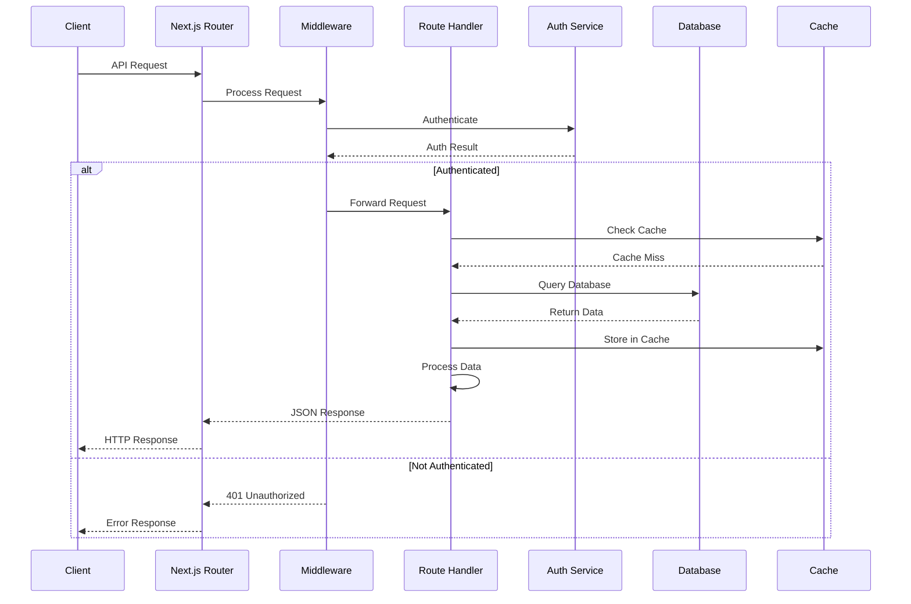

#### Route Handlers

```typescript
// app/api/users/route.ts
import { NextRequest, NextResponse } from 'next/server';
import { db } from '@/lib/db';

export async function GET(request: NextRequest) {
    const searchParams = request.nextUrl.searchParams;
    const page = parseInt(searchParams.get('page') || '1');
    const limit = parseInt(searchParams.get('limit') || '10');
    
    const users = await db.users.findMany({
        skip: (page - 1) * limit,
        take: limit,
    });
    
    return NextResponse.json({ users, page, limit });
}

export async function POST(request: NextRequest) {
    const body = await request.json();
    
    const user = await db.users.create({
        data: body
    });
    
    return NextResponse.json(user, { status: 201 });
}
```

### Next.js 16 Highlights (2025)

- **Cache Components + `use cache`**: Partial Pre-Rendering (PPR) now lets you mark fragments that stay hot between requests while still streaming fresh data around them.
- **React Compiler (stable)**: the release ships with compiler-backed automatic memoization, so most components no longer need manual `useMemo` / `memo` wrappers.
- **Turbopack by default**: both dev and prod builds use Rust-powered Turbopack; fall back with `next build --no-turbo` only when legacy webpack plugins are still required.
- **`proxy.ts` network boundary**: middleware rewrites and auth headers move into `proxy.ts`, which runs on the Node runtime and makes outbound dependencies explicit.
- **Next.js DevTools + MCP**: the overlay now surfaces fetch cache misses, route waterfalls, and AI-assisted remediation steps.
- **Expanded cache APIs**: helpers like `updateTag()`, `refresh()`, and improved `revalidateTag()` give finer control when mixing Server Components and Route Handlers.
- **Image defaults**: AVIF is first-class with automatic `sizes` hints, cutting layout shift on content-heavy landing pages.

> ✅ **Upgrade tip**: run `npx @next/codemod@latest upgrade` to migrate middleware to `proxy.ts`, flag legacy webpack configs, and surface `"use cache"` opportunities automatically.

---

## React Advanced Patterns

### React Component Lifecycle

#### Component Lifecycle Diagram

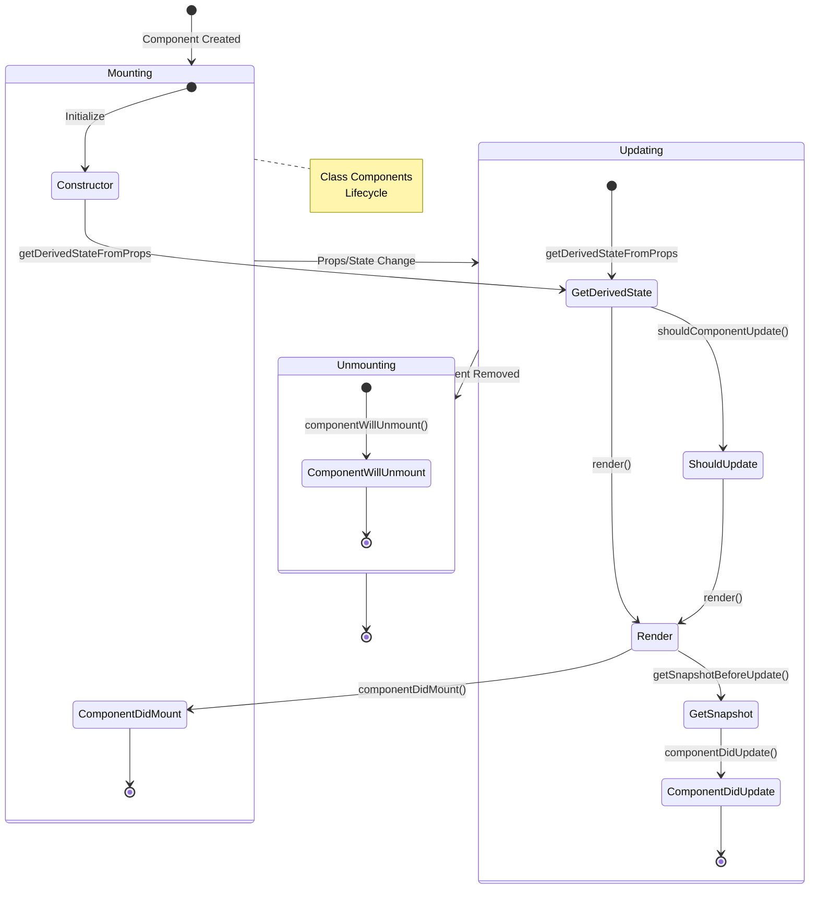

#### React Hooks Lifecycle (Functional Components)

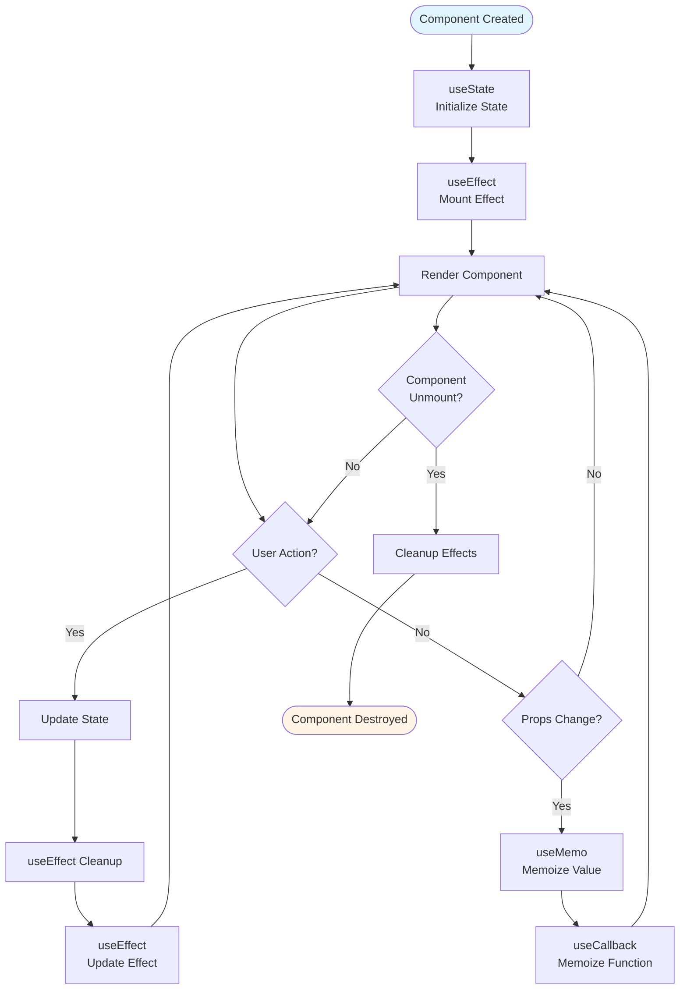

### React Component Lifecycle

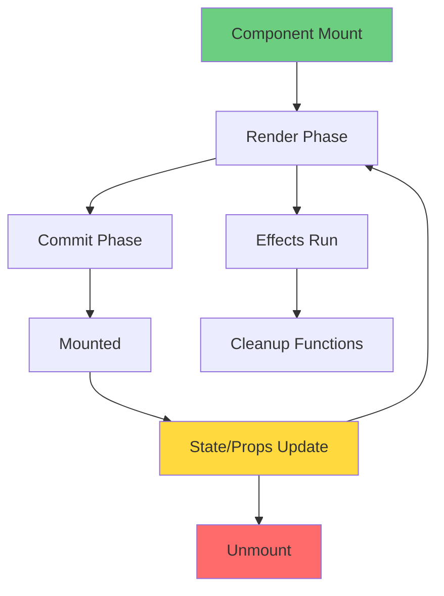

### Custom Hooks

```typescript
// hooks/useDebounce.ts
import { useState, useEffect } from 'react';

export function useDebounce<T>(value: T, delay: number): T {
    const [debouncedValue, setDebouncedValue] = useState<T>(value);
    
    useEffect(() => {
        const handler = setTimeout(() => {
            setDebouncedValue(value);
        }, delay);
        
        return () => {
            clearTimeout(handler);
        };
    }, [value, delay]);
    
    return debouncedValue;
}

// hooks/useFetch.ts
import { useState, useEffect } from 'react';

interface UseFetchResult<T> {
    data: T | null;
    loading: boolean;
    error: Error | null;
    refetch: () => void;
}

export function useFetch<T>(url: string): UseFetchResult<T> {
    const [data, setData] = useState<T | null>(null);
    const [loading, setLoading] = useState(true);
    const [error, setError] = useState<Error | null>(null);
    
    const fetchData = async () => {
        try {
            setLoading(true);
            setError(null);
            const response = await fetch(url);
            if (!response.ok) {
                throw new Error(`HTTP error! status: ${response.status}`);
            }
            const json = await response.json();
            setData(json);
        } catch (err) {
            setError(err instanceof Error ? err : new Error('Unknown error'));
        } finally {
            setLoading(false);
        }
    };
    
    useEffect(() => {
        fetchData();
    }, [url]);
    
    return { data, loading, error, refetch: fetchData };
}
```

### Compound Components

```typescript
// components/Accordion.tsx
'use client';

import { createContext, useContext, useState, ReactNode } from 'react';

interface AccordionContextType {
    openItems: Set<string>;
    toggle: (id: string) => void;
}

const AccordionContext = createContext<AccordionContextType | undefined>(undefined);

export function Accordion({ children }: { children: ReactNode }) {
    const [openItems, setOpenItems] = useState<Set<string>>(new Set());
    
    const toggle = (id: string) => {
        setOpenItems(prev => {
            const next = new Set(prev);
            if (next.has(id)) {
                next.delete(id);
            } else {
                next.add(id);
            }
            return next;
        });
    };
    
    return (
        <AccordionContext.Provider value={{ openItems, toggle }}>
            <div className="accordion">{children}</div>
        </AccordionContext.Provider>
    );
}

export function AccordionItem({ id, children }: { id: string; children: ReactNode }) {
    const context = useContext(AccordionContext);
    if (!context) throw new Error('AccordionItem must be inside Accordion');
    
    const isOpen = context.openItems.has(id);
    
    return (
        <div className="accordion-item">
            {React.Children.map(children, child => {
                if (React.isValidElement(child)) {
                    return React.cloneElement(child, { id, isOpen });
                }
                return child;
            })}
        </div>
    );
}

export function AccordionHeader({ id, isOpen }: { id: string; isOpen: boolean }) {
    const context = useContext(AccordionContext);
    if (!context) throw new Error('AccordionHeader must be inside Accordion');
    
    return (
        <button onClick={() => context.toggle(id)}>
            {isOpen ? '▼' : '▶'}
        </button>
    );
}
```

---

## State Management

### State Management Architecture

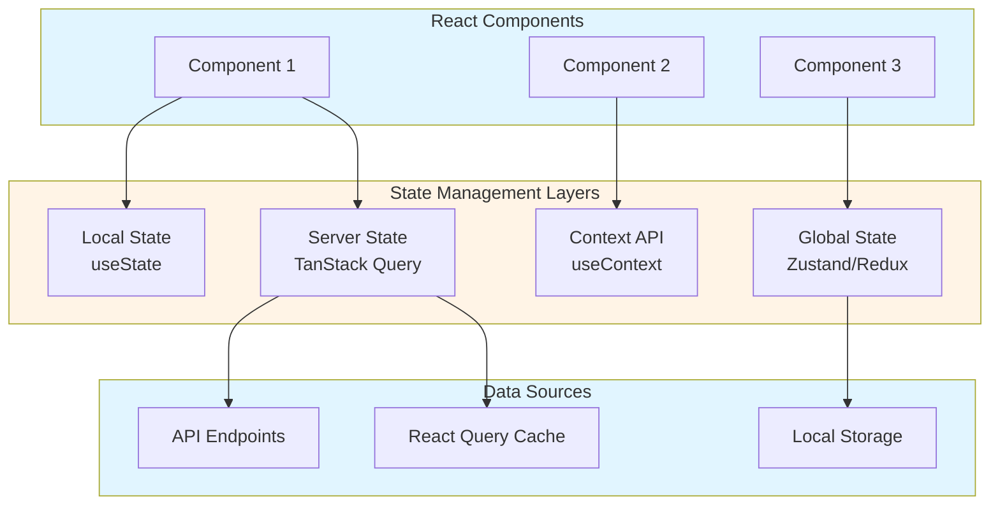

### State Management Flow

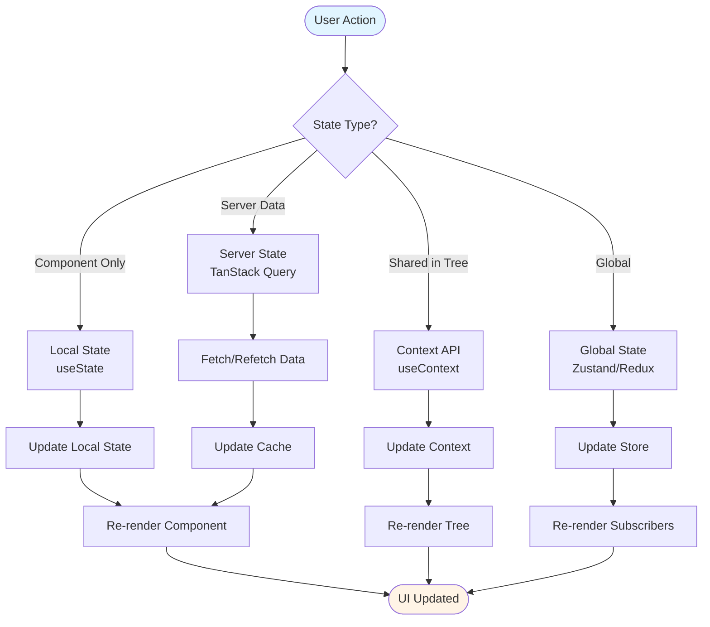

### State Management Flow

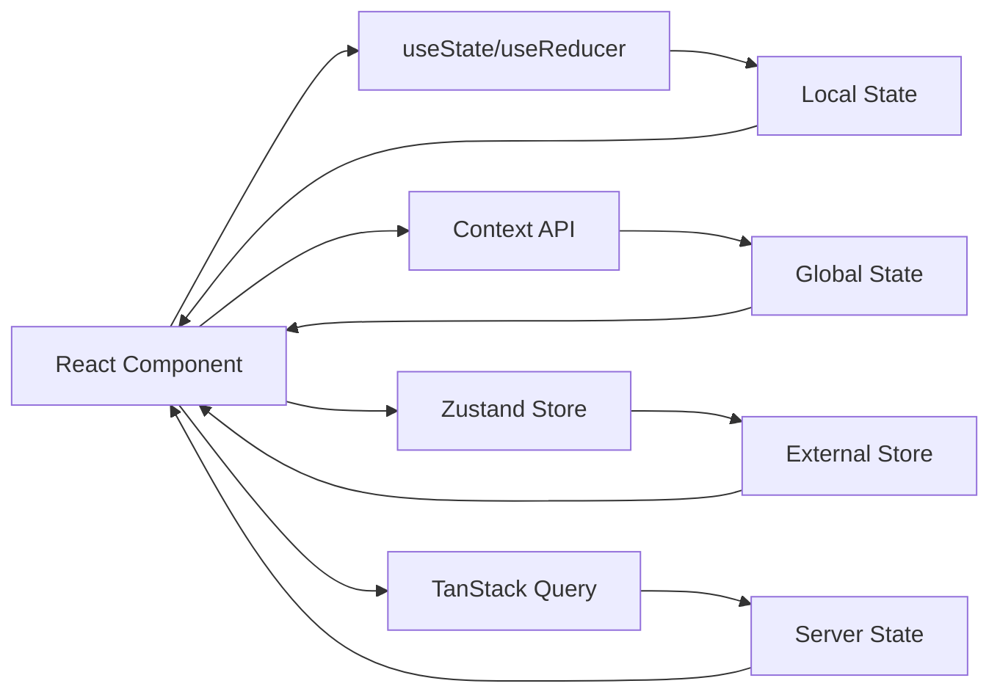

### Zustand Example

```typescript
// stores/userStore.ts
import { create } from 'zustand';
import { devtools, persist } from 'zustand/middleware';

interface UserState {
    user: User | null;
    setUser: (user: User) => void;
    clearUser: () => void;
}

export const useUserStore = create<UserState>()(
    devtools(
        persist(
            (set) => ({
                user: null,
                setUser: (user) => set({ user }),
                clearUser: () => set({ user: null }),
            }),
            { name: 'user-storage' }
        )
    )
);
```

### TanStack Query Example

```typescript
// hooks/useUsers.ts
import { useQuery, useMutation, useQueryClient } from '@tanstack/react-query';

export function useUsers() {
    return useQuery({
        queryKey: ['users'],
        queryFn: async () => {
            const response = await fetch('/api/users');
            if (!response.ok) throw new Error('Failed to fetch users');
            return response.json();
        },
        staleTime: 5 * 60 * 1000, // 5 minutes
    });
}

export function useCreateUser() {
    const queryClient = useQueryClient();
    
    return useMutation({
        mutationFn: async (userData: CreateUserData) => {
            const response = await fetch('/api/users', {
                method: 'POST',
                headers: { 'Content-Type': 'application/json' },
                body: JSON.stringify(userData),
            });
            if (!response.ok) throw new Error('Failed to create user');
            return response.json();
        },
        onSuccess: () => {
            queryClient.invalidateQueries({ queryKey: ['users'] });
        },
    });
}
```

---

## Performance Optimization

### Code Splitting

```typescript
// Dynamic imports for code splitting
import dynamic from 'next/dynamic';

const HeavyComponent = dynamic(() => import('./HeavyComponent'), {
    loading: () => <p>Loading...</p>,
    ssr: false, // Disable SSR if needed
});

// Route-based code splitting
const AdminPanel = dynamic(() => import('./AdminPanel'), {
    loading: () => <div>Loading admin panel...</div>,
});
```

### React Performance

```typescript
// Memoization
import { memo, useMemo, useCallback } from 'react';

const ExpensiveComponent = memo(({ data, onUpdate }: Props) => {
    const processedData = useMemo(() => {
        return expensiveCalculation(data);
    }, [data]);
    
    const handleClick = useCallback(() => {
        onUpdate(processedData);
    }, [processedData, onUpdate]);
    
    return <div onClick={handleClick}>{processedData}</div>;
});
```

---

## Testing

### Unit Testing with Jest

```typescript
// __tests__/utils.test.ts
import { formatCurrency, calculateTotal } from '@/utils';

describe('formatCurrency', () => {
    it('formats positive numbers correctly', () => {
        expect(formatCurrency(1000)).toBe('$1,000.00');
    });
    
    it('handles zero', () => {
        expect(formatCurrency(0)).toBe('$0.00');
    });
    
    it('handles negative numbers', () => {
        expect(formatCurrency(-100)).toBe('-$100.00');
    });
});
```

### Component Testing

```typescript
// __tests__/Button.test.tsx
import { render, screen, fireEvent } from '@testing-library/react';
import { Button } from '@/components/Button';

describe('Button', () => {
    it('renders with text', () => {
        render(<Button>Click me</Button>);
        expect(screen.getByText('Click me')).toBeInTheDocument();
    });
    
    it('calls onClick when clicked', () => {
        const handleClick = jest.fn();
        render(<Button onClick={handleClick}>Click me</Button>);
        
        fireEvent.click(screen.getByText('Click me'));
        expect(handleClick).toHaveBeenCalledTimes(1);
    });
});
```

---

## Architecture & Design Patterns

### Feature-Based Organization

```
src/
├── features/
│   ├── users/
│   │   ├── components/
│   │   ├── hooks/
│   │   ├── services/
│   │   ├── types/
│   │   └── index.ts
│   └── products/
├── shared/
│   ├── components/
│   ├── utils/
│   └── types/
└── app/
```

### Repository Pattern

```typescript
// repositories/UserRepository.ts
export interface UserRepository {
    findById(id: number): Promise<User | null>;
    findAll(): Promise<User[]>;
    create(data: CreateUserData): Promise<User>;
    update(id: number, data: UpdateUserData): Promise<User>;
    delete(id: number): Promise<void>;
}

export class PrismaUserRepository implements UserRepository {
    constructor(private db: PrismaClient) {}
    
    async findById(id: number): Promise<User | null> {
        return this.db.user.findUnique({ where: { id } });
    }
    
    // ... other methods
}
```

---

## DevOps & Deployment

### Next.js Build & Deployment Flow

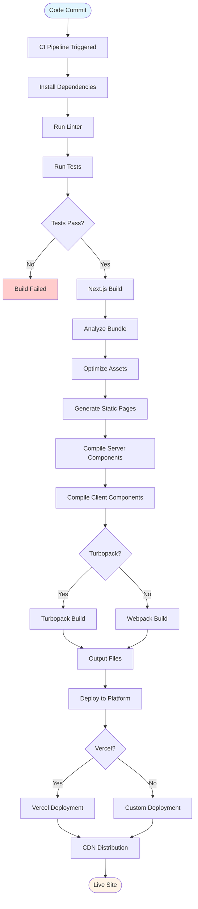

### Build Process Architecture

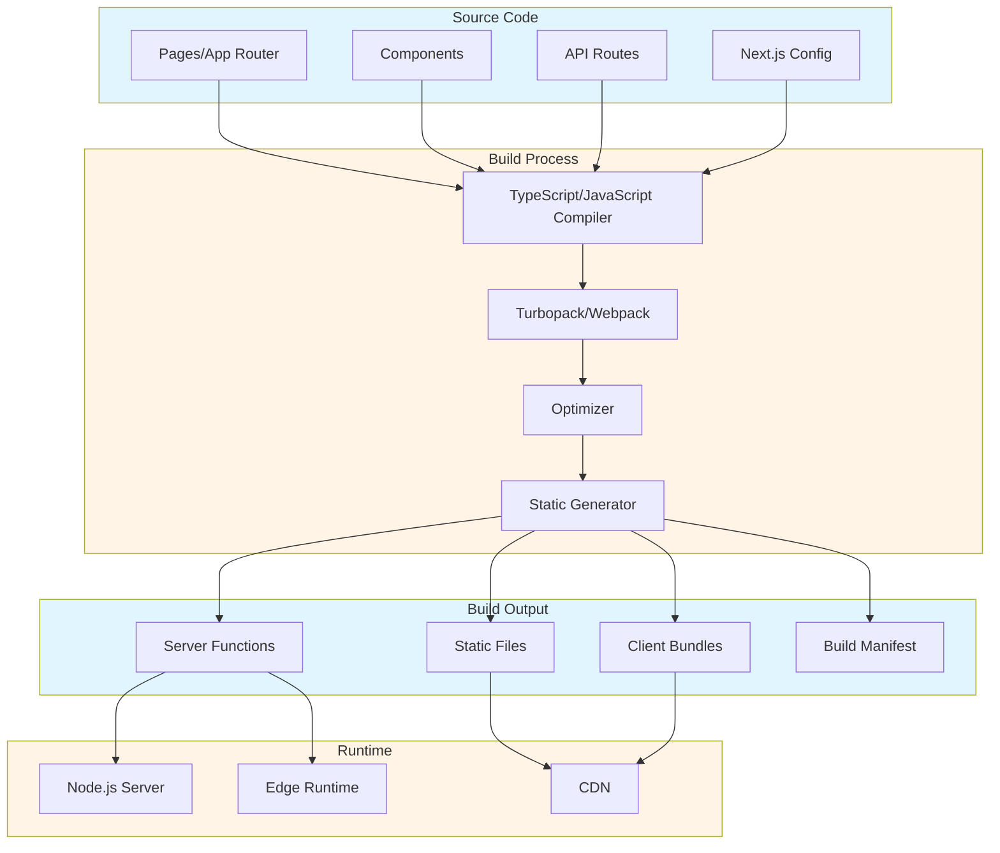

### Next.js 16 Build & Cache Strategy

- **Turbopack CI**: default `next build` already runs Turbopack—pin `NEXT_TELEMETRY_DISABLED=1` and cache `.next/cache/turbo` between CI jobs for 3x faster cold builds.
- **Partial Pre-Rendering (PPR)**: pair `Cache Components` with `prerender-manifest.json` auditing so that every deploy documents which routes stream vs hydrate.
- **`proxy.ts` rollout**: treat the file as infrastructure-as-code—gate PRs that add new upstreams, enforce secret injection via typed helpers, and keep the legacy `middleware.ts` only for Edge runtime use cases.

### Operational Guardrails

- **Cache invalidation**: build runbooks around `revalidateTag()`, `updateTag()`, and `refresh()` so incidents are solved with targeted invalidations instead of full redeploys.
- **Security feed automation**: subscribe CI to `nextjs.org/blog/security` and `devblogs.microsoft.com/typescript` RSS feeds; fail builds when vulnerable versions are detected.
- **Release verification**: smoke-test Server Actions, `use cache` components, and React Compiler output under production-like load before rolling traffic to the new release.

---

## Security

### XSS Prevention

```typescript
// Sanitize user input
import DOMPurify from 'isomorphic-dompurify';

function SafeHTML({ html }: { html: string }) {
    const sanitized = DOMPurify.sanitize(html);
    return <div dangerouslySetInnerHTML={{ __html: sanitized }} />;
}
```

### CSRF Protection

```typescript
// middleware.ts
import { NextResponse } from 'next/server';
import type { NextRequest } from 'next/server';

export function middleware(request: NextRequest) {
    const token = request.headers.get('X-CSRF-Token');
    const cookieToken = request.cookies.get('csrf-token')?.value;
    
    if (request.method !== 'GET' && token !== cookieToken) {
        return NextResponse.json(
            { error: 'Invalid CSRF token' },
            { status: 403 }
        );
    }
    
    return NextResponse.next();
}
```

### Next.js Security Advisories (Dec 2025)

- **CVE-2025-55184**: crafted RSC payloads can trigger infinite loops and DoS unpatched servers—upgrade to Next.js ≥16.0.10 immediately.
- **CVE-2025-55183**: the same RSC window could leak compiled server code; rotate secrets and redeploy after patching.
- **CVE-2025-66478**: fixes a remote code execution vector in the RSC protocol—treat it as critical and automate dependency alerts for future advisories.

---

## Common Pitfalls

### 1. **Memory Leaks**

```typescript
// BAD: Event listener not cleaned up
useEffect(() => {
    window.addEventListener('resize', handleResize);
    // Missing cleanup!
}, []);

// GOOD: Proper cleanup
useEffect(() => {
    window.addEventListener('resize', handleResize);
    return () => {
        window.removeEventListener('resize', handleResize);
    };
}, []);
```

### 2. **Stale Closures**

```typescript
// BAD: Stale closure
function Component() {
    const [count, setCount] = useState(0);
    
    useEffect(() => {
        const interval = setInterval(() => {
            setCount(count + 1); // Always uses initial count
        }, 1000);
        return () => clearInterval(interval);
    }, []); // Missing count dependency
    
    return <div>{count}</div>;
}

// GOOD: Functional update
useEffect(() => {
    const interval = setInterval(() => {
        setCount(prev => prev + 1); // Uses latest state
    }, 1000);
    return () => clearInterval(interval);
}, []);
```

### 3. **Unnecessary Re-renders**

```typescript
// BAD: New object/array on every render
function Component({ items }: { items: string[] }) {
    const filtered = items.filter(i => i.startsWith('a')); // New array every render
    const config = { option: true }; // New object every render
    
    return <Child items={filtered} config={config} />;
}

// GOOD: Memoization
function Component({ items }: { items: string[] }) {
    const filtered = useMemo(
        () => items.filter(i => i.startsWith('a')),
        [items]
    );
    const config = useMemo(() => ({ option: true }), []);
    
    return <Child items={filtered} config={config} />;
}
```

---

## Real-World Examples

### Example 1: E-Commerce Product Page

```typescript
// app/products/[id]/page.tsx - Server Component
import { db } from '@/lib/db';
import { ProductDetails } from '@/components/ProductDetails';
import { RelatedProducts } from '@/components/RelatedProducts';

export default async function ProductPage({ params }: { params: { id: string } }) {
    // Server-side data fetching
    const product = await db.products.findUnique({
        where: { id: params.id },
        include: { reviews: true, images: true }
    });
    
    const relatedProducts = await db.products.findMany({
        where: { categoryId: product.categoryId },
        take: 4
    });
    
    return (
        <div>
            <ProductDetails product={product} />
            <RelatedProducts products={relatedProducts} />
        </div>
    );
}

// components/ProductDetails.tsx - Client Component
'use client';

import { useState } from 'react';
import { useCart } from '@/hooks/useCart';

export function ProductDetails({ product }: { product: Product }) {
    const [selectedImage, setSelectedImage] = useState(product.images[0]);
    const { addToCart } = useCart();
    
    return (
        <div>
            
            <h1>{product.name}</h1>
            <p>{product.description}</p>
            <button onClick={() => addToCart(product)}>Add to Cart</button>
        </div>
    );
}
```

### Example 2: Real-Time Dashboard with TanStack Query

```typescript
// hooks/useDashboardData.ts
import { useQuery } from '@tanstack/react-query';

export function useDashboardData() {
    const { data: stats, isLoading } = useQuery({
        queryKey: ['dashboard', 'stats'],
        queryFn: async () => {
            const response = await fetch('/api/dashboard/stats');
            return response.json();
        },
        refetchInterval: 30000, // Refetch every 30 seconds
    });
    
    return { stats, isLoading };
}

// app/dashboard/page.tsx
'use client';

import { useDashboardData } from '@/hooks/useDashboardData';

export default function Dashboard() {
    const { stats, isLoading } = useDashboardData();
    
    if (isLoading) return <div>Loading...</div>;
    
    return (
        <div>
            <h1>Dashboard</h1>
            <div>Total Users: {stats.totalUsers}</div>
            <div>Active Orders: {stats.activeOrders}</div>
            <div>Revenue: ${stats.revenue}</div>
        </div>
    );
}
```

---

## Resources

### Documentation
- [MDN Web Docs](https://developer.mozilla.org/)
- [TypeScript Handbook](https://www.typescriptlang.org/docs/)
- [Next.js Documentation](https://nextjs.org/docs)
- [React Documentation](https://react.dev/)

### Release Notes & Advisories
- [Next.js 16 Release Notes](https://nextjs.org/blog/next-16)
- [Next.js Security Update – December 2025](https://nextjs.org/blog/security-update-2025-12-11)
- [Announcing TypeScript 5.9](https://devblogs.microsoft.com/typescript/announcing-typescript-5-9/)
- [Progress on TypeScript 7 (Project Corsa)](https://devblogs.microsoft.com/typescript/progress-on-typescript-7-december-2025/)

### Tools
- [ESLint](https://eslint.org/)
- [Prettier](https://prettier.io/)
- [Jest](https://jestjs.io/)
- [Playwright](https://playwright.dev/)

---

## Summary

This guide covers the essential knowledge for senior JavaScript/TypeScript/Next.js developers:

1. **Core JavaScript**: Closures, prototypes, async programming, memory management
2. **TypeScript**: Advanced types, generics, type guards
3. **Next.js**: App Router, Server Components, Server Actions
4. **React**: Advanced hooks, patterns, performance optimization
5. **State Management**: Zustand, TanStack Query
6. **Testing**: Unit, integration, E2E testing
7. **Architecture**: Feature-based organization, design patterns
8. **Security**: XSS, CSRF prevention, secure coding
9. **Performance**: Code splitting, memoization, optimization
10. **Best Practices**: Code quality, documentation, team leadership

Master these concepts to build scalable, maintainable, and high-performance web applications.

