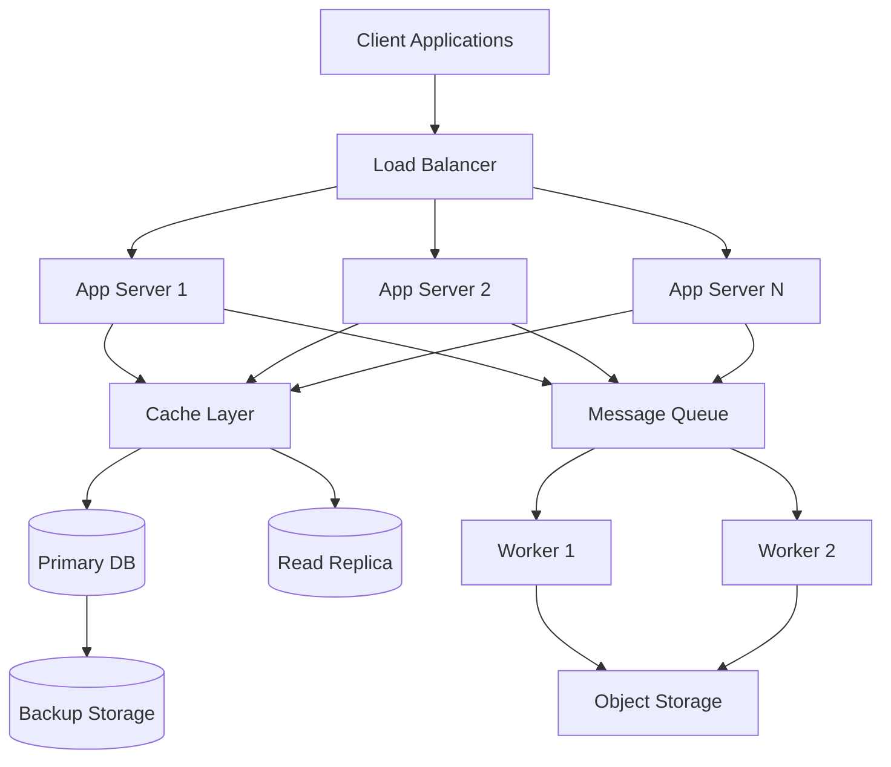
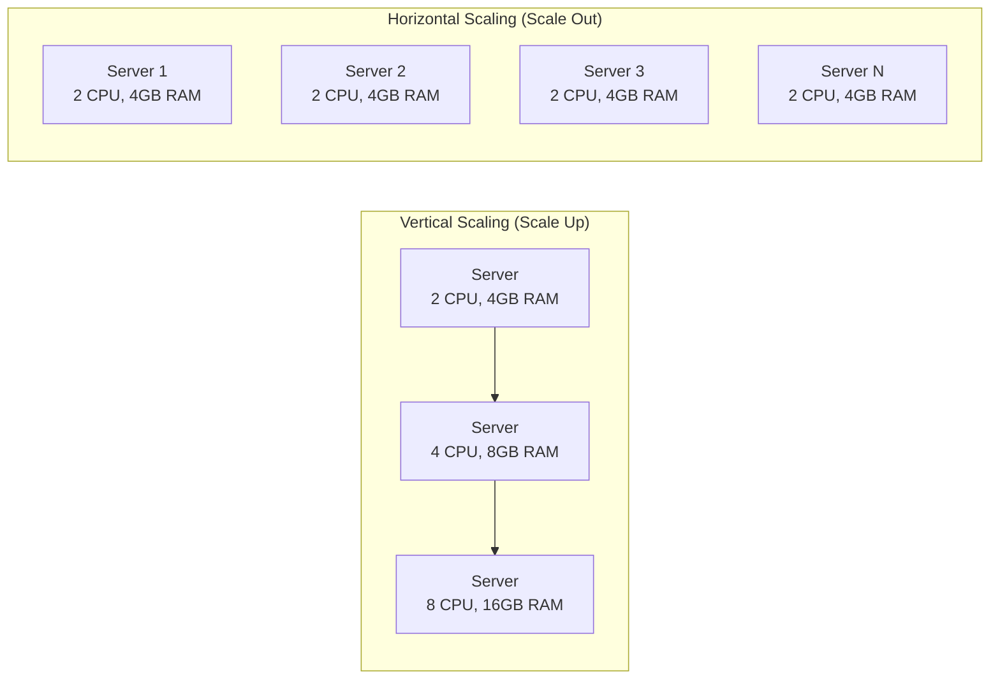
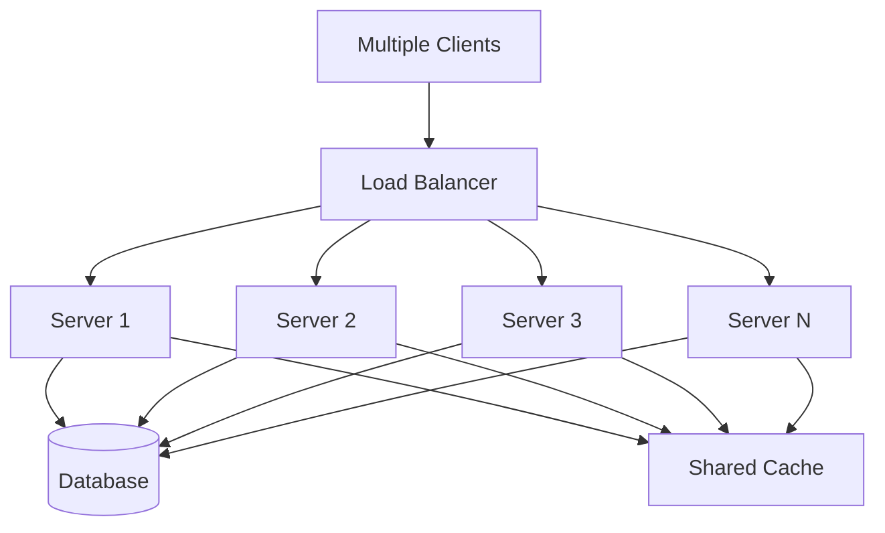
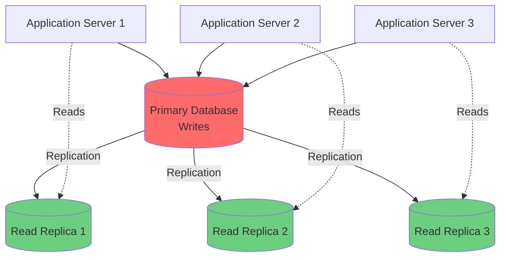

# System Design Guide for Senior Engineers

## Table of Contents
1. [Fundamentals](#fundamentals)
2. [Scalability](#scalability)
3. [Reliability & Availability](#reliability--availability)
4. [Performance](#performance)
5. [Consistency & Data Management](#consistency--data-management)
6. [Architecture Patterns](#architecture-patterns)
7. [Distributed Systems](#distributed-systems)
8. [Caching Strategies](#caching-strategies)
9. [Load Balancing](#load-balancing)
10. [Database Design](#database-design)
11. [API Design](#api-design)
12. [Security](#security)
13. [Monitoring & Observability](#monitoring--observability)
14. [Design Process](#design-process)
15. [Common System Design Questions](#common-system-design-questions)

---

## Fundamentals

### What is System Design?

System design is the process of defining the architecture, components, modules, interfaces, and data for a system to satisfy specified requirements. It involves:

- **Architecture**: High-level structure of the system
- **Components**: Individual modules and services
- **Interfaces**: Communication between components
- **Data Flow**: How data moves through the system
- **Scalability**: Ability to handle growth
- **Reliability**: System availability and fault tolerance
- **Performance**: Response time and throughput

### Key Principles

#### 1. **Scalability**
- Horizontal scaling (add more servers)
- Vertical scaling (upgrade server resources)
- Stateless services for easy scaling
- Database sharding and replication

#### 2. **Reliability**
- Redundancy and failover
- Error handling and recovery
- Data backup and replication
- Health checks and monitoring

#### 3. **Availability**
- 99.9% (3 nines) = 8.76 hours downtime/year
- 99.99% (4 nines) = 52.56 minutes downtime/year
- 99.999% (5 nines) = 5.26 minutes downtime/year

#### 4. **Performance**
- Response time (latency)
- Throughput (requests per second)
- Resource utilization
- Caching strategies

#### 5. **Consistency**
- Strong consistency
- Eventual consistency
- CAP theorem trade-offs

#### 6. **Security**
- Authentication and authorization
- Data encryption
- Input validation
- Rate limiting
- DDoS protection

### System Architecture Overview



---

## Scalability

### Horizontal vs Vertical Scaling

#### Vertical Scaling (Scale Up)
- **Definition**: Adding more power (CPU, RAM) to existing machines
- **Pros**: Simple, no code changes needed
- **Cons**: Limited by hardware, expensive, single point of failure
- **Use Case**: Small to medium applications

#### Horizontal Scaling (Scale Out)
- **Definition**: Adding more machines to handle increased load
- **Pros**: Unlimited scaling, cost-effective, fault-tolerant
- **Cons**: Requires stateless design, load balancing, data consistency challenges
- **Use Case**: Large-scale applications

### Scaling Comparison



### Scaling Strategies

#### 1. **Stateless Services**
```javascript
// ❌ Stateful (hard to scale)
class UserSession {
    constructor() {
        this.sessions = new Map(); // Stored in memory
    }
}

// ✅ Stateless (easy to scale)
class UserSession {
    async getSession(sessionId) {
        return await redis.get(`session:${sessionId}`);
    }
    
    async setSession(sessionId, data) {
        return await redis.set(`session:${sessionId}`, data);
    }
}
```

#### 2. **Database Scaling**
- **Read Replicas**: Distribute read traffic
- **Sharding**: Partition data across multiple databases
- **Caching**: Reduce database load
- **Connection Pooling**: Efficient database connections

#### 3. **Microservices**
- Break monolithic application into smaller services
- Independent scaling per service
- Service-specific technology choices
- Challenges: Service communication, data consistency, deployment complexity

### Capacity Planning

#### Estimating Requirements
1. **Traffic Estimation**
   - Daily Active Users (DAU)
   - Requests per user per day
   - Peak traffic (2-3x average)
   - Growth projections

2. **Storage Estimation**
   - Data per user
   - Retention period
   - Replication factor
   - Growth rate

3. **Bandwidth Estimation**
   - Request/response sizes
   - Peak requests per second
   - Content delivery needs

#### Example Calculation
```
Assumptions:
- 100M DAU
- Each user makes 10 requests/day
- Average request size: 10KB
- Response size: 50KB
- Peak traffic: 3x average

Daily requests: 100M × 10 = 1B requests/day
Peak QPS: (1B / 86400) × 3 ≈ 35,000 QPS
Bandwidth: 35,000 × 60KB = 2.1 GB/s
```

---

## Reliability & Availability

### Fault Tolerance

#### 1. **Redundancy**
- **Active-Passive**: One active, one standby
- **Active-Active**: Multiple active instances
- **Geographic Redundancy**: Multiple data centers

#### 2. **Failover Mechanisms**
```javascript
// Circuit Breaker Pattern
class CircuitBreaker {
    constructor(threshold = 5, timeout = 60000) {
        this.failureCount = 0;
        this.threshold = threshold;
        this.timeout = timeout;
        this.state = 'CLOSED'; // CLOSED, OPEN, HALF_OPEN
        this.nextAttempt = Date.now();
    }
    
    async execute(fn) {
        if (this.state === 'OPEN') {
            if (Date.now() < this.nextAttempt) {
                throw new Error('Circuit breaker is OPEN');
            }
            this.state = 'HALF_OPEN';
        }
        
        try {
            const result = await fn();
            this.onSuccess();
            return result;
        } catch (error) {
            this.onFailure();
            throw error;
        }
    }
    
    onSuccess() {
        this.failureCount = 0;
        this.state = 'CLOSED';
    }
    
    onFailure() {
        this.failureCount++;
        if (this.failureCount >= this.threshold) {
            this.state = 'OPEN';
            this.nextAttempt = Date.now() + this.timeout;
        }
    }
}
```

#### 3. **Health Checks**
- **Liveness Probe**: Is the service running?
- **Readiness Probe**: Is the service ready to accept traffic?
- **Startup Probe**: Has the service started?

### Data Replication

#### 1. **Master-Slave Replication**
- One master (writes), multiple slaves (reads)
- Asynchronous replication
- Use case: Read-heavy workloads

#### 2. **Master-Master Replication**
- Multiple masters, bidirectional replication
- Conflict resolution needed
- Use case: Geographic distribution

#### 3. **Multi-Region Replication**
- Data replicated across regions
- Lower latency for global users
- Disaster recovery

### Backup Strategies

#### 1. **Full Backup**
- Complete data copy
- Time-consuming, storage-intensive
- Weekly or monthly

#### 2. **Incremental Backup**
- Only changed data since last backup
- Faster, less storage
- Daily

#### 3. **Continuous Backup**
- Real-time replication
- Point-in-time recovery
- Higher cost

---

## Performance

### Latency Optimization

#### 1. **CDN (Content Delivery Network)**
- Geographic distribution of static content
- Reduced latency for global users
- Reduced origin server load
- Use cases: Images, videos, static assets, API responses

#### 2. **Caching Layers**
```
Browser Cache → CDN → Application Cache → Database Cache
```

#### 3. **Database Optimization**
- Indexing strategies
- Query optimization
- Connection pooling
- Read replicas for read-heavy workloads

#### 4. **Asynchronous Processing**
```javascript
// Synchronous (blocking)
app.post('/upload', async (req, res) => {
    const result = await processLargeFile(req.file); // Blocks
    res.json(result);
});

// Asynchronous (non-blocking)
app.post('/upload', async (req, res) => {
    const jobId = await queue.add('process-file', req.file);
    res.json({ jobId, status: 'processing' });
});

// Worker processes file in background
worker.process('process-file', async (job) => {
    return await processLargeFile(job.data);
});
```

### Throughput Optimization

#### 1. **Connection Pooling**
- Reuse database connections
- Reduce connection overhead
- Configure pool size based on load

#### 2. **Batch Processing**
```javascript
// ❌ N+1 Query Problem
users.forEach(async user => {
    const orders = await db.getOrders(user.id); // N queries
});

// ✅ Batch Query
const userIds = users.map(u => u.id);
const allOrders = await db.getOrdersBatch(userIds); // 1 query
```

#### 3. **Pagination**
- Limit data transfer
- Reduce memory usage
- Improve response time

#### 4. **Compression**
- Gzip/Brotli compression
- Reduce bandwidth usage
- Faster data transfer

---

## Consistency & Data Management

### CAP Theorem

The CAP theorem states that a distributed system can only guarantee two of three properties:

- **Consistency**: All nodes see the same data simultaneously
- **Availability**: System remains operational
- **Partition Tolerance**: System continues despite network failures

#### Trade-offs

1. **CP (Consistency + Partition Tolerance)**
   - Example: Distributed databases (MongoDB, HBase)
   - Sacrifices availability for consistency

2. **AP (Availability + Partition Tolerance)**
   - Example: DNS, CouchDB, Cassandra
   - Sacrifices consistency for availability

3. **CA (Consistency + Availability)**
   - Not possible in distributed systems
   - Only works in single-node systems

### Consistency Models

#### 1. **Strong Consistency**
- All reads receive the most recent write
- Synchronous replication
- Higher latency
- Use case: Financial transactions

#### 2. **Eventual Consistency**
- System will become consistent over time
- Asynchronous replication
- Lower latency
- Use case: Social media feeds, comments

#### 3. **Weak Consistency**
- No guarantee of consistency
- Fastest performance
- Use case: Real-time analytics, metrics

### ACID vs BASE

#### ACID (Traditional Databases)
- **Atomicity**: All or nothing
- **Consistency**: Valid state transitions
- **Isolation**: Concurrent transactions don't interfere
- **Durability**: Committed data persists

#### BASE (NoSQL Databases)
- **Basically Available**: System is available
- **Soft State**: State may change over time
- **Eventual Consistency**: Will become consistent

---

## Architecture Patterns

### Monolithic Architecture

#### Characteristics
- Single deployable unit
- Shared database
- Tightly coupled components
- Simple to develop and deploy initially

#### Pros
- Simple development
- Easy testing
- Straightforward deployment
- Transaction management

#### Cons
- Hard to scale
- Technology lock-in
- Single point of failure
- Difficult to maintain at scale

### Microservices Architecture

#### Characteristics
- Small, independent services
- Own database per service
- Loosely coupled
- Independent deployment

#### Pros
- Independent scaling
- Technology diversity
- Fault isolation
- Team autonomy

#### Cons
- Distributed system complexity
- Network latency
- Data consistency challenges
- Operational overhead

#### Service Communication
```javascript
// Synchronous (REST, gRPC)
class UserService {
    async getUserOrders(userId) {
        const orders = await httpClient.get(`/orders?userId=${userId}`);
        return orders;
    }
}

// Asynchronous (Message Queue)
class OrderService {
    async createOrder(order) {
        await orderRepository.save(order);
        await messageQueue.publish('order.created', order);
    }
}

class NotificationService {
    async onOrderCreated(event) {
        await emailService.send(order.userId, 'Order confirmed');
    }
}
```

### Event-Driven Architecture

#### Components
- **Event Producers**: Generate events
- **Event Consumers**: Process events
- **Event Bus/Message Broker**: Routes events
- **Event Store**: Persists events

#### Patterns
1. **Pub/Sub**: Multiple consumers per event
2. **Event Sourcing**: Store all events as source of truth
3. **CQRS**: Separate read and write models

```javascript
// Event Sourcing Example
class EventStore {
    async append(streamId, event) {
        await db.insert({
            streamId,
            eventType: event.type,
            eventData: event.data,
            timestamp: Date.now()
        });
    }
    
    async getEvents(streamId) {
        return await db.query(
            'SELECT * FROM events WHERE streamId = ? ORDER BY timestamp',
            [streamId]
        );
    }
}

// Rebuild state from events
class Aggregate {
    constructor(events) {
        this.state = {};
        events.forEach(event => this.apply(event));
    }
    
    apply(event) {
        switch(event.type) {
            case 'UserCreated':
                this.state = { ...event.data };
                break;
            case 'UserUpdated':
                this.state = { ...this.state, ...event.data };
                break;
        }
    }
}
```

### Serverless Architecture

#### Characteristics
- Function-as-a-Service (FaaS)
- Event-driven execution
- Auto-scaling
- Pay-per-use

#### Pros
- No server management
- Auto-scaling
- Cost-effective
- Fast deployment

#### Cons
- Cold start latency
- Vendor lock-in
- Debugging complexity
- Limited execution time

---

## Distributed Systems

### Distributed System Challenges

#### 1. **Network Partitions**
- Services can't communicate
- Need partition tolerance
- Handle gracefully

#### 2. **Clock Synchronization**
- Distributed systems need time coordination
- Use NTP (Network Time Protocol)
- Consider logical clocks (Lamport timestamps)

#### 3. **Distributed Transactions**
- Two-Phase Commit (2PC)
- Saga Pattern
- Eventual consistency

#### 4. **Service Discovery**
```javascript
// Service Registry Pattern
class ServiceRegistry {
    async register(serviceName, address, port) {
        await redis.set(
            `service:${serviceName}`,
            JSON.stringify({ address, port, timestamp: Date.now() })
        );
    }
    
    async discover(serviceName) {
        const service = await redis.get(`service:${serviceName}`);
        return JSON.parse(service);
    }
    
    async healthCheck(serviceName) {
        // Periodic health checks
        setInterval(async () => {
            const service = await this.discover(serviceName);
            const isHealthy = await this.checkHealth(service);
            if (!isHealthy) {
                await this.unregister(serviceName);
            }
        }, 30000);
    }
}
```

### Consensus Algorithms

#### 1. **Raft**
- Leader election
- Log replication
- Simpler than Paxos
- Used in: etcd, Consul

#### 2. **Paxos**
- Classic consensus algorithm
- Complex to implement
- Used in: Chubby, Google systems

#### 3. **Byzantine Fault Tolerance**
- Handles malicious nodes
- More complex
- Used in: Blockchain systems

---

## Caching Strategies

### Cache Levels

#### 1. **Browser Cache**
- HTTP headers (Cache-Control, ETag)
- Static assets
- User-specific data

#### 2. **CDN Cache**
- Geographic distribution
- Static content
- API responses (if cacheable)

#### 3. **Application Cache**
- In-memory cache (Redis, Memcached)
- Frequently accessed data
- Session data

#### 4. **Database Cache**
- Query result cache
- Materialized views
- Read replicas

### Caching Patterns

#### 1. **Cache-Aside (Lazy Loading)**
```javascript
async function getUser(userId) {
    // Try cache first
    let user = await cache.get(`user:${userId}`);
    
    if (!user) {
        // Cache miss - load from database
        user = await db.getUser(userId);
        // Store in cache
        await cache.set(`user:${userId}`, user, 3600);
    }
    
    return user;
}
```

#### 2. **Write-Through**
```javascript
async function updateUser(userId, data) {
    // Update database
    const user = await db.updateUser(userId, data);
    // Update cache
    await cache.set(`user:${userId}`, user, 3600);
    return user;
}
```

#### 3. **Write-Behind (Write-Back)**
```javascript
async function updateUser(userId, data) {
    // Update cache immediately
    await cache.set(`user:${userId}`, data, 3600);
    // Write to database asynchronously
    queue.add('write-to-db', { userId, data });
    return data;
}
```

#### 4. **Refresh-Ahead**
- Proactively refresh cache before expiration
- Reduces cache misses
- Higher cache hit rate

### Cache Invalidation

#### Strategies
1. **TTL (Time-To-Live)**: Automatic expiration
2. **Manual Invalidation**: Explicit cache clearing
3. **Event-Based**: Invalidate on data changes
4. **Versioning**: Cache key includes version

```javascript
// Event-based cache invalidation
class CacheInvalidator {
    async onUserUpdated(userId) {
        await cache.delete(`user:${userId}`);
        await cache.delete(`user:${userId}:orders`);
    }
    
    async onOrderCreated(userId) {
        await cache.delete(`user:${userId}:orders`);
    }
}
```

---

## Load Balancing

### Load Balancing Architecture



### Load Balancing Algorithms

#### 1. **Round Robin**
- Distribute requests sequentially
- Simple and fair
- Doesn't consider server load

#### 2. **Weighted Round Robin**
- Assign weights to servers
- More powerful servers get more traffic
- Better resource utilization

#### 3. **Least Connections**
- Route to server with fewest active connections
- Good for long-lived connections
- Better load distribution

#### 4. **IP Hash**
- Hash client IP to determine server
- Session affinity
- Consistent routing

#### 5. **Geographic Routing**
- Route based on client location
- Lower latency
- Better user experience

### Load Balancer Types

#### 1. **Layer 4 (Transport Layer)**
- Routes based on IP and port
- Fast and simple
- No content awareness

#### 2. **Layer 7 (Application Layer)**
- Routes based on HTTP headers/content
- More intelligent routing
- SSL termination
- Content-based routing

### Health Checks

```javascript
class LoadBalancer {
    constructor(servers) {
        this.servers = servers;
        this.healthStatus = new Map();
        this.startHealthChecks();
    }
    
    async startHealthChecks() {
        setInterval(async () => {
            for (const server of this.servers) {
                const isHealthy = await this.checkHealth(server);
                this.healthStatus.set(server, isHealthy);
            }
        }, 5000);
    }
    
    async getHealthyServer() {
        const healthyServers = this.servers.filter(
            server => this.healthStatus.get(server)
        );
        
        if (healthyServers.length === 0) {
            throw new Error('No healthy servers available');
        }
        
        // Use load balancing algorithm
        return this.selectServer(healthyServers);
    }
}
```

---

## Database Design

### Database Replication Architecture



### Database Types

#### 1. **Relational Databases (SQL)**
- **PostgreSQL**: Advanced features, JSON support
- **MySQL**: Popular, well-supported
- **SQL Server**: Microsoft ecosystem
- **Oracle**: Enterprise features

**Use Cases**: Structured data, ACID transactions, complex queries

#### 2. **NoSQL Databases**

**Document Stores**
- **MongoDB**: Flexible schema, JSON documents
- **CouchDB**: Document-oriented, replication

**Key-Value Stores**
- **Redis**: In-memory, fast caching
- **DynamoDB**: AWS managed, scalable

**Column Stores**
- **Cassandra**: Wide columns, high write throughput
- **HBase**: Hadoop ecosystem

**Graph Databases**
- **Neo4j**: Relationship-heavy data
- **Amazon Neptune**: Managed graph database

### Database Sharding

#### Sharding Strategies

1. **Range-Based Sharding**
   - Partition by value ranges
   - Simple to implement
   - Potential hotspots

2. **Hash-Based Sharding**
   - Hash key to determine shard
   - Even distribution
   - Hard to reshard

3. **Directory-Based Sharding**
   - Lookup table for shard mapping
   - Flexible
   - Single point of failure

```javascript
class ShardedDatabase {
    constructor(shards) {
        this.shards = shards;
    }
    
    getShard(key) {
        // Hash-based sharding
        const hash = this.hash(key);
        const shardIndex = hash % this.shards.length;
        return this.shards[shardIndex];
    }
    
    async get(key) {
        const shard = this.getShard(key);
        return await shard.get(key);
    }
    
    async set(key, value) {
        const shard = this.getShard(key);
        return await shard.set(key, value);
    }
}
```

### Database Replication

#### Master-Slave Replication
- One master (writes), multiple slaves (reads)
- Asynchronous replication
- Read scaling
- Single point of failure for writes

#### Master-Master Replication
- Multiple masters
- Bidirectional replication
- Write scaling
- Conflict resolution needed

---

## API Design

### RESTful API Principles

#### 1. **Resource-Based URLs**
```
✅ GET    /api/users
✅ GET    /api/users/123
✅ POST   /api/users
✅ PUT    /api/users/123
✅ PATCH  /api/users/123
✅ DELETE /api/users/123
```

#### 2. **HTTP Methods**
- **GET**: Retrieve resources
- **POST**: Create resources
- **PUT**: Update entire resource
- **PATCH**: Partial update
- **DELETE**: Remove resources

#### 3. **Status Codes**
- **2xx**: Success
  - 200 OK
  - 201 Created
  - 204 No Content
- **4xx**: Client Error
  - 400 Bad Request
  - 401 Unauthorized
  - 403 Forbidden
  - 404 Not Found
- **5xx**: Server Error
  - 500 Internal Server Error
  - 503 Service Unavailable

#### 4. **Versioning**
```
/api/v1/users
/api/v2/users
```

#### 5. **Pagination**
```json
{
  "data": [...],
  "pagination": {
    "page": 1,
    "pageSize": 20,
    "total": 100,
    "totalPages": 5
  }
}
```

### GraphQL

#### Advantages
- Single endpoint
- Client specifies needed fields
- Strongly typed schema
- Introspection

#### Disadvantages
- Complexity
- Caching challenges
- Over-fetching prevention but potential over-querying
- N+1 query problem

```graphql
type Query {
  user(id: ID!): User
  users(limit: Int, offset: Int): [User]
}

type User {
  id: ID!
  name: String!
  email: String!
  posts: [Post!]!
}

type Post {
  id: ID!
  title: String!
  content: String!
  author: User!
}
```

### gRPC

#### Advantages
- High performance (HTTP/2, binary protocol)
- Strongly typed
- Streaming support
- Language agnostic

#### Use Cases
- Microservices communication
- Real-time streaming
- High-performance APIs

---

## Security

### Authentication & Authorization

#### 1. **JWT (JSON Web Tokens)**
```javascript
// Token Structure
{
  "header": {
    "alg": "HS256",
    "typ": "JWT"
  },
  "payload": {
    "userId": 123,
    "email": "user@example.com",
    "exp": 1234567890
  },
  "signature": "..."
}
```

#### 2. **OAuth 2.0**
- Authorization framework
- Third-party access
- Access tokens and refresh tokens

#### 3. **RBAC (Role-Based Access Control)**
```javascript
class AuthorizationService {
    hasPermission(user, resource, action) {
        const role = user.role;
        const permissions = this.getPermissions(role);
        return permissions.some(p => 
            p.resource === resource && p.actions.includes(action)
        );
    }
}
```

### Security Best Practices

#### 1. **Input Validation**
- Sanitize all inputs
- Validate data types
- Prevent injection attacks

#### 2. **Rate Limiting**
```javascript
class RateLimiter {
    constructor(maxRequests, windowMs) {
        this.maxRequests = maxRequests;
        this.windowMs = windowMs;
        this.requests = new Map();
    }
    
    isAllowed(identifier) {
        const now = Date.now();
        const userRequests = this.requests.get(identifier) || [];
        
        // Remove old requests
        const recentRequests = userRequests.filter(
            time => now - time < this.windowMs
        );
        
        if (recentRequests.length >= this.maxRequests) {
            return false;
        }
        
        recentRequests.push(now);
        this.requests.set(identifier, recentRequests);
        return true;
    }
}
```

#### 3. **HTTPS/TLS**
- Encrypt data in transit
- Certificate management
- HSTS headers

#### 4. **Data Encryption**
- Encrypt sensitive data at rest
- Use strong encryption algorithms
- Key management

---

## Monitoring & Observability

### Three Pillars of Observability

#### 1. **Metrics**
- Quantitative measurements
- CPU, memory, request rate, error rate
- Time-series data
- Tools: Prometheus, Datadog, CloudWatch

#### 2. **Logging**
- Event records
- Application logs, error logs, access logs
- Structured logging
- Tools: ELK Stack, Splunk, CloudWatch Logs

#### 3. **Tracing**
- Request flow through services
- Distributed tracing
- Performance bottlenecks
- Tools: Jaeger, Zipkin, AWS X-Ray

### Key Metrics to Monitor

#### Application Metrics
- Request rate (QPS)
- Error rate
- Response time (p50, p95, p99)
- Throughput

#### Infrastructure Metrics
- CPU usage
- Memory usage
- Disk I/O
- Network I/O

#### Business Metrics
- User signups
- Active users
- Conversion rate
- Revenue

### Alerting

#### Alert Rules
- Error rate > threshold
- Response time > SLA
- Resource utilization > limit
- Service downtime

```javascript
class MonitoringService {
    async checkHealth() {
        const metrics = await this.collectMetrics();
        
        if (metrics.errorRate > 0.05) {
            await this.sendAlert('High error rate detected');
        }
        
        if (metrics.p95Latency > 1000) {
            await this.sendAlert('High latency detected');
        }
        
        if (metrics.cpuUsage > 0.9) {
            await this.sendAlert('High CPU usage');
        }
    }
}
```

---

## Design Process

### Step-by-Step Approach

#### 1. **Requirements Clarification**
- Functional requirements
- Non-functional requirements
- Scale requirements
- Constraints

**Questions to Ask:**
- What is the scale? (users, requests, data)
- What are the latency requirements?
- What is the availability requirement?
- What are the consistency requirements?
- What is the read/write ratio?
- Are there any constraints?

#### 2. **Back-of-the-Envelope Estimation**
- Traffic estimation
- Storage estimation
- Bandwidth estimation
- Server estimation

#### 3. **System Interface Design**
- Define APIs
- Request/response formats
- Data models

#### 4. **Data Model Design**
- Database schema
- Data relationships
- Indexing strategy
- Sharding strategy

#### 5. **High-Level Design**
- Major components
- Component interactions
- Technology choices

#### 6. **Detailed Design**
- Component details
- Algorithms
- Data flow
- Error handling

#### 7. **Identify Bottlenecks**
- Scalability bottlenecks
- Performance bottlenecks
- Single points of failure

#### 8. **Scale the Design**
- Horizontal scaling
- Caching strategies
- Load balancing
- Database optimization

---

## Common System Design Questions

### 1. Design a URL Shortener (like bit.ly)

#### Requirements
- Shorten long URLs
- Redirect to original URL
- High availability
- 100M URLs/day

#### Design
1. **API Design**
   - POST /api/v1/shorten (longUrl) → shortUrl
   - GET /{shortUrl} → redirect to longUrl

2. **Data Model**
   - shortUrl (primary key)
   - longUrl
   - createdAt
   - expirationDate
   - clickCount

3. **Algorithm for Short URL**
   - Base62 encoding of auto-increment ID
   - Hash-based (MD5/SHA, take first 7 chars)
   - Random string generation

4. **Database**
   - SQL: Store mappings
   - Cache: Hot URLs in Redis

5. **Scaling**
   - Database sharding by shortUrl hash
   - Read replicas for redirects
   - CDN for static assets
   - Caching frequently accessed URLs

### 2. Design a Chat System (like WhatsApp)

#### Requirements
- One-on-one messaging
- Group messaging
- Real-time delivery
- Message history
- 50M DAU, 1B messages/day

#### Design
1. **Components**
   - Chat service
   - Message queue
   - Presence service
   - Notification service
   - Media service

2. **Data Model**
   - Users table
   - Conversations table
   - Messages table
   - Group members table

3. **Real-time Communication**
   - WebSocket connections
   - Message queue (Kafka/RabbitMQ)
   - Push notifications

4. **Scaling**
   - Horizontal scaling of chat servers
   - Message queue for async processing
   - Database sharding by user ID
   - Caching recent messages

### 3. Design a News Feed (like Facebook)

#### Requirements
- Personalized feed
- Real-time updates
- 500M DAU
- 100 posts/user/day

#### Design
1. **Approaches**
   - **Pull Model**: User requests feed, system generates
   - **Push Model**: Pre-compute feed, store for each user
   - **Hybrid**: Push for active users, pull for inactive

2. **Data Model**
   - Users
   - Posts
   - Friends/Follows
   - Feed (pre-computed)

3. **Ranking Algorithm**
   - Relevance score
   - Recency
   - Engagement metrics
   - User preferences

4. **Scaling**
   - Feed generation service
   - Message queue for updates
   - Caching user feeds
   - Database sharding

### 4. Design a Distributed Cache

#### Requirements
- Key-value store
- High availability
- Low latency
- 1M QPS

#### Design
1. **Architecture**
   - Consistent hashing for sharding
   - Replication for availability
   - Cache eviction (LRU)

2. **Consistent Hashing**
   - Distribute keys across nodes
   - Handle node failures
   - Add/remove nodes dynamically

3. **Replication**
   - Master-slave replication
   - Quorum for reads/writes

4. **Eviction Policy**
   - LRU (Least Recently Used)
   - TTL-based expiration
   - Size-based eviction

---

## Best Practices Summary

### Do's
✅ Start with requirements clarification
✅ Make back-of-the-envelope estimates
✅ Design for scale from the beginning
✅ Consider trade-offs (CAP theorem)
✅ Plan for failure (redundancy, failover)
✅ Use caching strategically
✅ Monitor and measure everything
✅ Document your design decisions

### Don'ts
❌ Over-engineer initially
❌ Ignore non-functional requirements
❌ Single point of failure
❌ Ignore security
❌ Forget about monitoring
❌ Assume perfect network
❌ Ignore data consistency requirements
❌ Skip capacity planning

---

## Tools & Technologies

### Infrastructure
- **Cloud Platforms**: AWS, GCP, Azure
- **Containerization**: Docker, Kubernetes
- **Orchestration**: Kubernetes, Docker Swarm
- **Service Mesh**: Istio, Linkerd

### Databases
- **SQL**: PostgreSQL, MySQL, SQL Server
- **NoSQL**: MongoDB, Cassandra, Redis, DynamoDB
- **Search**: Elasticsearch, Solr

### Message Queues
- **RabbitMQ**: General purpose
- **Kafka**: High throughput, event streaming
- **AWS SQS**: Managed queue service
- **Redis Pub/Sub**: Simple pub/sub

### Caching
- **Redis**: In-memory data store
- **Memcached**: Simple caching
- **CDN**: CloudFront, Cloudflare

### Monitoring
- **Metrics**: Prometheus, Datadog, CloudWatch
- **Logging**: ELK Stack, Splunk
- **Tracing**: Jaeger, Zipkin, X-Ray
- **APM**: New Relic, AppDynamics

---

This guide provides a comprehensive foundation for system design. Master these concepts to design scalable, reliable, and performant distributed systems.

