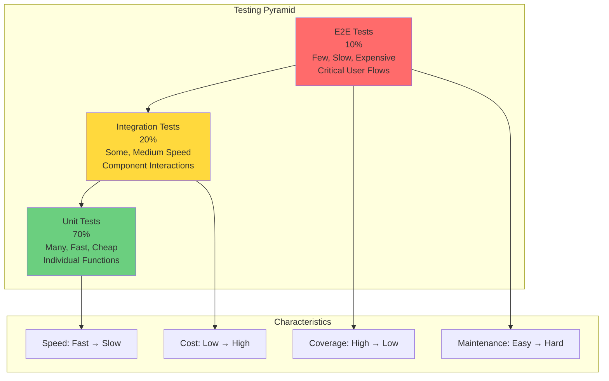
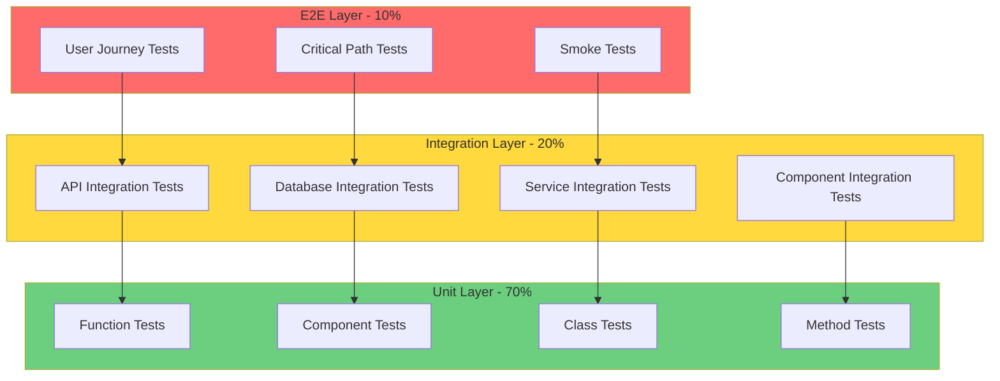
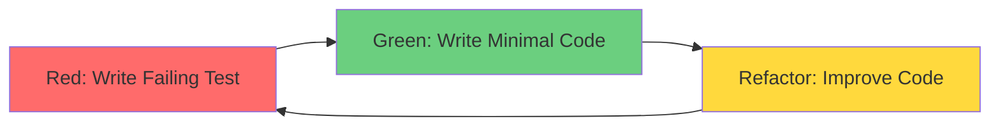
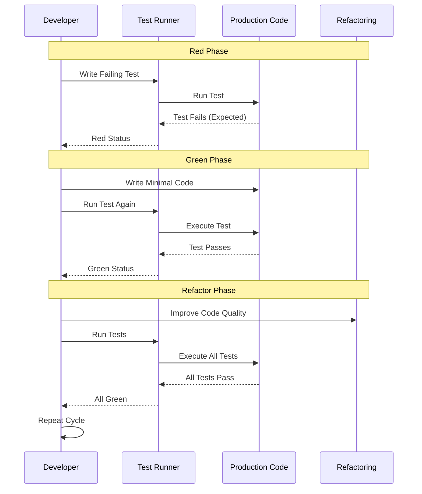
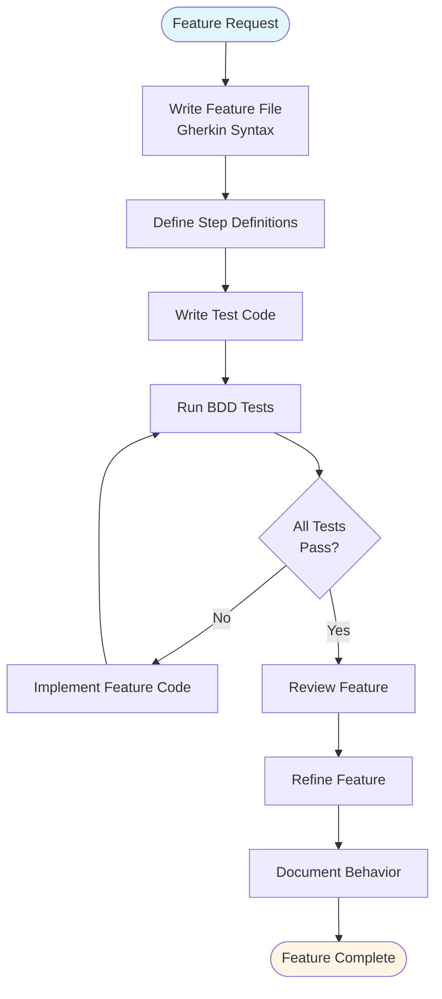
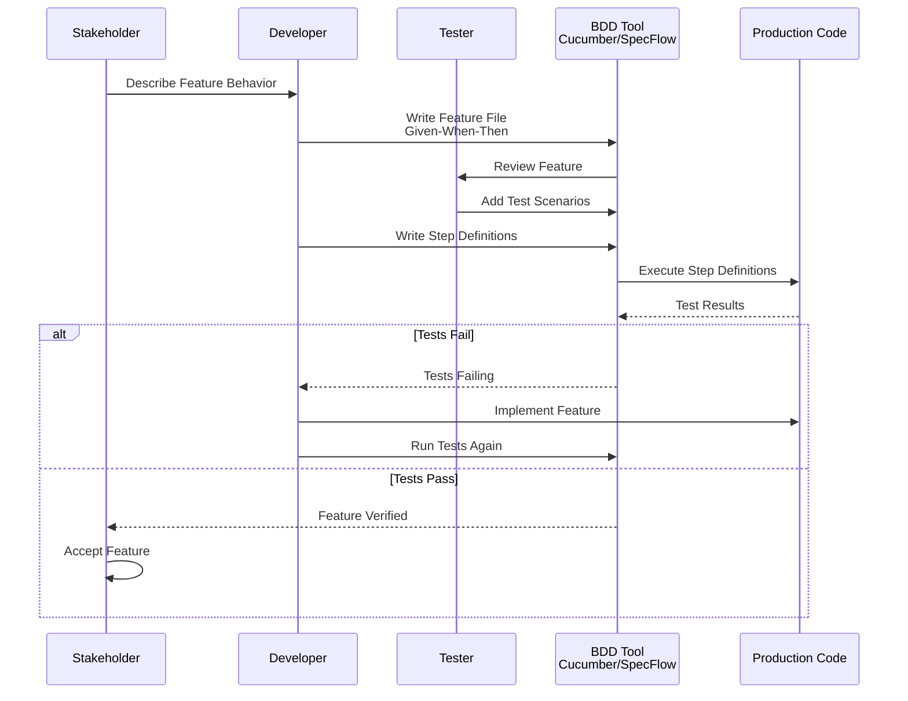
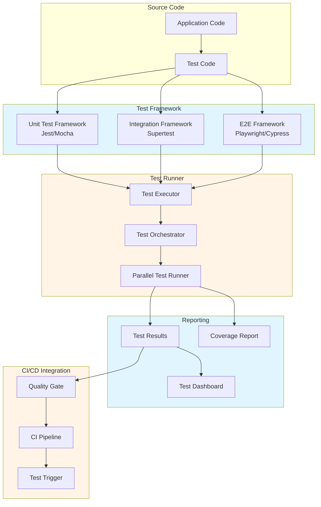
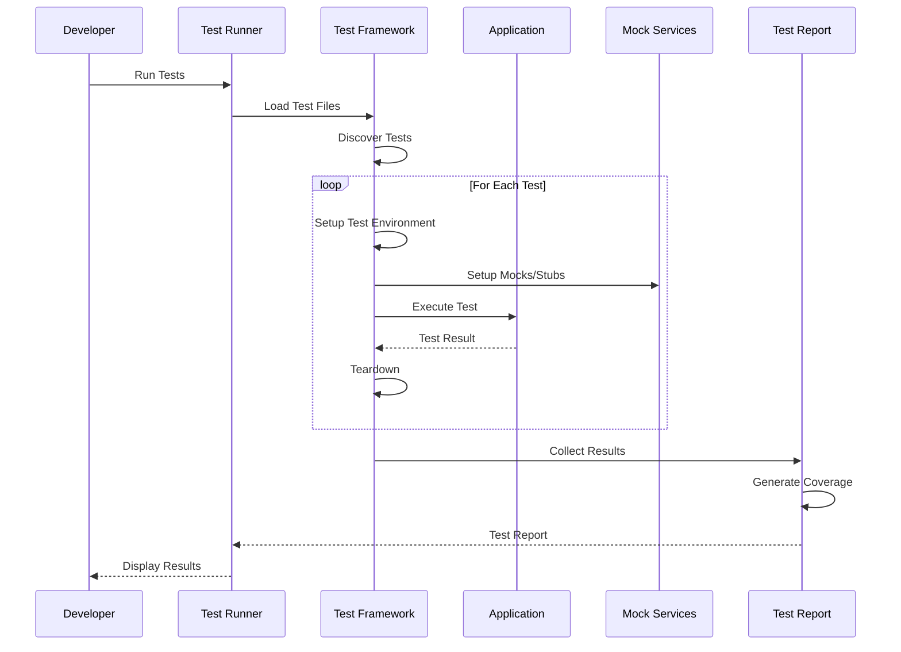
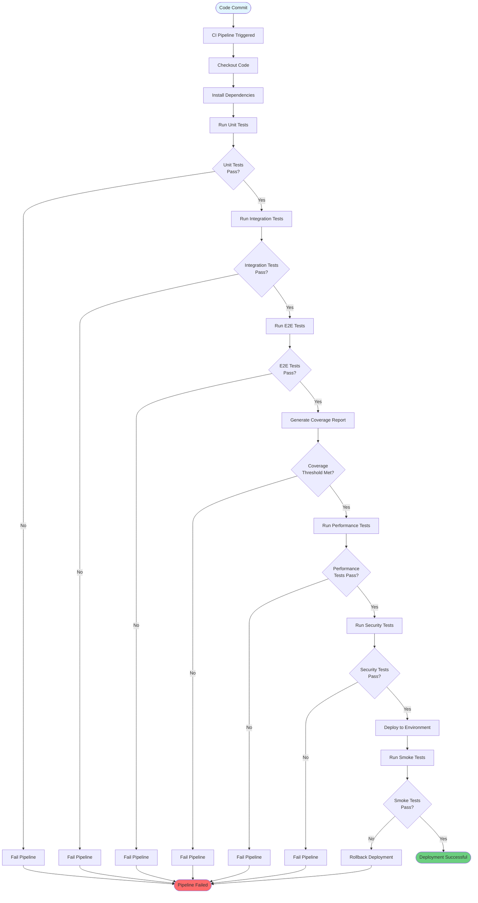
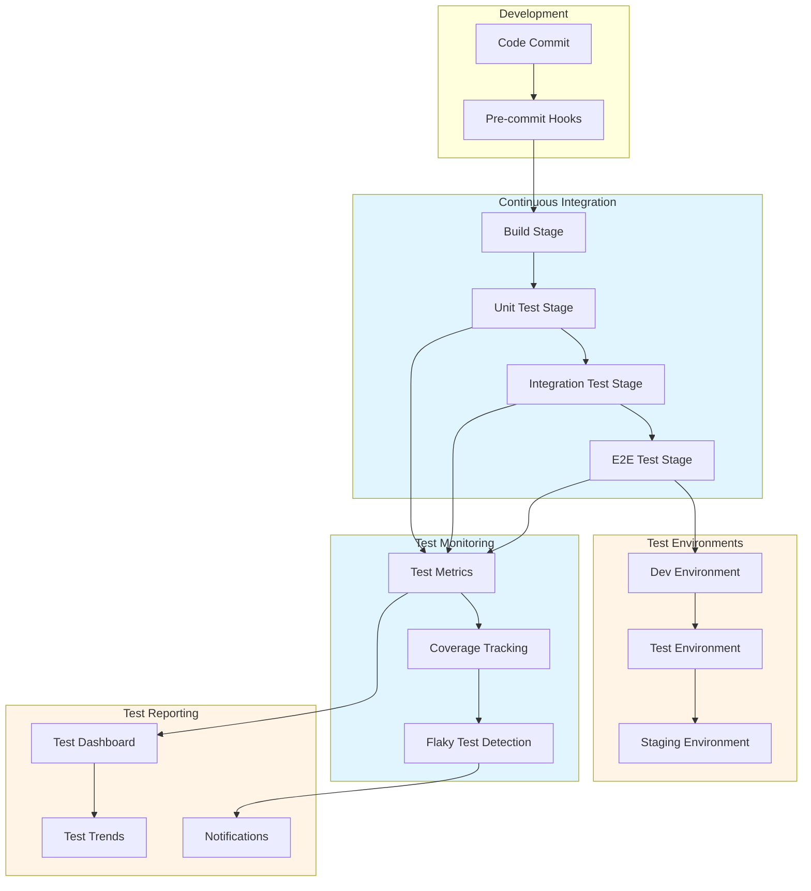

# Testing Strategies Guide - Comprehensive

## Table of Contents
1. [Introduction](#introduction)
2. [Testing Pyramid](#testing-pyramid)
3. [Test-Driven Development (TDD)](#test-driven-development-tdd)
4. [Behavior-Driven Development (BDD)](#behavior-driven-development-bdd)
5. [Unit Testing](#unit-testing)
6. [Integration Testing](#integration-testing)
7. [End-to-End Testing](#end-to-end-testing)
8. [Performance Testing](#performance-testing)
9. [Security Testing](#security-testing)
10. [Test Automation](#test-automation)
11. [Mocking and Stubbing](#mocking-and-stubbing)
12. [Test Coverage](#test-coverage)
13. [Continuous Testing](#continuous-testing)
14. [Resources](#resources)
15. [Summary](#summary)

---

## Introduction

This guide covers comprehensive testing strategies for building reliable software. Learn TDD, BDD, unit testing, integration testing, E2E testing, and more.

### Who This Guide Is For
- Developers
- QA engineers
- Test automation engineers
- Anyone writing tests

---

## Testing Pyramid

### Testing Pyramid Overview



### Testing Pyramid with Test Types



### Unit Tests (70%)
- Fast execution
- Test individual functions/components
- Isolated from dependencies
- High coverage

### Integration Tests (20%)
- Test component interactions
- Test with real dependencies
- Medium speed
- Moderate coverage

### E2E Tests (10%)
- Test complete user flows
- Slow execution
- Test in production-like environment
- Critical paths only

---

## Test-Driven Development (TDD)

### TDD Cycle Flow



### TDD Process Flow



### TDD Cycle

1. **Red**: Write failing test
2. **Green**: Write minimal code to pass
3. **Refactor**: Improve code while keeping tests green

### Example

```typescript
// 1. Write failing test
describe('Calculator', () => {
    it('should add two numbers', () => {
        const calc = new Calculator();
        expect(calc.add(2, 3)).toBe(5);
    });
});

// 2. Write minimal implementation
class Calculator {
    add(a: number, b: number): number {
        return a + b;
    }
}

// 3. Refactor if needed
```

---

## Unit Testing

### Jest Example

```typescript
import { calculateTotal } from './utils';

describe('calculateTotal', () => {
    it('should calculate total correctly', () => {
        const items = [
            { price: 10, quantity: 2 },
            { price: 5, quantity: 3 }
        ];
        expect(calculateTotal(items)).toBe(35);
    });
    
    it('should handle empty array', () => {
        expect(calculateTotal([])).toBe(0);
    });
    
    it('should handle negative prices', () => {
        const items = [{ price: -10, quantity: 1 }];
        expect(calculateTotal(items)).toBe(-10);
    });
});
```

### React Testing

```typescript
import { render, screen, fireEvent } from '@testing-library/react';
import { Button } from './Button';

describe('Button', () => {
    it('renders with text', () => {
        render(<Button>Click me</Button>);
        expect(screen.getByText('Click me')).toBeInTheDocument();
    });
    
    it('calls onClick when clicked', () => {
        const handleClick = jest.fn();
        render(<Button onClick={handleClick}>Click me</Button>);
        
        fireEvent.click(screen.getByText('Click me'));
        expect(handleClick).toHaveBeenCalledTimes(1);
    });
});
```

---

## Integration Testing

```typescript
import request from 'supertest';
import app from './app';

describe('User API Integration', () => {
    it('should create and retrieve user', async () => {
        // Create user
        const createResponse = await request(app)
            .post('/api/users')
            .send({ name: 'John', email: 'john@example.com' })
            .expect(201);
        
        const userId = createResponse.body.id;
        
        // Retrieve user
        const getResponse = await request(app)
            .get(`/api/users/${userId}`)
            .expect(200);
        
        expect(getResponse.body.name).toBe('John');
    });
});
```

---

## Behavior-Driven Development (BDD)

### BDD Workflow



### BDD Process Flow



### BDD with Cucumber

```gherkin
# features/user_management.feature
Feature: User Management
  As a system administrator
  I want to manage users
  So that I can control access

  Scenario: Create a new user
    Given I am logged in as an admin
    When I create a user with email "user@example.com"
    Then the user should be created successfully
    And I should receive a confirmation email

  Scenario: Delete a user
    Given a user exists with email "user@example.com"
    When I delete the user
    Then the user should be removed from the system
```

```typescript
// step_definitions/user_steps.ts
import { Given, When, Then } from '@cucumber/cucumber';

Given('I am logged in as an admin', async () => {
    await loginAsAdmin();
});

When('I create a user with email {string}', async (email: string) => {
    await createUser({ email });
});

Then('the user should be created successfully', async () => {
    const user = await getUserByEmail('user@example.com');
    expect(user).toBeDefined();
});
```

---

## End-to-End Testing

### Playwright Example

```typescript
import { test, expect } from '@playwright/test';

test('user can login and view dashboard', async ({ page }) => {
    // Navigate to login page
    await page.goto('https://example.com/login');
    
    // Fill login form
    await page.fill('#email', 'user@example.com');
    await page.fill('#password', 'password123');
    await page.click('button[type="submit"]');
    
    // Wait for redirect
    await page.waitForURL('**/dashboard');
    
    // Verify dashboard content
    await expect(page.locator('h1')).toContainText('Dashboard');
});
```

---

## Mocking and Stubbing

```typescript
// Mock external API
jest.mock('./api', () => ({
    fetchUser: jest.fn().mockResolvedValue({
        id: 1,
        name: 'John',
        email: 'john@example.com'
    })
}));

// Stub database
const mockDb = {
    users: {
        findById: jest.fn().mockResolvedValue({ id: 1, name: 'John' })
    }
};
```

---

## Test Coverage

```json
// jest.config.js
{
  "collectCoverage": true,
  "coverageThreshold": {
    "global": {
      "branches": 80,
      "functions": 80,
      "lines": 80,
      "statements": 80
    }
  }
}
```

---

## Common Pitfalls

### 1. Testing Implementation Details

```typescript
// BAD: Testing implementation
it('should call setState', () => {
    const component = render(<Counter />);
    expect(component.instance().setState).toHaveBeenCalled();
});

// GOOD: Testing behavior
it('should increment count', () => {
    const { getByText } = render(<Counter />);
    fireEvent.click(getByText('Increment'));
    expect(getByText('Count: 1')).toBeInTheDocument();
});
```

### 2. Not Cleaning Up

```typescript
// BAD: No cleanup
beforeEach(() => {
    global.fetch = jest.fn();
});

// GOOD: Cleanup
afterEach(() => {
    jest.restoreAllMocks();
    cleanup();
});
```

### 3. Testing Too Much at Once

```typescript
// BAD: Testing multiple things
it('should create user, send email, and update database', () => {
    // Too complex
});

// GOOD: Focused tests
it('should create user', () => { /* ... */ });
it('should send email', () => { /* ... */ });
it('should update database', () => { /* ... */ });
```

---

## Best Practices

### Testing Best Practices

1. **Follow Testing Pyramid**
   - Many unit tests
   - Some integration tests
   - Few E2E tests

2. **Write Readable Tests**
   - Clear test names
   - Arrange-Act-Assert pattern
   - One assertion per test

3. **Test Behavior, Not Implementation**
   - Test what users see
   - Test outcomes
   - Avoid testing internals

4. **Keep Tests Fast**
   - Mock external dependencies
   - Use test databases
   - Parallel execution

---

## Real-World Examples

### Example 1: Complete Test Suite

```typescript
describe('UserService', () => {
    let userService: UserService;
    let mockRepository: jest.Mocked<UserRepository>;
    
    beforeEach(() => {
        mockRepository = {
            findById: jest.fn(),
            save: jest.fn(),
            delete: jest.fn()
        };
        userService = new UserService(mockRepository);
    });
    
    describe('getUser', () => {
        it('should return user when found', async () => {
            const user = { id: 1, name: 'John' };
            mockRepository.findById.mockResolvedValue(user);
            
            const result = await userService.getUser(1);
            
            expect(result).toEqual(user);
            expect(mockRepository.findById).toHaveBeenCalledWith(1);
        });
        
        it('should throw error when user not found', async () => {
            mockRepository.findById.mockResolvedValue(null);
            
            await expect(userService.getUser(1))
                .rejects.toThrow('User not found');
        });
    });
});
```

### Example 2: E2E Test with Playwright

```typescript
test('complete checkout flow', async ({ page }) => {
    // Login
    await page.goto('/login');
    await page.fill('#email', 'user@example.com');
    await page.fill('#password', 'password');
    await page.click('button[type="submit"]');
    
    // Add to cart
    await page.goto('/products/1');
    await page.click('button:has-text("Add to Cart")');
    
    // Checkout
    await page.goto('/cart');
    await page.click('button:has-text("Checkout")');
    
    // Fill payment
    await page.fill('#card-number', '4111111111111111');
    await page.fill('#expiry', '12/25');
    await page.fill('#cvv', '123');
    await page.click('button[type="submit"]');
    
    // Verify success
    await expect(page.locator('h1')).toContainText('Order Confirmed');
});
```

---

## Performance Testing

### Load Testing with k6

```javascript
// load-test.js
import http from 'k6/http';
import { check, sleep } from 'k6';

export const options = {
    stages: [
        { duration: '2m', target: 100 }, // Ramp up
        { duration: '5m', target: 100 }, // Stay at 100 users
        { duration: '2m', target: 200 }, // Ramp up to 200
        { duration: '5m', target: 200 }, // Stay at 200
        { duration: '2m', target: 0 },   // Ramp down
    ],
};

export default function() {
    const response = http.get('https://api.example.com/users');
    check(response, {
        'status is 200': (r) => r.status === 200,
        'response time < 500ms': (r) => r.timings.duration < 500,
    });
    sleep(1);
}
```

### Stress Testing

```javascript
// stress-test.js
export const options = {
    stages: [
        { duration: '1m', target: 50 },
        { duration: '2m', target: 100 },
        { duration: '2m', target: 200 },
        { duration: '2m', target: 300 },
        { duration: '2m', target: 400 },
        { duration: '2m', target: 500 }, // Find breaking point
    ],
};
```

### Performance Metrics

```typescript
// Performance test results
interface PerformanceMetrics {
    responseTime: {
        p50: number;  // Median
        p95: number; // 95th percentile
        p99: number; // 99th percentile
    };
    throughput: number; // Requests per second
    errorRate: number;  // Percentage of errors
    cpuUsage: number;
    memoryUsage: number;
}
```

---

## Security Testing

### OWASP ZAP Integration

```typescript
// security-test.ts
import { ZapClient } from 'zap-client';

describe('Security Tests', () => {
    it('should pass OWASP ZAP scan', async () => {
        const zap = new ZapClient('http://localhost:8080');
        
        // Run active scan
        const scanId = await zap.ascan.scan('http://localhost:3000');
        
        // Wait for scan to complete
        await zap.ascan.status(scanId);
        
        // Get results
        const alerts = await zap.core.alerts();
        
        // Check for high/critical vulnerabilities
        const criticalAlerts = alerts.filter(a => 
            a.risk === 'High' || a.risk === 'Critical'
        );
        
        expect(criticalAlerts).toHaveLength(0);
    });
});
```

### Penetration Testing

```typescript
// Penetration test scenarios
describe('Penetration Tests', () => {
    it('should prevent SQL injection', async () => {
        const maliciousInput = "'; DROP TABLE users; --";
        const response = await request(app)
            .get('/api/users')
            .query({ search: maliciousInput });
        
        expect(response.status).toBe(400);
    });
    
    it('should prevent XSS attacks', async () => {
        const xssPayload = '<script>alert("XSS")</script>';
        const response = await request(app)
            .post('/api/users')
            .send({ name: xssPayload });
        
        expect(response.status).toBe(400);
    });
    
    it('should prevent CSRF attacks', async () => {
        const response = await request(app)
            .post('/api/users')
            .send({ name: 'Test' })
            .set('X-CSRF-Token', 'invalid-token');
        
        expect(response.status).toBe(403);
    });
});
```

### Security Test Checklist

- [ ] SQL injection prevention
- [ ] XSS prevention
- [ ] CSRF protection
- [ ] Authentication bypass attempts
- [ ] Authorization checks
- [ ] Input validation
- [ ] Output encoding
- [ ] Secure headers
- [ ] Sensitive data exposure
- [ ] API rate limiting

---

## Test Automation

### Test Automation Architecture



### Test Execution Flow



---

## Continuous Testing

### Continuous Testing Pipeline



### Continuous Testing Architecture



---

## Resources

- [Jest Documentation](https://jestjs.io/)
- [Playwright Documentation](https://playwright.dev/)
- [Testing Library](https://testing-library.com/)

---

## Summary

Key testing strategies:

1. **Testing Pyramid**: Balance of unit, integration, E2E tests
2. **TDD**: Write tests first
3. **BDD**: Behavior-driven testing
4. **Unit Tests**: Fast, isolated tests
5. **Integration Tests**: Test component interactions
6. **E2E Tests**: Test complete flows
7. **Mocking**: Isolate dependencies
8. **Coverage**: Measure test coverage

Master these strategies to build reliable software.

