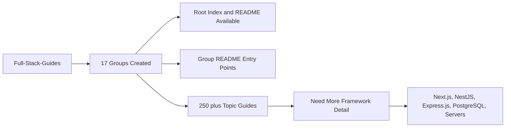

# Group Creation Status / Trạng thái tạo nhóm

## Overview / Tổng quan

**English**: This file tracks the maturity of the `Full-Stack-Guides` folder at the group level. It is intended to answer two questions quickly:

- Which groups already exist and are usable?
- Which groups need more detail, framework specificity, and production-grade examples?

**Vietnamese**: File này theo dõi mức độ hoàn thiện của thư mục `Full-Stack-Guides` ở cấp độ nhóm. Mục tiêu là trả lời nhanh hai câu hỏi:

- Những nhóm nào đã tồn tại và có thể dùng được?
- Những nhóm nào cần thêm chi tiết, tính đặc thù framework, và ví dụ production?

## Current Status Summary / Tóm tắt trạng thái hiện tại

## Status Legend / Chú thích trạng thái

- `Created`: group exists and topic files are present
- `Navigable`: group has a README or index path that helps users start
- `Needs Detail`: group is usable but still benefits from deeper examples and production context
- `Priority`: should be expanded early because it directly affects real project delivery

## Group-Level Status / Trạng thái theo nhóm

| Group | Status | Notes |
| --- | --- | --- |
| Group 01 Foundation Review | Created, Navigable, Priority | Core prerequisite for every later group |
| Group 02 Basic Functions | Created, Navigable, Priority | Strong practical backend coverage |
| Group 03 Algorithm Analysis | Created, Navigable, Priority | Important for performance and code quality |
| Group 04 Requirements Research | Created, Navigable | Strong process and requirement analysis support |
| Group 05 AI-Assisted Coding | Created, Navigable, Priority | High leverage for modern development workflows |
| Group 06 Database Analysis | Created, Navigable, Priority | Strongest current database section |
| Group 07 Unit Test, Debug | Created, Navigable, Priority | Critical for quality and release confidence |
| Group 08 Code Review | Created, Navigable, Priority | Important for engineering standards |
| Group 09 Complex Functions | Created, Navigable, Priority | Strong bridge to production systems |
| Group 10 Team Collaboration | Created, Navigable | Supports team execution and handoff |
| Group 11 Agile Scrum | Created, Navigable | Good process support |
| Group 12 Time Management | Created, Navigable | Good personal productivity support |
| Group 13 Design Patterns | Created, Navigable, Priority | Useful for backend and architecture literacy |
| Group 14 Advanced Tech | Created, Navigable, Priority | Important for modern infrastructure topics |
| Group 15 Soft Skills | Created, Navigable | Good career development support |
| Group 16 Performance Testing | Created, Navigable, Priority | High value for real systems |
| Group 17 DevOps Automation | Created, Navigable, Priority | Key for deployment and operations maturity |

## Strongest Areas Already / Khu vực mạnh nhất hiện tại

- conceptual backend fundamentals
- CRUD and API basics
- database analysis and SQL optimization
- testing, review, and debugging support
- performance and DevOps foundations

## Weakest Areas Right Now / Khu vực yếu nhất hiện tại

- dedicated framework-first learning tracks
- end-to-end reference architectures
- self-hosted server operations
- Nginx, TLS, Linux service management
- modern Next.js App Router patterns
- deeper NestJS module and lifecycle patterns
- deeper Express.js production structuring
- PostgreSQL production tuning and advanced indexing

## Highest-Priority Expansion Areas / Khu vực mở rộng ưu tiên cao nhất

1. Next.js App Router, Route Handlers, Server Actions, auth, caching
2. NestJS modules, providers, guards, pipes, interceptors, testing
3. Express.js app structure, middleware layering, error handling, observability
4. PostgreSQL constraints, indexes, transactions, query plans, pooling
5. servers and deployment: Nginx, Docker Compose, TLS, rollback, monitoring

## Recommended Reading Path By Goal / Lộ trình đọc theo mục tiêu

### Build a Full-Stack App

- Group 01
- Group 02
- Group 06
- Group 07
- Group 09
- Group 14
- Group 17

### Improve Code Quality

- Group 03
- Group 07
- Group 08
- Group 13
- Group 16

### Improve Delivery Process

- Group 04
- Group 05
- Group 10
- Group 11
- Group 17

## Important Navigation Files / File điều hướng quan trọng

- [README](./README.md)
- [Comprehensive Index](./Comprehensive_Index.md)
- [Modern Full-Stack Research Roadmap 2026](./Modern_Full_Stack_Research_Roadmap_2026.md)

## This Pass Added / Những gì đã được thêm trong lần cập nhật này

- completed missing group-level README entry points
- added a framework-focused roadmap for modern full-stack work
- improved discoverability from root navigation and index
- documented where the folder is strong and where it still needs deeper content

## Summary / Tóm tắt

The folder is already broad and usable.

The next quality jump does not come from creating more topic names. It comes from enriching the existing topics with:

- modern stack-specific examples
- deeper architecture explanations
- more production deployment guidance
- clearer recommended reading paths
