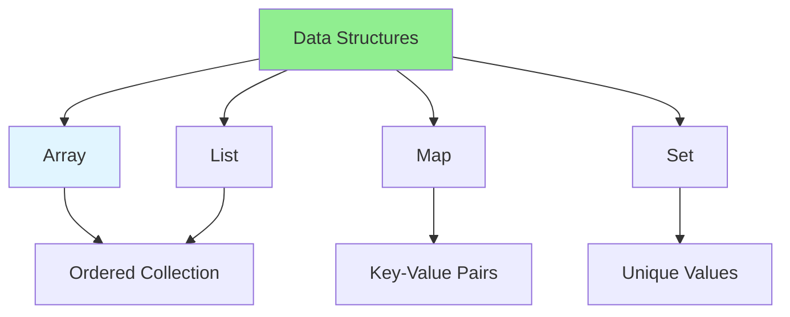
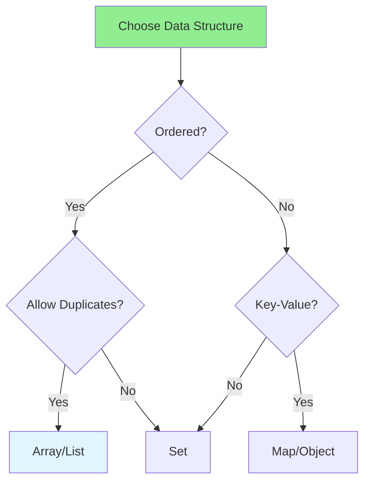

# 01.01 Data Structures: Array, List, Map, Set / Cấu trúc dữ liệu: Array, List, Map, Set

## Table of Contents / Mục lục
1. [Introduction / Giới thiệu](#introduction--giới-thiệu)
2. [Arrays / Mảng](#arrays--mảng)
3. [Lists / Danh sách](#lists--danh-sách)
4. [Maps / Bản đồ](#maps--bản-đồ)
5. [Sets / Tập hợp](#sets--tập-hợp)
6. [Comparison / So sánh](#comparison--so-sánh)
7. [Best Practices / Thực hành tốt nhất](#best-practices--thực-hành-tốt-nhất)
8. [Summary / Tóm tắt](#summary--tóm-tắt)

---

## Introduction / Giới thiệu

### Overview / Tổng quan

**English**: Data structures are fundamental building blocks in programming. Learn to use Arrays, Lists, Maps, and Sets effectively in JavaScript/TypeScript and Python.

**Vietnamese**: Cấu trúc dữ liệu là khối xây dựng cơ bản trong lập trình. Học cách sử dụng Array, List, Map và Set hiệu quả trong JavaScript/TypeScript và Python.

### Data Structures Overview / Tổng quan cấu trúc dữ liệu



---

## Arrays / Mảng

### Example 1: Array Operations / Ví dụ 1: Thao tác mảng

```typescript
// Arrays in TypeScript / Mảng trong TypeScript
const numbers: number[] = [1, 2, 3, 4, 5];
const names: string[] = ['Alice', 'Bob', 'Charlie'];

// Array operations / Thao tác mảng
// Access / Truy cập
console.log(numbers[0]); // 1

// Add / Thêm
numbers.push(6); // [1, 2, 3, 4, 5, 6]

// Remove / Xóa
numbers.pop(); // [1, 2, 3, 4, 5]

// Iterate / Lặp
numbers.forEach(num => console.log(num));

// Map / Chuyển đổi
const doubled = numbers.map(num => num * 2); // [2, 4, 6, 8, 10]

// Filter / Lọc
const evens = numbers.filter(num => num % 2 === 0); // [2, 4]

// Reduce / Giảm
const sum = numbers.reduce((acc, num) => acc + num, 0); // 15
```

### Example 2: Array Methods / Ví dụ 2: Phương thức mảng

```typescript
// Common array methods / Phương thức mảng phổ biến
const fruits = ['apple', 'banana', 'orange'];

// Find / Tìm
const apple = fruits.find(fruit => fruit === 'apple');

// Includes / Bao gồm
const hasBanana = fruits.includes('banana'); // true

// IndexOf / Vị trí
const index = fruits.indexOf('orange'); // 2

// Slice / Cắt
const firstTwo = fruits.slice(0, 2); // ['apple', 'banana']

// Splice / Chèn/Xóa
fruits.splice(1, 1, 'grape'); // ['apple', 'grape', 'orange']

// Sort / Sắp xếp
const sorted = fruits.sort(); // ['apple', 'grape', 'orange']

// Reverse / Đảo ngược
const reversed = fruits.reverse(); // ['orange', 'grape', 'apple']
```

---

## Lists / Danh sách

### Example 3: Lists in Python / Ví dụ 3: List trong Python

```python
# Lists in Python / List trong Python
numbers = [1, 2, 3, 4, 5]
names = ['Alice', 'Bob', 'Charlie']

# List operations / Thao tác list
# Access / Truy cập
print(numbers[0])  # 1

# Add / Thêm
numbers.append(6)  # [1, 2, 3, 4, 5, 6]
numbers.insert(0, 0)  # [0, 1, 2, 3, 4, 5, 6]

# Remove / Xóa
numbers.remove(0)  # [1, 2, 3, 4, 5, 6]
numbers.pop()  # [1, 2, 3, 4, 5]

# List comprehension / List comprehension
doubled = [x * 2 for x in numbers]  # [2, 4, 6, 8, 10]
evens = [x for x in numbers if x % 2 == 0]  # [2, 4]

# Slicing / Cắt
first_three = numbers[:3]  # [1, 2, 3]
last_two = numbers[-2:]  # [4, 5]
```

---

## Maps / Bản đồ

### Example 4: Maps in TypeScript / Ví dụ 4: Map trong TypeScript

```typescript
// Maps in TypeScript / Map trong TypeScript
const userMap = new Map<string, string>();

// Add / Thêm
userMap.set('id1', 'Alice');
userMap.set('id2', 'Bob');
userMap.set('id3', 'Charlie');

// Get / Lấy
const user = userMap.get('id1'); // 'Alice'

// Check / Kiểm tra
const hasId = userMap.has('id1'); // true

// Size / Kích thước
const size = userMap.size; // 3

// Iterate / Lặp
userMap.forEach((value, key) => {
  console.log(`${key}: ${value}`);
});

// Delete / Xóa
userMap.delete('id2');

// Clear / Xóa tất cả
userMap.clear();
```

### Example 5: Objects as Maps / Ví dụ 5: Object như Map

```typescript
// Objects as maps / Object như map
interface UserMap {
  [key: string]: string;
}

const users: UserMap = {
  'id1': 'Alice',
  'id2': 'Bob',
  'id3': 'Charlie'
};

// Access / Truy cập
const user = users['id1']; // 'Alice'

// Add / Thêm
users['id4'] = 'David';

// Delete / Xóa
delete users['id2'];

// Iterate / Lặp
Object.keys(users).forEach(key => {
  console.log(`${key}: ${users[key]}`);
});
```

---

## Sets / Tập hợp

### Example 6: Sets in TypeScript / Ví dụ 6: Set trong TypeScript

```typescript
// Sets in TypeScript / Set trong TypeScript
const numberSet = new Set<number>();

// Add / Thêm
numberSet.add(1);
numberSet.add(2);
numberSet.add(3);
numberSet.add(2); // Duplicate ignored / Bỏ qua trùng lặp

// Check / Kiểm tra
const hasTwo = numberSet.has(2); // true

// Size / Kích thước
const size = numberSet.size; // 3

// Iterate / Lặp
numberSet.forEach(value => {
  console.log(value);
});

// Delete / Xóa
numberSet.delete(2);

// Clear / Xóa tất cả
numberSet.clear();
```

### Example 7: Set Operations / Ví dụ 7: Thao tác Set

```typescript
// Set operations / Thao tác Set
const set1 = new Set([1, 2, 3]);
const set2 = new Set([3, 4, 5]);

// Union / Hợp
const union = new Set([...set1, ...set2]); // {1, 2, 3, 4, 5}

// Intersection / Giao
const intersection = new Set(
  [...set1].filter(x => set2.has(x))
); // {3}

// Difference / Hiệu
const difference = new Set(
  [...set1].filter(x => !set2.has(x))
); // {1, 2}
```

---

## Comparison / So sánh

### Data Structure Comparison / So sánh cấu trúc dữ liệu



### Example 8: When to Use Each / Ví dụ 8: Khi nào sử dụng mỗi loại

```typescript
// When to use each / Khi nào sử dụng mỗi loại

// Array: Ordered collection, allows duplicates
// Mảng: Tập hợp có thứ tự, cho phép trùng lặp
const shoppingList = ['milk', 'bread', 'eggs', 'milk'];

// Set: Unique values, fast lookup
// Set: Giá trị duy nhất, tìm kiếm nhanh
const uniqueIds = new Set(['id1', 'id2', 'id3']);

// Map: Key-value pairs, fast access by key
// Map: Cặp khóa-giá trị, truy cập nhanh theo khóa
const userCache = new Map<string, User>();
userCache.set('user123', { name: 'Alice', email: 'alice@example.com' });

// Object: Simple key-value, JSON serializable
// Object: Khóa-giá trị đơn giản, có thể serialize JSON
const config = {
  apiUrl: 'https://api.example.com',
  timeout: 5000
};
```

---

## Best Practices / Thực hành tốt nhất

1. **Choose right structure** - Match data structure to use case
2. **Use Sets for uniqueness** - When you need unique values
3. **Use Maps for lookups** - When you need fast key-based access
4. **Consider performance** - Arrays vs Sets vs Maps
5. **Immutable operations** - Use methods that don't mutate

---

## Summary / Tóm tắt

### Key Takeaways / Điểm chính

- **Arrays**: Ordered, indexed, allows duplicates
- **Lists**: Similar to arrays (Python)
- **Maps**: Key-value pairs, fast lookups
- **Sets**: Unique values, fast membership check

### Next Steps / Bước tiếp theo

- [01.02 Algorithms: Sorting & Searching](./01.02_Algorithms_Sorting_Searching.md) - Next: Algorithms

---

**Last Updated / Cập nhật lần cuối**: 2024


