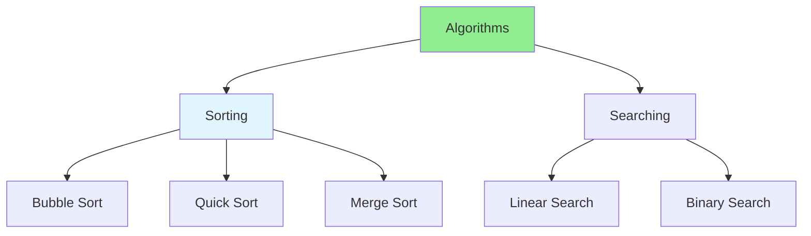

# 01.02 Algorithms: Sorting & Searching / Thuật toán: Sắp xếp & Tìm kiếm

## Table of Contents / Mục lục
1. [Introduction / Giới thiệu](#introduction--giới-thiệu)
2. [Sorting Algorithms / Thuật toán sắp xếp](#sorting-algorithms--thuật-toán-sắp-xếp)
3. [Searching Algorithms / Thuật toán tìm kiếm](#searching-algorithms--thuật-toán-tìm-kiếm)
4. [Best Practices / Thực hành tốt nhất](#best-practices--thực-hành-tốt-nhất)
5. [Summary / Tóm tắt](#summary--tóm-tắt)

---

## Introduction / Giới thiệu

### Overview / Tổng quan

**English**: Sorting and searching are fundamental algorithms. Learn common sorting algorithms (Bubble, Quick, Merge) and searching algorithms (Linear, Binary).

**Vietnamese**: Sắp xếp và tìm kiếm là thuật toán cơ bản. Học thuật toán sắp xếp phổ biến (Bubble, Quick, Merge) và thuật toán tìm kiếm (Linear, Binary).

### Algorithm Categories / Danh mục thuật toán



---

## Sorting Algorithms / Thuật toán sắp xếp

### Example 1: Bubble Sort / Ví dụ 1: Bubble Sort

```typescript
// Bubble Sort / Sắp xếp nổi bọt
function bubbleSort(arr: number[]): number[] {
  const n = arr.length;
  const sorted = [...arr];
  
  for (let i = 0; i < n - 1; i++) {
    for (let j = 0; j < n - i - 1; j++) {
      if (sorted[j] > sorted[j + 1]) {
        // Swap / Hoán đổi
        [sorted[j], sorted[j + 1]] = [sorted[j + 1], sorted[j]];
      }
    }
  }
  
  return sorted;
}

// Usage / Sử dụng
const numbers = [64, 34, 25, 12, 22, 11, 90];
const sorted = bubbleSort(numbers);
console.log(sorted); // [11, 12, 22, 25, 34, 64, 90]
```

### Example 2: Quick Sort / Ví dụ 2: Quick Sort

```typescript
// Quick Sort / Sắp xếp nhanh
function quickSort(arr: number[]): number[] {
  if (arr.length <= 1) return arr;
  
  const pivot = arr[Math.floor(arr.length / 2)];
  const left = arr.filter(x => x < pivot);
  const middle = arr.filter(x => x === pivot);
  const right = arr.filter(x => x > pivot);
  
  return [...quickSort(left), ...middle, ...quickSort(right)];
}

// Usage / Sử dụng
const numbers = [64, 34, 25, 12, 22, 11, 90];
const sorted = quickSort(numbers);
console.log(sorted); // [11, 12, 22, 25, 34, 64, 90]
```

### Example 3: Merge Sort / Ví dụ 3: Merge Sort

```typescript
// Merge Sort / Sắp xếp trộn
function mergeSort(arr: number[]): number[] {
  if (arr.length <= 1) return arr;
  
  const mid = Math.floor(arr.length / 2);
  const left = mergeSort(arr.slice(0, mid));
  const right = mergeSort(arr.slice(mid));
  
  return merge(left, right);
}

function merge(left: number[], right: number[]): number[] {
  const result: number[] = [];
  let i = 0, j = 0;
  
  while (i < left.length && j < right.length) {
    if (left[i] <= right[j]) {
      result.push(left[i++]);
    } else {
      result.push(right[j++]);
    }
  }
  
  return result.concat(left.slice(i)).concat(right.slice(j));
}

// Usage / Sử dụng
const numbers = [64, 34, 25, 12, 22, 11, 90];
const sorted = mergeSort(numbers);
console.log(sorted); // [11, 12, 22, 25, 34, 64, 90]
```

### Example 4: Built-in Sort / Ví dụ 4: Sắp xếp tích hợp

```typescript
// Built-in sort / Sắp xếp tích hợp
const numbers = [64, 34, 25, 12, 22, 11, 90];

// Ascending / Tăng dần
const ascending = [...numbers].sort((a, b) => a - b);

// Descending / Giảm dần
const descending = [...numbers].sort((a, b) => b - a);

// Sort objects / Sắp xếp objects
interface User {
  name: string;
  age: number;
}

const users: User[] = [
  { name: 'Alice', age: 30 },
  { name: 'Bob', age: 25 },
  { name: 'Charlie', age: 35 }
];

// Sort by age / Sắp xếp theo tuổi
const sortedByAge = [...users].sort((a, b) => a.age - b.age);

// Sort by name / Sắp xếp theo tên
const sortedByName = [...users].sort((a, b) => 
  a.name.localeCompare(b.name)
);
```

---

## Searching Algorithms / Thuật toán tìm kiếm

### Example 5: Linear Search / Ví dụ 5: Tìm kiếm tuyến tính

```typescript
// Linear Search / Tìm kiếm tuyến tính
function linearSearch(arr: number[], target: number): number {
  for (let i = 0; i < arr.length; i++) {
    if (arr[i] === target) {
      return i; // Found / Tìm thấy
    }
  }
  return -1; // Not found / Không tìm thấy
}

// Usage / Sử dụng
const numbers = [64, 34, 25, 12, 22, 11, 90];
const index = linearSearch(numbers, 25);
console.log(index); // 2
```

### Example 6: Binary Search / Ví dụ 6: Tìm kiếm nhị phân

```typescript
// Binary Search / Tìm kiếm nhị phân
function binarySearch(arr: number[], target: number): number {
  let left = 0;
  let right = arr.length - 1;
  
  while (left <= right) {
    const mid = Math.floor((left + right) / 2);
    
    if (arr[mid] === target) {
      return mid; // Found / Tìm thấy
    } else if (arr[mid] < target) {
      left = mid + 1;
    } else {
      right = mid - 1;
    }
  }
  
  return -1; // Not found / Không tìm thấy
}

// Usage / Sử dụng (array must be sorted / mảng phải được sắp xếp)
const sortedNumbers = [11, 12, 22, 25, 34, 64, 90];
const index = binarySearch(sortedNumbers, 25);
console.log(index); // 3
```

### Example 7: Built-in Search Methods / Ví dụ 7: Phương thức tìm kiếm tích hợp

```typescript
// Built-in search methods / Phương thức tìm kiếm tích hợp
const numbers = [64, 34, 25, 12, 22, 11, 90];

// Find / Tìm
const found = numbers.find(num => num > 50); // 64

// FindIndex / Tìm vị trí
const index = numbers.findIndex(num => num > 50); // 0

// Includes / Bao gồm
const has25 = numbers.includes(25); // true

// IndexOf / Vị trí
const pos = numbers.indexOf(25); // 2

// Some / Một số
const hasEven = numbers.some(num => num % 2 === 0); // true

// Every / Tất cả
const allPositive = numbers.every(num => num > 0); // true
```

---

## Best Practices / Thực hành tốt nhất

1. **Use built-in methods** - Prefer native sort/search when possible
2. **Choose right algorithm** - Binary search requires sorted array
3. **Consider complexity** - O(n log n) for sort, O(log n) for binary search
4. **Optimize for data** - Different algorithms for different data sizes
5. **Test edge cases** - Empty arrays, single element, duplicates

---

## Summary / Tóm tắt

### Key Takeaways / Điểm chính

- **Sorting**: Bubble (O(n²)), Quick (O(n log n)), Merge (O(n log n))
- **Searching**: Linear (O(n)), Binary (O(log n))
- **Built-in**: Use native methods when appropriate
- **Complexity**: Consider time complexity for large data

### Next Steps / Bước tiếp theo

- [01.03 OOP: Inheritance, Polymorphism, Encapsulation](./01.03_OOP_Inheritance_Polymorphism_Encapsulation.md) - Next: OOP

---

**Last Updated / Cập nhật lần cuối**: 2024

