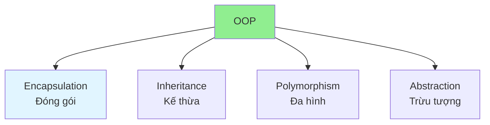

# 01.03 OOP: Inheritance, Polymorphism, Encapsulation / OOP: Kế thừa, Đa hình, Đóng gói

## Table of Contents / Mục lục
1. [Introduction / Giới thiệu](#introduction--giới-thiệu)
2. [Encapsulation / Đóng gói](#encapsulation--đóng-gói)
3. [Inheritance / Kế thừa](#inheritance--kế-thừa)
4. [Polymorphism / Đa hình](#polymorphism--đa-hình)
5. [Abstraction / Trừu tượng](#abstraction--trừu-tượng)
6. [Best Practices / Thực hành tốt nhất](#best-practices--thực-hành-tốt-nhất)
7. [Summary / Tóm tắt](#summary--tóm-tắt)

---

## Introduction / Giới thiệu

### Overview / Tổng quan

**English**: Object-Oriented Programming (OOP) organizes code around objects. Learn the four pillars: Encapsulation, Inheritance, Polymorphism, and Abstraction.

**Vietnamese**: Lập trình hướng đối tượng (OOP) tổ chức code xung quanh objects. Học bốn trụ cột: Đóng gói, Kế thừa, Đa hình và Trừu tượng.

### OOP Pillars / Trụ cột OOP



---

## Encapsulation / Đóng gói

### Example 1: Encapsulation in TypeScript / Ví dụ 1: Đóng gói trong TypeScript

```typescript
// Encapsulation / Đóng gói
class BankAccount {
  private balance: number = 0; // Private field / Trường riêng tư
  
  // Public methods / Phương thức công khai
  public deposit(amount: number): void {
    if (amount > 0) {
      this.balance += amount;
    }
  }
  
  public withdraw(amount: number): boolean {
    if (amount > 0 && amount <= this.balance) {
      this.balance -= amount;
      return true;
    }
    return false;
  }
  
  public getBalance(): number {
    return this.balance;
  }
}

// Usage / Sử dụng
const account = new BankAccount();
account.deposit(100);
account.withdraw(50);
console.log(account.getBalance()); // 50
// account.balance; // Error: Property 'balance' is private
```

### Example 2: Encapsulation in Python / Ví dụ 2: Đóng gói trong Python

```python
# Encapsulation / Đóng gói
class BankAccount:
    def __init__(self):
        self.__balance = 0  # Private attribute / Thuộc tính riêng tư
    
    def deposit(self, amount):
        if amount > 0:
            self.__balance += amount
    
    def withdraw(self, amount):
        if amount > 0 and amount <= self.__balance:
            self.__balance -= amount
            return True
        return False
    
    def get_balance(self):
        return self.__balance

# Usage / Sử dụng
account = BankAccount()
account.deposit(100)
account.withdraw(50)
print(account.get_balance())  # 50
```

---

## Inheritance / Kế thừa

### Example 3: Inheritance in TypeScript / Ví dụ 3: Kế thừa trong TypeScript

```typescript
// Base class / Lớp cơ sở
class Animal {
  protected name: string;
  
  constructor(name: string) {
    this.name = name;
  }
  
  public speak(): void {
    console.log(`${this.name} makes a sound`);
  }
}

// Derived class / Lớp dẫn xuất
class Dog extends Animal {
  public speak(): void {
    console.log(`${this.name} barks`);
  }
  
  public fetch(): void {
    console.log(`${this.name} fetches the ball`);
  }
}

class Cat extends Animal {
  public speak(): void {
    console.log(`${this.name} meows`);
  }
}

// Usage / Sử dụng
const dog = new Dog('Buddy');
dog.speak(); // Buddy barks
dog.fetch(); // Buddy fetches the ball

const cat = new Cat('Whiskers');
cat.speak(); // Whiskers meows
```

### Example 4: Inheritance in Python / Ví dụ 4: Kế thừa trong Python

```python
# Base class / Lớp cơ sở
class Animal:
    def __init__(self, name):
        self.name = name
    
    def speak(self):
        print(f"{self.name} makes a sound")

# Derived class / Lớp dẫn xuất
class Dog(Animal):
    def speak(self):
        print(f"{self.name} barks")
    
    def fetch(self):
        print(f"{self.name} fetches the ball")

class Cat(Animal):
    def speak(self):
        print(f"{self.name} meows")

# Usage / Sử dụng
dog = Dog('Buddy')
dog.speak()  # Buddy barks
dog.fetch()  # Buddy fetches the ball

cat = Cat('Whiskers')
cat.speak()  # Whiskers meows
```

---

## Polymorphism / Đa hình

### Example 5: Polymorphism / Ví dụ 5: Đa hình

```typescript
// Polymorphism / Đa hình
interface Shape {
  area(): number;
  perimeter(): number;
}

class Rectangle implements Shape {
  constructor(
    private width: number,
    private height: number
  ) {}
  
  area(): number {
    return this.width * this.height;
  }
  
  perimeter(): number {
    return 2 * (this.width + this.height);
  }
}

class Circle implements Shape {
  constructor(private radius: number) {}
  
  area(): number {
    return Math.PI * this.radius * this.radius;
  }
  
  perimeter(): number {
    return 2 * Math.PI * this.radius;
  }
}

// Polymorphic usage / Sử dụng đa hình
function printShapeInfo(shape: Shape): void {
  console.log(`Area: ${shape.area()}`);
  console.log(`Perimeter: ${shape.perimeter()}`);
}

const rectangle = new Rectangle(5, 10);
const circle = new Circle(5);

printShapeInfo(rectangle); // Works with Rectangle
printShapeInfo(circle); // Works with Circle
```

---

## Abstraction / Trừu tượng

### Example 6: Abstraction / Ví dụ 6: Trừu tượng

```typescript
// Abstract class / Lớp trừu tượng
abstract class Vehicle {
  protected speed: number = 0;
  
  abstract start(): void;
  abstract stop(): void;
  
  public getSpeed(): number {
    return this.speed;
  }
}

class Car extends Vehicle {
  start(): void {
    this.speed = 60;
    console.log('Car started');
  }
  
  stop(): void {
    this.speed = 0;
    console.log('Car stopped');
  }
}

class Bike extends Vehicle {
  start(): void {
    this.speed = 20;
    console.log('Bike started');
  }
  
  stop(): void {
    this.speed = 0;
    console.log('Bike stopped');
  }
}

// Usage / Sử dụng
const car = new Car();
car.start(); // Car started
console.log(car.getSpeed()); // 60
```

---

## Best Practices / Thực hành tốt nhất

1. **Encapsulate data** - Use private/protected modifiers
2. **Favor composition** - Prefer composition over inheritance
3. **Use interfaces** - Define contracts with interfaces
4. **Single responsibility** - Each class has one responsibility
5. **Avoid deep inheritance** - Keep inheritance hierarchy shallow

---

## Summary / Tóm tắt

### Key Takeaways / Điểm chính

- **Encapsulation**: Hide internal details
- **Inheritance**: Reuse code through inheritance
- **Polymorphism**: Same interface, different implementations
- **Abstraction**: Hide complexity, show essentials

### Next Steps / Bước tiếp theo

- [01.04 Interface & Abstract Class](./01.04_Interface_Abstract_Class.md) - Next: Interface & Abstract Class

---

**Last Updated / Cập nhật lần cuối**: 2024

