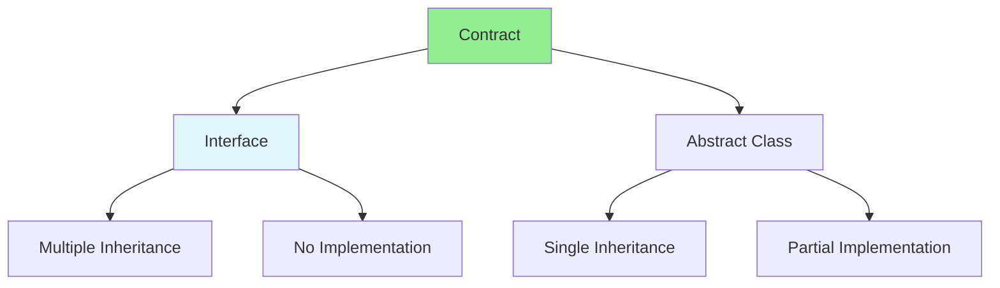

# 01.04 Interface & Abstract Class / Interface & Abstract Class

## Table of Contents / Mục lục
1. [Introduction / Giới thiệu](#introduction--giới-thiệu)
2. [Interfaces / Interface](#interfaces--interface)
3. [Abstract Classes / Lớp trừu tượng](#abstract-classes--lớp-trừu-tượng)
4. [Comparison / So sánh](#comparison--so-sánh)
5. [Best Practices / Thực hành tốt nhất](#best-practices--thực-hành-tốt-nhất)
6. [Summary / Tóm tắt](#summary--tóm-tắt)

---

## Introduction / Giới thiệu

### Overview / Tổng quan

**English**: Interfaces and abstract classes define contracts for classes. Learn when to use interfaces vs abstract classes in TypeScript and Python.

**Vietnamese**: Interface và abstract class định nghĩa hợp đồng cho classes. Học khi nào sử dụng interface vs abstract class trong TypeScript và Python.

### Interface vs Abstract Class / Interface vs Abstract Class



---

## Interfaces / Interface

### Example 1: Interfaces in TypeScript / Ví dụ 1: Interface trong TypeScript

```typescript
// Interface / Interface
interface Flyable {
  fly(): void;
}

interface Swimmable {
  swim(): void;
}

// Class implementing interface / Class triển khai interface
class Duck implements Flyable, Swimmable {
  fly(): void {
    console.log('Duck is flying');
  }
  
  swim(): void {
    console.log('Duck is swimming');
  }
}

// Usage / Sử dụng
const duck = new Duck();
duck.fly();
duck.swim();
```

### Example 2: Interface with Properties / Ví dụ 2: Interface với thuộc tính

```typescript
// Interface with properties / Interface với thuộc tính
interface User {
  id: string;
  name: string;
  email: string;
  age?: number; // Optional / Tùy chọn
}

// Implement interface / Triển khai interface
class Admin implements User {
  id: string;
  name: string;
  email: string;
  age?: number;
  role: string = 'admin';
  
  constructor(id: string, name: string, email: string) {
    this.id = id;
    this.name = name;
    this.email = email;
  }
}
```

---

## Abstract Classes / Lớp trừu tượng

### Example 3: Abstract Classes / Ví dụ 3: Abstract Classes

```typescript
// Abstract class / Lớp trừu tượng
abstract class Animal {
  protected name: string;
  
  constructor(name: string) {
    this.name = name;
  }
  
  // Abstract method / Phương thức trừu tượng
  abstract makeSound(): void;
  
  // Concrete method / Phương thức cụ thể
  public getName(): string {
    return this.name;
  }
}

// Concrete class / Lớp cụ thể
class Dog extends Animal {
  makeSound(): void {
    console.log(`${this.name} barks`);
  }
}

class Cat extends Animal {
  makeSound(): void {
    console.log(`${this.name} meows`);
  }
}

// Usage / Sử dụng
const dog = new Dog('Buddy');
dog.makeSound(); // Buddy barks
```

### Example 4: Abstract Class in Python / Ví dụ 4: Abstract Class trong Python

```python
# Abstract class / Lớp trừu tượng
from abc import ABC, abstractmethod

class Animal(ABC):
    def __init__(self, name):
        self.name = name
    
    @abstractmethod
    def make_sound(self):
        pass
    
    def get_name(self):
        return self.name

# Concrete class / Lớp cụ thể
class Dog(Animal):
    def make_sound(self):
        print(f"{self.name} barks")

class Cat(Animal):
    def make_sound(self):
        print(f"{self.name} meows")

# Usage / Sử dụng
dog = Dog('Buddy')
dog.make_sound()  # Buddy barks
```

---

## Comparison / So sánh

### Example 5: When to Use Each / Ví dụ 5: Khi nào sử dụng mỗi loại

```typescript
// Use Interface when:
// Sử dụng Interface khi:
// - Multiple inheritance needed / Cần kế thừa nhiều
// - No implementation needed / Không cần triển khai
// - Contract definition / Định nghĩa hợp đồng

interface Drawable {
  draw(): void;
}

interface Resizable {
  resize(width: number, height: number): void;
}

class Rectangle implements Drawable, Resizable {
  draw(): void {
    console.log('Drawing rectangle');
  }
  
  resize(width: number, height: number): void {
    console.log(`Resizing to ${width}x${height}`);
  }
}

// Use Abstract Class when:
// Sử dụng Abstract Class khi:
// - Shared implementation / Triển khai chung
// - Single inheritance / Kế thừa đơn
// - Partial implementation / Triển khai một phần

abstract class Shape {
  protected color: string;
  
  constructor(color: string) {
    this.color = color;
  }
  
  abstract area(): number;
  
  public getColor(): string {
    return this.color;
  }
}
```

---

## Best Practices / Thực hành tốt nhất

1. **Use interfaces** - For contracts and multiple inheritance
2. **Use abstract classes** - For shared implementation
3. **Prefer interfaces** - More flexible in TypeScript
4. **Keep simple** - Don't over-complicate
5. **Document** - Document contracts clearly

---

## Summary / Tóm tắt

### Key Takeaways / Điểm chính

- **Interface**: Contract, multiple inheritance, no implementation
- **Abstract Class**: Partial implementation, single inheritance
- **Choose wisely**: Based on requirements
- **TypeScript**: Interfaces are preferred

### Next Steps / Bước tiếp theo

- [01.05 HTTP Protocol & RESTful API](./01.05_HTTP_Protocol_RESTful_API.md) - Next: HTTP & RESTful API

---

**Last Updated / Cập nhật lần cuối**: 2024


