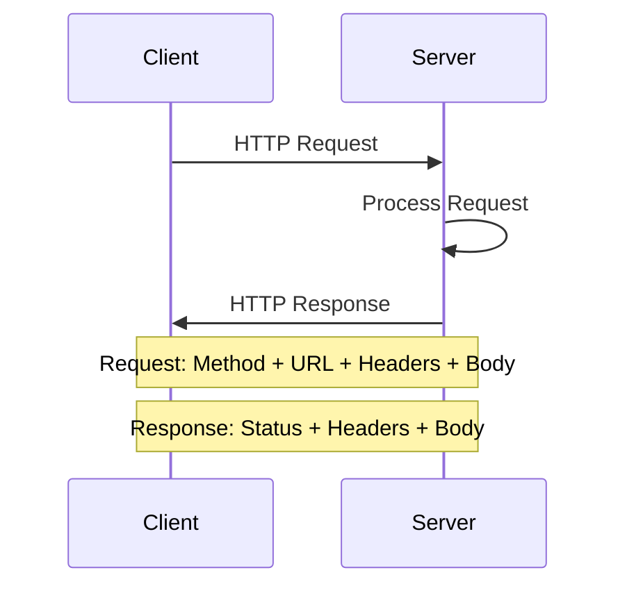

# 01.05 HTTP Protocol & RESTful API / Giao thức HTTP & RESTful API

## Table of Contents / Mục lục
1. [Introduction / Giới thiệu](#introduction--giới-thiệu)
2. [HTTP Protocol / Giao thức HTTP](#http-protocol--giao-thức-http)
3. [RESTful API / RESTful API](#restful-api--restful-api)
4. [Best Practices / Thực hành tốt nhất](#best-practices--thực-hành-tốt-nhất)
5. [Summary / Tóm tắt](#summary--tóm-tắt)

---

## Introduction / Giới thiệu

### Overview / Tổng quan

**English**: HTTP is the foundation of web communication. Learn HTTP methods, status codes, and RESTful API design principles.

**Vietnamese**: HTTP là nền tảng của giao tiếp web. Học phương thức HTTP, mã trạng thái và nguyên tắc thiết kế RESTful API.

### HTTP Request-Response Cycle / Chu kỳ Request-Response HTTP



---

## HTTP Protocol / Giao thức HTTP

### Example 1: HTTP Methods / Ví dụ 1: Phương thức HTTP

```typescript
// HTTP Methods / Phương thức HTTP
enum HttpMethod {
  GET = 'GET',      // Retrieve data / Lấy dữ liệu
  POST = 'POST',    // Create resource / Tạo tài nguyên
  PUT = 'PUT',      // Update resource / Cập nhật tài nguyên
  PATCH = 'PATCH',  // Partial update / Cập nhật một phần
  DELETE = 'DELETE' // Delete resource / Xóa tài nguyên
}

// HTTP Request / Request HTTP
interface HttpRequest {
  method: HttpMethod;
  url: string;
  headers: Record<string, string>;
  body?: any;
}

// HTTP Response / Response HTTP
interface HttpResponse {
  status: number;
  headers: Record<string, string>;
  body: any;
}
```

### Example 2: HTTP Status Codes / Ví dụ 2: Mã trạng thái HTTP

```typescript
// HTTP Status Codes / Mã trạng thái HTTP
enum HttpStatus {
  // Success / Thành công
  OK = 200,
  CREATED = 201,
  NO_CONTENT = 204,
  
  // Client Error / Lỗi client
  BAD_REQUEST = 400,
  UNAUTHORIZED = 401,
  FORBIDDEN = 403,
  NOT_FOUND = 404,
  
  // Server Error / Lỗi server
  INTERNAL_SERVER_ERROR = 500,
  BAD_GATEWAY = 502,
  SERVICE_UNAVAILABLE = 503
}

// Handle status codes / Xử lý mã trạng thái
function handleResponse(response: HttpResponse): void {
  switch (response.status) {
    case HttpStatus.OK:
      console.log('Success');
      break;
    case HttpStatus.NOT_FOUND:
      console.log('Resource not found');
      break;
    case HttpStatus.INTERNAL_SERVER_ERROR:
      console.log('Server error');
      break;
  }
}
```

---

## RESTful API / RESTful API

### Example 3: RESTful API Design / Ví dụ 3: Thiết kế RESTful API

```typescript
// RESTful API / RESTful API
// Express.js example / Ví dụ Express.js
import express from 'express';

const app = express();
app.use(express.json());

// GET /users - Get all users / Lấy tất cả users
app.get('/users', async (req, res) => {
  const users = await userService.findAll();
  res.json(users);
});

// GET /users/:id - Get user by ID / Lấy user theo ID
app.get('/users/:id', async (req, res) => {
  const user = await userService.findById(req.params.id);
  if (user) {
    res.json(user);
  } else {
    res.status(404).json({ error: 'User not found' });
  }
});

// POST /users - Create user / Tạo user
app.post('/users', async (req, res) => {
  const user = await userService.create(req.body);
  res.status(201).json(user);
});

// PUT /users/:id - Update user / Cập nhật user
app.put('/users/:id', async (req, res) => {
  const user = await userService.update(req.params.id, req.body);
  res.json(user);
});

// DELETE /users/:id - Delete user / Xóa user
app.delete('/users/:id', async (req, res) => {
  await userService.delete(req.params.id);
  res.status(204).send();
});
```

### Example 4: RESTful API with NestJS / Ví dụ 4: RESTful API với NestJS

```typescript
// NestJS RESTful API / RESTful API NestJS
import { Controller, Get, Post, Put, Delete, Param, Body } from '@nestjs/common';

@Controller('users')
export class UserController {
  constructor(private userService: UserService) {}
  
  @Get()
  findAll(): Promise<User[]> {
    return this.userService.findAll();
  }
  
  @Get(':id')
  findOne(@Param('id') id: string): Promise<User> {
    return this.userService.findOne(id);
  }
  
  @Post()
  create(@Body() createUserDto: CreateUserDto): Promise<User> {
    return this.userService.create(createUserDto);
  }
  
  @Put(':id')
  update(
    @Param('id') id: string,
    @Body() updateUserDto: UpdateUserDto
  ): Promise<User> {
    return this.userService.update(id, updateUserDto);
  }
  
  @Delete(':id')
  remove(@Param('id') id: string): Promise<void> {
    return this.userService.remove(id);
  }
}
```

---

## Best Practices / Thực hành tốt nhất

1. **Use proper HTTP methods** - GET, POST, PUT, DELETE
2. **Return correct status codes** - 200, 201, 404, 500
3. **Use RESTful URLs** - /users, /users/:id
4. **Version APIs** - /api/v1/users
5. **Document APIs** - Use Swagger/OpenAPI

---

## Summary / Tóm tắt

### Key Takeaways / Điểm chính

- **HTTP Methods**: GET, POST, PUT, DELETE
- **Status Codes**: 200, 201, 404, 500
- **RESTful**: Resource-based URLs
- **Stateless**: No server-side session

### Next Steps / Bước tiếp theo

- [01.06 MVC, MVVM, Layered Architecture](./01.06_MVC_MVVM_Layered_Architecture.md) - Next: Architecture Patterns

---

**Last Updated / Cập nhật lần cuối**: 2024

