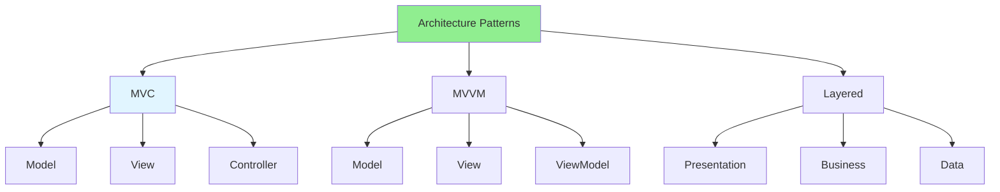
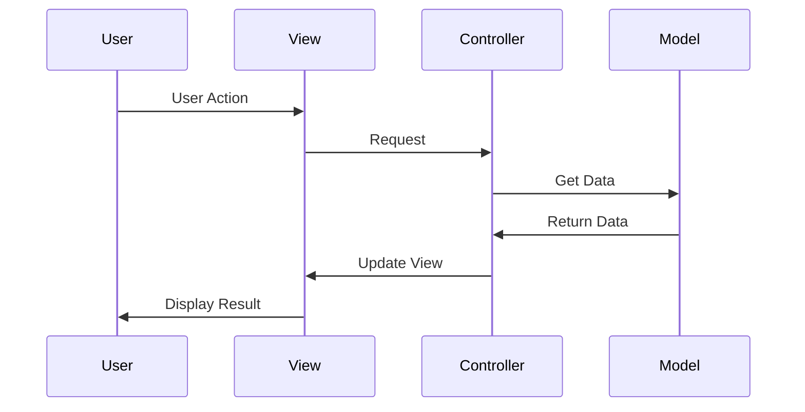

# 01.06 MVC, MVVM, Layered Architecture / MVC, MVVM, Kiến trúc phân lớp

## Table of Contents / Mục lục
1. [Introduction / Giới thiệu](#introduction--giới-thiệu)
2. [MVC Pattern / Mẫu MVC](#mvc-pattern--mẫu-mvc)
3. [MVVM Pattern / Mẫu MVVM](#mvvm-pattern--mẫu-mvvm)
4. [Layered Architecture / Kiến trúc phân lớp](#layered-architecture--kiến-trúc-phân-lớp)
5. [Best Practices / Thực hành tốt nhất](#best-practices--thực-hành-tốt-nhất)
6. [Summary / Tóm tắt](#summary--tóm-tắt)

---

## Introduction / Giới thiệu

### Overview / Tổng quan

**English**: Architecture patterns organize code structure. Learn MVC, MVVM, and Layered Architecture for better code organization.

**Vietnamese**: Mẫu kiến trúc tổ chức cấu trúc code. Học MVC, MVVM và Kiến trúc phân lớp để tổ chức code tốt hơn.

### Architecture Patterns / Mẫu kiến trúc



---

## MVC Pattern / Mẫu MVC

### Example 1: MVC in Express.js / Ví dụ 1: MVC trong Express.js

```typescript
// Model / Model
class UserModel {
  async findAll(): Promise<User[]> {
    return await prisma.user.findMany();
  }
  
  async findById(id: string): Promise<User | null> {
    return await prisma.user.findUnique({ where: { id } });
  }
}

// View / View (JSON response in API / Response JSON trong API)
// In web apps, views are templates / Trong web app, views là templates

// Controller / Controller
class UserController {
  constructor(private userModel: UserModel) {}
  
  async getAllUsers(req: any, res: any): Promise<void> {
    const users = await this.userModel.findAll();
    res.json(users); // View / View
  }
  
  async getUserById(req: any, res: any): Promise<void> {
    const user = await this.userModel.findById(req.params.id);
    if (user) {
      res.json(user);
    } else {
      res.status(404).json({ error: 'User not found' });
    }
  }
}
```

### Example 2: MVC Flow / Ví dụ 2: Luồng MVC



---

## MVVM Pattern / Mẫu MVVM

### Example 3: MVVM in React / Ví dụ 3: MVVM trong React

```typescript
// Model / Model
interface User {
  id: string;
  name: string;
  email: string;
}

// ViewModel / ViewModel
function useUserViewModel() {
  const [users, setUsers] = useState<User[]>([]);
  const [loading, setLoading] = useState(false);
  
  const loadUsers = async () => {
    setLoading(true);
    try {
      const data = await fetch('/api/users').then(r => r.json());
      setUsers(data);
    } finally {
      setLoading(false);
    }
  };
  
  return { users, loading, loadUsers };
}

// View / View
function UserView() {
  const { users, loading, loadUsers } = useUserViewModel();
  
  useEffect(() => {
    loadUsers();
  }, []);
  
  if (loading) return <div>Loading...</div>;
  
  return (
    <div>
      {users.map(user => (
        <div key={user.id}>{user.name}</div>
      ))}
    </div>
  );
}
```

---

## Layered Architecture / Kiến trúc phân lớp

### Example 4: Layered Architecture / Ví dụ 4: Kiến trúc phân lớp

```typescript
// Presentation Layer / Lớp trình bày
@Controller('users')
export class UserController {
  constructor(private userService: UserService) {}
  
  @Get()
  async findAll(): Promise<UserDto[]> {
    const users = await this.userService.findAll();
    return users.map(u => this.toDto(u));
  }
}

// Business Layer / Lớp nghiệp vụ
@Injectable()
export class UserService {
  constructor(private userRepository: UserRepository) {}
  
  async findAll(): Promise<User[]> {
    return await this.userRepository.findAll();
  }
  
  async create(data: CreateUserDto): Promise<User> {
    // Business logic / Logic nghiệp vụ
    if (await this.userRepository.exists(data.email)) {
      throw new Error('Email already exists');
    }
    return await this.userRepository.create(data);
  }
}

// Data Layer / Lớp dữ liệu
@Injectable()
export class UserRepository {
  async findAll(): Promise<User[]> {
    return await prisma.user.findMany();
  }
  
  async create(data: CreateUserDto): Promise<User> {
    return await prisma.user.create({ data });
  }
}
```

---

## Best Practices / Thực hành tốt nhất

1. **Separate concerns** - Clear layer boundaries
2. **Dependency direction** - Depend on abstractions
3. **Single responsibility** - Each layer has one purpose
4. **Testability** - Easy to test each layer
5. **Maintainability** - Clear structure

---

## Summary / Tóm tắt

### Key Takeaways / Điểm chính

- **MVC**: Model-View-Controller separation
- **MVVM**: Model-View-ViewModel with data binding
- **Layered**: Presentation-Business-Data layers
- **Benefits**: Better organization and maintainability

### Next Steps / Bước tiếp theo

- [01.07 Git Basics](./01.07_Git_Basics_Commit_Branch_Merge.md) - Next: Git Basics

---

**Last Updated / Cập nhật lần cuối**: 2024

