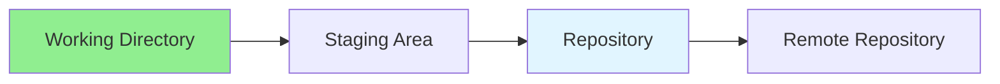
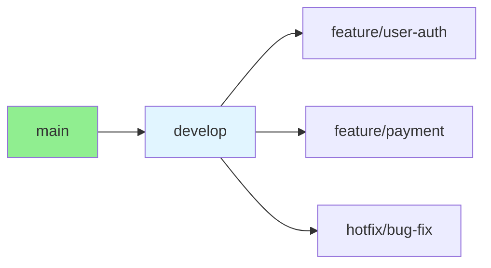

# 01.07 Git Basics: Commit, Branch, Merge / Git cơ bản: Commit, Branch, Merge

## Table of Contents / Mục lục
1. [Introduction / Giới thiệu](#introduction--giới-thiệu)
2. [Git Basics / Git cơ bản](#git-basics--git-cơ-bản)
3. [Branching / Nhánh](#branching--nhánh)
4. [Merging / Hợp nhất](#merging--hợp-nhất)
5. [Best Practices / Thực hành tốt nhất](#best-practices--thực-hành-tốt-nhất)
6. [Summary / Tóm tắt](#summary--tóm-tắt)

---

## Introduction / Giới thiệu

### Overview / Tổng quan

**English**: Git is essential for version control. Learn basic Git commands for commits, branching, and merging.

**Vietnamese**: Git rất quan trọng cho kiểm soát phiên bản. Học lệnh Git cơ bản cho commit, branching và merging.

### Git Workflow / Quy trình Git



---

## Git Basics / Git cơ bản

### Example 1: Basic Git Commands / Ví dụ 1: Lệnh Git cơ bản

```bash
# Initialize repository / Khởi tạo repository
git init

# Check status / Kiểm tra trạng thái
git status

# Add files / Thêm file
git add .
git add file.txt

# Commit / Commit
git commit -m "Initial commit"

# View history / Xem lịch sử
git log
git log --oneline

# View changes / Xem thay đổi
git diff
git diff --staged
```

### Example 2: Git Configuration / Ví dụ 2: Cấu hình Git

```bash
# Configure user / Cấu hình user
git config --global user.name "Your Name"
git config --global user.email "your.email@example.com"

# View config / Xem cấu hình
git config --list

# Set default branch / Đặt nhánh mặc định
git config --global init.defaultBranch main
```

---

## Branching / Nhánh

### Example 3: Branch Operations / Ví dụ 3: Thao tác nhánh

```bash
# Create branch / Tạo nhánh
git branch feature-branch

# Switch branch / Chuyển nhánh
git checkout feature-branch
git switch feature-branch

# Create and switch / Tạo và chuyển
git checkout -b feature-branch

# List branches / Liệt kê nhánh
git branch
git branch -a

# Delete branch / Xóa nhánh
git branch -d feature-branch
git branch -D feature-branch # Force delete / Xóa cưỡng bức
```

### Example 4: Git Branching Strategy / Ví dụ 4: Chiến lược nhánh Git



---

## Merging / Hợp nhất

### Example 5: Merge Operations / Ví dụ 5: Thao tác merge

```bash
# Merge branch / Hợp nhất nhánh
git checkout main
git merge feature-branch

# Merge with no-ff / Merge không fast-forward
git merge --no-ff feature-branch

# Abort merge / Hủy merge
git merge --abort

# Resolve conflicts / Giải quyết xung đột
# Edit conflicted files / Chỉnh sửa file xung đột
git add .
git commit -m "Merge feature-branch"
```

### Example 6: Merge Types / Ví dụ 6: Loại merge

```typescript
// Merge types / Loại merge
const mergeTypes = {
  fastForward: 'No new commits on base branch',
  threeWay: 'New commits on both branches',
  squash: 'Combine all commits into one',
  rebase: 'Reapply commits on top of base'
};

// Merge conflict resolution / Giải quyết xung đột merge
// <<<<<<< HEAD
// Current branch code
// =======
// Incoming branch code
// >>>>>>> feature-branch
```

---

## Best Practices / Thực hành tốt nhất

1. **Commit often** - Small, logical commits
2. **Write clear messages** - Descriptive commit messages
3. **Use branches** - Feature branches for new work
4. **Merge carefully** - Review before merging
5. **Keep main clean** - Only merge tested code

---

## Summary / Tóm tắt

### Key Takeaways / Điểm chính

- **Commit**: Save changes with messages
- **Branch**: Isolate features
- **Merge**: Combine branches
- **Workflow**: Follow branching strategy

### Next Steps / Bước tiếp theo

- [01.08 HTML5: Structure & Semantic Elements](./01.08_HTML5_Structure_Semantic_Elements.md) - Next: HTML5

---

**Last Updated / Cập nhật lần cuối**: 2024

