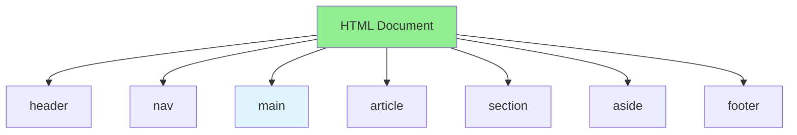

# 01.08 HTML5: Structure & Semantic Elements / HTML5: Cấu trúc & Phần tử ngữ nghĩa

## Table of Contents / Mục lục
1. [Introduction / Giới thiệu](#introduction--giới-thiệu)
2. [HTML5 Structure / Cấu trúc HTML5](#html5-structure--cấu-trúc-html5)
3. [Semantic Elements / Phần tử ngữ nghĩa](#semantic-elements--phần-tử-ngữ-nghĩa)
4. [Best Practices / Thực hành tốt nhất](#best-practices--thực-hành-tốt-nhất)
5. [Summary / Tóm tắt](#summary--tóm-tắt)

---

## Introduction / Giới thiệu

### Overview / Tổng quan

**English**: HTML5 provides semantic elements for better structure. Learn to use semantic HTML5 elements for accessible, maintainable markup.

**Vietnamese**: HTML5 cung cấp phần tử ngữ nghĩa cho cấu trúc tốt hơn. Học cách sử dụng phần tử HTML5 ngữ nghĩa cho markup dễ truy cập, dễ bảo trì.

### HTML5 Semantic Structure / Cấu trúc ngữ nghĩa HTML5



---

## HTML5 Structure / Cấu trúc HTML5

### Example 1: HTML5 Document Structure / Ví dụ 1: Cấu trúc tài liệu HTML5

```html
<!DOCTYPE html>
<html lang="en">
<head>
  <meta charset="UTF-8">
  <meta name="viewport" content="width=device-width, initial-scale=1.0">
  <title>Page Title</title>
</head>
<body>
  <header>
    <h1>Website Title</h1>
  </header>
  
  <nav>
    <ul>
      <li><a href="/">Home</a></li>
      <li><a href="/about">About</a></li>
      <li><a href="/contact">Contact</a></li>
    </ul>
  </nav>
  
  <main>
    <article>
      <h2>Article Title</h2>
      <p>Article content...</p>
    </article>
  </main>
  
  <footer>
    <p>&copy; 2024 Company Name</p>
  </footer>
</body>
</html>
```

---

## Semantic Elements / Phần tử ngữ nghĩa

### Example 2: Semantic HTML5 Elements / Ví dụ 2: Phần tử HTML5 ngữ nghĩa

```html
<!-- Semantic elements / Phần tử ngữ nghĩa -->
<header>
  <h1>Site Header</h1>
  <nav>
    <ul>
      <li><a href="#home">Home</a></li>
      <li><a href="#about">About</a></li>
    </ul>
  </nav>
</header>

<main>
  <article>
    <header>
      <h2>Article Title</h2>
      <p>Published on <time datetime="2024-01-15">January 15, 2024</time></p>
    </header>
    
    <section>
      <h3>Introduction</h3>
      <p>Introduction content...</p>
    </section>
    
    <section>
      <h3>Main Content</h3>
      <p>Main content...</p>
    </section>
    
    <footer>
      <p>Author: John Doe</p>
    </footer>
  </article>
  
  <aside>
    <h3>Related Articles</h3>
    <ul>
      <li><a href="#">Related Article 1</a></li>
      <li><a href="#">Related Article 2</a></li>
    </ul>
  </aside>
</main>

<footer>
  <p>&copy; 2024 Company</p>
</footer>
```

### Example 3: Form Elements / Ví dụ 3: Phần tử form

```html
<!-- HTML5 form elements / Phần tử form HTML5 -->
<form>
  <fieldset>
    <legend>User Information</legend>
    
    <label for="name">Name:</label>
    <input type="text" id="name" name="name" required>
    
    <label for="email">Email:</label>
    <input type="email" id="email" name="email" required>
    
    <label for="age">Age:</label>
    <input type="number" id="age" name="age" min="18" max="100">
    
    <label for="birthdate">Birthdate:</label>
    <input type="date" id="birthdate" name="birthdate">
    
    <label for="color">Favorite Color:</label>
    <input type="color" id="color" name="color">
    
    <label for="range">Rating:</label>
    <input type="range" id="range" name="range" min="1" max="5">
    
    <button type="submit">Submit</button>
  </fieldset>
</form>
```

---

## Best Practices / Thực hành tốt nhất

1. **Use semantic elements** - header, nav, main, article, section
2. **Proper nesting** - Logical structure
3. **Accessibility** - Use proper labels and ARIA
4. **SEO friendly** - Semantic HTML helps SEO
5. **Maintainable** - Clear structure

---

## Summary / Tóm tắt

### Key Takeaways / Điểm chính

- **Semantic elements**: header, nav, main, article, section, aside, footer
- **Structure**: Logical document structure
- **Accessibility**: Better for screen readers
- **SEO**: Improved search engine understanding

### Next Steps / Bước tiếp theo

- [01.09 CSS3: Layout & Styling](./01.09_CSS3_Layout_Styling.md) - Next: CSS3

---

**Last Updated / Cập nhật lần cuối**: 2024


