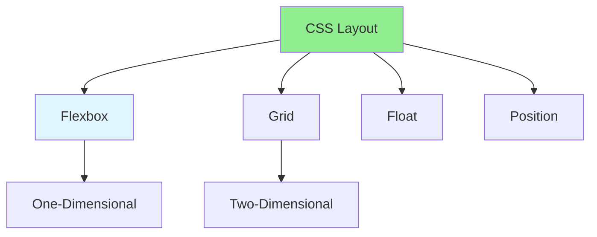

# 01.09 CSS3: Layout & Styling / CSS3: Bố cục & Styling

## Table of Contents / Mục lục
1. [Introduction / Giới thiệu](#introduction--giới-thiệu)
2. [CSS Layout Models / Mô hình bố cục CSS](#css-layout-models--mô-hình-bố-cục-css)
3. [CSS3 Features / Tính năng CSS3](#css3-features--tính-năng-css3)
4. [Best Practices / Thực hành tốt nhất](#best-practices--thực-hành-tốt-nhất)
5. [Summary / Tóm tắt](#summary--tóm-tắt)

---

## Introduction / Giới thiệu

### Overview / Tổng quan

**English**: CSS3 provides powerful layout and styling capabilities. Learn Flexbox, Grid, and modern CSS3 features.

**Vietnamese**: CSS3 cung cấp khả năng bố cục và styling mạnh mẽ. Học Flexbox, Grid và tính năng CSS3 hiện đại.

### CSS Layout Models / Mô hình bố cục CSS



---

## CSS Layout Models / Mô hình bố cục CSS

### Example 1: Flexbox Layout / Ví dụ 1: Bố cục Flexbox

```css
/* Flexbox / Flexbox */
.container {
  display: flex;
  flex-direction: row; /* row, column, row-reverse, column-reverse */
  justify-content: center; /* flex-start, center, flex-end, space-between, space-around */
  align-items: center; /* flex-start, center, flex-end, stretch */
  gap: 20px;
}

.item {
  flex: 1; /* Grow and shrink / Tăng và giảm */
  flex-basis: 200px; /* Base size / Kích thước cơ sở */
}

/* Responsive flexbox / Flexbox responsive */
@media (max-width: 768px) {
  .container {
    flex-direction: column;
  }
}
```

### Example 2: Grid Layout / Ví dụ 2: Bố cục Grid

```css
/* Grid / Grid */
.container {
  display: grid;
  grid-template-columns: repeat(3, 1fr); /* 3 equal columns / 3 cột bằng nhau */
  grid-template-rows: auto;
  gap: 20px;
  grid-template-areas:
    "header header header"
    "sidebar main main"
    "footer footer footer";
}

.header {
  grid-area: header;
}

.sidebar {
  grid-area: sidebar;
}

.main {
  grid-area: main;
}

.footer {
  grid-area: footer;
}

/* Responsive grid / Grid responsive */
@media (max-width: 768px) {
  .container {
    grid-template-columns: 1fr;
    grid-template-areas:
      "header"
      "main"
      "sidebar"
      "footer";
  }
}
```

### Example 3: CSS3 Features / Ví dụ 3: Tính năng CSS3

```css
/* CSS3 features / Tính năng CSS3 */

/* Border radius / Bo góc */
.rounded {
  border-radius: 10px;
  border-radius: 50%; /* Circle / Hình tròn */
}

/* Box shadow / Đổ bóng */
.shadow {
  box-shadow: 0 2px 4px rgba(0, 0, 0, 0.1);
  box-shadow: 0 4px 6px rgba(0, 0, 0, 0.1), 0 1px 3px rgba(0, 0, 0, 0.08);
}

/* Gradients / Gradient */
.gradient {
  background: linear-gradient(to right, #ff6b6b, #4ecdc4);
  background: radial-gradient(circle, #ff6b6b, #4ecdc4);
}

/* Transitions / Chuyển tiếp */
.transition {
  transition: all 0.3s ease;
  transition: background-color 0.3s, transform 0.2s;
}

/* Transforms / Biến đổi */
.transform {
  transform: translateX(10px);
  transform: rotate(45deg);
  transform: scale(1.2);
  transform: translate(10px, 20px) rotate(45deg);
}

/* Animations / Hoạt hình */
@keyframes slideIn {
  from {
    transform: translateX(-100%);
  }
  to {
    transform: translateX(0);
  }
}

.animate {
  animation: slideIn 0.5s ease;
}
```

---

## Best Practices / Thực hành tốt nhất

1. **Use Flexbox** - For one-dimensional layouts
2. **Use Grid** - For two-dimensional layouts
3. **Mobile first** - Design for mobile first
4. **Use CSS variables** - For maintainable styles
5. **Optimize** - Minimize CSS, use efficient selectors

---

## Summary / Tóm tắt

### Key Takeaways / Điểm chính

- **Flexbox**: One-dimensional layouts
- **Grid**: Two-dimensional layouts
- **CSS3**: Modern features (transitions, transforms, animations)
- **Responsive**: Mobile-first design

### Next Steps / Bước tiếp theo

- [01.10 JavaScript ES6+](./01.10_JavaScript_ES6_Modern_JavaScript.md) - Next: Modern JavaScript

---

**Last Updated / Cập nhật lần cuối**: 2024

