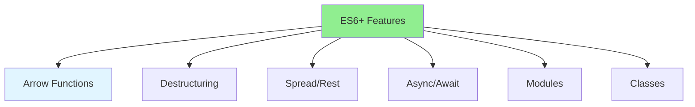

# 01.10 JavaScript ES6+: Modern JavaScript / JavaScript ES6+: JavaScript hiện đại

## Table of Contents / Mục lục
1. [Introduction / Giới thiệu](#introduction--giới-thiệu)
2. [ES6+ Features / Tính năng ES6+](#es6-features--tính-năng-es6)
3. [Modern JavaScript / JavaScript hiện đại](#modern-javascript--javascript-hiện-đại)
4. [Best Practices / Thực hành tốt nhất](#best-practices--thực-hành-tốt-nhất)
5. [Summary / Tóm tắt](#summary--tóm-tắt)

---

## Introduction / Giới thiệu

### Overview / Tổng quan

**English**: ES6+ introduced many modern JavaScript features. Learn arrow functions, destructuring, async/await, and other ES6+ features.

**Vietnamese**: ES6+ giới thiệu nhiều tính năng JavaScript hiện đại. Học arrow functions, destructuring, async/await và các tính năng ES6+ khác.

### ES6+ Features / Tính năng ES6+



---

## ES6+ Features / Tính năng ES6+

### Example 1: Arrow Functions / Ví dụ 1: Arrow Functions

```typescript
// Arrow functions / Arrow functions
// Traditional / Truyền thống
function add(a: number, b: number): number {
  return a + b;
}

// Arrow function / Arrow function
const addArrow = (a: number, b: number): number => a + b;

// Multiple lines / Nhiều dòng
const process = (data: any[]) => {
  return data
    .filter(item => item.active)
    .map(item => item.name);
};

// This binding / Ràng buộc this
class Counter {
  count = 0;
  
  // Arrow function preserves this / Arrow function giữ this
  increment = () => {
    this.count++;
  }
}
```

### Example 2: Destructuring / Ví dụ 2: Destructuring

```typescript
// Destructuring / Destructuring
// Array destructuring / Destructuring mảng
const numbers = [1, 2, 3];
const [first, second, third] = numbers;
const [head, ...tail] = numbers; // Rest / Rest

// Object destructuring / Destructuring object
const user = { name: 'Alice', age: 30, email: 'alice@example.com' };
const { name, age } = user;
const { name: userName, ...rest } = user; // Rename / Đổi tên

// Function parameters / Tham số hàm
function greet({ name, age }: { name: string; age: number }) {
  return `Hello, ${name}! You are ${age} years old.`;
}

// Default values / Giá trị mặc định
const { name = 'Anonymous', age = 0 } = user;
```

### Example 3: Spread & Rest / Ví dụ 3: Spread & Rest

```typescript
// Spread operator / Toán tử spread
const arr1 = [1, 2, 3];
const arr2 = [4, 5, 6];
const combined = [...arr1, ...arr2]; // [1, 2, 3, 4, 5, 6]

// Object spread / Spread object
const user = { name: 'Alice', age: 30 };
const updated = { ...user, age: 31 }; // { name: 'Alice', age: 31 }

// Rest parameters / Tham số rest
function sum(...numbers: number[]): number {
  return numbers.reduce((acc, num) => acc + num, 0);
}

sum(1, 2, 3, 4, 5); // 15
```

### Example 4: Async/Await / Ví dụ 4: Async/Await

```typescript
// Async/Await / Async/Await
// Promises / Promises
function fetchUser(id: string): Promise<User> {
  return fetch(`/api/users/${id}`).then(res => res.json());
}

// Async/Await / Async/Await
async function getUser(id: string): Promise<User> {
  try {
    const response = await fetch(`/api/users/${id}`);
    const user = await response.json();
    return user;
  } catch (error) {
    console.error('Error fetching user:', error);
    throw error;
  }
}

// Multiple async operations / Nhiều thao tác async
async function getUsers(): Promise<User[]> {
  const [user1, user2, user3] = await Promise.all([
    getUser('1'),
    getUser('2'),
    getUser('3')
  ]);
  return [user1, user2, user3];
}
```

### Example 5: Modules / Ví dụ 5: Modules

```typescript
// ES6 Modules / Module ES6
// Export / Xuất
export const PI = 3.14159;

export function calculateArea(radius: number): number {
  return PI * radius * radius;
}

export default class Circle {
  constructor(private radius: number) {}
  
  area(): number {
    return calculateArea(this.radius);
  }
}

// Import / Nhập
import Circle, { calculateArea, PI } from './circle';
import * as MathUtils from './math';
```

### Example 6: Classes / Ví dụ 6: Classes

```typescript
// ES6 Classes / Class ES6
class User {
  private id: string;
  public name: string;
  protected email: string;
  
  constructor(id: string, name: string, email: string) {
    this.id = id;
    this.name = name;
    this.email = email;
  }
  
  // Getter / Getter
  get userId(): string {
    return this.id;
  }
  
  // Method / Phương thức
  greet(): string {
    return `Hello, ${this.name}!`;
  }
}

// Inheritance / Kế thừa
class Admin extends User {
  private role: string = 'admin';
  
  constructor(id: string, name: string, email: string) {
    super(id, name, email);
  }
  
  getRole(): string {
    return this.role;
  }
}
```

---

## Best Practices / Thực hành tốt nhất

1. **Use arrow functions** - For callbacks and short functions
2. **Destructure** - Extract values cleanly
3. **Use async/await** - Instead of promise chains
4. **Use modules** - Organize code
5. **Modern syntax** - Use ES6+ features

---

## Summary / Tóm tắt

### Key Takeaways / Điểm chính

- **Arrow functions**: Concise function syntax
- **Destructuring**: Extract values easily
- **Spread/Rest**: Combine and extract
- **Async/Await**: Clean asynchronous code
- **Modules**: Organize code

### Next Steps / Bước tiếp theo

- [01.11 Database Basics: SQL & Queries](./01.11_Database_Basics_SQL_Queries.md) - Next: Database Basics

---

**Last Updated / Cập nhật lần cuối**: 2024


