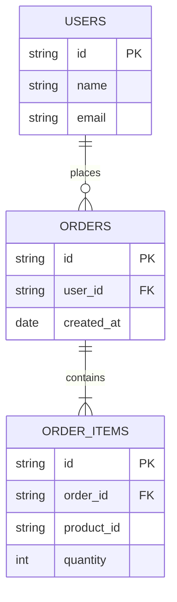

# 01.11 Database Basics: SQL & Queries / Cơ bản Database: SQL & Queries

## Table of Contents / Mục lục
1. [Introduction / Giới thiệu](#introduction--giới-thiệu)
2. [SQL Basics / SQL cơ bản](#sql-basics--sql-cơ-bản)
3. [Queries / Truy vấn](#queries--truy-vấn)
4. [Best Practices / Thực hành tốt nhất](#best-practices--thực-hành-tốt-nhất)
5. [Summary / Tóm tắt](#summary--tóm-tắt)

---

## Introduction / Giới thiệu

### Overview / Tổng quan

**English**: SQL is the language for database operations. Learn basic SQL queries for selecting, inserting, updating, and deleting data.

**Vietnamese**: SQL là ngôn ngữ cho thao tác database. Học truy vấn SQL cơ bản để chọn, chèn, cập nhật và xóa dữ liệu.

### Database Structure / Cấu trúc Database



---

## SQL Basics / SQL cơ bản

### Example 1: Basic SQL Queries / Ví dụ 1: Truy vấn SQL cơ bản

```sql
-- SELECT / Chọn
SELECT * FROM users;
SELECT id, name, email FROM users;

-- WHERE / Điều kiện
SELECT * FROM users WHERE age > 18;
SELECT * FROM users WHERE email LIKE '%@example.com';

-- ORDER BY / Sắp xếp
SELECT * FROM users ORDER BY name ASC;
SELECT * FROM users ORDER BY created_at DESC;

-- LIMIT / Giới hạn
SELECT * FROM users LIMIT 10;
SELECT * FROM users LIMIT 10 OFFSET 20;
```

### Example 2: INSERT, UPDATE, DELETE / Ví dụ 2: INSERT, UPDATE, DELETE

```sql
-- INSERT / Chèn
INSERT INTO users (name, email, age) 
VALUES ('Alice', 'alice@example.com', 30);

INSERT INTO users (name, email, age) 
VALUES 
  ('Bob', 'bob@example.com', 25),
  ('Charlie', 'charlie@example.com', 35);

-- UPDATE / Cập nhật
UPDATE users 
SET age = 31, email = 'alice.new@example.com' 
WHERE id = '123';

-- DELETE / Xóa
DELETE FROM users WHERE id = '123';
DELETE FROM users WHERE age < 18;
```

### Example 3: JOINs / Ví dụ 3: JOIN

```sql
-- INNER JOIN / INNER JOIN
SELECT u.name, o.total
FROM users u
INNER JOIN orders o ON u.id = o.user_id;

-- LEFT JOIN / LEFT JOIN
SELECT u.name, o.total
FROM users u
LEFT JOIN orders o ON u.id = o.user_id;

-- RIGHT JOIN / RIGHT JOIN
SELECT u.name, o.total
FROM users u
RIGHT JOIN orders o ON u.id = o.user_id;

-- Multiple JOINs / Nhiều JOIN
SELECT u.name, o.id, oi.product_name
FROM users u
INNER JOIN orders o ON u.id = o.user_id
INNER JOIN order_items oi ON o.id = oi.order_id;
```

---

## Queries / Truy vấn

### Example 4: Aggregate Functions / Ví dụ 4: Hàm tổng hợp

```sql
-- Aggregate functions / Hàm tổng hợp
SELECT COUNT(*) FROM users;
SELECT COUNT(DISTINCT email) FROM users;

SELECT AVG(age) FROM users;
SELECT SUM(price) FROM orders;
SELECT MIN(price), MAX(price) FROM products;

-- GROUP BY / Nhóm
SELECT user_id, COUNT(*) as order_count
FROM orders
GROUP BY user_id;

SELECT user_id, SUM(total) as total_spent
FROM orders
GROUP BY user_id
HAVING SUM(total) > 1000;
```

### Example 5: SQL with ORM (Prisma) / Ví dụ 5: SQL với ORM (Prisma)

```typescript
// Prisma queries / Truy vấn Prisma
// SELECT / Chọn
const users = await prisma.user.findMany({
  where: { age: { gt: 18 } },
  orderBy: { name: 'asc' },
  take: 10
});

// Find unique / Tìm duy nhất
const user = await prisma.user.findUnique({
  where: { id: '123' }
});

// Create / Tạo
const newUser = await prisma.user.create({
  data: {
    name: 'Alice',
    email: 'alice@example.com',
    age: 30
  }
});

// Update / Cập nhật
const updated = await prisma.user.update({
  where: { id: '123' },
  data: { age: 31 }
});

// Delete / Xóa
await prisma.user.delete({
  where: { id: '123' }
});
```

---

## Best Practices / Thực hành tốt nhất

1. **Use parameters** - Prevent SQL injection
2. **Index columns** - For frequently queried columns
3. **Limit results** - Use LIMIT for large datasets
4. **Use transactions** - For multiple operations
5. **Optimize queries** - Avoid N+1 problems

---

## Summary / Tóm tắt

### Key Takeaways / Điểm chính

- **SELECT**: Retrieve data
- **INSERT/UPDATE/DELETE**: Modify data
- **JOINs**: Combine tables
- **Aggregates**: COUNT, SUM, AVG, MIN, MAX
- **ORM**: Use ORM for type safety

### Next Steps / Bước tiếp theo

- [01.12 Database Normalization](./01.12_Database_Normalization_1NF_2NF_3NF.md) - Next: Database Normalization

---

**Last Updated / Cập nhật lần cuối**: 2024

