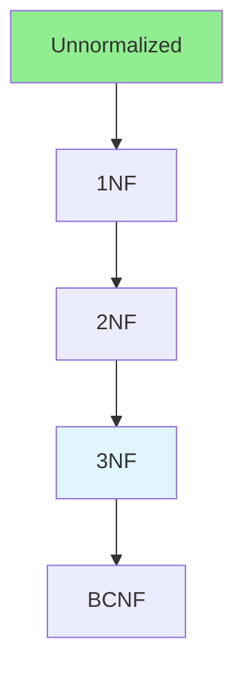

# 01.12 Database Normalization: 1NF, 2NF, 3NF / Chuẩn hóa Database: 1NF, 2NF, 3NF

## Table of Contents / Mục lục
1. [Introduction / Giới thiệu](#introduction--giới-thiệu)
2. [Normal Forms / Dạng chuẩn](#normal-forms--dạng-chuẩn)
3. [Normalization Process / Quy trình chuẩn hóa](#normalization-process--quy-trình-chuẩn-hóa)
4. [Best Practices / Thực hành tốt nhất](#best-practices--thực-hành-tốt-nhất)
5. [Summary / Tóm tắt](#summary--tóm-tắt)

---

## Introduction / Giới thiệu

### Overview / Tổng quan

**English**: Database normalization reduces data redundancy. Learn 1NF, 2NF, and 3NF to design efficient databases.

**Vietnamese**: Chuẩn hóa database giảm dư thừa dữ liệu. Học 1NF, 2NF và 3NF để thiết kế database hiệu quả.

### Normalization Flow / Luồng chuẩn hóa



---

## Normal Forms / Dạng chuẩn

### Example 1: 1NF (First Normal Form) / Ví dụ 1: 1NF

```sql
-- Before 1NF / Trước 1NF
-- Violates 1NF: Multiple values in one column
-- Vi phạm 1NF: Nhiều giá trị trong một cột
CREATE TABLE orders (
  id INT PRIMARY KEY,
  user_id INT,
  products VARCHAR(255) -- 'Product1,Product2,Product3' ❌
);

-- After 1NF / Sau 1NF
-- Each cell contains atomic value
-- Mỗi ô chứa giá trị nguyên tử
CREATE TABLE orders (
  id INT PRIMARY KEY,
  user_id INT,
  created_at TIMESTAMP
);

CREATE TABLE order_items (
  id INT PRIMARY KEY,
  order_id INT,
  product_id INT,
  quantity INT,
  FOREIGN KEY (order_id) REFERENCES orders(id)
);
```

### Example 2: 2NF (Second Normal Form) / Ví dụ 2: 2NF

```sql
-- Before 2NF / Trước 2NF
-- Violates 2NF: Partial dependency
-- Vi phạm 2NF: Phụ thuộc một phần
CREATE TABLE order_items (
  order_id INT,
  product_id INT,
  product_name VARCHAR(255), -- Depends only on product_id
  quantity INT,
  price DECIMAL,
  PRIMARY KEY (order_id, product_id)
);

-- After 2NF / Sau 2NF
-- Remove partial dependencies
-- Loại bỏ phụ thuộc một phần
CREATE TABLE order_items (
  order_id INT,
  product_id INT,
  quantity INT,
  price DECIMAL,
  PRIMARY KEY (order_id, product_id),
  FOREIGN KEY (product_id) REFERENCES products(id)
);

CREATE TABLE products (
  id INT PRIMARY KEY,
  name VARCHAR(255),
  description TEXT
);
```

### Example 3: 3NF (Third Normal Form) / Ví dụ 3: 3NF

```sql
-- Before 3NF / Trước 3NF
-- Violates 3NF: Transitive dependency
-- Vi phạm 3NF: Phụ thuộc bắc cầu
CREATE TABLE orders (
  id INT PRIMARY KEY,
  user_id INT,
  user_name VARCHAR(255), -- Depends on user_id
  user_email VARCHAR(255), -- Depends on user_id
  total DECIMAL
);

-- After 3NF / Sau 3NF
-- Remove transitive dependencies
-- Loại bỏ phụ thuộc bắc cầu
CREATE TABLE orders (
  id INT PRIMARY KEY,
  user_id INT,
  total DECIMAL,
  FOREIGN KEY (user_id) REFERENCES users(id)
);

CREATE TABLE users (
  id INT PRIMARY KEY,
  name VARCHAR(255),
  email VARCHAR(255)
);
```

---

## Normalization Process / Quy trình chuẩn hóa

### Example 4: Normalization Example / Ví dụ 4: Ví dụ chuẩn hóa

```sql
-- Unnormalized / Chưa chuẩn hóa
CREATE TABLE student_courses (
  student_id INT,
  student_name VARCHAR(255),
  course_id INT,
  course_name VARCHAR(255),
  instructor VARCHAR(255),
  grade CHAR(1)
);

-- 1NF: Atomic values / 1NF: Giá trị nguyên tử
-- Already atomic / Đã nguyên tử

-- 2NF: Remove partial dependencies / 2NF: Loại bỏ phụ thuộc một phần
CREATE TABLE students (
  id INT PRIMARY KEY,
  name VARCHAR(255)
);

CREATE TABLE courses (
  id INT PRIMARY KEY,
  name VARCHAR(255),
  instructor VARCHAR(255)
);

CREATE TABLE enrollments (
  student_id INT,
  course_id INT,
  grade CHAR(1),
  PRIMARY KEY (student_id, course_id),
  FOREIGN KEY (student_id) REFERENCES students(id),
  FOREIGN KEY (course_id) REFERENCES courses(id)
);

-- 3NF: Remove transitive dependencies / 3NF: Loại bỏ phụ thuộc bắc cầu
-- If instructor depends on course, separate table
-- Nếu instructor phụ thuộc vào course, tách bảng
```

---

## Best Practices / Thực hành tốt nhất

1. **Normalize to 3NF** - Usually sufficient
2. **Consider denormalization** - For performance when needed
3. **Balance** - Normalization vs performance
4. **Document** - Document normalization decisions
5. **Review** - Review design with team

---

## Summary / Tóm tắt

### Key Takeaways / Điểm chính

- **1NF**: Atomic values, no repeating groups
- **2NF**: 1NF + no partial dependencies
- **3NF**: 2NF + no transitive dependencies
- **Balance**: Normalization vs performance

### Next Steps / Bước tiếp theo

- [01.13 JSON & XML](./01.13_JSON_XML_Data_Format.md) - Next: JSON & XML

---

**Last Updated / Cập nhật lần cuối**: 2024

