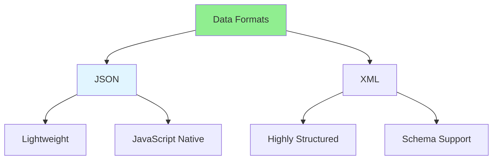

# 01.13 JSON & XML: Data Formats / JSON & XML: Định dạng dữ liệu

## Table of Contents / Mục lục
1. [Introduction / Giới thiệu](#introduction--giới-thiệu)
2. [JSON / JSON](#json--json)
3. [XML / XML](#xml--xml)
4. [Comparison / So sánh](#comparison--so-sánh)
5. [Best Practices / Thực hành tốt nhất](#best-practices--thực-hành-tốt-nhất)
6. [Summary / Tóm tắt](#summary--tóm-tắt)

---

## Introduction / Giới thiệu

### Overview / Tổng quan

**English**: JSON and XML are common data formats. Learn to work with JSON and XML in JavaScript/TypeScript and when to use each.

**Vietnamese**: JSON và XML là định dạng dữ liệu phổ biến. Học cách làm việc với JSON và XML trong JavaScript/TypeScript và khi nào sử dụng mỗi loại.

### Data Format Comparison / So sánh định dạng dữ liệu



---

## JSON / JSON

### Example 1: JSON in JavaScript / Ví dụ 1: JSON trong JavaScript

```typescript
// JSON object / Object JSON
const user = {
  id: '123',
  name: 'Alice',
  email: 'alice@example.com',
  age: 30,
  active: true,
  tags: ['developer', 'javascript'],
  address: {
    street: '123 Main St',
    city: 'New York',
    zip: '10001'
  }
};

// Stringify / Chuyển thành chuỗi
const jsonString = JSON.stringify(user);
console.log(jsonString);
// {"id":"123","name":"Alice","email":"alice@example.com",...}

// Parse / Phân tích
const parsed = JSON.parse(jsonString);
console.log(parsed.name); // Alice

// Pretty print / In đẹp
const pretty = JSON.stringify(user, null, 2);
```

### Example 2: JSON with TypeScript / Ví dụ 2: JSON với TypeScript

```typescript
// JSON with types / JSON với kiểu
interface User {
  id: string;
  name: string;
  email: string;
  age: number;
  active: boolean;
}

// Parse with type / Phân tích với kiểu
function parseUser(json: string): User {
  return JSON.parse(json) as User;
}

// Validate JSON / Xác thực JSON
function isValidJSON(str: string): boolean {
  try {
    JSON.parse(str);
    return true;
  } catch {
    return false;
  }
}
```

---

## XML / XML

### Example 3: XML Structure / Ví dụ 3: Cấu trúc XML

```xml
<!-- XML example / Ví dụ XML -->
<?xml version="1.0" encoding="UTF-8"?>
<users>
  <user id="123">
    <name>Alice</name>
    <email>alice@example.com</email>
    <age>30</age>
    <active>true</active>
    <tags>
      <tag>developer</tag>
      <tag>javascript</tag>
    </tags>
    <address>
      <street>123 Main St</street>
      <city>New York</city>
      <zip>10001</zip>
    </address>
  </user>
  <user id="456">
    <name>Bob</name>
    <email>bob@example.com</email>
    <age>25</age>
    <active>true</active>
  </user>
</users>
```

### Example 4: XML Parsing in JavaScript / Ví dụ 4: Phân tích XML trong JavaScript

```typescript
// XML parsing / Phân tích XML
// Using DOMParser / Sử dụng DOMParser
function parseXML(xmlString: string): Document {
  const parser = new DOMParser();
  return parser.parseFromString(xmlString, 'text/xml');
}

// Extract data / Trích xuất dữ liệu
function extractUsers(xml: Document): User[] {
  const users: User[] = [];
  const userElements = xml.querySelectorAll('user');
  
  userElements.forEach(userEl => {
    const user: User = {
      id: userEl.getAttribute('id') || '',
      name: userEl.querySelector('name')?.textContent || '',
      email: userEl.querySelector('email')?.textContent || '',
      age: parseInt(userEl.querySelector('age')?.textContent || '0')
    };
    users.push(user);
  });
  
  return users;
}
```

---

## Comparison / So sánh

### Example 5: JSON vs XML / Ví dụ 5: JSON vs XML

```typescript
// JSON vs XML comparison / So sánh JSON vs XML
const comparison = {
  json: {
    syntax: 'Lightweight, simple',
    parsing: 'Native in JavaScript',
    size: 'Smaller',
    useCase: 'APIs, configuration'
  },
  xml: {
    syntax: 'Verbose, structured',
    parsing: 'Requires parser',
    size: 'Larger',
    useCase: 'Documents, complex data'
  }
};

// When to use JSON / Khi nào sử dụng JSON
// - APIs / API
// - Configuration files / File cấu hình
// - Simple data structures / Cấu trúc dữ liệu đơn giản

// When to use XML / Khi nào sử dụng XML
// - Documents / Tài liệu
// - Complex nested structures / Cấu trúc lồng nhau phức tạp
// - When schema validation needed / Khi cần xác thực schema
```

---

## Best Practices / Thực hành tốt nhất

1. **Use JSON** - For APIs and simple data
2. **Use XML** - For documents and complex structures
3. **Validate** - Validate JSON/XML before parsing
4. **Handle errors** - Catch parsing errors
5. **Format** - Pretty print for readability

---

## Summary / Tóm tắt

### Key Takeaways / Điểm chính

- **JSON**: Lightweight, JavaScript native, common for APIs
- **XML**: Structured, verbose, good for documents
- **Choose**: Based on use case
- **Parse**: Handle errors properly

### Next Steps / Bước tiếp theo

- [01.14 Error Handling Basics](./01.14_Error_Handling_Basics.md) - Next: Error Handling

---

**Last Updated / Cập nhật lần cuối**: 2024

