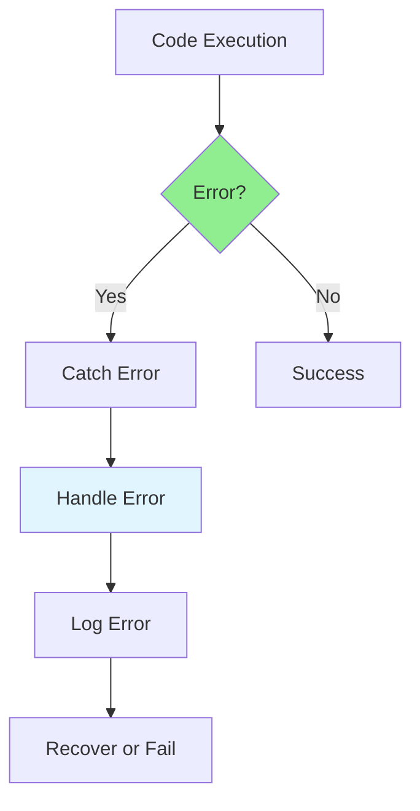

# 01.14 Error Handling Basics / Cơ bản xử lý lỗi

## Table of Contents / Mục lục
1. [Introduction / Giới thiệu](#introduction--giới-thiệu)
2. [Error Types / Loại lỗi](#error-types--loại-lỗi)
3. [Error Handling / Xử lý lỗi](#error-handling--xử-lý-lỗi)
4. [Best Practices / Thực hành tốt nhất](#best-practices--thực-hành-tốt-nhất)
5. [Summary / Tóm tắt](#summary--tóm-tắt)

---

## Introduction / Giới thiệu

### Overview / Tổng quan

**English**: Error handling prevents application crashes. Learn to catch, handle, and log errors effectively in JavaScript/TypeScript and Node.js.

**Vietnamese**: Xử lý lỗi ngăn chặn sự cố ứng dụng. Học cách bắt, xử lý và ghi log lỗi hiệu quả trong JavaScript/TypeScript và Node.js.

### Error Handling Flow / Luồng xử lý lỗi



---

## Error Types / Loại lỗi

### Example 1: Error Types / Ví dụ 1: Loại lỗi

```typescript
// Error types / Loại lỗi
// Syntax Error / Lỗi cú pháp
// const x = ; // Syntax error

// TypeError / Lỗi kiểu
const obj: any = null;
// obj.property; // TypeError: Cannot read property

// ReferenceError / Lỗi tham chiếu
// console.log(undefinedVar); // ReferenceError

// Custom Error / Lỗi tùy chỉnh
class ValidationError extends Error {
  constructor(message: string, public field: string) {
    super(message);
    this.name = 'ValidationError';
  }
}

class NotFoundError extends Error {
  constructor(resource: string) {
    super(`${resource} not found`);
    this.name = 'NotFoundError';
  }
}
```

---

## Error Handling / Xử lý lỗi

### Example 2: Try-Catch / Ví dụ 2: Try-Catch

```typescript
// Try-catch / Try-catch
function riskyOperation(): string {
  if (Math.random() > 0.5) {
    throw new Error('Operation failed');
  }
  return 'Success';
}

try {
  const result = riskyOperation();
  console.log(result);
} catch (error) {
  console.error('Error occurred:', error.message);
}

// Multiple catch blocks / Nhiều khối catch
try {
  // Code / Code
} catch (error) {
  if (error instanceof ValidationError) {
    console.error('Validation error:', error.field);
  } else if (error instanceof NotFoundError) {
    console.error('Not found:', error.message);
  } else {
    console.error('Unknown error:', error);
  }
}
```

### Example 3: Async Error Handling / Ví dụ 3: Xử lý lỗi async

```typescript
// Async error handling / Xử lý lỗi async
async function fetchUser(id: string): Promise<User> {
  try {
    const response = await fetch(`/api/users/${id}`);
    
    if (!response.ok) {
      throw new Error(`HTTP error! status: ${response.status}`);
    }
    
    const user = await response.json();
    return user;
  } catch (error) {
    console.error('Failed to fetch user:', error);
    throw error; // Re-throw / Ném lại
  }
}

// Promise error handling / Xử lý lỗi Promise
fetchUser('123')
  .then(user => console.log(user))
  .catch(error => console.error('Error:', error));

// Error handling in Express / Xử lý lỗi trong Express
app.get('/users/:id', async (req, res, next) => {
  try {
    const user = await userService.findById(req.params.id);
    if (!user) {
      throw new NotFoundError('User');
    }
    res.json(user);
  } catch (error) {
    next(error); // Pass to error handler / Chuyển đến error handler
  }
});

// Error handler middleware / Middleware xử lý lỗi
app.use((err: Error, req: any, res: any, next: any) => {
  console.error(err.stack);
  res.status(500).json({ error: 'Something went wrong!' });
});
```

### Example 4: Error Handling Patterns / Ví dụ 4: Mẫu xử lý lỗi

```typescript
// Error handling patterns / Mẫu xử lý lỗi
// Result pattern / Mẫu kết quả
type Result<T, E = Error> = 
  | { success: true; data: T }
  | { success: false; error: E };

function divide(a: number, b: number): Result<number> {
  if (b === 0) {
    return { success: false, error: new Error('Division by zero') };
  }
  return { success: true, data: a / b };
}

// Usage / Sử dụng
const result = divide(10, 2);
if (result.success) {
  console.log(result.data);
} else {
  console.error(result.error);
}

// Error wrapper / Bọc lỗi
async function safeAsync<T>(
  fn: () => Promise<T>
): Promise<Result<T>> {
  try {
    const data = await fn();
    return { success: true, data };
  } catch (error) {
    return { success: false, error: error as Error };
  }
}
```

---

## Best Practices / Thực hành tốt nhất

1. **Always handle errors** - Don't ignore errors
2. **Use try-catch** - For synchronous code
3. **Handle promises** - Use catch for async
4. **Log errors** - Log for debugging
5. **Provide context** - Include error context

---

## Summary / Tóm tắt

### Key Takeaways / Điểm chính

- **Try-catch**: Handle synchronous errors
- **Async**: Handle promise rejections
- **Custom errors**: Create specific error types
- **Logging**: Log errors for debugging
- **Recovery**: Handle gracefully

### Next Steps / Bước tiếp theo

- [01.15 Environment Variables & Configuration](./01.15_Environment_Variables_Configuration.md) - Next: Environment Variables

---

**Last Updated / Cập nhật lần cuối**: 2024


