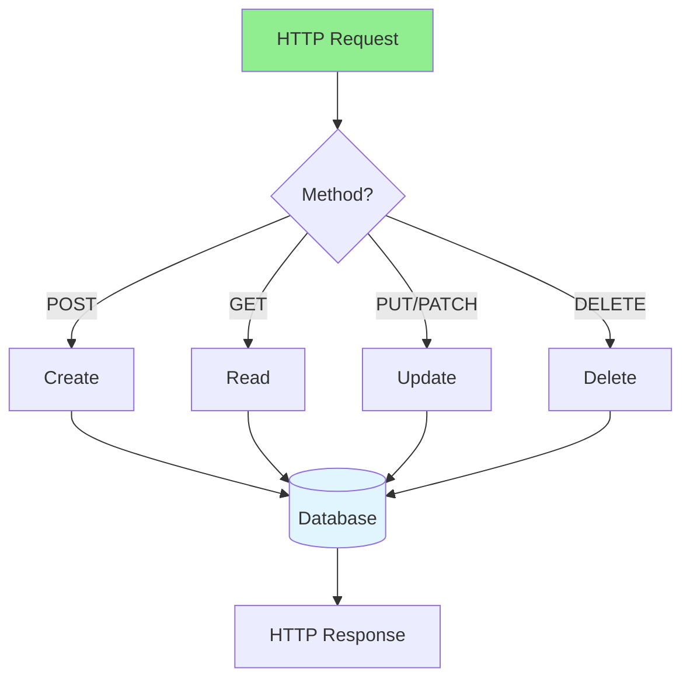

# 02.01 CRUD: Basic Create, Read, Update, Delete / CRUD: Tạo, Đọc, Cập nhật, Xóa cơ bản

## Table of Contents / Mục lục
1. [Introduction / Giới thiệu](#introduction--giới-thiệu)
2. [CRUD Operations / Thao tác CRUD](#crud-operations--thao-tác-crud)
3. [Implementation Examples / Ví dụ triển khai](#implementation-examples--ví-dụ-triển-khai)
4. [Best Practices / Thực hành tốt nhất](#best-practices--thực-hành-tốt-nhất)
5. [Summary / Tóm tắt](#summary--tóm-tắt)

---

## Introduction / Giới thiệu

### Overview / Tổng quan

**English**: CRUD (Create, Read, Update, Delete) operations are fundamental to most applications. Learn to implement CRUD operations in RESTful APIs using Node.js, NestJS, and Python.

**Vietnamese**: Thao tác CRUD (Tạo, Đọc, Cập nhật, Xóa) là cơ bản cho hầu hết ứng dụng. Học cách triển khai thao tác CRUD trong RESTful API sử dụng Node.js, NestJS và Python.

### CRUD Flow / Luồng CRUD



---

## CRUD Operations / Thao tác CRUD

### Example 1: CRUD with Express.js / Ví dụ 1: CRUD với Express.js

```typescript
// Express.js CRUD / CRUD Express.js
import express from 'express';
import { PrismaClient } from '@prisma/client';

const app = express();
const prisma = new PrismaClient();
app.use(express.json());

// CREATE / Tạo
app.post('/users', async (req, res) => {
  try {
    const user = await prisma.user.create({
      data: req.body
    });
    res.status(201).json(user);
  } catch (error) {
    res.status(400).json({ error: error.message });
  }
});

// READ / Đọc
// Get all / Lấy tất cả
app.get('/users', async (req, res) => {
  const users = await prisma.user.findMany();
  res.json(users);
});

// Get by ID / Lấy theo ID
app.get('/users/:id', async (req, res) => {
  const user = await prisma.user.findUnique({
    where: { id: req.params.id }
  });
  if (user) {
    res.json(user);
  } else {
    res.status(404).json({ error: 'User not found' });
  }
});

// UPDATE / Cập nhật
app.put('/users/:id', async (req, res) => {
  try {
    const user = await prisma.user.update({
      where: { id: req.params.id },
      data: req.body
    });
    res.json(user);
  } catch (error) {
    res.status(404).json({ error: 'User not found' });
  }
});

// DELETE / Xóa
app.delete('/users/:id', async (req, res) => {
  try {
    await prisma.user.delete({
      where: { id: req.params.id }
    });
    res.status(204).send();
  } catch (error) {
    res.status(404).json({ error: 'User not found' });
  }
});
```

### Example 2: CRUD with NestJS / Ví dụ 2: CRUD với NestJS

```typescript
// NestJS CRUD / CRUD NestJS
import { Controller, Get, Post, Put, Delete, Body, Param } from '@nestjs/common';
import { UserService } from './user.service';
import { CreateUserDto, UpdateUserDto } from './dto';

@Controller('users')
export class UserController {
  constructor(private userService: UserService) {}
  
  @Post()
  create(@Body() createUserDto: CreateUserDto) {
    return this.userService.create(createUserDto);
  }
  
  @Get()
  findAll() {
    return this.userService.findAll();
  }
  
  @Get(':id')
  findOne(@Param('id') id: string) {
    return this.userService.findOne(id);
  }
  
  @Put(':id')
  update(@Param('id') id: string, @Body() updateUserDto: UpdateUserDto) {
    return this.userService.update(id, updateUserDto);
  }
  
  @Delete(':id')
  remove(@Param('id') id: string) {
    return this.userService.remove(id);
  }
}

// Service / Dịch vụ
@Injectable()
export class UserService {
  constructor(private prisma: PrismaService) {}
  
  create(createUserDto: CreateUserDto) {
    return this.prisma.user.create({ data: createUserDto });
  }
  
  findAll() {
    return this.prisma.user.findMany();
  }
  
  findOne(id: string) {
    return this.prisma.user.findUnique({ where: { id } });
  }
  
  update(id: string, updateUserDto: UpdateUserDto) {
    return this.prisma.user.update({
      where: { id },
      data: updateUserDto
    });
  }
  
  remove(id: string) {
    return this.prisma.user.delete({ where: { id } });
  }
}
```

### Example 3: CRUD with Python (FastAPI) / Ví dụ 3: CRUD với Python (FastAPI)

```python
# FastAPI CRUD / CRUD FastAPI
from fastapi import FastAPI, HTTPException
from pydantic import BaseModel
from typing import List

app = FastAPI()

class UserCreate(BaseModel):
    name: str
    email: str
    age: int

class UserUpdate(BaseModel):
    name: str = None
    email: str = None
    age: int = None

# CREATE / Tạo
@app.post("/users", status_code=201)
async def create_user(user: UserCreate):
    # Database operation / Thao tác database
    new_user = await db.create_user(user.dict())
    return new_user

# READ / Đọc
@app.get("/users", response_model=List[User])
async def get_users():
    return await db.get_all_users()

@app.get("/users/{user_id}")
async def get_user(user_id: int):
    user = await db.get_user(user_id)
    if not user:
        raise HTTPException(status_code=404, detail="User not found")
    return user

# UPDATE / Cập nhật
@app.put("/users/{user_id}")
async def update_user(user_id: int, user: UserUpdate):
    updated = await db.update_user(user_id, user.dict(exclude_unset=True))
    if not updated:
        raise HTTPException(status_code=404, detail="User not found")
    return updated

# DELETE / Xóa
@app.delete("/users/{user_id}", status_code=204)
async def delete_user(user_id: int):
    deleted = await db.delete_user(user_id)
    if not deleted:
        raise HTTPException(status_code=404, detail="User not found")
```

---

## Best Practices / Thực hành tốt nhất

1. **Use proper HTTP methods** - POST, GET, PUT, DELETE
2. **Return correct status codes** - 201, 200, 404, 204
3. **Validate input** - Validate request data
4. **Handle errors** - Proper error handling
5. **Use DTOs** - Data Transfer Objects for type safety

---

## Summary / Tóm tắt

### Key Takeaways / Điểm chính

- **CREATE**: POST request, return 201
- **READ**: GET request, return 200
- **UPDATE**: PUT/PATCH request, return 200
- **DELETE**: DELETE request, return 204
- **RESTful**: Follow REST conventions

### Next Steps / Bước tiếp theo

- [02.02 Validation: Client & Server Side](./02.02_Validation_Client_Server_Side.md) - Next: Validation

---

**Last Updated / Cập nhật lần cuối**: 2024

