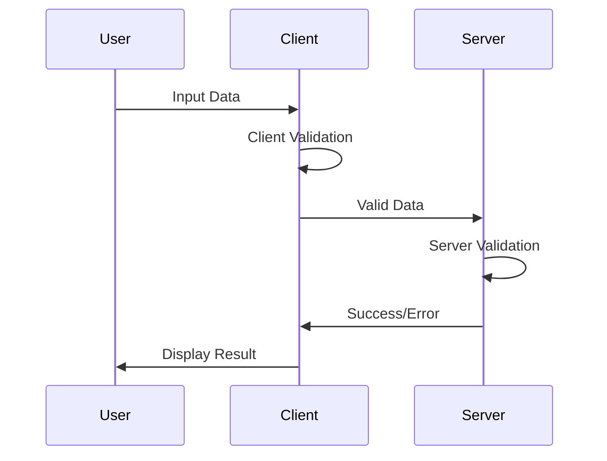

# 02.02 Validation: Client & Server Side / Xác thực: Phía Client & Server

## Table of Contents / Mục lục
1. [Introduction / Giới thiệu](#introduction--giới-thiệu)
2. [Client-Side Validation / Xác thực phía Client](#client-side-validation--xác-thực-phía-client)
3. [Server-Side Validation / Xác thực phía Server](#server-side-validation--xác-thực-phía-server)
4. [Best Practices / Thực hành tốt nhất](#best-practices--thực-hành-tốt-nhất)
5. [Summary / Tóm tắt](#summary--tóm-tắt)

---

## Introduction / Giới thiệu

### Overview / Tổng quan

**English**: Validation ensures data integrity. Learn to implement validation on both client and server side for secure, user-friendly applications.

**Vietnamese**: Xác thực đảm bảo tính toàn vẹn dữ liệu. Học cách triển khai xác thực ở cả phía client và server cho ứng dụng an toàn, thân thiện người dùng.

### Validation Flow / Luồng xác thực



---

## Client-Side Validation / Xác thực phía Client

### Example 1: HTML5 Validation / Ví dụ 1: Xác thực HTML5

```html
<!-- HTML5 validation / Xác thực HTML5 -->
<form id="userForm">
  <input 
    type="text" 
    name="name" 
    required 
    minlength="2" 
    maxlength="50"
    pattern="[A-Za-z\s]+"
    placeholder="Name"
  >
  
  <input 
    type="email" 
    name="email" 
    required
    placeholder="Email"
  >
  
  <input 
    type="number" 
    name="age" 
    required 
    min="18" 
    max="100"
    placeholder="Age"
  >
  
  <input 
    type="password" 
    name="password" 
    required 
    minlength="8"
    pattern="(?=.*\d)(?=.*[a-z])(?=.*[A-Z]).{8,}"
    placeholder="Password"
  >
  
  <button type="submit">Submit</button>
</form>
```

### Example 2: JavaScript Validation / Ví dụ 2: Xác thực JavaScript

```typescript
// JavaScript validation / Xác thực JavaScript
interface ValidationRule {
  required?: boolean;
  minLength?: number;
  maxLength?: number;
  pattern?: RegExp;
  custom?: (value: any) => boolean;
}

function validate(value: any, rules: ValidationRule): string | null {
  if (rules.required && !value) {
    return 'This field is required';
  }
  
  if (value && rules.minLength && value.length < rules.minLength) {
    return `Minimum length is ${rules.minLength}`;
  }
  
  if (value && rules.maxLength && value.length > rules.maxLength) {
    return `Maximum length is ${rules.maxLength}`;
  }
  
  if (value && rules.pattern && !rules.pattern.test(value)) {
    return 'Invalid format';
  }
  
  if (value && rules.custom && !rules.custom(value)) {
    return 'Invalid value';
  }
  
  return null;
}

// Usage / Sử dụng
const emailRules: ValidationRule = {
  required: true,
  pattern: /^[^\s@]+@[^\s@]+\.[^\s@]+$/
};

const error = validate('invalid-email', emailRules);
```

### Example 3: React Validation / Ví dụ 3: Xác thực React

```typescript
// React validation with hooks / Xác thực React với hooks
import { useState } from 'react';

function useFormValidation<T>(initialValues: T, validate: (values: T) => Partial<T>) {
  const [values, setValues] = useState<T>(initialValues);
  const [errors, setErrors] = useState<Partial<T>>({});
  const [touched, setTouched] = useState<Record<string, boolean>>({});
  
  const handleChange = (name: string, value: any) => {
    setValues(prev => ({ ...prev, [name]: value }));
    
    if (touched[name]) {
      const validationErrors = validate({ ...values, [name]: value });
      setErrors(prev => ({ ...prev, [name]: validationErrors[name] }));
    }
  };
  
  const handleBlur = (name: string) => {
    setTouched(prev => ({ ...prev, [name]: true }));
    const validationErrors = validate(values);
    setErrors(prev => ({ ...prev, [name]: validationErrors[name] }));
  };
  
  const handleSubmit = (onSubmit: (values: T) => void) => {
    const validationErrors = validate(values);
    setErrors(validationErrors);
    
    if (Object.keys(validationErrors).length === 0) {
      onSubmit(values);
    }
  };
  
  return { values, errors, touched, handleChange, handleBlur, handleSubmit };
}
```

---

## Server-Side Validation / Xác thực phía Server

### Example 4: Express.js Validation / Ví dụ 4: Xác thực Express.js

```typescript
// Express.js validation with express-validator
import { body, validationResult } from 'express-validator';

app.post('/users', 
  [
    body('name').trim().isLength({ min: 2, max: 50 }).withMessage('Name must be 2-50 characters'),
    body('email').isEmail().normalizeEmail().withMessage('Invalid email'),
    body('age').isInt({ min: 18, max: 100 }).withMessage('Age must be 18-100'),
    body('password').isLength({ min: 8 }).matches(/^(?=.*\d)(?=.*[a-z])(?=.*[A-Z])/).withMessage('Password must be at least 8 characters with uppercase, lowercase, and number')
  ],
  (req, res) => {
    const errors = validationResult(req);
    if (!errors.isEmpty()) {
      return res.status(400).json({ errors: errors.array() });
    }
    
    // Process valid data / Xử lý dữ liệu hợp lệ
    res.status(201).json({ message: 'User created' });
  }
);
```

### Example 5: NestJS Validation / Ví dụ 5: Xác thực NestJS

```typescript
// NestJS validation with class-validator
import { IsEmail, IsString, MinLength, MaxLength, IsInt, Min, Max } from 'class-validator';

export class CreateUserDto {
  @IsString()
  @MinLength(2)
  @MaxLength(50)
  name: string;
  
  @IsEmail()
  email: string;
  
  @IsInt()
  @Min(18)
  @Max(100)
  age: number;
  
  @IsString()
  @MinLength(8)
  password: string;
}

@Controller('users')
export class UserController {
  @Post()
  create(@Body() createUserDto: CreateUserDto) {
    return this.userService.create(createUserDto);
  }
}
```

### Example 6: Python Validation (Pydantic) / Ví dụ 6: Xác thực Python (Pydantic)

```python
# FastAPI validation with Pydantic
from pydantic import BaseModel, EmailStr, validator
from typing import Optional

class UserCreate(BaseModel):
    name: str
    email: EmailStr
    age: int
    password: str
    
    @validator('name')
    def name_must_be_valid(cls, v):
        if len(v) < 2 or len(v) > 50:
            raise ValueError('Name must be 2-50 characters')
        return v
    
    @validator('age')
    def age_must_be_valid(cls, v):
        if v < 18 or v > 100:
            raise ValueError('Age must be 18-100')
        return v
    
    @validator('password')
    def password_must_be_strong(cls, v):
        if len(v) < 8:
            raise ValueError('Password must be at least 8 characters')
        if not any(c.isupper() for c in v):
            raise ValueError('Password must contain uppercase letter')
        if not any(c.islower() for c in v):
            raise ValueError('Password must contain lowercase letter')
        if not any(c.isdigit() for c in v):
            raise ValueError('Password must contain number')
        return v

@app.post("/users")
async def create_user(user: UserCreate):
    return {"message": "User created", "user": user}
```

---

## Best Practices / Thực hành tốt nhất

1. **Always validate server-side** - Never trust client input
2. **Client validation for UX** - Provide immediate feedback
3. **Use validation libraries** - express-validator, class-validator, Pydantic
4. **Clear error messages** - User-friendly error messages
5. **Sanitize input** - Clean data before processing

---

## Summary / Tóm tắt

### Key Takeaways / Điểm chính

- **Client-side**: Better UX, immediate feedback
- **Server-side**: Security, data integrity (required)
- **Both**: Use both for best experience
- **Libraries**: Use validation libraries
- **Messages**: Clear, user-friendly errors

### Next Steps / Bước tiếp theo

- [02.03 Search Functionality](./02.03_Search_Functionality_Basic.md) - Next: Search

---

**Last Updated / Cập nhật lần cuối**: 2024


