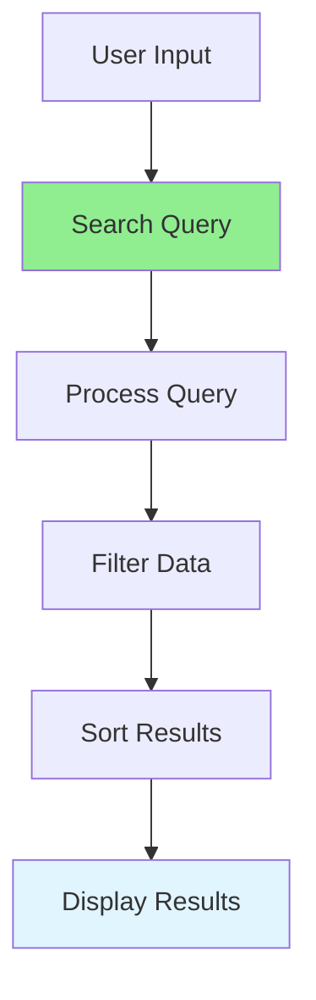

# 02.03 Search Functionality: Basic / Chức năng tìm kiếm: Cơ bản

## Table of Contents / Mục lục
1. [Introduction / Giới thiệu](#introduction--giới-thiệu)
2. [Basic Search / Tìm kiếm cơ bản](#basic-search--tìm-kiếm-cơ-bản)
3. [Search Implementation / Triển khai tìm kiếm](#search-implementation--triển-khai-tìm-kiếm)
4. [Best Practices / Thực hành tốt nhất](#best-practices--thực-hành-tốt-nhất)
5. [Summary / Tóm tắt](#summary--tóm-tắt)

---

## Introduction / Giới thiệu

### Overview / Tổng quan

**English**: Search functionality allows users to find data quickly. Learn to implement basic search with text matching, filtering, and sorting.

**Vietnamese**: Chức năng tìm kiếm cho phép người dùng tìm dữ liệu nhanh chóng. Học cách triển khai tìm kiếm cơ bản với khớp văn bản, lọc và sắp xếp.

### Search Flow / Luồng tìm kiếm



---

## Basic Search / Tìm kiếm cơ bản

### Example 1: Simple Text Search / Ví dụ 1: Tìm kiếm văn bản đơn giản

```typescript
// Simple text search / Tìm kiếm văn bản đơn giản
function searchUsers(users: User[], query: string): User[] {
  if (!query) return users;
  
  const lowerQuery = query.toLowerCase();
  return users.filter(user => 
    user.name.toLowerCase().includes(lowerQuery) ||
    user.email.toLowerCase().includes(lowerQuery)
  );
}

// Usage / Sử dụng
const users = [
  { id: '1', name: 'Alice', email: 'alice@example.com' },
  { id: '2', name: 'Bob', email: 'bob@example.com' },
  { id: '3', name: 'Charlie', email: 'charlie@example.com' }
];

const results = searchUsers(users, 'alice');
```

### Example 2: Database Search (SQL) / Ví dụ 2: Tìm kiếm Database (SQL)

```typescript
// SQL search / Tìm kiếm SQL
// Using Prisma / Sử dụng Prisma
async function searchUsers(query: string) {
  return await prisma.user.findMany({
    where: {
      OR: [
        { name: { contains: query, mode: 'insensitive' } },
        { email: { contains: query, mode: 'insensitive' } }
      ]
    }
  });
}

// Raw SQL / SQL thô
async function searchUsersRaw(query: string) {
  return await prisma.$queryRaw`
    SELECT * FROM users 
    WHERE name ILIKE ${`%${query}%`} 
       OR email ILIKE ${`%${query}%`}
  `;
}
```

### Example 3: Search with Express.js / Ví dụ 3: Tìm kiếm với Express.js

```typescript
// Express.js search endpoint / Endpoint tìm kiếm Express.js
app.get('/users/search', async (req, res) => {
  const { q, limit = 10, offset = 0 } = req.query;
  
  if (!q) {
    return res.status(400).json({ error: 'Query parameter required' });
  }
  
  const users = await prisma.user.findMany({
    where: {
      OR: [
        { name: { contains: q as string, mode: 'insensitive' } },
        { email: { contains: q as string, mode: 'insensitive' } }
      ]
    },
    take: Number(limit),
    skip: Number(offset)
  });
  
  res.json(users);
});
```

---

## Search Implementation / Triển khai tìm kiếm

### Example 4: React Search Component / Ví dụ 4: Component tìm kiếm React

```typescript
// React search component / Component tìm kiếm React
import { useState, useEffect } from 'react';

function UserSearch() {
  const [query, setQuery] = useState('');
  const [results, setResults] = useState<User[]>([]);
  const [loading, setLoading] = useState(false);
  
  useEffect(() => {
    if (query.length < 2) {
      setResults([]);
      return;
    }
    
    const searchUsers = async () => {
      setLoading(true);
      try {
        const response = await fetch(`/api/users/search?q=${encodeURIComponent(query)}`);
        const data = await response.json();
        setResults(data);
      } catch (error) {
        console.error('Search error:', error);
      } finally {
        setLoading(false);
      }
    };
    
    const timeoutId = setTimeout(searchUsers, 300); // Debounce
    return () => clearTimeout(timeoutId);
  }, [query]);
  
  return (
    <div>
      <input
        type="text"
        value={query}
        onChange={(e) => setQuery(e.target.value)}
        placeholder="Search users..."
      />
      {loading && <div>Loading...</div>}
      <ul>
        {results.map(user => (
          <li key={user.id}>{user.name} - {user.email}</li>
        ))}
      </ul>
    </div>
  );
}
```

### Example 5: NestJS Search / Ví dụ 5: Tìm kiếm NestJS

```typescript
// NestJS search / Tìm kiếm NestJS
@Get('search')
async search(@Query('q') query: string) {
  if (!query) {
    throw new BadRequestException('Query parameter required');
  }
  
  return this.userService.search(query);
}

// Service / Dịch vụ
async search(query: string): Promise<User[]> {
  return this.prisma.user.findMany({
    where: {
      OR: [
        { name: { contains: query, mode: 'insensitive' } },
        { email: { contains: query, mode: 'insensitive' } }
      ]
    }
  });
}
```

---

## Best Practices / Thực hành tốt nhất

1. **Debounce search** - Wait for user to stop typing
2. **Minimum length** - Require minimum characters
3. **Case insensitive** - Search regardless of case
4. **Index columns** - Index searchable columns
5. **Limit results** - Limit number of results

---

## Summary / Tóm tắt

### Key Takeaways / Điểm chính

- **Text matching**: Use contains/ILIKE for text search
- **Debouncing**: Wait before searching
- **Indexing**: Index searchable columns
- **Limits**: Limit result count
- **UX**: Show loading states

### Next Steps / Bước tiếp theo

- [02.04 Filter & Sort Data](./02.04_Filter_Sort_Data.md) - Next: Filter & Sort

---

**Last Updated / Cập nhật lần cuối**: 2024


