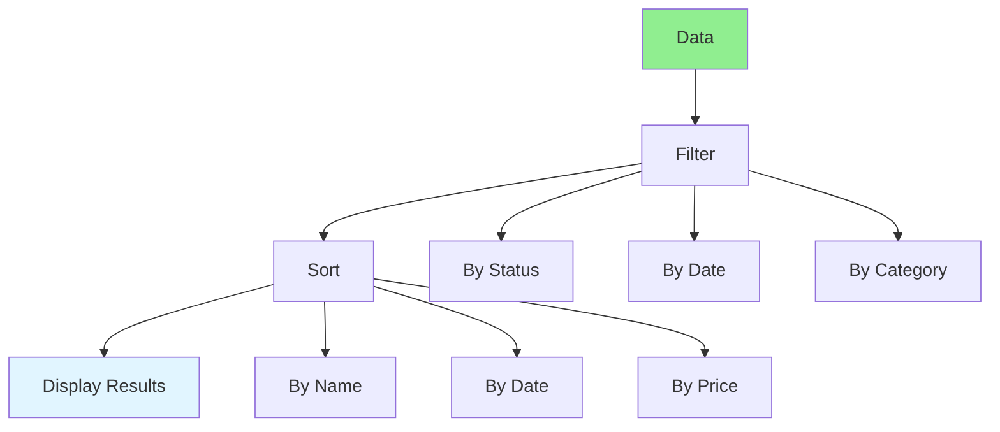

# 02.04 Filter & Sort Data / Lọc & Sắp xếp dữ liệu

## Table of Contents / Mục lục
1. [Introduction / Giới thiệu](#introduction--giới-thiệu)
2. [Filtering / Lọc](#filtering--lọc)
3. [Sorting / Sắp xếp](#sorting--sắp-xếp)
4. [Combined Filter & Sort / Kết hợp lọc & sắp xếp](#combined-filter--sort--kết-hợp-lọc--sắp-xếp)
5. [Best Practices / Thực hành tốt nhất](#best-practices--thực-hành-tốt-nhất)
6. [Summary / Tóm tắt](#summary--tóm-tắt)

---

## Introduction / Giới thiệu

### Overview / Tổng quan

**English**: Filtering and sorting help users find and organize data. Learn to implement filtering and sorting in frontend and backend.

**Vietnamese**: Lọc và sắp xếp giúp người dùng tìm và tổ chức dữ liệu. Học cách triển khai lọc và sắp xếp ở frontend và backend.

### Filter and Sort Flow / Luồng lọc và sắp xếp



---

## Filtering / Lọc

### Example 1: Frontend Filtering / Ví dụ 1: Lọc Frontend

```typescript
// Frontend filtering / Lọc frontend
interface Filter {
  status?: string;
  category?: string;
  minPrice?: number;
  maxPrice?: number;
  dateFrom?: Date;
  dateTo?: Date;
}

function filterItems(items: Item[], filters: Filter): Item[] {
  return items.filter(item => {
    if (filters.status && item.status !== filters.status) return false;
    if (filters.category && item.category !== filters.category) return false;
    if (filters.minPrice && item.price < filters.minPrice) return false;
    if (filters.maxPrice && item.price > filters.maxPrice) return false;
    if (filters.dateFrom && item.createdAt < filters.dateFrom) return false;
    if (filters.dateTo && item.createdAt > filters.dateTo) return false;
    return true;
  });
}
```

### Example 2: Backend Filtering (Prisma) / Ví dụ 2: Lọc Backend (Prisma)

```typescript
// Backend filtering with Prisma / Lọc backend với Prisma
async function getFilteredUsers(filters: {
  status?: string;
  role?: string;
  minAge?: number;
  maxAge?: number;
}) {
  const where: any = {};
  
  if (filters.status) {
    where.status = filters.status;
  }
  
  if (filters.role) {
    where.role = filters.role;
  }
  
  if (filters.minAge || filters.maxAge) {
    where.age = {};
    if (filters.minAge) where.age.gte = filters.minAge;
    if (filters.maxAge) where.age.lte = filters.maxAge;
  }
  
  return await prisma.user.findMany({ where });
}
```

---

## Sorting / Sắp xếp

### Example 3: Frontend Sorting / Ví dụ 3: Sắp xếp Frontend

```typescript
// Frontend sorting / Sắp xếp frontend
type SortField = 'name' | 'date' | 'price';
type SortOrder = 'asc' | 'desc';

function sortItems(items: Item[], field: SortField, order: SortOrder): Item[] {
  return [...items].sort((a, b) => {
    let aValue = a[field];
    let bValue = b[field];
    
    if (typeof aValue === 'string') {
      aValue = aValue.toLowerCase();
      bValue = bValue.toLowerCase();
    }
    
    if (order === 'asc') {
      return aValue > bValue ? 1 : aValue < bValue ? -1 : 0;
    } else {
      return aValue < bValue ? 1 : aValue > bValue ? -1 : 0;
    }
  });
}
```

### Example 4: Backend Sorting (Prisma) / Ví dụ 4: Sắp xếp Backend (Prisma)

```typescript
// Backend sorting with Prisma / Sắp xếp backend với Prisma
async function getSortedUsers(sortBy: string, sortOrder: 'asc' | 'desc' = 'asc') {
  const orderBy: any = {};
  orderBy[sortBy] = sortOrder;
  
  return await prisma.user.findMany({
    orderBy
  });
}

// Multiple sort fields / Nhiều trường sắp xếp
async function getUsersMultiSort(sorts: { field: string; order: 'asc' | 'desc' }[]) {
  const orderBy = sorts.map(sort => ({
    [sort.field]: sort.order
  }));
  
  return await prisma.user.findMany({ orderBy });
}
```

---

## Combined Filter & Sort / Kết hợp lọc & sắp xếp

### Example 5: Combined Implementation / Ví dụ 5: Triển khai kết hợp

```typescript
// Combined filter and sort / Kết hợp lọc và sắp xếp
app.get('/users', async (req, res) => {
  const { 
    status, 
    role, 
    minAge, 
    maxAge,
    sortBy = 'name',
    sortOrder = 'asc'
  } = req.query;
  
  const where: any = {};
  if (status) where.status = status;
  if (role) where.role = role;
  if (minAge || maxAge) {
    where.age = {};
    if (minAge) where.age.gte = Number(minAge);
    if (maxAge) where.age.lte = Number(maxAge);
  }
  
  const orderBy: any = {};
  orderBy[sortBy as string] = sortOrder;
  
  const users = await prisma.user.findMany({
    where,
    orderBy
  });
  
  res.json(users);
});
```

---

## Best Practices / Thực hành tốt nhất

1. **Validate filters** - Validate filter parameters
2. **Index columns** - Index filtered/sorted columns
3. **Default sorting** - Provide default sort order
4. **Limit results** - Limit number of results
5. **Cache** - Cache filtered/sorted results when possible

---

## Summary / Tóm tắt

### Key Takeaways / Điểm chính

- **Filtering**: Use WHERE clauses in database
- **Sorting**: Use ORDER BY in database
- **Combine**: Filter then sort
- **Performance**: Index filtered/sorted columns
- **UX**: Provide clear filter/sort options

### Next Steps / Bước tiếp theo

- [02.05 Pagination](./02.05_Pagination_Data_Paging.md) - Next: Pagination

---

**Last Updated / Cập nhật lần cuối**: 2024

